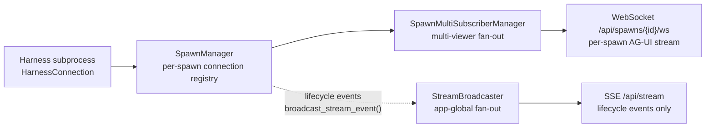
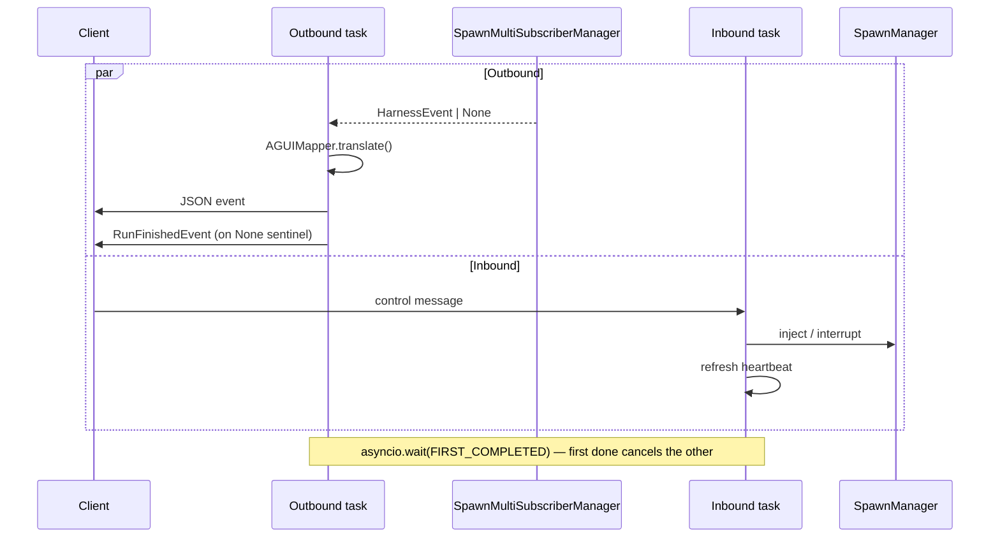

# Architecture: App Server

The app server (`lib/app/`) is a thin FastAPI layer that exposes Meridian operations as HTTP endpoints. It uses the same launch, state, and extension machinery as the CLI — no duplicated logic. External callers (IDEs, scripts, future UIs) use it to trigger spawns and stream output without shelling out.

## FastAPI Application Factory

`server.py:create_app()` produces the FastAPI app. Responsibilities:

**Lifecycle:**
- Startup: generate `instance_id` (UUID), write `runtime_root/app/<pid>/endpoint.json` + `token` (mode 0o600)
- Shutdown: remove instance directory, shut down SpawnManager, drain background finalize tasks

**Token security:**
- `secrets.token_hex(32)`, generated fresh at startup
- Stored in `runtime_root/app/<pid>/token` (0o600 permissions)
- Required as `Authorization: Bearer <token>` on all invoke endpoints
- Discovery endpoints (`GET /api/extensions/...`) are intentionally public

**Route registration order** (static before dynamic, prevents path parameter capture):
1. Spawn query routes (static paths first)
2. SSE stream routes (`/api/stream`)
3. Spawn routes (`/api/spawns/…`)
4. Work, file, catalog, thread inspector routes
5. WebSocket routes (`/api/spawns/{id}/ws`)
6. Extension discovery (no auth)
7. Extension invoke (auth required)
8. Static frontend (`frontend/dist/` if present)

**CORS:** `^https?://(localhost|127\.0\.0\.1)(:\d+)?$` — local origins only.

## Streaming Architecture

Two distinct streaming paths for different audiences:



**Use SSE** for lifecycle overview: spawn created/started/done, work item changes, dashboard refresh. 30-second keepalive; `event: connected` on connect.

**Use WebSocket** for interactive per-spawn event stream and control messages (inject, interrupt, cancel).

### StreamBroadcaster (SSE fan-out)

App-global event broadcaster. One `asyncio.Queue` per SSE subscriber.

- `subscribe()` → `(sub_id, queue)` | `unsubscribe(sub_id)`
- `broadcast(event)` — sends to all; drops oldest on QueueFull (backpressure)
- `broadcast_close()` — sends `None` sentinel (force-through on full queues)

Other modules emit lifecycle events via `broadcast_stream_event(app, event_type, payload)`.

### SpawnMultiSubscriberManager (multi-viewer WebSocket)

`SpawnManager.subscribe()` allows only one subscriber per spawn natively. `SpawnMultiSubscriberManager` wraps it to support N concurrent WebSocket clients:

```
subscribe(spawn_id)
  → first call: create _EventBroadcaster + pump_task → SpawnManager.subscribe()
  → subsequent: register with existing _EventBroadcaster
unsubscribe(spawn_id, subscriber_id)
  → last subscriber: cancel pump_task → SpawnManager.unsubscribe()
```

**Critical deadlock prevention:** pump task's `finally` acquires `self._lock`. `unsubscribe` must release `self._lock` before awaiting the cancelled pump task. See implementation for lock-release-before-await pattern.

## WebSocket Per-Spawn (`ws_endpoint.py`)

AG-UI protocol at `GET /api/spawns/{spawn_id}/ws`.

### Client Protocol

| Direction | Event types |
|-----------|-------------|
| Server → client | AG-UI events (`RunStartedEvent`, `TextMessageContentEvent`, `RunFinishedEvent`, …) + capabilities event + 30s keepalive `{"type":"keepalive"}` |
| Client → server | Control messages `{"type": "pong"\|"user_message"\|"interrupt"\|"cancel"}` |

Any valid control message refreshes heartbeat liveness. 90s without inbound message → auto-close.

### Concurrent Task Architecture



**AG-UI mapping:** `get_agui_mapper(harness_id)` returns harness-specific translator. `make_capabilities_event()` announces harness capabilities on connect.

**Origin validation:** `^https?://(localhost|127\.0\.0\.1)(:\d+)?$` — mismatches close with code 4403.

## Harness Connections Subpackage

`lib/harness/connections/` provides bidirectional harness connections — used by the app server and streaming paths. Different from the one-shot subprocess used by the primary CLI path.

```
connections/
  base.py         HarnessConnection ABC, ConnectionCapabilities, HarnessEvent,
                  ConnectionConfig, ConnectionState
  claude_ws.py    Claude WebSocket connection
  codex_ws.py     Codex WebSocket connection
  opencode_http.py OpenCode HTTP connection
```

**`HarnessConnection`** — abstract base: full-duplex lifecycle (`start`, `stop`, `health`), event iteration (`events()`), and control methods (`send_user_message`, `send_interrupt`, `send_cancel`).

**`ConnectionState`** = `"created" | "starting" | "connected" | "stopping" | "stopped" | "failed"`

**`HarnessEvent`** — frozen dataclass: `event_type`, `payload`, `harness_id`, optional `raw_text`.

**`ConnectionConfig`** — frozen dataclass: inputs for one connection. Key fields: `spawn_id`, `harness_id`, `prompt`, `project_root`, `env_overrides`, `timeout_seconds`, `ws_bind_host`, `ws_port`, `startup_telemetry_hook`.

`startup_telemetry_hook` (`Callable[[str], None]`, optional) is injected by `PrimaryAttachLauncher` to receive phase messages during managed primary startup. Only called in observer mode.

**Prompt limits:** `MAX_HARNESS_MESSAGE_BYTES = MAX_INITIAL_PROMPT_BYTES = 10 MiB`. `PromptTooLargeError` carries `actual_bytes`, `max_bytes`, `harness`.

### ConnectionCapabilities

| Field | Type | Meaning |
|-------|------|---------|
| `mid_turn_injection` | `"queue"\|"interrupt_restart"\|"http_post"` | How to send mid-turn messages |
| `supports_steer` | bool | Inject steering during running turn |
| `supports_interrupt` | bool | Interrupt model mid-turn |
| `supports_cancel` | bool | Cancel current request |
| `runtime_model_switch` | bool | Change model without restarting |
| `structured_reasoning` | bool | Produces structured reasoning events |
| `supports_primary_observer` | bool | Can start in observer mode for managed primary attach |

`CodexConnection` sets `supports_primary_observer=True` — Codex primary always uses `CodexConnection` via `PrimaryAttachLauncher`. Claude primary still uses the black-box PTY/pipe path (does not go through the connections layer).

## AppServerLocator

`locator.py:AppServerLocator` discovers running instances and validates they are alive.

State layout: `runtime_root/app/<pid>/endpoint.json` + `token`.

Error hierarchy:
- `AppServerNotRunning` — no endpoint files
- `AppServerStaleEndpoint` — files exist but process dead or UDS socket missing
- `AppServerWrongProject` — live server for different project UUID
- `AppServerUnreachable` — health check failed

Health check: `GET /api/health` validates `project_uuid` and `instance_id`. No auth required.

Multiple instances for same project: uses most-recently-started (mtime sort), warns to stderr.

## Extension HTTP Routes

Two route groups:

**Discovery (no auth):**
- `GET /api/extensions` — all extensions with commands, arg/output schemas, manifest hash
- `GET /api/extensions/{ext_id}/commands/{cmd_id}/invoke` — invoke endpoint (auth required)

**Invoke (Bearer token):**
Response: `InvokeResponse(request_id, result)` on success, RFC 9457 `ProblemDetail` on error.

Error status mapping:

| Error code | HTTP status |
|------------|-------------|
| `not_found` | 404 |
| `args_invalid` | 422 |
| `surface_not_allowed`, `capability_missing`, `trust_violation` | 403 |
| `app_server_required`, `service_unavailable` | 503 |
| `handler_error` | 500 |

Streaming (`?stream=1`) → 501 (not implemented).

## Related Pages

- [system-overview.md](system-overview.md) — where the app server fits
- [launch-system.md](launch-system.md) — how `prepare_spawn()` integrates
- [../codebase/harness-adapters.md](../codebase/harness-adapters.md) — per-connection adapter notes
- [../concepts/harness-abstraction.md](../concepts/harness-abstraction.md) — policy/mechanism split
