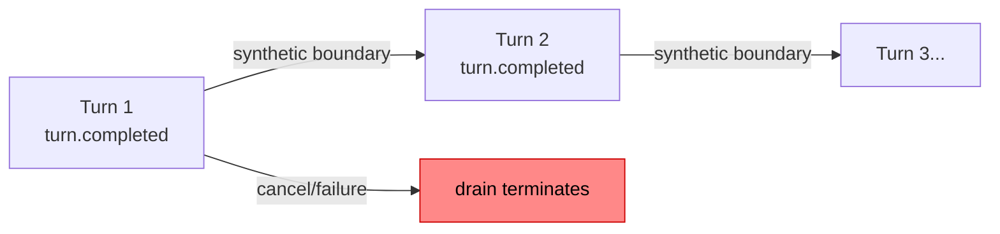
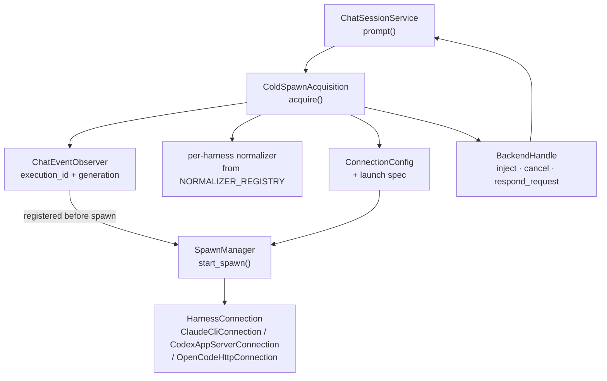

# Backend Acquisition

Backend acquisition is the process of attaching a live harness execution to a chat session. It is defined by a protocol boundary (`BackendAcquisition`) so future strategies — warm pool, resume, remote — can be added without modifying the session or transport layers.

**Source:** `src/meridian/lib/chat/backend_acquisition.py`

## Acquisition Boundary

Two protocol types define the seam:

```python
class BackendAcquisition(Protocol):
    async def acquire(
        self,
        chat_id: str,
        execution_generation: int,
        launch_config: LaunchConfig,
    ) -> BackendHandle: ...

class BackendAcquisitionFactory(Protocol):
    def build(
        self,
        *,
        pipeline_lookup: PipelineLookup,
        project_root: Path,
        runtime_root: Path,
    ) -> BackendAcquisition: ...
```

`BackendHandle` (from `src/meridian/lib/chat/backend_handle.py`) is the result: a live handle that can inject messages, cancel, and respond to HITL requests.

The factory seam breaks the bootstrap cycle between `ChatRuntime` and `ColdSpawnAcquisition`. See [runtime-and-sessions.md](runtime-and-sessions.md) for the construction order.

## When Acquisition Happens

Acquisition is deferred to the **first prompt**, not performed at chat creation.

```
POST /chat            → reserve chat_id, create event log, state = idle (no backend)
POST /chat/{id}/msg   → acquire backend (cold spawn), send prompt
```

The reason: all three `HarnessConnection` implementations send the initial prompt during `start()`. There is no "start backend in idle" mode. See [decisions/chat-backend.md#d19](../../decisions/chat-backend.md#d19).

On subsequent prompts, `ChatSessionService` checks whether the current handle is still alive and reacquires if it is dead.

## ColdSpawnAcquisition

`ColdSpawnAcquisition` is the concrete strategy for starting a fresh harness execution. It is the only acquisition strategy currently implemented.

### What it builds

For each `acquire()` call, it assembles:

1. **`ConnectionConfig`** — harness ID, endpoint config, environment overrides
2. **Launch spec** — project root, runtime root, child environment
3. **Per-execution normalizer** — looked up from `NORMALIZER_REGISTRY` by harness ID
4. **`ChatEventPipeline`** — looked up from `PipelineLookup` (the chat's existing pipeline)
5. **`ChatEventObserver`** — bridges the R4 observer seam into the chat pipeline

Environment overrides inject the harness ID and optionally derive a child environment from the runtime root.

### Observer-Before-Spawn Invariant

```python
# backend_acquisition.py:130-144 (simplified)
observer = ChatEventObserver(
    chat_id=chat_id,
    execution_id=spawn_id,
    execution_generation=execution_generation,
    normalizer=normalizer,
    pipeline=pipeline,
)
spawn_manager.register_observer(spawn_id, observer)  # BEFORE start_spawn()
await spawn_manager.start_spawn(spawn_id, connection_config, launch_spec)
```

The observer **must** be registered before `start_spawn()`. If the spawn emits events before the observer is registered, those events are lost — the R4 seam delivers events only to registered observers. Reversing this order is a correctness bug.

### Drain Policy

Chat-backed spawns always use `PersistentDrainPolicy`. This policy:

- On a successful turn: emits a synthetic `meridian/turn_completed` boundary event and continues draining
- On failure or cancel: terminates the drain

`SingleTurnDrainPolicy` (used by non-chat spawns) would terminate after the first turn boundary, ending the backend after one exchange.



**Source:** `src/meridian/lib/streaming/drain_policy.py`

## Data Flow Through Acquisition



## BackendHandle

`BackendHandle` (`src/meridian/lib/chat/backend_handle.py`) is returned from `acquire()` and stored on `ChatSessionService`. It exposes:

- `inject(message)` — send a prompt to the running execution
- `cancel()` — request cancellation
- `respond_request(request_id, decision, payload)` — resolve a HITL approval request
- `respond_user_input(request_id, answers)` — resolve a user-input request

HITL capability varies by harness. Claude and OpenCode do not support runtime approval — only launch-time. `HarnessConnection.respond_request()` raises `NotImplementedError` for these; `ConnectionCapabilities.supports_runtime_hitl` flags this. See [decisions/chat-backend.md#d16](../../decisions/chat-backend.md#d16).

## Invariants

- **I-1: Observer before spawn** — `register_observer()` is always called before `start_spawn()`. Violating this order loses events.
- **I-2: PersistentDrainPolicy for chat** — chat-backed spawns always use `PersistentDrainPolicy`. `SingleTurnDrainPolicy` terminates after one turn.
- **I-3: Generation at acquire-time** — `execution_generation` is read from the session at the moment of `acquire()`, not stored statically at construction. Stale generation from construction time causes generation-fencing failures. See [decisions/chat-backend.md#d27](../../decisions/chat-backend.md#d27).
- **I-4: Acquisition failure rollback** — `start_spawn` and `start_heartbeat` are wrapped in try/except with rollback to prevent orphaned spawn entries. See [decisions/chat-backend.md#d27](../../decisions/chat-backend.md#d27).

## Key References

- `BackendAcquisition` / `BackendAcquisitionFactory` — `src/meridian/lib/chat/backend_acquisition.py:29–53`
- `ColdSpawnAcquisition` — `src/meridian/lib/chat/backend_acquisition.py:79–203`
- `BackendHandle` — `src/meridian/lib/chat/backend_handle.py`
- `PersistentDrainPolicy` / `SingleTurnDrainPolicy` — `src/meridian/lib/streaming/drain_policy.py:20–39`
- `NORMALIZER_REGISTRY` — `src/meridian/lib/chat/normalization/registry.py:15–29`

## Related

- [overview.md](overview.md) — chat pipeline reading map
- [runtime-and-sessions.md](runtime-and-sessions.md) — ChatRuntime, session state machine, factory seam
- [event-pipeline.md](event-pipeline.md) — ChatEventPipeline and ChatEventObserver
- [decisions/chat-backend.md](../../decisions/chat-backend.md) — D15 (SpawnManager ownership), D16 (HITL policy), D19 (deferred acquisition), D27 (final gate fixes)
