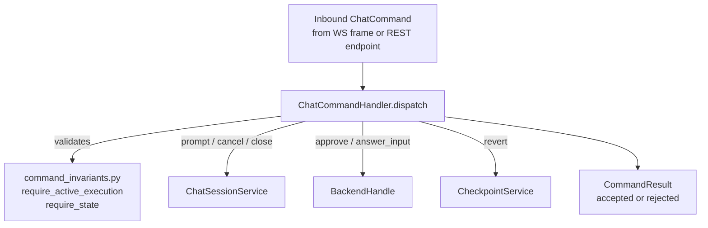

# Chat Command System

All inbound commands — from WebSocket frames and REST endpoints — route through a single dispatch point: `ChatCommandHandler`. This gives every consumer the same `ChatCommand` type and eliminates per-endpoint routing logic.

See [decisions/chat-backend.md — D21](../../decisions/chat-backend.md#d21) for the rationale behind single dispatch.

## ChatCommand Type

```python
# src/meridian/lib/chat/commands.py
@dataclass(frozen=True)
class ChatCommand:
    type: str                              # command discriminator
    command_id: str                        # UUID for ack correlation
    chat_id: str                           # target chat
    timestamp: str                         # ISO 8601 client-side timestamp
    payload: dict[str, Any] = field(default_factory=dict)
```

`CommandResult` is the synchronous acknowledgment:

```python
@dataclass(frozen=True)
class CommandResult:
    status: Literal["accepted", "rejected"]
    error: str | None = None               # set when status == "rejected"
```

## Command Types

| Type | Payload fields | Handler target |
|---|---|---|
| `prompt` | `text: str` | `ChatSessionService.prompt()` |
| `cancel` | *(none)* | `ChatSessionService.cancel()` |
| `approve` | `request_id: str`, `decision: str`, `payload?: dict` | `BackendHandle.respond_request()` |
| `answer_input` | `request_id: str`, `answers: dict` | `BackendHandle.respond_user_input()` |
| `close` | *(none)* | `ChatSessionService.close()` |
| `revert` | `commit_sha: str` | `CheckpointService.revert_to_checkpoint()` |
| `swap_model` | `model: str` | ⚠ **Rejected** — `not_supported_by_current_harness` |
| `swap_effort` | `effort: str` | ⚠ **Rejected** — `not_supported_by_current_harness` |

`swap_model` and `swap_effort` are schema-recognized but unconditionally rejected at dispatch. No current harness supports runtime model switching. See [decisions/chat-backend.md — D24](../../decisions/chat-backend.md#d24).

## Dispatch Flow



`ChatCommandHandler` is instantiated per-dispatch call inside `ChatRuntime.dispatch()`. After the handler returns `accepted` for a `close` command, `ChatRuntime` performs close postwork (drain pipeline, drop fanout reference) before returning the result to the transport layer.

## Rejection Semantics

`ChatCommandHandler` catches all exceptions at the dispatch boundary and maps them to stable rejection strings:

| Error condition | `CommandResult.error` |
|---|---|
| `ConcurrentPromptError` | `"concurrent_prompt"` |
| `ChatClosedError` | `"chat_closed"` |
| `NoActiveExecutionError` | `"no_active_execution"` |
| `swap_model` / `swap_effort` | `"not_supported_by_current_harness"` |
| Unknown `command.type` | `"unknown_command_type: <type>"` |
| Any other exception | `str(exc)` |

Transport layers (WebSocket, REST) never see raw exceptions from command dispatch — only `CommandResult`.

## Invariant Guards

`command_invariants.py` provides shared precondition checks used across handler branches:

```python
# src/meridian/lib/chat/command_invariants.py

def require_active_execution(session: ChatSessionService) -> BackendHandle:
    """Raises NoActiveExecutionError if no backend handle is live.
    Used by: approve, answer_input."""

def require_state(session: ChatSessionService, *allowed: ChatState) -> None:
    """Raises ChatStateError if session is not in one of the allowed states."""
```

These guards prevent duplicating state checks in each handler branch.

## Approval and Input Resolution

`approve` and `answer_input` commands resolve pending HITL requests on the backend. After dispatching to `BackendHandle`, the handler emits a normalized confirmation event back into `ChatEventPipeline`:

| Command | Emitted event type |
|---|---|
| `approve` | `request.resolved` |
| `answer_input` | `user_input.resolved` |

Both commands require `require_active_execution()` — they fail with `no_active_execution` if there is no live backend handle. They also validate that the `request_id` matches the execution's current pending request, preventing stale resolution from a prior execution generation.

Harness capability constraint: Claude and OpenCode do not support runtime approval (`ConnectionCapabilities.supports_runtime_hitl = False`). HITL approval for these harnesses is available at launch-time only. See [decisions/chat-backend.md — D16](../../decisions/chat-backend.md#d16).

## Adding a Command

Four steps:

1. Add type string constant to `commands.py`
2. Add a match case in `ChatCommandHandler.dispatch()`
3. Write the handler function using invariants from `command_invariants.py`
4. Optionally add a one-line REST wrapper: construct `ChatCommand`, call `handler.dispatch()`

Every new command must have a rejection path — `CommandResult(status="rejected", error=<reason>)` must be reachable.

**What the framework provides for free:** WebSocket transport, command correlation by `command_id`, centralized exception-to-rejection mapping, the invariant library, REST fallback, multi-client serialization via session lock.

## Key References

- `src/meridian/lib/chat/commands.py` — `ChatCommand`, `CommandResult`, command type constants
- `src/meridian/lib/chat/command_handler.py` — `ChatCommandHandler`
- `src/meridian/lib/chat/command_invariants.py` — `require_active_execution()`, `require_state()`
- `src/meridian/lib/chat/session_service.py` — `ChatSessionService`, `ChatState`
- `src/meridian/lib/chat/backend_handle.py` — `BackendHandle`
- `src/meridian/lib/chat/checkpoint.py` — `CheckpointService`
- `src/meridian/lib/chat/runtime.py` — `ChatRuntime.dispatch()` close postwork

## Related

- [runtime-and-sessions.md](runtime-and-sessions.md) — session state machine, how `prompt()` / `cancel()` / `close()` alter state
- [extensibility.md](extensibility.md) — S6: adding a new command type
- [decisions/chat-backend.md](../../decisions/chat-backend.md) — D21, D22, D23, D24
