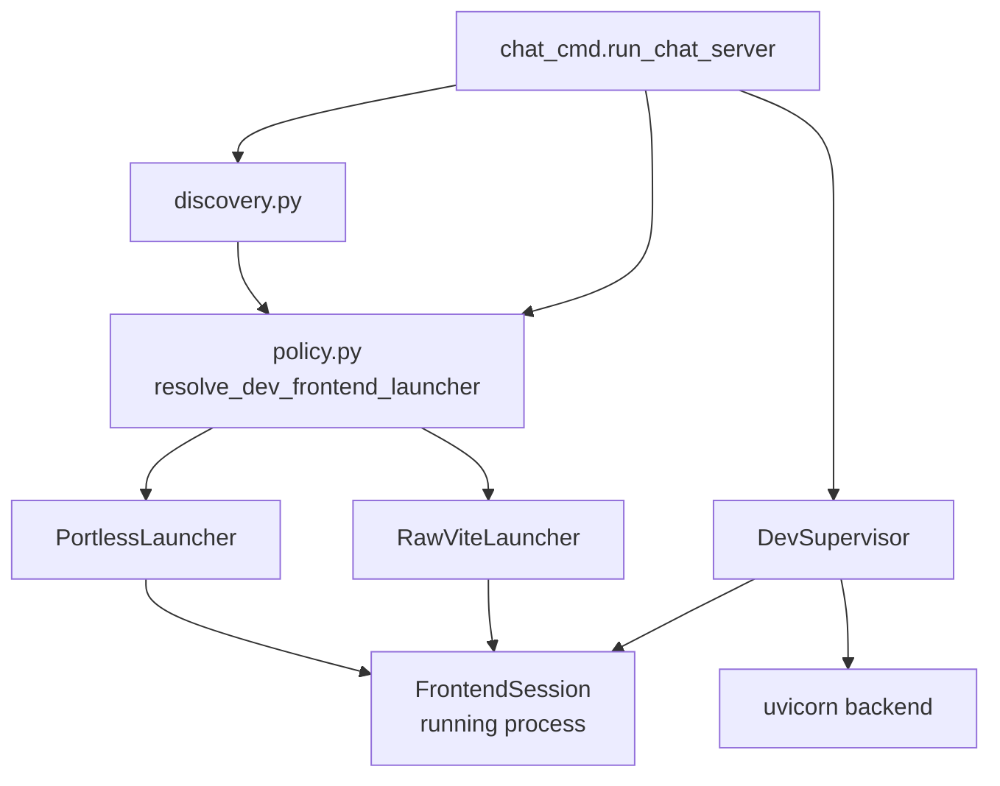
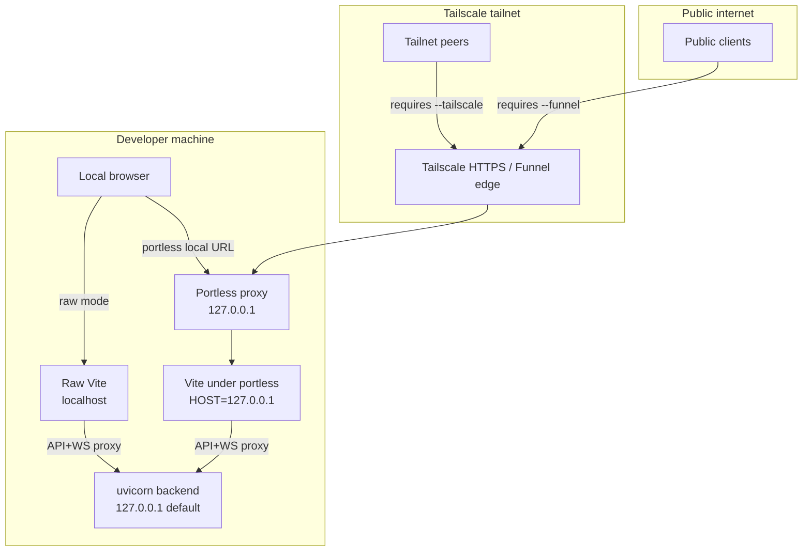

# Dev Frontend (`meridian chat --dev`)

`meridian chat --dev` runs the frontend in development mode: a Vite subprocess with hot-reload, connected to the live backend. All implementation lives in `src/meridian/lib/chat/dev_frontend/`.

Two launch strategies exist: **raw Vite** (localhost-only, direct subprocess) and **portless** (proxied HTTPS URLs, optional Tailscale/Funnel sharing). Auto-selection and flag normalization happen in `policy.py` before any process starts.

For the reasoning behind flag behavior and security boundaries, see [decisions/dev-frontend.md](../../decisions/dev-frontend.md).

## Package Layout

```
src/meridian/lib/chat/dev_frontend/
  __init__.py      re-exports: DevSupervisor, resolve_dev_frontend_root,
                               validate_dev_prerequisites
  supervisor.py    DevSupervisor — lifecycle: start backend, start frontend, monitor both
  launcher.py      FrontendSession + FrontendLauncher protocols; BackendEndpoint;
                               shared launcher error types
  raw_vite.py      RawViteLauncher
  portless.py      PortlessLauncher
  policy.py        DevFrontendPolicy, RawViteExposure, PortlessExposure,
                               resolve_dev_frontend_launcher()
  discovery.py     Pure environment/binary discovery helpers
```

### Ownership Boundaries

| File | Responsibility |
|---|---|
| `supervisor.py` | Backend + frontend lifecycle together |
| `policy.py` | Flag normalization, launcher selection, incompatible-flag rejection |
| `discovery.py` | Environment/binary detection (portless availability, Tailscale DNS) |
| `raw_vite.py` | How raw Vite starts, health-checks, and terminates |
| `portless.py` | How portless-managed Vite starts, health-checks, and terminates |
| `chat_cmd.py` (caller) | Flag parsing, root validation, construction injection |

## Component Flow



## Normalized Policy Model

All CLI flags collapse into a frozen `DevFrontendPolicy` before any process starts:

```python
# src/meridian/lib/chat/dev_frontend/policy.py
@dataclass(frozen=True)
class DevFrontendPolicy:
    transport: Literal["raw", "portless"]
    exposure:  Literal["local", "tailscale", "funnel"]
    force_takeover: bool = False
```

`resolve_dev_frontend_launcher()` is the single entry point from CLI flags to a concrete `FrontendLauncher`. It rejects incompatible flag combinations before returning.

## FrontendLauncher Protocol

`DevSupervisor` accepts any conforming `FrontendLauncher` and knows nothing about raw vs. portless. This keeps lifecycle code free of mode branches.

```python
# src/meridian/lib/chat/dev_frontend/launcher.py
class FrontendLauncher(Protocol):
    def launch(
        self,
        *,
        frontend_root: Path,
        backend: BackendEndpoint,
    ) -> FrontendSession: ...

class FrontendSession(Protocol):
    @property
    def url(self) -> str: ...
    async def wait_until_ready(self, *, timeout: float) -> None: ...
    def poll(self) -> int | None: ...
    def terminate(self, *, grace_period: float = 5.0) -> None: ...
```

`BackendEndpoint` carries both `bind_host` (uvicorn's listen address) and `client_host` (reachable hostname for child processes) — they differ when uvicorn binds `0.0.0.0`.

## Raw Vite Launcher

`RawViteLauncher` (`raw_vite.py`):

1. Picks a free localhost port
2. Scrubs conflicting env variables
3. Sets `VITE_API_PROXY_TARGET` and `VITE_WS_PROXY_TARGET` to the backend address
4. Optionally binds `0.0.0.0` when `--host` widens the bind; sets `VITE_DEV_ALLOWED_HOSTS` from `RawViteExposure.allowed_hosts`
5. Runs `pnpm dev` as a subprocess
6. Health-checks readiness by probing the local Vite port

## Portless Launcher

`PortlessLauncher` (`portless.py`):

1. Clears all inherited `PORTLESS_*` env variables (see [Env Scrub](#portless-env-scrub))
2. Sets `VITE_API_PROXY_TARGET` and `VITE_WS_PROXY_TARGET`
3. Runs `portless <service> [--force] [--tailscale|--funnel] pnpm dev`
4. Detects route-occupied early exit; raises `PortlessRouteOccupiedError` with recovery instructions
5. Polls the resulting HTTPS route for readiness

`--force` passes `--force` to portless on the initial invocation only. No auto-retry, no auto-prune.

## Dev Supervisor

`DevSupervisor` (`supervisor.py`) owns the combined backend+frontend lifecycle:

1. Starts the FastAPI backend via uvicorn
2. Creates an initial chat (writes discovery file at `~/.meridian/chat-server.json`)
3. Launches the frontend via the injected `FrontendLauncher`
4. Prints the chat ID and UI URL; optionally opens the browser
5. Monitors both processes; tears down both on exit or process failure

## CLI Flag Surface

| Flag | Effect |
|---|---|
| `--dev` | Enable dev mode; portless auto-detected |
| `--frontend-root <path>` | Path to meridian-web checkout; falls back to `MERIDIAN_DEV_FRONTEND_ROOT`, then `../meridian-web` |
| `--no-portless` | Force raw Vite; ignore portless even if installed |
| `--tailscale` | Share on Tailscale tailnet; requires portless |
| `--funnel` | Expose publicly via Tailscale Funnel; implies `--tailscale`; requires portless |
| `--portless-force` | Take over an occupied portless route (passes `--force` to portless) |

### Mode Selection

| Invocation | Frontend mode |
|---|---|
| `meridian chat` | Static assets (or headless if none found) |
| `meridian chat --dev` | Portless local (if available) else raw Vite |
| `meridian chat --dev --no-portless` | Raw Vite on localhost |
| `meridian chat --dev --tailscale` | Portless + tailnet share |
| `meridian chat --dev --funnel` | Portless + public Funnel |

### Invalid Combinations (fail before startup)

- `--tailscale` or `--funnel` when portless is unavailable
- `--no-portless` combined with `--tailscale` or `--funnel`
- `--tailscale` and `--funnel` together
- `--portless-force` in static or headless mode
- `--frontend-root` outside `--dev` mode
- `--frontend-dist` combined with `--dev`

## Security Model



### Security Invariants

- **Default exposure is local-only.** Auto-detected portless binds locally; raw Vite binds `localhost`.
- **Network sharing is opt-in.** Tailnet exposure requires `--tailscale`.
- **Public exposure requires two explicit flags.** Funnel requires `--funnel` (which implies `--tailscale`).
- **`allowedHosts: true` is never set.** This flag would bypass Vite's host-header check (CVE-2025-24010).
- **Backend bind is independent.** `--host 0.0.0.0` widens the backend independently of frontend mode. Meridian prints a warning when combined with dev mode.

## Portless Env Scrub

Before invoking portless, meridian clears all inherited `PORTLESS_*` env variables, then sets only what it controls:

```python
# src/meridian/lib/chat/dev_frontend/portless.py
_PORTLESS_VAR = re.compile(r'^PORTLESS', re.IGNORECASE)

def _sanitized_portless_env(base_env: dict[str, str]) -> dict[str, str]:
    return {k: v for k, v in base_env.items() if not _PORTLESS_VAR.match(k)}
```

After clearing: only `VITE_API_PROXY_TARGET` and `VITE_WS_PROXY_TARGET` are set. The Vite-managed `__VITE_ADDITIONAL_SERVER_ALLOWED_HOSTS` is intentionally not cleared — portless injects this into its child Vite process. See [decisions/dev-frontend.md — DF-D4](../../decisions/dev-frontend.md#df-d4-scrub-inherited-portless-env).

## Allowed-Hosts Contract

| Mode | Allowed-hosts owner |
|---|---|
| Raw Vite, localhost only | Vite default safe-list |
| Raw Vite, `--host 0.0.0.0` | Explicit `VITE_DEV_ALLOWED_HOSTS` via `RawViteExposure.allowed_hosts` |
| Portless (local / tailscale / funnel) | Portless natively — HTTPS skip + `__VITE_ADDITIONAL_SERVER_ALLOWED_HOSTS` |

In portless mode, Vite runs behind HTTPS (proxied by portless). Vite ≥6.0.9 skips its host-header check entirely under HTTPS. Portless also injects `__VITE_ADDITIONAL_SERVER_ALLOWED_HOSTS` into the child Vite process (Vite 6.1.0 feature, PR vitejs/vite#19325). Meridian does not derive allowed-hosts in portless mode.

## Route Collision Handling

When the desired portless route is occupied, portless exits immediately with non-zero status. Meridian detects this early exit and raises `PortlessRouteOccupiedError`:

```
Error: portless route 'app.meridian' appears to be occupied by another session.

If the previous session is stale, clean it up:
  portless prune

To take over the route explicitly:
  meridian chat --dev --portless-force
```

`--portless-force` passes `--force` to portless on initial invocation. Portless `--force` sends SIGTERM to the process owning the route (changed in portless v0.9.5, verified against v0.12.0). No auto-retry, no auto-prune.

## Discovery Helpers

`discovery.py` provides pure environment detection (no side effects):

- `is_portless_available()` — checks `PATH` for the portless binary
- `detect_tailscale_dns_name()` — parses `tailscale status --json`
- `get_portless_url()` — derives the stable portless local URL
- `get_portless_tailscale_url()` — derives the Tailscale portless URL

## Key References

- `src/meridian/lib/chat/dev_frontend/policy.py` — `DevFrontendPolicy`, `resolve_dev_frontend_launcher()`
- `src/meridian/lib/chat/dev_frontend/supervisor.py` — `DevSupervisor`
- `src/meridian/lib/chat/dev_frontend/launcher.py` — `FrontendLauncher`, `FrontendSession`, `BackendEndpoint`
- `src/meridian/lib/chat/dev_frontend/raw_vite.py` — `RawViteLauncher`
- `src/meridian/lib/chat/dev_frontend/portless.py` — `PortlessLauncher`
- `src/meridian/lib/chat/dev_frontend/discovery.py` — environment detection helpers
- `src/meridian/cli/chat_cmd.py` — `run_chat_server()` wiring

## Related

- [decisions/dev-frontend.md](../../decisions/dev-frontend.md) — DF-D1 through DF-D7: flag behavior, security boundaries, allowed-hosts rationale
- [research/vite-portless-funnel.md](../../research/vite-portless-funnel.md) — external validation: Vite CVE, portless v0.12.0, Tailscale Funnel prerequisites
- [architecture/app-server.md](../app-server.md) — REST/WebSocket API the frontend connects to
