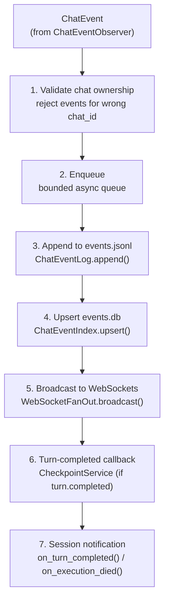

# Event Pipeline

The event pipeline transforms normalized `ChatEvent`s from all harnesses into a durable, indexed, and broadcast event stream. It is persistence-first: every event is written to disk before any downstream delivery occurs.

**Sources:** `src/meridian/lib/chat/event_pipeline.py`, `event_log.py`, `event_index.py`, `event_observer.py`, `src/meridian/lib/streaming/event_observers.py`

## ChatEvent Envelope

`ChatEvent` (`src/meridian/lib/chat/protocol.py:53–67`) is the normalized event type produced by per-harness normalizers and consumed by all downstream systems.

```python
@dataclass(frozen=True)
class ChatEvent:
    type: str               # event type, e.g. "content.delta"
    seq: int                # monotonic per-chat sequence number
    chat_id: str            # c-id (chat) or p-id (spawn)
    execution_id: str       # backing spawn_id; fences stale events
    timestamp: str          # ISO 8601
    turn_id: str | None = None
    item_id: str | None = None
    request_id: str | None = None
    payload: dict[str, Any] = field(default_factory=dict)
    harness_id: str | None = None
```

`execution_id` is present on every event. It allows clients to attribute events to the correct backing execution when a chat spans multiple executions (reacquire after backend death).

The chat contract intentionally keeps tool output off the `content` family. If a harness reports command output, file-change summaries, or tool-return payloads, those stay on `item.*` payloads so the frontend does not double-render them as assistant prose.

## Event Families

Events are grouped into 12 families. All type constants are defined in `src/meridian/lib/chat/protocol.py:9–44`.

| Family | Key Types | Description |
|---|---|---|
| **chat** | `chat.started`, `chat.configured`, `chat.state_changed`, `chat.exited` | Chat container lifecycle |
| **work** | `work.started`, `work.status_changed`, `work.files_changed` | Work item lifecycle |
| **turn** | `turn.started`, `turn.completed` | Agent turn boundaries; `turn.completed` carries usage + cost |
| **content** | `content.delta` | Assistant-authored or reasoning text only; `stream_kind`: `assistant_text`, `reasoning_text`, `reasoning_summary_text` |
| **item** | `item.started`, `item.updated`, `item.completed` | Tool/action lifecycle; carries tool metadata, command output, and terminal result data; `item_type`: `command_execution`, `file_change`, `mcp_tool_call`, `web_search`, `context_compaction`, `image_view` |
| **files** | `files.persisted` | Canonical file-change tracking; used by `meridian spawn files` |
| **spawn** | `spawn.started`, `spawn.progress`, `spawn.completed` | Sub-agent visibility |
| **request** | `request.opened`, `request.resolved`, `user_input.requested`, `user_input.resolved` | HITL approval and user input flows |
| **checkpoint** | `checkpoint.created`, `checkpoint.reverted` | Git snapshot / restore |
| **model** | `model.rerouted` | Mid-session model change |
| **runtime** | `runtime.warning`, `runtime.error` | Non-fatal issue / fatal error |
| **extension** | `extension.*` | Open namespace; e.g. `extension.microct.*`, `extension.claude.*` |

## ChatEventPipeline

`ChatEventPipeline` (`src/meridian/lib/chat/event_pipeline.py:41–148`) processes each event in strict order:



Steps 3–7 are ordered strictly. Persistence (step 3) always completes before fan-out (step 5) or any callback. Step 7 (session notification) is skipped for lifecycle events (`chat.started`, `chat.exited`).

### Queue Overflow

The pipeline queue is bounded. If it is full when a new event arrives, the event is **dropped** and a synthetic `runtime.warning` event is enqueued instead. The warning payload describes the overflow and the dropped event type. This prevents unbounded memory growth at the cost of an explicit loss signal.

## ChatEventObserver

`ChatEventObserver` (`src/meridian/lib/chat/event_observer.py:13–55`) is the bridge between the R4 observer seam (in `SpawnManager`) and `ChatEventPipeline`.

For each `HarnessEvent` dispatched by `SpawnManager`:

1. Filters by `execution_id` — drops events from stale executions
2. Calls the per-harness normalizer: `HarnessEvent → list[ChatEvent]`
3. Injects `execution_generation` into payload where needed
4. Enqueues each resulting `ChatEvent` into `ChatEventPipeline`

`ChatEventObserver` is created by `ColdSpawnAcquisition` and registered with `SpawnManager` **before** `start_spawn()`. See [backend-acquisition.md](backend-acquisition.md).

## Observer Infrastructure

The observer layer (`src/meridian/lib/streaming/event_observers.py`) decouples `SpawnManager` from chat-layer callbacks.

```python
class EventObserver(Protocol):
    async def on_event(self, event: HarnessEvent) -> None: ...

class QueuedObserver:
    """Decouples observer latency via a bounded async queue."""
    # Drops events and logs a warning if the queue is full.

class EventObserverRegistry:
    """Per-spawn observer management."""
    def register(self, spawn_id: str, observer: EventObserver) -> None: ...
    def unregister(self, spawn_id: str) -> None: ...
    async def dispatch(self, spawn_id: str, event: HarnessEvent) -> None: ...
    async def complete(self, spawn_id: str) -> None: ...
    async def shutdown(self) -> None: ...
```

`QueuedObserver` wraps `ChatEventObserver` to decouple the drain loop from the chat pipeline's processing time. The drain loop enqueues to the observer non-blocking; slow pipeline processing cannot stall event ingestion.

## ChatEventLog (JSONL Source of Truth)

`ChatEventLog` (`src/meridian/lib/chat/event_log.py:18–94`) is an append-only JSONL store.

**Location:** `~/.meridian/chats/<chat_id>/events.jsonl`

Key behaviors:

- `append(event)` assigns the next monotonic `seq`, writes atomically via `append_text_line`, returns the persisted event
- `read_from(seq)` and `read_all()` stop at truncated lines instead of raising — crash-safe reads
- On open, recovers the current `seq` and file offset by scanning from the tail; tolerates truncated last lines

The JSONL log is the **only source of truth**. If `events.db` is corrupted or deleted, it is rebuilt from this file.

## ChatEventIndex (SQLite Derived Projection)

`ChatEventIndex` (`src/meridian/lib/chat/event_index.py:14–115`) is a rebuildable SQLite projection over the JSONL log.

**Location:** `~/.meridian/chats/<chat_id>/events.db`

Six tables:

| Table | Purpose |
|---|---|
| `events` | Full event records; queryable by type, seq, execution_id |
| `files` | Per-turn file changes; powers `meridian spawn files` |
| `turns` | Turn boundaries, usage, and cost summaries |
| `checkpoints` | Checkpoint SHA, timestamp, associated turn |
| `token_usage` | Per-turn token consumption |
| `spawns` | Sub-agent spawn records |

`rebuild_from_log(event_log)` wipes all tables and replays the JSONL log from the beginning. Recovery uses this when the index is missing or stale. See [recovery.md](recovery.md).

## WebSocket Fan-Out and Replay

`WebSocketFanOut` (`src/meridian/lib/chat/ws_fanout.py:15–47`) maintains bounded per-client queues. Slow clients are evicted with WebSocket close code `1008` and a `backpressure:reconnect_with_last_seq` reason, so they can reconnect and resume from the log.

`ReplayService` (`src/meridian/lib/chat/replay.py:16–53`) handles reconnect:

1. Registers the socket before replay begins
2. Replays from `last_seq + 1` out of `ChatEventLog`
3. Tails the live fan-out queue

The chat WebSocket handler uses a send lock so replay traffic, live fan-out, and command acks do not interleave. See [decisions/chat-backend.md#d2](../../decisions/chat-backend.md#d2) for why replay was included.

## Persistence Layout

```
~/.meridian/chats/<chat_id>/
    events.jsonl    # source of truth — append-only, crash-safe
    events.db       # derived SQLite index — rebuildable from events.jsonl
    history.jsonl   # raw harness wire events — debug only, not consumed by production paths
```

## Invariants

- **I-1: Persistence before delivery** — events are written to `events.jsonl` before any WebSocket broadcast or callback. Clients always see a consistent log.
- **I-2: JSONL is the authority** — `events.db` is derived and always rebuildable from `events.jsonl`. Deleting `events.db` causes no data loss.
- **I-3: Monotonic seq** — `seq` is assigned by `ChatEventLog.append()`, never by the caller. Sequence numbers are per-chat and never reused.
- **I-4: Truncation tolerance** — `read_all()` and `read_from()` stop at truncated lines. An incomplete last line from a crash is silently ignored.
- **I-5: Overflow signal** — queue overflow drops the event and emits an explicit `runtime.warning`. Silent loss is not acceptable.

## Key References

- `ChatEventPipeline` — `src/meridian/lib/chat/event_pipeline.py:41–148`
- `ChatEventObserver` — `src/meridian/lib/chat/event_observer.py:13–55`
- `ChatEvent` + event constants — `src/meridian/lib/chat/protocol.py:9–67`
- `ChatEventLog` — `src/meridian/lib/chat/event_log.py:18–94`
- `ChatEventIndex` — `src/meridian/lib/chat/event_index.py:14–115`
- `EventObserverRegistry` / `QueuedObserver` — `src/meridian/lib/streaming/event_observers.py:52–196`
- `WebSocketFanOut` — `src/meridian/lib/chat/ws_fanout.py:15–47`
- `ReplayService` — `src/meridian/lib/chat/replay.py:16–53`

## Related

- [overview.md](overview.md) — chat pipeline reading map
- [backend-acquisition.md](backend-acquisition.md) — how ChatEventObserver is created and registered
- [runtime-and-sessions.md](runtime-and-sessions.md) — turn-completed callbacks, session notifications
- [normalization.md](normalization.md) — HarnessEvent → ChatEvent projection
- [recovery.md](recovery.md) — index rebuild, 7-point recovery contract
- [decisions/chat-backend.md](../../decisions/chat-backend.md) — D2 (event pipeline with replay), D15 (SpawnManager ownership)
