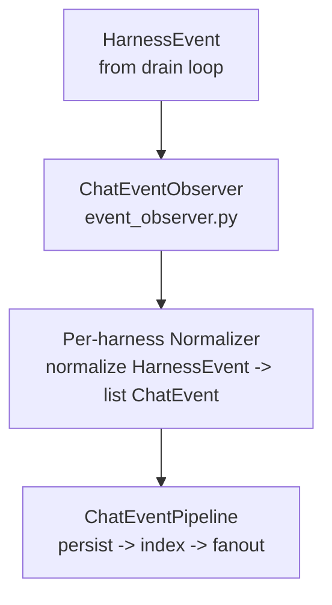
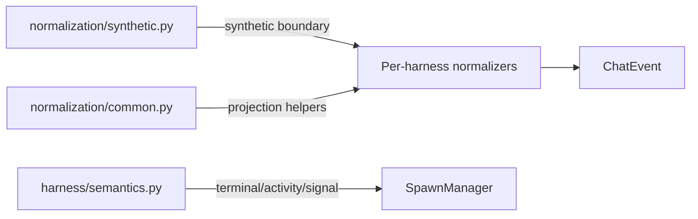

# Chat Event Normalization

Per-harness normalizers translate raw `HarnessEvent` objects into `list[ChatEvent]`. The normalizer layer is owned by the chat subsystem — `chat/normalization/` — not the harness layer.

See [decisions/chat-backend.md — D8-superseded](../../decisions/chat-backend.md#d8-superseded) for why normalizers moved from `harness/normalizers/` to `chat/normalization/`.

## Registry

`NORMALIZER_REGISTRY` maps a harness ID string to a normalizer class:

```python
# src/meridian/lib/chat/normalization/registry.py
NORMALIZER_REGISTRY: dict[str, type[EventNormalizer]] = {
    "claude": ClaudeNormalizer,
    "codex": CodexNormalizer,
    "opencode": OpenCodeNormalizer,
}
```

`get_normalizer_factory()` raises if the requested harness ID is not registered. **New harness = one new normalizer file + one registry entry.**

## Normalizer Contract

```python
# src/meridian/lib/chat/normalization/base.py
class EventNormalizer(Protocol):
    def normalize(self, event: HarnessEvent) -> list[ChatEvent]:
        """Translate one HarnessEvent into zero or more ChatEvents.
        Returns [] to drop an unrecognized event."""
        ...

    def reset(self) -> None:
        """Clear stateful context at execution boundaries."""
        ...
```

Each normalizer is stateful and per-execution. `reset()` is called when an execution boundary is crossed (reconnect, reacquire). The normalizers carry just enough turn-local memory to turn evolving harness event shapes back into the stable chat contract.

## Frontend Contract

Normalization exists to preserve the frontend chat contract across harness drift. The current contract is:

- Assistant-visible text emits `content.delta` with `payload.stream_kind = "assistant_text"` and `payload.text`.
- Reasoning emits `content.delta` with a reasoning stream kind.
- Turn lifecycle emits `turn.started` and exactly one `turn.completed` per actual turn.
- Tool lifecycle is canonicalized as `item.started` -> `item.updated` -> `item.completed`, with exactly one terminal `item.completed` per tool item.
- Tool output and command output stay on `item.*` payloads. They do not project into `content.delta`.
- Errors and request flows emit normalized terminal/request events instead of being silently dropped.

This is a repair seam, not a redesign seam. When a harness adds a new raw event shape, expand the per-harness mapping without breaking older supported shapes.

## Normalization Pipeline



`ChatEventObserver` filters by `execution_id` and injects `execution_generation` into the payload before passing to the normalizer. See [event-pipeline.md](event-pipeline.md) for pipeline internals.

## Three Semantic Planes

Three modules serve distinct roles. They must not be merged:

| Plane | Module | Purpose |
|---|---|---|
| Runtime/drain semantics | `src/meridian/lib/harness/semantics.py` | `terminal_outcome()`, `activity_transition()`, `clears_signal()` — when does a drain end, what activity state changes |
| Synthetic runtime events | `src/meridian/lib/chat/normalization/synthetic.py` | Adapter for `meridian/*` event constants; `is_turn_boundary_event()`. Per-harness normalizers import this, never `drain_policy` directly. |
| Projection helpers | `src/meridian/lib/chat/normalization/common.py` | `canonical_item_type()`, ID extraction/coercion helpers, and small shared projection utilities |

Runtime semantics and projection semantics answer different questions for different consumers. Keeping them separate prevents coupling `SpawnManager` and `ChatEventPipeline` through a shared classifier.



## Per-Harness Normalizers

### Claude (`normalization/claude.py`)

Claude now has to support both streaming block events and aggregated message snapshots.

| Claude event | ChatEvent(s) |
|---|---|
| `message_start` | `turn.started` |
| `content_block_delta` with text | `content.delta` (`assistant_text`) |
| `content_block_delta` with thinking | `content.delta` (`reasoning_text`) |
| `content_block_start` with `tool_use` | `item.started` |
| `content_block_delta` with `input_json_delta` | accumulated tool metadata |
| aggregated `assistant` event with `message.content[].type = tool_use` | `item.started` |
| aggregated `user` event with `message.content[].type = tool_result` | `item.completed` |
| `result` | fallback assistant text, `files.persisted`, `turn.completed` |

Important behavior:

- `content_block_stop` for `tool_use` is non-terminal. If Claude later emits an aggregated `tool_result`, that result owns the terminal `item.completed`.
- Aggregated `tool_result` can arrive on later persistent turns after prior synthetic completion activity. The normalizer must not suppress that later real turn.
- Assistant fallback text may come only on `result`; the normalizer emits it only if earlier streaming text was not already emitted.

### Codex (`normalization/codex.py`)

Codex support is mostly about compatibility with multiple live raw shapes and defensive ID extraction.

| Codex event | ChatEvent(s) |
|---|---|
| `turn/started` | `turn.started` |
| `turn/completed` | `turn.completed` with usage or error |
| `item/started`, `item/updated`, `item/completed` | canonical `item.*` |
| `item/agentMessage/delta` | `content.delta` (`assistant_text`) |
| terminal `item/completed` for `agentMessage` | fallback assistant `content.delta` when no delta was seen |
| `agent_message_chunk`, `content/delta`, `agent/message/delta` | `content.delta` (`assistant_text`) |
| `agent_thought_chunk`, `reasoning/delta`, `agent/thought/delta` | `content.delta` (`reasoning_text`) |
| `request.opened`, `request.resolved` | request lifecycle events |
| `user_input.requested` | `user_input.requested` |
| file events | `files.persisted` |
| warning events | `runtime.warning` |

Important behavior:

- Turn and thread IDs may appear as snake_case, camelCase, or nested under `turn`, `thread`, and item payloads. The normalizer extracts IDs defensively.
- Tool output such as `aggregatedOutput` stays on the `item.completed` payload. It does not become assistant text.
- Assistant text can arrive either as streamed deltas or only on terminal `agentMessage` completion snapshots. The normalizer avoids double-emitting the same assistant text.

### OpenCode (`normalization/opencode.py`)

OpenCode requires part-role tracking across deltas, snapshots, and session lifecycle events.

| OpenCode event | ChatEvent(s) |
|---|---|
| `session.status` with `busy` | `turn.started` |
| first assistant/tool event in a turn | `turn.started` if not already open |
| `session.idle` | `turn.completed` |
| `session.error` | `runtime.error` + error `turn.completed` |
| `message.part.delta` | `content.delta` using tracked `part.id -> part.type` |
| `message.part.updated` | snapshot-based text/reasoning fallback or tool lifecycle events |
| `message.updated` | authoritative message snapshot; refresh role/type tracking and emit any missing terminal state |
| legacy `agent_message_chunk` / `agent_thought_chunk` | text/reasoning fallback mappings |
| legacy `tool_call` / `tool_call_update` | tool fallback mappings |

Important behavior:

- `message.updated` records `message.id -> role`.
- `message.part.updated` and `message.part.delta` record `part.id -> type` and `part.id -> message.id`.
- Only assistant-role `text` and `reasoning` parts become `content.delta`.
- Tool state maps as `pending` -> `item.started`, `running` -> `item.updated`, `completed` -> `item.completed`.
- If OpenCode only surfaces a terminal completed tool snapshot, the normalizer emits a synthetic `item.started` first so downstream consumers still see a coherent lifecycle.

## Synthetic Turn Boundary Adapter

`drain_policy.py` emits a synthetic `meridian/turn_completed` event when `PersistentDrainPolicy` observes a successful turn boundary. Normalizers must recognize this without importing `drain_policy` directly:

```python
# src/meridian/lib/chat/normalization/synthetic.py
TURN_BOUNDARY_EVENT_TYPE = "meridian/turn_completed"

def is_turn_boundary_event(event: HarnessEvent) -> bool:
    return event.type == TURN_BOUNDARY_EVENT_TYPE
```

Each normalizer imports `is_turn_boundary_event` from `synthetic.py`. This is the only coupling point between the drain layer and the normalization layer.

## Completion Dedupe Rule

Synthetic completion exists to close turns when a harness never provides a usable terminal boundary. It must not create extra turns or poison later ones.

- Emit exactly one normalized `turn.completed` per actual turn.
- Prefer real terminal events over synthetic `meridian/turn_completed`.
- Dedupe by real turn identity when the harness provides one.
- Synthetic fallback IDs may keep the stream internally coherent, but they must not create a second visible completion.
- State reset after completion must allow the next real `turn.started` and `turn.completed` through.

This rule is shared behavior even though the state tracking remains per-normalizer.

## Canonical Item Types

`canonical_item_type()` in `common.py` maps harness-specific tool or item names to chat-layer canonical categories:

| Output | Meaning |
|---|---|
| `"command_execution"` | Shell command runs |
| `"file_change"` | File read/write/edit operations |
| `"mcp_tool_call"` | MCP protocol tool invocations |
| `"web_search"` | Web search tool |
| `"context_compaction"` | Context window compaction |
| `"image_view"` | Image inspection |
| fallback `"tool_use"` | Unrecognized tool names |

## Import Direction

The harness layer (`lib/harness/`) must not import from the chat layer (`lib/chat/`). Normalizers live in `lib/chat/normalization/` so all `ChatEvent` imports remain inside the chat layer boundary.

```text
lib/harness/        # HarnessEvent, raw connections, semantics
    ↓ (HarnessEvent passed through observer seam)
lib/chat/           # ChatEvent, normalizers, pipeline
```

## Key References

- `src/meridian/lib/chat/normalization/base.py` — `EventNormalizer` protocol
- `src/meridian/lib/chat/normalization/registry.py` — `NORMALIZER_REGISTRY`, `get_normalizer_factory()`
- `src/meridian/lib/chat/normalization/claude.py` — `ClaudeNormalizer`
- `src/meridian/lib/chat/normalization/codex.py` — `CodexNormalizer`
- `src/meridian/lib/chat/normalization/opencode.py` — `OpenCodeNormalizer`
- `src/meridian/lib/chat/normalization/common.py` — `canonical_item_type()`, coercion helpers, shared extraction
- `src/meridian/lib/chat/normalization/synthetic.py` — `is_turn_boundary_event()`
- `src/meridian/lib/chat/event_observer.py` — `ChatEventObserver`
- `src/meridian/lib/harness/semantics.py` — runtime semantic functions
- `tests/unit/chat/normalization/test_claude.py` — aggregated `tool_use` / `tool_result` coverage and persistent-turn regressions
- `tests/unit/chat/normalization/test_codex.py` — ID extraction, assistant-text fallback, tool lifecycle, completion dedupe
- `tests/unit/chat/normalization/test_opencode.py` — part-role tracking, snapshot recovery, tool-state lifecycle, idle completion dedupe
- `tests/integration/chat/test_harness_parity.py` — canonical event-family parity across harnesses

## Related

- [event-pipeline.md](event-pipeline.md) — how normalized events are persisted and fanned out
- [recovery.md](recovery.md) — replay and persisted-history behavior that depends on normalization staying stable
- [extensibility.md](extensibility.md) — S1: adding a new harness normalizer
- [decisions/chat-backend.md](../../decisions/chat-backend.md) — D8, D8-superseded, D20
