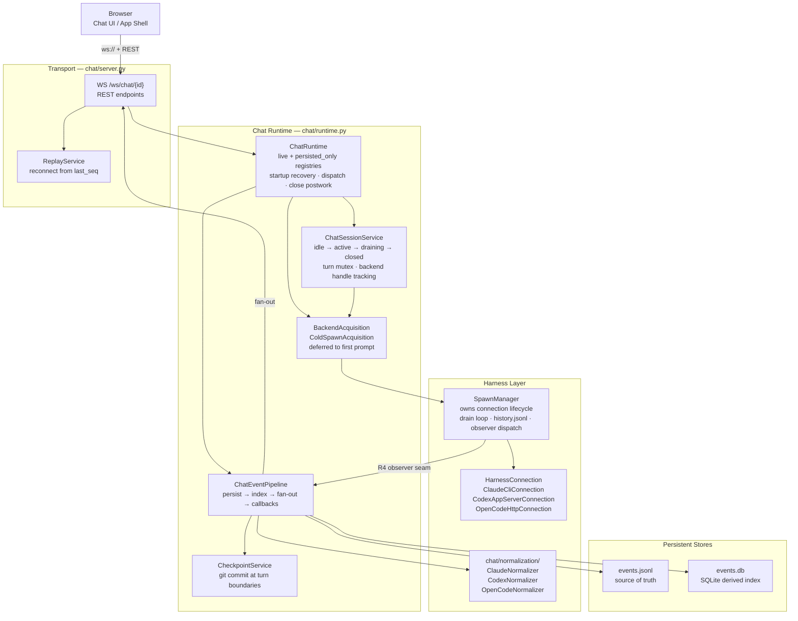

# Chat Pipeline — Overview

The chat pipeline is a five-layer stack that transforms raw harness wire events into a persistent, queryable, multi-client event stream. It runs inside `meridian chat` and powers the browser-based agent interaction UI.

## Five-Layer Model

```
Layer 0: Wire protocol
  Claude: stdio NDJSON  |  Codex: JSON-RPC WebSocket  |  OpenCode: HTTP SSE
  (stays inside the connection class — never exposed upstream)

Layer 1: SpawnManager + HarnessConnection
  drain loop  →  history.jsonl persistence  →  R4 observer dispatch

Layer 2: Normalization
  HarnessEvent  →  per-harness normalizer  →  ChatEvent

Layer 3: Persistence
  events.jsonl (source of truth)  →  events.db (SQLite derived index)

Layer 4: Delivery
  WebSocket fan-out  |  REST endpoints  |  ReplayService  |  CLI tools
```

Wire-protocol details never leave the connection class. All consumers see `HarnessEvent` at layer 1 and `ChatEvent` at layer 2 and above.

## Component Diagram



## Ownership Boundaries

**SpawnManager owns the connection.** It runs the drain loop, persists raw events to `history.jsonl`, and dispatches through the `EventObserverRegistry`. It does not produce `ChatEvent`s — that projection is the chat layer's responsibility.

**ChatRuntime owns the session lifecycle.** It maintains the live and persisted-only chat registries, assembles per-chat components at creation time, dispatches commands, and runs close postwork after a session accepts a `close` command.

**ChatEventPipeline is persistence-first.** Events are written to `events.jsonl` before any fan-out or callback. Clients always see a consistent log; no event can be delivered to a WebSocket before it is durable.

**Normalization is a chat concern.** The `chat/normalization/` layer owns the `HarnessEvent → ChatEvent` projection. The harness layer stops at raw events and runtime semantics. See [decisions/chat-backend.md#d8-superseded](../../decisions/chat-backend.md#d8-superseded) for why normalizers moved out of the harness layer.

## Pages in This Subtree

| Page | What it covers |
|---|---|
| [runtime-and-sessions.md](runtime-and-sessions.md) | ChatRuntime registries, session state machine, close lifecycle, stop contract |
| [backend-acquisition.md](backend-acquisition.md) | Acquisition boundary, ColdSpawnAcquisition, observer-before-spawn invariant |
| [event-pipeline.md](event-pipeline.md) | ChatEvent envelope, event families, persistence-first pipeline, JSONL log, SQLite index |
| [normalization.md](normalization.md) | Per-harness normalizers, registry, semantic planes |
| [command-system.md](command-system.md) | ChatCommand contract, dispatch, bidirectional WebSocket protocol |
| [recovery.md](recovery.md) | Crash recovery, 7-point contract, checkpoint service |
| [dev-frontend.md](dev-frontend.md) | Portless launcher, Vite, supervisor, discovery |
| extensibility.md | Extension scenarios, registry patterns (not yet written) |

## Key File Paths

```
src/meridian/lib/chat/
    runtime.py              # ChatRuntime, LiveChatEntry, PersistedChatRecord
    session_service.py      # ChatSessionService, ChatState
    backend_acquisition.py  # BackendAcquisition, ColdSpawnAcquisition
    event_pipeline.py       # ChatEventPipeline, ChatEventObserver
    event_log.py            # ChatEventLog (JSONL)
    event_index.py          # ChatEventIndex (SQLite)
    protocol.py             # ChatEvent, event family + lifecycle constants
    normalization/          # per-harness HarnessEvent → ChatEvent projection
    server.py               # FastAPI app, WebSocket, REST, configure()

src/meridian/lib/streaming/
    spawn_manager.py        # SpawnManager, drain loop, observer registry
    event_observers.py      # EventObserver, QueuedObserver, EventObserverRegistry
    drain_policy.py         # SingleTurnDrainPolicy, PersistentDrainPolicy
```

## Related

- [architecture/overview.md](../overview.md) — subsystem map
- [concepts/spawn-lifecycle.md](../../concepts/spawn-lifecycle.md) — spawn state machine underlying chat sessions
- [decisions/chat-backend.md](../../decisions/chat-backend.md) — all chat architecture decisions
