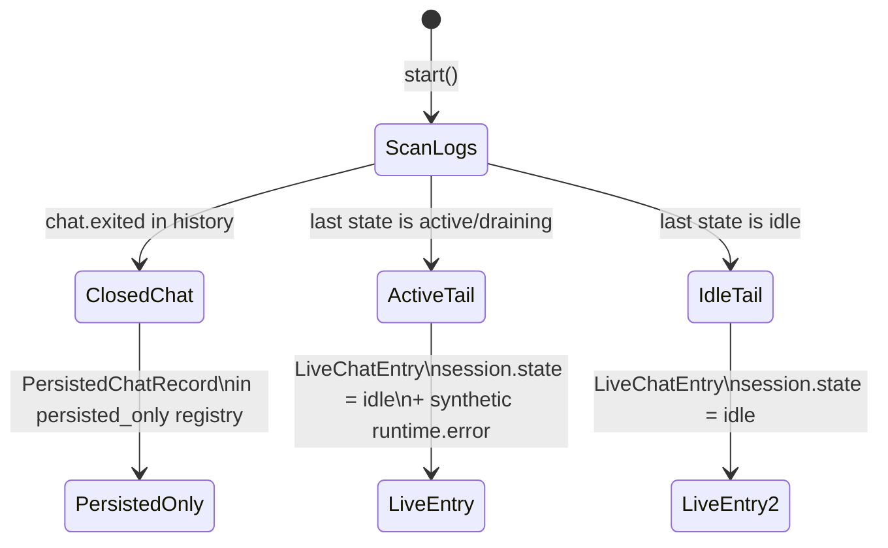

# Chat Recovery

The chat subsystem applies crash-only design: if meridian exits mid-session, the next `ChatRuntime.start()` reconstructs all chat state from disk. There is no "graceful shutdown" path that the recovery logic depends on.

Recovery operates at two levels: **crash recovery** (startup scan of all chat event logs) and **runtime recovery** (serving disk state for chats not currently in memory).

## Crash Recovery

`recover_all()` in `src/meridian/lib/chat/recovery.py` runs once at startup, called by `ChatRuntime.start()`. It scans `{runtime_root}/chats/*/history.jsonl`, rebuilds indexes, and populates the runtime registries.

### 7-Point Recovery Contract

| Point | Condition | Outcome |
|---|---|---|
| R1 | `chats/` directory missing | Return empty registries; no error |
| R2 | Truncated JSONL tail | Tolerated via `ChatEventLog.read_all()` — truncated last line is skipped, not raised |
| R3 | Chat has `chat.exited` in history | → `PersistedChatRecord` in `persisted_only` registry; no `ChatSessionService`, pipeline, checkpoint, or fanout created |
| R4 | Last derived state is `active` or `draining` | → `LiveChatEntry` with `session.state = "idle"` + synthetic `runtime.error{reason: "backend_lost_after_restart"}` |
| R5 | Last derived state is `idle` | → `LiveChatEntry` with `session.state = "idle"`; no synthetic error |
| R6 | Stale or corrupt `events.db` | Rebuild from `events.jsonl` via `ChatEventIndex.rebuild_from_log()` |
| R7 | Repeated `start()` calls | Idempotent — no duplicate registry entries, no duplicate `runtime.error` events |

### Recovery State Machine

### Build Path for Live Entries

`build_live_entry()` assembles a `LiveChatEntry` from the recovered event log:

1. Load `ChatEventLog` from `{chats_dir}/{chat_id}/history.jsonl`
2. Load or rebuild `ChatEventIndex` from the JSONL source of truth
3. Construct `WebSocketFanOut`, `ChatEventPipeline`, `CheckpointService`
4. Construct `ChatSessionService` with `state = idle`
5. If the last state was `active` or `draining`, append the synthetic `runtime.error` to the log and upsert into the index

The `execution_id` in the synthetic `runtime.error` is set to the last non-empty `execution_id` found in the history.

## Runtime Recovery (Disk Fallback)

After startup, `ChatRuntime` can serve state for chats not held in memory:

- `get_state()` — returns chat state from the `persisted_only` registry if the chat is not live
- `get_stream_source()` — falls back to disk for replay if the chat is not live
- `list_chats()` — merges live registry, `persisted_only` registry, and on-disk chat directory listing

This allows a reconnecting client to replay history for a closed chat without the chat being in the live registry.

## Checkpoints

**`CheckpointService`** (`src/meridian/lib/chat/checkpoint.py`) provides git-backed undo at turn boundaries.

### Behavior

- `create_checkpoint()`: runs `git add -A`, commits if there are staged changes, emits `checkpoint.created` into the pipeline
- `revert_to_checkpoint()`: runs `git reset --hard <commit_sha>`, emits `checkpoint.reverted` into the pipeline

The checkpoint callback is wired from `ChatEventPipeline.set_turn_completed_callback()` during `build_live_entry()`. Every completed turn triggers a checkpoint attempt.

### Conservative Defaults

`CheckpointService` is intentionally conservative:

- **Skip for multi-chat roots.** When multiple chats share the same project root, checkpoint create/revert are refused — one chat's revert would clobber another's working tree.
- **No-op outside a git repo.** If the project root has no `.git`, checkpoint operations silently no-op.
- **No cross-process locking.** `git reset --hard` is not safe to run concurrently with another process modifying the working tree. This is a known limitation tracked as a deferred structural concern.

See [decisions/chat-backend.md — D27](../../decisions/chat-backend.md#d27) for the checkpoint scope safety fix.

## Invariants

- **I-1: JSONL is the source of truth.** Recovery reads only `history.jsonl`. The `events.db` SQLite index is always derivable from JSONL and rebuilt if corrupt.
- **I-2: `start()` is idempotent.** Calling `ChatRuntime.start()` twice produces no duplicate registry entries and no duplicate synthetic errors.
- **I-3: Truncation tolerance.** `ChatEventLog.read_all()` stops at a truncated line; startup never fails because the last write was partial.
- **I-4: Synthetic errors are persisted.** `runtime.error{reason: "backend_lost_after_restart"}` is appended to `history.jsonl` and upserted into `events.db` so clients receive it on replay.

## Key References

- `src/meridian/lib/chat/recovery.py` — `recover_all()`, `build_live_entry()`
- `src/meridian/lib/chat/runtime.py` — `ChatRuntime.start()`, `get_state()`, `get_stream_source()`, `list_chats()`
- `src/meridian/lib/chat/checkpoint.py` — `CheckpointService`
- `src/meridian/lib/chat/event_log.py` — `ChatEventLog.read_all()` truncation tolerance
- `src/meridian/lib/chat/event_index.py` — `ChatEventIndex.rebuild_from_log()`

## Related

- [runtime-and-sessions.md](runtime-and-sessions.md) — `ChatRuntime`, `LiveChatEntry`, `PersistedChatRecord`, session lifecycle
- [event-pipeline.md](event-pipeline.md) — `ChatEventLog`, `ChatEventIndex`, persistence layer
- [decisions/chat-backend.md](../../decisions/chat-backend.md) — D27, D29, D30, D31
