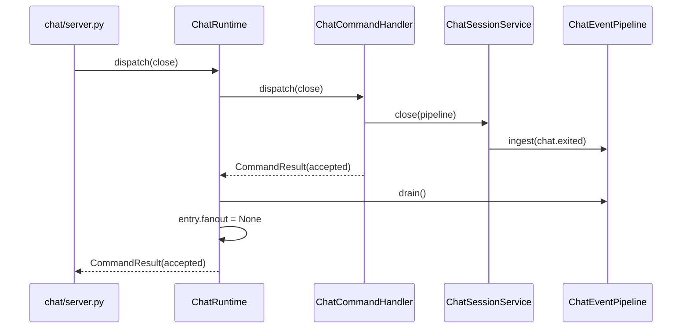
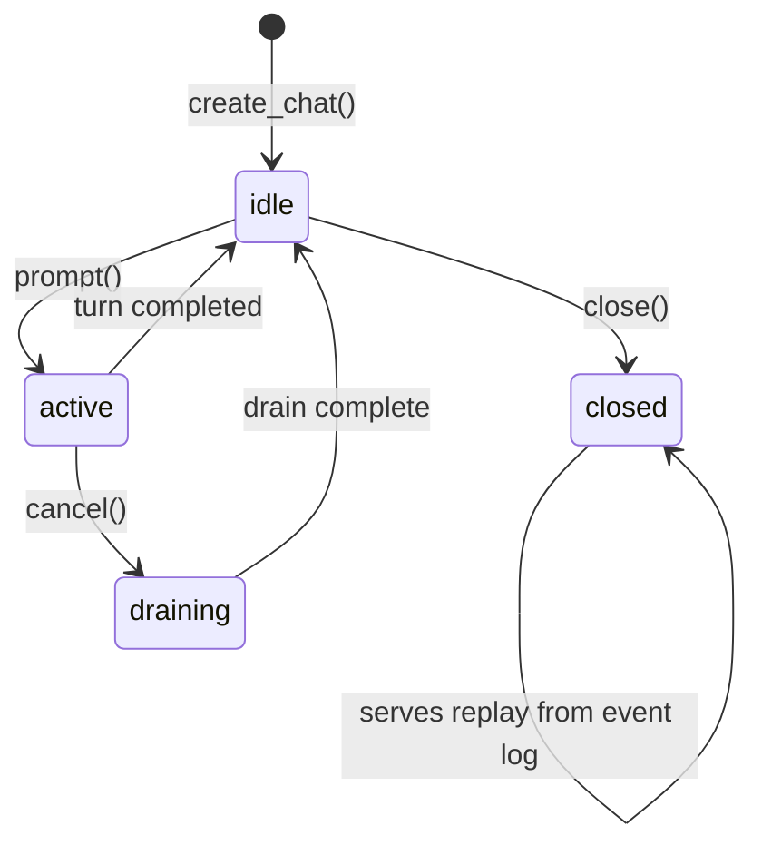

# Chat Runtime and Sessions

`ChatRuntime` is the top-level registry for all chats within a single `meridian chat` process. It owns lifecycle, command dispatch, startup recovery, and close postwork. `ChatSessionService` owns per-chat state transitions and turn serialization.

## ChatRuntime

**Source:** `src/meridian/lib/chat/runtime.py`

`ChatRuntime` maintains two registries:

```python
@dataclass
class LiveChatEntry:
    session: ChatSessionService
    event_log: ChatEventLog
    event_index: ChatEventIndex
    fanout: WebSocketFanOut | None   # None after same-process close
    pipeline: ChatEventPipeline
    checkpoint: CheckpointService

@dataclass(frozen=True)
class PersistedChatRecord:
    event_log: ChatEventLog
    event_index: ChatEventIndex
    state: Literal["closed"]
```

### Registry Rules

| Situation | Placement | Notes |
|---|---|---|
| `create_chat()` | `live` | `fanout` present and active |
| Accepted `close` command (same process) | `live` | `fanout = None`; `session.state == "closed"` |
| Recovered closed chat (after restart) | `persisted_only` | Event log readable; no session, pipeline, or fanout |
| Recovered active/draining chat (after restart) | `live` | `session.state = "idle"` + synthetic `runtime.error{reason: "backend_lost_after_restart"}` |

Subsequent commands on a same-process-closed chat reject with `chat_closed`, not `chat_not_found`. This distinction is intentional — the chat exists but accepts no new commands.

### Chat Creation

`create_chat()` performs component assembly in order:

1. Create `ChatEventLog` (JSONL store)
2. Create `ChatEventIndex` (SQLite projection)
3. Create `ChatSessionService`
4. Create `WebSocketFanOut`
5. Create `ChatEventPipeline`
6. Create `CheckpointService`
7. Register in `live` registry
8. Emit `chat.started` into the pipeline

Backend acquisition is **not** performed at creation. It is deferred to first prompt. See [backend-acquisition.md](backend-acquisition.md) and [decisions/chat-backend.md#d19](../../decisions/chat-backend.md#d19).

### Command Dispatch

`dispatch(command)` creates a per-call `ChatCommandHandler` and executes it. For accepted `close` commands, `ChatRuntime` runs postwork after the handler returns:



`server.py` never touches pipeline or fanout internals. All close postwork runs inside `ChatRuntime.dispatch()`.

### Stop Contract

`stop()` is process teardown, not user close. It is **idempotent** and does **not** emit `chat.exited` or modify persisted history. For each live entry: stop the backend handle (best-effort), `await pipeline.drain()`, `await pipeline.stop()`, drop fanout references, clear registries.

### Startup Recovery

`start()` calls `recover_all()` exactly once, then starts any recovered live pipelines. Recovery is documented in [recovery.md](recovery.md).

`list_chats()` merges live, persisted-only, and on-disk chat IDs so state queries work for chats not currently in memory.

## ChatSessionService

**Source:** `src/meridian/lib/chat/session_service.py`

`ChatSessionService` owns per-chat lifecycle and serializes concurrent turn requests.

### State Machine



State values (`ChatState`): `idle | active | draining | closed`.

State transitions are serialized through an internal `_state_lock`.

### prompt()

1. Rejects if `state == closed` → `ChatClosedError`
2. Rejects if `state == active` or `state == draining` → `ConcurrentPromptError`
3. If backend handle is dead, reacquires via the stored `BackendAcquisition`
4. Sends the message through the existing execution
5. Transitions to `active`

### cancel()

Moves to `draining` and sends cancel downstream to the backend handle.

### close(pipeline)

Stops the backend handle and emits `chat.exited` into the pipeline (if `pipeline` is provided). Moves to `closed`. Runtime-owned postwork runs after this returns.

### on_turn_completed() / on_execution_died()

Both use **execution generation fencing** to reject callbacks from stale executions. Each new backend acquisition increments the generation counter. Callbacks carrying an outdated generation are dropped. `on_turn_completed()` restores `idle`. `on_execution_died()` clears the dead handle and, for an unexpectedly dead execution, synthesizes a `runtime.error` event.

## Acquisition Assembly Seams

`ChatRuntime` breaks the bootstrap cycle between itself and `ColdSpawnAcquisition` via two protocol seams:

```python
class PipelineLookup(Protocol):
    def get_pipeline(self, chat_id: str) -> ChatEventPipeline | None: ...

class BackendAcquisitionFactory(Protocol):
    def build(
        self,
        *,
        pipeline_lookup: PipelineLookup,
        project_root: Path,
        runtime_root: Path,
    ) -> BackendAcquisition: ...
```

Construction order at startup:

1. `chat_cmd.py` creates `ChatRuntime` with `runtime_root`, `project_root`, and an `AcquisitionFactory`
2. `ChatRuntime.__init__()` creates empty registries
3. `ChatRuntime` calls `factory.build(pipeline_lookup=self, ...)`
4. The built `BackendAcquisition` is stored on the runtime
5. `build_live_entry()` injects it into each new `ChatSessionService`

`ColdSpawnAcquisition` needs `PipelineLookup` at acquire-time, not at construction — so the factory seam allows both objects to exist without either importing the other.

## Invariants

- **I-1: Single consumer** — `ChatRuntime.dispatch()` is the only entry point for commands. `server.py` never reaches into live entry internals.
- **I-2: Close postwork** — after an accepted `close`, `ChatRuntime.dispatch()` drains the pipeline and nulls `fanout` before returning. Server layer sees a clean `CommandResult`.
- **I-3: Generation fencing** — `on_turn_completed` and `on_execution_died` check generation counters before mutating state. Stale callbacks from prior executions are dropped.
- **I-4: Idempotent stop** — `stop()` is safe to call multiple times; no duplicate teardown or extra history entries.

## Key References

- `ChatRuntime` — `src/meridian/lib/chat/runtime.py:70–287`
- `LiveChatEntry` / `PersistedChatRecord` — `src/meridian/lib/chat/runtime.py:34–60`
- `ChatSessionService` / `ChatState` — `src/meridian/lib/chat/session_service.py:15–145`
- `build_live_entry()` — `src/meridian/lib/chat/runtime.py:185–214`
- `BackendAcquisitionFactory` / `PipelineLookup` — `src/meridian/lib/chat/backend_acquisition.py:29–53`

## Related

- [overview.md](overview.md) — chat pipeline reading map
- [backend-acquisition.md](backend-acquisition.md) — ColdSpawnAcquisition, observer-before-spawn invariant
- [event-pipeline.md](event-pipeline.md) — ChatEventPipeline internals
- [recovery.md](recovery.md) — 7-point startup recovery contract
- [decisions/chat-backend.md](../../decisions/chat-backend.md) — D15 (connection ownership), D19 (deferred acquisition), D27 (final gate fixes)
