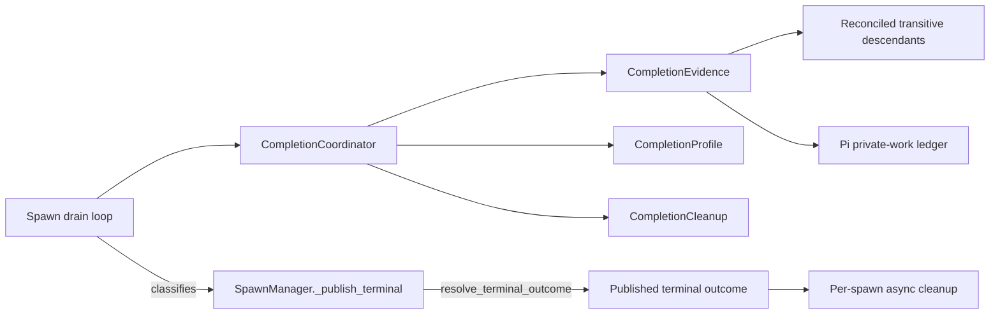

# Completion drain is shared mechanism with profile-owned policy

Pi and resident drains use one `CompletionCoordinator`, composed with
`CompletionEvidence`, `CompletionProfile`, and `CompletionCleanup`
collaborators. The coordinator owns candidate, wait, deadline, and stabilization
mechanics; each profile owns the policy that decides what those facts mean.

## The coordinator accepts evidence; it does not discover work

The coordinator retains a successful parent terminal candidate, requests fresh
work assessments, schedules one completion deadline, and manages any
stabilization window. Assessments are `ready`, `blocked`, or `unknown`. A store
or observation failure produces typed `unknown`; it never becomes an empty work
set.

Events, file notifications, and bounded polls only wake assessment. They carry
no completion truth. A profile can allow evaluation before a terminal candidate
through `allows_evaluation_without_candidate`, but the generic coordinator does
not infer that policy from an event type.

The collaborators are cohesive boundaries:

- **Completion evidence** observes persisted events and returns immutable
  assessments.
- **Completion profile** owns directives, precedence, outcome mapping,
  deadline/reset policy, close classification, stabilization, and advisory
  nudges.
- **Completion cleanup** interprets cleanup handles after the profile authorizes
  cleanup.

Composition avoids an inheritance contract at the most ordering-sensitive
points. A shared base class would make Pi override timeout, post-event,
stream-exit, and finalization hooks, turning hook order and protected mutable
state into an implicit API.

## One reconciled tree owns persisted descendants

`ReconciledDescendantEvidence` is the sole persisted-descendant authority for
both profiles. It reads valid spawn rows, applies the non-mutating reconciliation
projection, then performs cycle-safe transitive traversal. A live grandchild
beneath a terminal direct child therefore still blocks completion. A store-wide
read failure returns `unknown`; an individual row that cannot establish a valid
lineage is not admitted to the tree.

Pi-private work remains separate because a `SpawnRecord` cannot represent it.
`PiPrivateWorkLedger` owns immutable snapshots of:

- tracked bash;
- pending implicit-wait notifications;
- rowless Pi-internal subspawns;
- private-work read failures;
- owned PID/PGID cleanup handles.

`PiDiskWatcher` observes only the private bash and notification files. It does
not scan spawn directories or infer descendants. The reconciled tree is
reassessed on a bounded poll while completion is pending.

## Readability is required even for `done`

Every success follows a fresh assessment. A `done` directive may override known
blockers, but it cannot turn `unknown` into success. Transient unreadability
waits for recovery. Persistent unreadability fails at the single completion
deadline with `resident_evidence_unreadable` or `pi_evidence_unreadable`; the
rendered failure directs the operator to the session log.

Stabilization is generation-aware but not generation-only. An unchanged ready
assessment after an early wake keeps the current window. Persisted activity may
restart the window even when the evidence generation is unchanged. Pi may also
hold the original candidate and absolute stabilization deadline across an
auxiliary-only blocker.

## Publication is a manager-owned barrier

Terminal publication is owned by `SpawnManager._publish_terminal()`, not by
the drain loop. The drain loop classifies its outcome and passes it to the
barrier; `stop_spawn()` also calls the same barrier with its own stop intent.
The `terminal_published` flag on `SpawnSession` makes publication idempotent
across both paths.

`resolve_terminal_outcome()` resolves competing terminal sources in explicit
priority order: success wins; otherwise an authoritative stop outcome (set by
`stop_spawn()`) wins; otherwise the drain classification stands. This replaces
the former `preferred_stop_outcome` mutable override, making the priority
visible in one named function rather than scattered across the drain loop.

When a deadline, failure, cancel, or stream-exit path authorizes cleanup, the
coordinator latches at most one cleanup request and clears the live deadline.
The barrier publishes the resolved terminal outcome, resolves the completion
future, and starts one per-spawn cleanup task. Cleanup tasks are keyed by
spawn ID (`_cleanup_tasks: dict[SpawnId, Task]`); `stop_spawn()` awaits only
its own spawn's cleanup, and `shutdown()` drains all remaining tasks.

A stuck descendant cleanup cannot delay publication. `CleanupReport` is
telemetry: cleanup failure cannot replace the published outcome, reopen the
completion cycle, or arm another child wave. Startup reaper reconciliation
recovers incomplete cleanup after a crash. Completion deadlines are
process-local monotonic values rather than persisted timers.

Cleanup identity is not cleanup permission. Canonical descendant cancellation
runs first and returns only IDs proved terminal by its fixed-point path. Pi
process cleanup may exclude those `converged_cancel_ids`; merely selected or
attempted IDs remain eligible for an owned fallback handle.

## Composition is outside `SpawnManager`

`drain_plan_factory.py` is the composition root:

- a resident-capable connection gets the resident profile;
- a spawned Pi RPC session gets the Pi profile and private-ledger wake source;
- ordinary streaming gets `DrainPlan(coordinator=None)`.

The plan owns `DrainSessionTeardown` from `drain_teardown.py`, including async
connection stop and Pi cleanup-phase policy. `SpawnManager` supplies generic
capabilities such as serialized injection and application-service cleanup; it
contains no Pi imports or Pi child-wave, notification, process-group, stop
reason, or cleanup-phase policy.

## Invariants

1. Fresh evidence precedes every success.
2. `unknown` blocks success, including a `done`-directed success.
3. One completion cycle has at most one deadline expiry, one latched cleanup,
   and one published terminal outcome.
4. Wakes trigger reassessment; they are not evidence.
5. Persisted descendant authority is reconciled, cycle-safe, and transitive.
6. Profile precedence owns coincident directives, deadlines, readiness,
   stabilization, and profile timers.
7. Terminal publication is idempotent and one-way; `_publish_terminal` guards
   against double publication; cleanup and lifecycle effects cannot replace the
   outcome.
8. `note_event_persisted`, observer dispatch, and fan-out occur only after a
   successful history write.
9. Pi nudges route through serialized `SpawnManager.inject()`.
10. The plain path remains `coordinator=None`.

## Provenance

- `work:drain-convergence`
- `work:drain-streaming-cleanup` (PR #375: reconciliation decisions extraction, rearm budget, timeout carrier unification)
- `work:drain-streaming-cleanup` follow-up (probe-fix cycle: publication barrier, `resolve_terminal_outcome`, per-spawn cleanup keying)

## Related pages

- [spawn-finalization.md](spawn-finalization.md) — store authority and terminal publication.
- [pi-lifecycle.md](pi-lifecycle.md) — Pi quiescence and private-work behavior.
- [atomic-child-row-publication.md](atomic-child-row-publication.md) — complete-row visibility.
