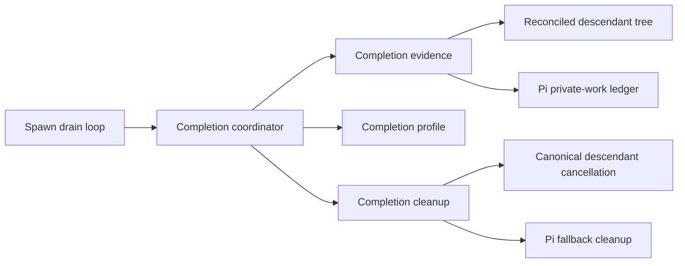

# Completion drain converges through composition

Meridian will use one completion coordinator for Pi and resident drains, while
keeping evidence, profile policy, and cleanup in three injected collaborators.
This is settled target architecture, not the current checkout: resident and Pi
still have separate coordinators and different descendant sources.

## The shared mechanism is deliberately small

The coordinator holds a successful parent terminal candidate, requests a fresh
work assessment, schedules deadlines and stabilization, and publishes the
profile-selected terminal outcome. An assessment is `ready`, `blocked`, or
`unknown`; an evidence failure produces `unknown` and cannot be interpreted as
an empty work set. Events, file notifications, and polling only wake assessment.
They are never completion evidence themselves.

The collaborators are deep boundaries rather than callback collections:

- **Completion evidence** observes events and produces immutable assessments.
- **Completion profile** owns directives, outcome mapping, deadline/reset
  policy, close classification, stabilization, and advisory nudges.
- **Completion cleanup** interprets safe cleanup handles after policy authorizes
  cleanup.

A shared base coordinator was rejected. Pi would have to override timeout,
post-event, stream-exit, and finalization hooks—the exact ordering-sensitive
points—turning protected mutable state and hook order into an implicit API.
Composition makes those dependencies explicit and keeps Pi policy out of the
generic state machine. A universal functional reducer remains deferred until
the profiles prove a stable shared input/effect vocabulary.

## Persisted descendants and Pi-private work are separate ledgers

The reconciled, cycle-safe, transitive spawn tree is the target authority for
Meridian-managed persisted descendants in both profiles. Pi keeps a separate
private-work ledger for facts that a `SpawnRecord` cannot represent:

- tracked bash;
- pending implicit-wait notifications;
- rowless Pi-internal subspawns;
- owned PID/PGID cleanup handles.

Blocker identity does not grant permission to kill a process. Deadline cleanup
first invokes canonical descendant cancellation. Pi fallback cleanup may
exclude only `converged_cancel_ids`: descendant IDs that the canonical
fixed-point path proved terminal. Selected or attempted IDs remain eligible for
an owned fallback handle.

> [!NOTE]
> The current Pi runtime still confirms direct child rows through
> `PiDiskWatcher`, while resident drain uses reconciled transitive descendants.
> The canonical [Pi runtime vocabulary](pi-runtime/vocab.md) intentionally keeps
> the direct-child rule until the Phase 2 authority cutover. Change the
> vocabulary in that same gated slice, not before it.

## One deadline produces one terminal outcome

Once deadline expiry wins profile arbitration, cleanup is latched and the
deadline is revoked before cleanup is awaited. Cleanup is attempted once;
cleanup failure is recorded but cannot arm another work wave or replace the
policy-owned terminal outcome.

This rule includes a known Pi correctness fix. In the current checkout, a
cleanup exception escapes before the child-wave deadline is cleared, permits a
second cleanup call, and turns the drain into a generic failure instead of the
Pi child-wave timeout. The migration must characterize the old path, then make
the one-deadline rule true; it is not parity-only refactoring.

## Persistence is the notification gate

The drain loop contract is `persist → observer dispatch → fan-out`.
`note_event_persisted` is also post-persistence. The current recoverable
history-write path violates that contract by notifying downstream consumers
after a failed write. Correcting this gate is a prerequisite to shared evidence,
not a new completion policy.

## Migration preserves rollback seams

Delivery is ordered so mechanism extraction does not hide authority changes:

1. characterize current priority tables and repair the persistence gate;
2. extract contracts and the composition-first coordinator;
3. compare, then switch Pi to reconciled transitive tree evidence;
4. split Pi-private work from persisted descendants;
5. prove [atomic child-row publication](atomic-child-row-publication.md), bypass
   the allocation barrier under comparison, then delete raw-directory inference;
6. move plan construction and async session teardown out of `SpawnManager`.

Temporary wrappers and comparison flags are rollback seams, not permanent
architecture. Plain streaming remains `coordinator=None`. Resident selection
remains capability-driven, and Pi nudges continue through serialized
`SpawnManager.inject()` rather than direct connection sends.

Product-policy changes are excluded from this structural design. Preserve
current profile behavior unless a separately settled product decision changes
it; do not infer a universal policy from the shared mechanism.

## Provenance

- `work:drain-convergence`
- `spawn:p5086`
- `spawn:p5096`
