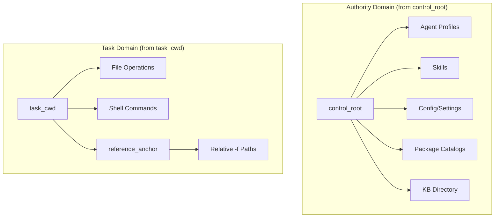
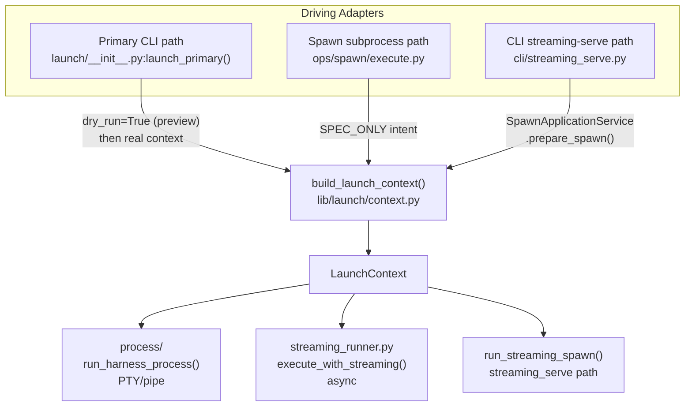

# Architecture: Launch System

The launch system is the composition and execution layer between the policy layer (`ops/spawn/`) and the mechanism layer (harness adapters, state stores). It has one job: turn a caller's intent into a running subprocess, then record what happened.

## Central Seam: `build_launch_context()`

All launch paths share one composition factory in `lib/launch/context.py`. No driving adapter composes launch state independently.

```
SpawnRequest + LaunchRuntime  →  build_launch_context()  →  LaunchContext
                                   (sole composition seam)
```

**`SpawnRequest`** — frozen Pydantic DTO: caller intent (prompt, model, harness, skills, session, budget, …). JSON-safe field types only. No derived state.

**`LaunchRuntime`** — frozen Pydantic DTO: driving-adapter inputs (surface, state_root, project_paths, argv_intent, config_snapshot, …).

**`LaunchContext`** — frozen dataclass: fully composed launch state (argv, spec, env, run_params, perms, child_cwd, report_output_path, warnings, resolved_request). Complete at construction.

`LaunchContext.warnings` is the sole channel for non-fatal composition issues (invariant I-13). Adapters that silently transform inputs or warn via other channels violate this.

### Prepare/Bind Split

`build_launch_context()` is now a backward-compat wrapper over a two-phase internal pipeline:

```
SpawnRequest + LaunchRuntime
        │
        ▼
prepare_launch_surface()    ← expensive, done once per spawn
        │
        │  PreparedLaunchSurface (frozen dataclass, public boundary)
        │
        ▼
bind_launch_context()       ← cheap materialization, spawn-ID + paths + env
        │
        ▼
LaunchContext
```

**`prepare_launch_surface()`** — the expensive phase. Runs model/harness/profile/skill resolution, composition, prompt assembly, semantic IR projection, skill injection, continuation resolution. Called once per spawn. Safe to call before the spawn ID is known — it produces no side effects.

**`PreparedLaunchSurface`** — frozen dataclass; the in-memory boundary between preparation and binding. Carries: resolved request, harness, seed session info, composition warnings, loaded references, agent inventory prompt, context prompt, alias catalog, model selection context. Deliberately excludes spawn IDs, report paths, env, argv, and permission outputs — everything that varies per bind.

**`bind_launch_context()`** — the cheap phase. Given a `PreparedLaunchSurface` and `RuntimeBindings`, materializes env, cwd, spec, argv, and permissions. Runs in microseconds. Called as many times as needed for a given prepared surface (e.g., preview + real for the primary path).

**`RuntimeBindings`** — frozen dataclass for runtime-only values: `spawn_id`, `report_output_path`, `runtime_work_id`, `chat_id`, `forked_harness_session_id`, `plan_overrides`, `dry_run`.

**`CatalogSession`** — operation-scoped collaborator holding a `MarsResultCache` for the duration of one launch. Passed to `prepare_launch_surface()`. Prevents redundant `mars models list` calls within a single spawn without creating a shared global cache. Discarded after the operation.

The primary CLI path is the canonical example of prepare-once/bind-twice: `prepare_launch_surface()` is called once before the session is opened, then `bind_launch_context()` runs for dry-run preview (display), then again with real spawn-id/paths for actual execution.

## control_root / task_cwd Split

`LaunchContext` carries two distinct path fields introduced in PR #210:

- **`control_root: Path`** — the project config/authority root. Where `meridian.toml` lives. Used for spawn log directories, config loading, and harness `--add-dir` roots. Equivalent to the old `project_root` / `execution_cwd` in the pre-#210 model. Also called `authority_root` in design docs.
- **`task_cwd: Path | None`** — the task's intended working directory. `None` when task directory == control root (common case).

The split captures the divergence between *where project config lives* and *where the task should be done*.

**`bind_launch_context()` behavior when `task_cwd` is set:**
1. Sets `MERIDIAN_TASK_DIR` in the child process's environment to the `task_cwd` value.
2. Appends a `# Source-edit directory` block to the agent's system prompt when actual process cwd cannot be set to task_cwd (`LaunchDirectoryContext.requires_task_cwd_instruction`).
3. Runs `_is_task_cwd_covered_by_projection()` before adding task_cwd as a workspace root to avoid redundant projection.

**Spawn and session records** persist both fields: `control_root` (config authority) and `task_cwd` (nullable, task directory intent). `execution_cwd` remains as a legacy alias for the actual process cwd (`child_cwd`).

**continue/fork authority:** `resolve_session_reference()` uses `source_control_root` from persisted spawn records. Legacy refs that predate PR #210 fall back to the current launch `control_root`.

**continue replay:** Same-session continue enters launch through `continue_replay.py`.
`ContinueReplayContract` is the shared internal seam for primary and spawn
continue: it carries the source harness session, work/task context, replayed
launch identity, passthrough args, and persisted launch-policy snapshot instead of
letting callers recompute from current CWD/config/env. See
[D-continue-replays-recorded-launch-contract](../decisions/launch.md#d-continue-replays-recorded-launch-contract-same-session-continue-is-not-live-policy-recomputation).

See [decisions/launch.md](../decisions/launch.md#d-control-root-task-cwd-split) for the rationale.

## Authority/Task Domain Split (PR #248)

PR #248 extends the PR #210 two-field model into a full two-domain architecture. Every spawn resolves two separate domains:



**Authority domain** (`control_root`): agent profiles, skills, config, package catalogs, KB directory. Never changes based on worktree selection. `kb:` references always resolve here.

**Task domain** (`task_cwd`): where the spawned agent works. Where relative `-f` reference files resolve from. Set by worktree resolution.

### task_cwd Resolution Priority

Resolution priority (see `resolve_task_cwd()` in `cwd.py`):

| Priority | Source | task_cwd |
|----------|--------|----------|
| 1 | explicit task-dir override | validated task directory |
| 2 | explicit work item `--work <id>` | item's `worktree_path` if set; else `control_root`. Ambient work NOT consulted. |
| 3 | ambient work item attachment | item's `worktree_path` if set; else `control_root` |
| 3.5 | caller cwd outside the project tree (ambient-cwd) | caller cwd |
| 4 | default | `control_root` |

**Stale worktree_path** (path no longer exists on disk) → hard error. NOT silent fallback to control_root.

**Explicit `--work` is a hard selection boundary.** When the user specifies `--work <item>`, only that item is consulted. If it has no worktree_path, task_cwd = control_root — the ambient session work attachment is NOT used as a fallback.

### Reference File Anchor

`task_cwd` is also the `reference_anchor` — the base directory for all relative `-f` paths:

| Prefix | Resolves from |
|--------|--------------|
| `(relative)` | `reference_anchor` = `task_cwd` |
| `/absolute` | Direct pass-through |
| `~/path` | HOME expansion |
| `kb:path` | KB directory (from `control_root`) |
| `@path` | **ERROR** — use `kb:path` instead |

`kb:` always resolves from the authority domain. Changing task_cwd does not affect KB path resolution.

See [../concepts/reference-resolution.md](../concepts/reference-resolution.md) for full resolution algorithm.

### Adapter CWD Policy

| Harness | Behavior |
|---------|----------|
| Pi / OpenCode / Codex / Cursor | Actual process cwd = `task_cwd` |
| Claude `-p` (legacy) | Process cwd = `control_root`; task-cwd instruction injected into system prompt |

When `task_cwd` is outside `control_root`, it must be included in workspace projection so the harness sandbox grants filesystem access. If the harness cannot project the path, the fallback (instruction injection) applies.

See [../decisions/spawn-cwd-worktree-anchor.md](../decisions/spawn-cwd-worktree-anchor.md) for rationale on all design decisions.


## Startup Watchdog

`_start_spawn_with_timeout()` in `streaming_runner.py` wraps the entire pre-connect
span (backend boot, connection establishment, session handshake) with an outer
`asyncio.timeout`. The default bound is 5 minutes, configured via
`timeouts.startup_minutes` (TOML) or `MERIDIAN_STARTUP_TIMEOUT_MINUTES` (env).
Both `execute_with_streaming()` (spawn path) and `run_streaming_spawn()`
(streaming-serve path) use the same helper.

Exceeding the bound raises `StartupPhaseTimeout`, classified as a non-retryable
terminal failure. The timeout is resolved from the config snapshot via
`resolve_startup_timeout_seconds()` in `launch/resolve.py`. The streaming-serve
caller passes the resolved value rather than hardcoding the 300s default.

Rationale: before the watchdog, the pre-connect span was unbounded. The recorded
worst case was a spawn that wedged for 2h18m with no liveness signal.

## Attempt Evidence Preservation

When a streaming spawn retries, `_preserve_attempt_artifacts()` in
`streaming_runner.py` rotates the completed attempt's disk artifacts into
`attempt-N/` under the spawn log directory. Preserved files include
`history.jsonl`, `stderr.log`, `report.md`, `runner-lifecycle.jsonl`, and
`last-observed-event.json`. The rotation is crash-atomic: files are staged under
`attempt-N.tmp/` and committed with a single `os.replace()`. Artifact-store copies
and active-key deletion happen only after the filesystem commit, so the next attempt
never reads stale keys from a prior attempt.

## Ownership-Transfer Guard

External task cancellation during the startup corridor (adapter `start()`, dispatch,
manager registration) can strand a child process between owners.
`reap_on_ownership_transfer_failure()` in `harness/connections/base.py` catches
`BaseException`, wraps cleanup in `asyncio.shield()` inside a while-not-done loop
that survives repeated `CancelledError` deliveries, and bounds foreground cleanup
to 30 seconds. Beyond that bound, durable `spawn_owned` process scopes and the
reaper own any residue. Each adapter, `spawn_dispatch`, and `SpawnManager` invoke
the guard at their respective ownership boundaries.

## Managed Backend Launch Helper

Codex/OpenCode managed backends launch through one helper:
`harness/connections/managed_backend.py:launch_managed_backend()`. The helper starts
the backend subprocess, captures birth time for PID-reuse guards, determines
containment (`posix_pgid`, `windows_job`, or fallback), links child lifetime to the
parent when the platform supports it, builds a `ProcessScopeSnapshot`, records
`process_scopes.json`, and returns a `ManagedBackendHandle`.

Adapters no longer own per-harness backend launch blocks. They provide command/env/cwd
inputs and then expose the helper's `scope_snapshot` through the connection. Managed
primary attach upgrades that same concrete backend scope from provisional
`spawn_owned` to `session_owned` once a harness session id is known.

`register_spawn_owned_process()` in the same module is the generic scope recording
helper for stdio children (Claude, Pi, Cursor) that are not managed backends but
still need durable `spawn_owned` process-scope records for crash recovery. Its
placement in `managed_backend.py` is accepted naming debt; #424's layering split
will give it a better home.

## Three Driving Adapters



### 1. Primary CLI Path

`launch_primary()` in `launch/__init__.py`:

1. Builds `SpawnRequest` (PRIMARY surface) + `LaunchRuntime`
2. Calls factory with `dry_run=True` → preview context for display
3. Calls `run_harness_process(preview_context, …)` which:
   - Allocates session via `session_scope`; creates spawn row
   - Materializes fork if needed (only after row exists — invariant I-10)
   - **Rebuilds `LaunchContext`** with real paths (report path, actual state root, work_id)
   - Runs PTY or pipe subprocess
   - Finalizes inline; calls `observe_session_id()` once post-execution

Two-phase context building is intentional: the preview context exists for `--dry-run` display; the runtime context drives actual execution with concrete paths.

**Work-item attachment:** `launch_primary()` resolves explicit `--work` at policy level. `run_harness_process()` handles the resumed-session case: after `session_scope()` yields, it reads `preserved_work_id` from the resumed session (if no explicit work was given) and calls `update_session_work_id()`.

### 2. Spawn Subprocess Path

`ops/spawn/execute.py` drives foreground and background spawns:

- **Foreground (`execute_spawn_blocking`):** creates spawn row → calls `launch_prepared_spawn()` via `asyncio.run()`
- **Background (`execute_spawn_background`):** creates spawn row → persists `BackgroundWorkerLaunchRequest` to disk → detaches subprocess. Worker (`_background_worker_main`) calls `_execute_existing_spawn()` → `launch_prepared_spawn()`

**`launch_prepared_spawn()` — shared pre-run helper:**  
Both foreground and background paths converge here. The helper resolves session continuation, materializes any fork, builds the child env overrides, calls `build_launch_context()`, and then hands off to `execute_with_streaming()`. It owns `launch_failure` finalization for exceptions that occur before the runner starts — its broad `except` is safe because `complete_spawn()` is idempotent.

```
execute_spawn_blocking / _execute_existing_spawn
    └→ launch_prepared_spawn()     ← owns pre-run failure finalization
           └→ execute_with_streaming()  ← owns terminal finalization from entry
```

**Finalization ownership layers:**  
Three concentric layers, each defined by function scope:
1. **Runner** (`execute_with_streaming`): sentinel locals (`extracted`, `manager`, `lifecycle_service` initialized to `None` at top); `finally` block handles partial-setup failures.
2. **Helper** (`launch_prepared_spawn`): `except` catches pre-run exceptions; writes `launch_failure`; safe due to runner's idempotency.
3. **Surface backstop** (in the calling surface functions): last-resort around the entire post-row section.

**Resolution in the background worker:**  
The background worker trusts the `BackgroundWorkerLaunchRequest` written by `execute_spawn_background()`. It does NOT re-resolve model or harness from the spawn record — the request is already fully resolved when persisted. Validation checks only `harness` (required) and `prompt` (required); [empty model](../decisions/model-resolution.md#model-optional-empty-model) is accepted because it means no managed model override, whether from a model-optional profile or from Mars clearing an incompatible model after a stronger harness override won.

`execute_with_streaming()` in `streaming_runner.py` is the async executor: heartbeat every 30s, `mark_finalizing` CAS after harness exits, `enrich_finalize()` for usage/session/report extraction.

**Known gap:** The subprocess path still creates the spawn row before calling `build_launch_context()`, unlike the streaming-serve path which uses resolve-before-persist. Row-creation order unification is tracked as follow-up.

**Note:** `ops/spawn/prepare.py` uses `SPAWN_PREPARE` surface + `LaunchArgvIntent.REQUIRED` — it needs a real argv to populate `cli_command` for display. This is the exception; all execution paths use `SPEC_ONLY`.

**Pi dual launch path.** Pi is the first harness with two completely different launch configurations per role. Primary uses the native Pi TUI (`pi [--model ...] [--session/--fork ...]`, no `--mode`, `meridian-spawn-watch` only). Spawned uses Pi RPC (`pi --mode rpc ... --no-extensions -e managed-bash.js -e meridian-spawn-watch.js`, prompt written to stdin, JSONL drained from stdout). The split is enforced at projection time: `project_pi_native_tui.py` for primary, `project_pi_rpc.py` for spawned. See [pi-lifecycle.md](pi-lifecycle.md) for the quiescence model.

### 3. CLI Streaming-Serve Path

Uses `SpawnApplicationService.prepare_spawn()` for resolve-before-persist, then calls `run_streaming_spawn()` from `streaming_runner.py` directly. Finalizes inline under `signal_coordinator().mask_sigterm()`. `complete_spawn()` routes through the shared policy seam.

`SpawnApplicationService.prepare_spawn()` implements resolve-before-persist:

```
build_launch_context()     ← pure resolution; may raise; NO row yet
lifecycle_service.start()  ← only on success; row stores real resolved values
PreparedSpawn handoff type
```

**SEAM-1:** No spawn row on resolution failure.  
**SEAM-2:** Row metadata always reflects resolved model/agent/harness.  
**SEAM-3:** `ConnectionConfig.env_overrides` populated from `LaunchContext.env_overrides`.

`run_streaming_spawn()` is a focused executor: creates `SpawnManager`, starts harness connection, starts heartbeat, awaits drain, records exited event. It does **not** call `enrich_finalize()` or `execute_with_streaming()`.

## SpawnApplicationService: Policy Coordinator

Sits above `SpawnLifecycleService` (sole state writer) and below driving adapters. Surfaces call the service; the service calls the lifecycle service.

```
Layer 3: build_launch_context()     ← pure resolution, may fail, no side effects
Layer 4: SpawnApplicationService    ← lifecycle policy
Layer 5: SpawnLifecycleService      ← sole state writer (spawn_store)
```

Key methods:
- `prepare_spawn()` — resolve-before-persist; the streaming-serve entry point
- `cancel()` — surface-neutral cancel pipeline; handles managed-primary, signal cancellation, finalizing races
- `complete_spawn()` — idempotent terminal seam; acquires per-spawn lock internally
- `archive()` — validates terminal state, emits exactly one `spawn.archived`
- `update_metadata()` — surface-level metadata changes; runner-internal updates bypass this

## Key Invariants (Summary)

The full 13 invariants live at `.meridian/invariants/launch-composition-invariant.md`. Reviewers check these on every PR touching `launch/`, `harness/`, `ops/spawn/`, or `cli/streaming_serve.py`.

| Invariant | Rule |
|-----------|------|
| I-1 | All composition happens inside `build_launch_context()` |
| I-2 | No driving adapter reconstructs argv, env, or permissions independently |
| I-4 | `observe_session_id()` called exactly once post-execution (primary path) |
| I-5 | `SpawnRequest` / `LaunchRuntime` carry no derived state; `LaunchContext` complete at construction |
| I-10 | Fork materialization happens only after spawn row exists |
| I-13 | `LaunchContext.warnings` is the sole channel for composition warnings |

## DTO Discipline

- `SpawnRequest` and `LaunchRuntime`: frozen Pydantic, JSON-safe types only. No `Path` on `SpawnRequest`. No `arbitrary_types_allowed`.
- `LaunchContext`: frozen dataclass. No pre-composed intermediate DTOs.
- No derived/cached state on any DTO — factory recomputes from inputs on each call.

## Workspace Projection

Two steps inside `build_launch_context()`:

**Gate (pre-launch):** `resolve_workspace_snapshot_for_launch()` raises if workspace file is `"invalid"`. `"none"` and `"present"` pass through.

**Projection (post-resolution):** `project_workspace_roots()` maps per-harness:
- Claude: `--add-dir <root>` args
- OpenCode: `OPENCODE_CONFIG_CONTENT` env override (deep-merged with parent config when present)
- Codex: `--add-dir <root>` args (active; read-only sandbox modes may still limit effective access)
- No roots: `"ignored:no_roots"` for all harnesses

Roots are stored in `run_params.projected_roots` / `ResolvedLaunchSpec.projected_roots`. Harness projections convert that field into argv or env at the edge; `extra_args` remains user-owned passthrough only. OpenCode env results merge into `LaunchContext.env_overrides`.

**Pi env overrides.** `PiAdapter.env_overrides()` injects two Pi-specific env vars into every Pi child process:
- `PI_CODING_AGENT_SESSION_DIR` — scopes Pi's session file storage to `~/.meridian/meridian-pi/sessions` (Meridian-managed path, not Pi's default)
- `MERIDIAN_PI_SESSION_ROLE` — `"primary"` or `"spawned"`; extensions use this to gate quiescence machinery to spawned-only sessions

These are set by the adapter's `env_overrides()` method and flow through `build_harness_child_env()` alongside other harness-specific overrides.

## Claude Native Agent Permission Injection

For Claude launches, `bind_launch_context()` injects a two-tier Agent permission policy
before materializing the launch spec:

1. **Built-in denial (unconditional):** `ResolvedLaunchSpec` projection always adds
   `Agent(Explore)`, `Agent(Plan)`, `Agent(General-purpose)`, and `Agent(general-purpose)`
   to `--disallowedTools`. No config toggle.

2. **Generic `Agent` gating (Mars agent-copy boundary):** `project_has_claude_agent_copy()`
   reads `mars.toml` / `mars.local.toml` for `[settings.meridian.agent_copy] harnesses = ["claude"]`
   with `.claude` in targets. The result sets `claude_native_agents_enabled` on the spec, which
   `project_claude.py` uses to either allow or strip `Agent` from all allowed-tool sources
   (permission-derived, parent-inherited via `CLAUDE_PARENT_ALLOWED_TOOLS_FLAG`, and
   user passthrough).

For **nested Claude spawns** (SPAWN_PREPARE surface), `resolve_nested_claude_permission_request()`
applies additional deny entries for `agent` and `task` capabilities. Agent profiles can
opt out per-capability via `tools: {agent: allow}` in their frontmatter.

The injection runs in `bind_launch_context()`:

```python
claude_native_agents_enabled = (
    harness.id == HarnessId.CLAUDE
    and project_has_claude_agent_copy(project_paths.project_root)
)
# ... threaded into resolve_claude_native_agent_permission_request() and
# resolve_nested_claude_permission_request()
```

See [../concepts/harness-abstraction.md](../concepts/harness-abstraction.md#claude-native-agent-routing)
for the full policy.

## MERIDIAN_HARNESS Child Env Injection

`build_launch_context()` writes `MERIDIAN_HARNESS = harness.id.value` into the
child process's environment overrides (via `runtime_overrides` in
`ChildEnvContext.child_context()`). This means every spawned process knows which
harness it is running inside from the moment it starts.

**One-hop semantics.** `MERIDIAN_HARNESS` is **not** in `ALLOWED_CHILD_ENV_KEYS`
and does not cascade to grandchildren. Each spawn level gets its own value —
derived independently during its own `build_launch_context()` call. This is
intentional: a grandchild spawn uses a different harness in principle (resolved
from its own profile/model/config), so inheriting the grandparent's harness would
be wrong.

**Usage at wait time.** `spawn_wait_sync()` reads `os.getenv("MERIDIAN_HARNESS")`
to determine the yield interval. This is the orchestrator's own harness — the one
whose prompt-cache TTL the yield is designed to preserve. The orchestrator is
asking "how long until *my* cache expires?" — the answer is its own harness, not
the harnesses of the spawns it is waiting on.

```python
# In ops/spawn/api.py — _resolve_wait_yield_after_seconds()
parent_harness = os.getenv("MERIDIAN_HARNESS")
return float(config.wait_yield_seconds_for_harness(parent_harness))
```

See [../concepts/spawn-wait-barrier.md](../concepts/spawn-wait-barrier.md) —
Harness-Aware Yield Defaults for the full yield logic.

## Context-Env Block: Typed Prepare→Bind Flow (PR #328)

Bind refresh (re-projection after composition) uses a single prompt IR:
`PreparedLaunchContent` carries the `ComposedLaunchContent` and bind reprojection
is a single `dataclasses.replace`. The `ContextEnvRefreshPlan` mirror struct is
deleted.

`ChildEnvContext` is a projection of `ResolvedContext` — not a second
scope-precedence engine. `ChildEnvContext.from_resolved_context()` derives the
child env block from the parent's resolved context, applying spawn-local
overrides (spawn ID, work scope) without re-deriving scope precedence.

This eliminates the pre-PR #328 risk of two scope engines diverging —
`ResolvedContext` is the single scope authority; `ChildEnvContext` is a
read-only projection for child-process env construction.

## Module Map

```
launch/
  __init__.py           launch_primary() — public entry point
  context.py            build_launch_context() — SOLE composition seam (I-1)
                          prepare_launch_surface() — expensive phase (resolve/compose)
                          bind_launch_context() — cheap phase (env/cwd/spec/argv/perms)
                          PreparedLaunchSurface — public prepare/bind boundary dataclass
                          RuntimeBindings — spawn-ID + runtime-only values
                          CatalogSession — operation-scoped MarsResultCache holder (in catalog/)
  composition.py        ComposedLaunchContent, ProjectedContent — semantic IR types
  request.py            SpawnRequest, LaunchRuntime, LaunchArgvIntent, LaunchCompositionSurface
  plan.py               build_primary_spawn_request/runtime() — primary-path input builders
  process/              run_harness_process(); PTY/pipe; primary-path executor
  streaming_runner.py   execute_with_streaming(); async executor (spawn/streaming-serve paths)
  policies.py           resolve_policies() → ResolvedPolicies
  permissions.py        resolve_permission_pipeline()
  command.py            resolve_launch_spec_stage(), build_launch_argv()
  fork.py               materialize_fork() — sole callsite for adapter.fork_session()
  prompt.py             compose_run_prompt_text() — SPAWN_PREPARE path
                          build_goal_instruction() — renders completion_contract from normalized goal
  resolve.py            dedupe_skill_names(), resolve_skills_from_profile() — skill resolution
  reference.py          load_reference_items(); template variable resolution
  env.py                build_env_plan(); build_harness_child_env()
  extract.py            enrich_finalize(): usage + session + report (spawn path)
  signals.py            SignalForwarder, SignalCoordinator; SIGINT/SIGTERM forwarding

catalog/
  catalog_session.py    CatalogSession — operation-scoped catalog resolution state

ops/spawn/execute.py
  launch_prepared_spawn()      — shared pre-run helper (foreground + background converge here)
  execute_spawn_blocking()     — foreground surface; calls launch_prepared_spawn()
  execute_spawn_background()   — background surface; persists request + detaches worker
  _execute_existing_spawn()    — background worker body; calls launch_prepared_spawn()
  _background_worker_main()    — background worker entrypoint
```

## Related Pages

- [system-overview.md](system-overview.md) — where launch fits in the overall architecture
- [state-system.md](state-system.md) — what happens to events after launch writes them
- [../codebase/harness-adapters.md](../codebase/harness-adapters.md) — per-harness adapter notes
- [../concepts/spawn-lifecycle.md](../concepts/spawn-lifecycle.md) — spawn lifecycle mental model
- [../concepts/composition-pipeline.md](../concepts/composition-pipeline.md) — semantic IR + adapter projection
- [pi-lifecycle.md](pi-lifecycle.md) — Pi's quiescence-based completion model and extension architecture
