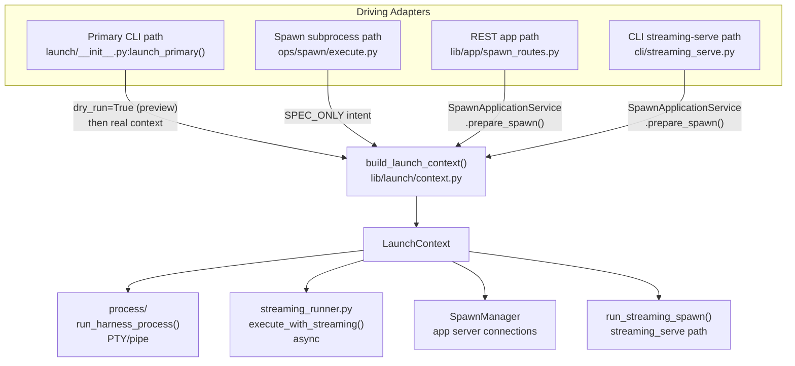

# Architecture: Launch System

The launch system is the composition and execution layer between the policy layer (`ops/spawn/`) and the mechanism layer (harness adapters, state stores). It has one job: turn a caller's intent into a running subprocess, then record what happened.

## Central Seam: `build_launch_context()`

All launch paths share one composition factory in `lib/launch/context.py`. No driving adapter composes launch state independently.

```
SpawnRequest + LaunchRuntime  →  build_launch_context()  →  LaunchContext
                                   (sole composition seam)
```

**`SpawnRequest`** — frozen Pydantic DTO: caller intent (prompt, model, harness, skills, session, budget, …). JSON-safe field types only. No derived state.

**`LaunchRuntime`** — frozen Pydantic DTO: driving-adapter inputs (surface, state_root, project_paths, argv_intent, config_snapshot, …).

**`LaunchContext`** — frozen dataclass: fully composed launch state (argv, spec, env, run_params, perms, child_cwd, report_output_path, warnings, resolved_request). Complete at construction.

`LaunchContext.warnings` is the sole channel for non-fatal composition issues (invariant I-13). Adapters that silently transform inputs or warn via other channels violate this.

### Prepare/Bind Split

`build_launch_context()` is now a backward-compat wrapper over a two-phase internal pipeline:

```
SpawnRequest + LaunchRuntime
        │
        ▼
prepare_launch_surface()    ← expensive, done once per spawn
        │
        │  PreparedLaunchSurface (frozen dataclass, public boundary)
        │
        ▼
bind_launch_context()       ← cheap materialization, spawn-ID + paths + env
        │
        ▼
LaunchContext
```

**`prepare_launch_surface()`** — the expensive phase. Runs model/harness/profile/skill resolution, composition, prompt assembly, semantic IR projection, skill injection, continuation resolution. Called once per spawn. Safe to call before the spawn ID is known — it produces no side effects.

**`PreparedLaunchSurface`** — frozen dataclass; the in-memory boundary between preparation and binding. Carries: resolved request, harness, seed session info, composition warnings, loaded references, agent inventory prompt, context prompt, alias catalog, model selection context. Deliberately excludes spawn IDs, report paths, env, argv, and permission outputs — everything that varies per bind.

**`bind_launch_context()`** — the cheap phase. Given a `PreparedLaunchSurface` and `RuntimeBindings`, materializes env, cwd, spec, argv, and permissions. Runs in microseconds. Called as many times as needed for a given prepared surface (e.g., preview + real for the primary path).

**`RuntimeBindings`** — frozen dataclass for runtime-only values: `spawn_id`, `report_output_path`, `runtime_work_id`, `chat_id`, `forked_harness_session_id`, `plan_overrides`, `dry_run`.

**`CatalogSession`** — operation-scoped collaborator holding a `MarsResultCache` for the duration of one launch. Passed to `prepare_launch_surface()`. Prevents redundant `mars models list` calls within a single spawn without creating a shared global cache. Discarded after the operation.

The primary CLI path is the canonical example of prepare-once/bind-twice: `prepare_launch_surface()` is called once before the session is opened, then `bind_launch_context()` runs for dry-run preview (display), then again with real spawn-id/paths for actual execution.

## control_root / task_cwd Split

`LaunchContext` carries two distinct path fields introduced in PR #210:

- **`control_root: Path`** — the project config/authority root. Where `meridian.toml` lives. Used for spawn log directories, config loading, and harness `--add-dir` roots. Equivalent to the old `project_root` / `execution_cwd` in the pre-#210 model.
- **`task_cwd: Path | None`** — the task's intended working directory. Set only when the spawn was requested from a directory other than the project root. `None` in the common case where task directory == control root.

The split captures the divergence between *where project config lives* and *where the task should be done*. A spawn launched from a nested subdirectory of a project (e.g., `packages/auth/`) should use the repo root as its config authority but communicate `packages/auth/` as the task working directory to the agent.

**`bind_launch_context()` behavior when `task_cwd` is set:**
1. Sets `MERIDIAN_TASK_CWD` in the child process's environment to the `task_cwd` value.
2. Appends a `# Task Working Directory` block to the agent's system prompt explaining that the process cwd is not the task directory and providing the `MERIDIAN_TASK_CWD` value.
3. Runs `_is_task_cwd_covered_by_projection()` to check whether `task_cwd` is already covered by projected workspace roots before adding it as an extra root.

**Spawn and session records** persist both fields: `control_root` (config authority) and `task_cwd` (nullable, task directory intent). `execution_cwd` remains as a legacy alias for the actual process cwd (`child_cwd`).

**continue/fork authority:** `resolve_session_reference()` uses `source_control_root` from persisted spawn records. Legacy refs that predate PR #210 fall back to the current launch `control_root`.

See [decisions/launch.md](../decisions/launch.md#d-control-root-task-cwd-split) for the rationale.


## Four Driving Adapters



### 1. Primary CLI Path

`launch_primary()` in `launch/__init__.py`:

1. Builds `SpawnRequest` (PRIMARY surface) + `LaunchRuntime`
2. Calls factory with `dry_run=True` → preview context for display
3. Calls `run_harness_process(preview_context, …)` which:
   - Allocates session via `session_scope`; creates spawn row
   - Materializes fork if needed (only after row exists — invariant I-10)
   - **Rebuilds `LaunchContext`** with real paths (report path, actual state root, work_id)
   - Runs PTY or pipe subprocess
   - Finalizes inline; calls `observe_session_id()` once post-execution

Two-phase context building is intentional: the preview context exists for `--dry-run` display; the runtime context drives actual execution with concrete paths.

**Work-item attachment:** `launch_primary()` resolves explicit `--work` at policy level. `run_harness_process()` handles the resumed-session case: after `session_scope()` yields, it reads `preserved_work_id` from the resumed session (if no explicit work was given) and calls `update_session_work_id()`.

### 2. Spawn Subprocess Path

`ops/spawn/execute.py` drives foreground and background spawns:

- **Foreground (`execute_spawn_blocking`):** creates spawn row → calls `launch_prepared_spawn()` via `asyncio.run()`
- **Background (`execute_spawn_background`):** creates spawn row → persists `BackgroundWorkerLaunchRequest` to disk → detaches subprocess. Worker (`_background_worker_main`) calls `_execute_existing_spawn()` → `launch_prepared_spawn()`

**`launch_prepared_spawn()` — shared pre-run helper:**  
Both foreground and background paths converge here. The helper resolves session continuation, materializes any fork, builds the child env overrides, calls `build_launch_context()`, and then hands off to `execute_with_streaming()`. It owns `launch_failure` finalization for exceptions that occur before the runner starts — its broad `except` is safe because `complete_spawn()` is idempotent.

```
execute_spawn_blocking / _execute_existing_spawn
    └→ launch_prepared_spawn()     ← owns pre-run failure finalization
           └→ execute_with_streaming()  ← owns terminal finalization from entry
```

**Finalization ownership layers:**  
Three concentric layers, each defined by function scope:
1. **Runner** (`execute_with_streaming`): sentinel locals (`extracted`, `manager`, `lifecycle_service` initialized to `None` at top); `finally` block handles partial-setup failures.
2. **Helper** (`launch_prepared_spawn`): `except` catches pre-run exceptions; writes `launch_failure`; safe due to runner's idempotency.
3. **Surface backstop** (in the calling surface functions): last-resort around the entire post-row section.

**Resolution in the background worker:**  
The background worker trusts the `BackgroundWorkerLaunchRequest` written by `execute_spawn_background()`. It does NOT re-resolve model or harness from the spawn record — the request is already fully resolved when persisted. Validation checks only `harness` (required) and `prompt` (required); empty model is accepted (model-optional profiles delegate model selection to the harness).

`execute_with_streaming()` in `streaming_runner.py` is the async executor: heartbeat every 30s, `mark_finalizing` CAS after harness exits, `enrich_finalize()` for usage/session/report extraction.

**Known gap:** The subprocess path still creates the spawn row before calling `build_launch_context()`, unlike the REST/streaming-serve paths which use resolve-before-persist. Row-creation order unification is tracked as follow-up.

**Note:** `ops/spawn/prepare.py` uses `SPAWN_PREPARE` surface + `LaunchArgvIntent.REQUIRED` — it needs a real argv to populate `cli_command` for display. This is the exception; all execution paths use `SPEC_ONLY`.

### 3. REST App Path

`SpawnApplicationService.prepare_spawn()` implements resolve-before-persist:

```
build_launch_context()     ← pure resolution; may raise; NO row yet
lifecycle_service.start()  ← only on success; row stores real resolved values
PreparedSpawn handoff type
```

**SEAM-1:** No spawn row on resolution failure.  
**SEAM-2:** Row metadata always reflects resolved model/agent/harness.  
**SEAM-3:** `ConnectionConfig.env_overrides` populated from `LaunchContext.env_overrides`.

Finalization is background-async via `spawn_manager.wait_for_completion()`. This path does not use `process/` or `streaming_runner.py`.

### 4. CLI Streaming-Serve Path

Also uses `SpawnApplicationService.prepare_spawn()`, then calls `run_streaming_spawn()` from `streaming_runner.py` directly. Finalizes inline under `signal_coordinator().mask_sigterm()`. `complete_spawn()` routes through the shared policy seam.

`run_streaming_spawn()` is a focused executor: creates `SpawnManager`, starts harness connection, starts heartbeat, awaits drain, records exited event. It does **not** call `enrich_finalize()` or `execute_with_streaming()`.

## SpawnApplicationService: Policy Coordinator

Sits above `SpawnLifecycleService` (sole state writer) and below driving adapters. Surfaces call the service; the service calls the lifecycle service.

```
Layer 3: build_launch_context()     ← pure resolution, may fail, no side effects
Layer 4: SpawnApplicationService    ← lifecycle policy
Layer 5: SpawnLifecycleService      ← sole state writer (spawn_store)
```

Key methods:
- `prepare_spawn()` — resolve-before-persist; the REST and streaming-serve entry point
- `cancel()` — surface-neutral cancel pipeline; handles managed-primary, signal cancellation, finalizing races
- `complete_spawn()` — idempotent terminal seam; acquires per-spawn lock internally
- `archive()` — validates terminal state, emits exactly one `spawn.archived`
- `update_metadata()` — surface-level metadata changes; runner-internal updates bypass this

## Key Invariants (Summary)

The full 13 invariants live at `.meridian/invariants/launch-composition-invariant.md`. Reviewers check these on every PR touching `launch/`, `harness/`, `ops/spawn/`, `app/`, or `cli/streaming_serve.py`.

| Invariant | Rule |
|-----------|------|
| I-1 | All composition happens inside `build_launch_context()` |
| I-2 | No driving adapter reconstructs argv, env, or permissions independently |
| I-4 | `observe_session_id()` called exactly once post-execution (primary path) |
| I-5 | `SpawnRequest` / `LaunchRuntime` carry no derived state; `LaunchContext` complete at construction |
| I-10 | Fork materialization happens only after spawn row exists |
| I-13 | `LaunchContext.warnings` is the sole channel for composition warnings |

## DTO Discipline

- `SpawnRequest` and `LaunchRuntime`: frozen Pydantic, JSON-safe types only. No `Path` on `SpawnRequest`. No `arbitrary_types_allowed`.
- `LaunchContext`: frozen dataclass. No pre-composed intermediate DTOs.
- No derived/cached state on any DTO — factory recomputes from inputs on each call.

## Workspace Projection

Two steps inside `build_launch_context()`:

**Gate (pre-launch):** `resolve_workspace_snapshot_for_launch()` raises if workspace file is `"invalid"`. `"none"` and `"present"` pass through.

**Projection (post-resolution):** `project_workspace_roots()` maps per-harness:
- Claude: `--add-dir <root>` args
- OpenCode: `OPENCODE_CONFIG_CONTENT` env override (deep-merged with parent config when present)
- Codex: `--add-dir <root>` args (active; read-only sandbox modes may still limit effective access)
- No roots: `"ignored:no_roots"` for all harnesses

Roots are stored in `run_params.projected_roots` / `ResolvedLaunchSpec.projected_roots`. Harness projections convert that field into argv or env at the edge; `extra_args` remains user-owned passthrough only. OpenCode env results merge into `LaunchContext.env_overrides`.

## MERIDIAN_HARNESS Child Env Injection

`build_launch_context()` writes `MERIDIAN_HARNESS = harness.id.value` into the
child process's environment overrides (via `runtime_overrides` in
`ChildEnvContext.child_context()`). This means every spawned process knows which
harness it is running inside from the moment it starts.

**One-hop semantics.** `MERIDIAN_HARNESS` is **not** in `ALLOWED_CHILD_ENV_KEYS`
and does not cascade to grandchildren. Each spawn level gets its own value —
derived independently during its own `build_launch_context()` call. This is
intentional: a grandchild spawn uses a different harness in principle (resolved
from its own profile/model/config), so inheriting the grandparent's harness would
be wrong.

**Usage at wait time.** `spawn_wait_sync()` reads `os.getenv("MERIDIAN_HARNESS")`
to determine the yield interval. This is the orchestrator's own harness — the one
whose prompt-cache TTL the yield is designed to preserve. The orchestrator is
asking "how long until *my* cache expires?" — the answer is its own harness, not
the harnesses of the spawns it is waiting on.

```python
# In ops/spawn/api.py — _resolve_wait_yield_after_seconds()
parent_harness = os.getenv("MERIDIAN_HARNESS")
return float(config.wait_yield_seconds_for_harness(parent_harness))
```

See [../concepts/spawn-wait-barrier.md](../concepts/spawn-wait-barrier.md) —
Harness-Aware Yield Defaults for the full yield logic.

## Module Map

```
launch/
  __init__.py           launch_primary() — public entry point
  context.py            build_launch_context() — SOLE composition seam (I-1)
                          prepare_launch_surface() — expensive phase (resolve/compose)
                          bind_launch_context() — cheap phase (env/cwd/spec/argv/perms)
                          PreparedLaunchSurface — public prepare/bind boundary dataclass
                          RuntimeBindings — spawn-ID + runtime-only values
                          CatalogSession — operation-scoped MarsResultCache holder (in catalog/)
  composition.py        ComposedLaunchContent, ProjectedContent — semantic IR types
  request.py            SpawnRequest, LaunchRuntime, LaunchArgvIntent, LaunchCompositionSurface
  plan.py               build_primary_spawn_request/runtime() — primary-path input builders
  process/              run_harness_process(); PTY/pipe; primary-path executor
  streaming_runner.py   execute_with_streaming(); async executor (spawn/streaming-serve paths)
  policies.py           resolve_policies() → ResolvedPolicies
  permissions.py        resolve_permission_pipeline()
  command.py            resolve_launch_spec_stage(), build_launch_argv()
  fork.py               materialize_fork() — sole callsite for adapter.fork_session()
  prompt.py             compose_run_prompt_text() — SPAWN_PREPARE path
                          build_goal_instruction() — renders completion_contract from normalized goal
  resolve.py            dedupe_skill_names(), resolve_skills_from_profile() — skill resolution
  reference.py          load_reference_items(); template variable resolution
  env.py                build_env_plan(); build_harness_child_env()
  extract.py            enrich_finalize(): usage + session + report (spawn path)
  signals.py            SignalForwarder, SignalCoordinator; SIGINT/SIGTERM forwarding

catalog/
  catalog_session.py    CatalogSession — operation-scoped catalog resolution state

ops/spawn/execute.py
  launch_prepared_spawn()      — shared pre-run helper (foreground + background converge here)
  execute_spawn_blocking()     — foreground surface; calls launch_prepared_spawn()
  execute_spawn_background()   — background surface; persists request + detaches worker
  _execute_existing_spawn()    — background worker body; calls launch_prepared_spawn()
  _background_worker_main()    — background worker entrypoint
```

## Related Pages

- [system-overview.md](system-overview.md) — where launch fits in the overall architecture
- [state-system.md](state-system.md) — what happens to events after launch writes them
- [app-server.md](app-server.md) — how the REST app path integrates
- [../codebase/harness-adapters.md](../codebase/harness-adapters.md) — per-harness adapter notes
- [../concepts/spawn-lifecycle.md](../concepts/spawn-lifecycle.md) — spawn lifecycle mental model
- [../concepts/composition-pipeline.md](../concepts/composition-pipeline.md) — semantic IR + adapter projection
