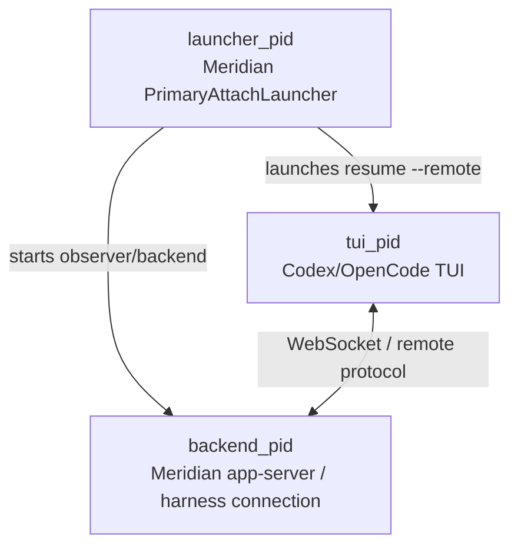

# Architecture: Managed Primary Lifecycle

Managed primaries are interactive Codex/OpenCode sessions where Meridian owns a
small launcher wrapper and a local backend while the user interacts through the
harness TUI. They are not the same lifecycle shape as Claude primaries or child
spawns, so reconciliation and cleanup policy must treat them differently.

Related pages:
- [concepts/spawn-lifecycle.md](../concepts/spawn-lifecycle.md) — generic spawn status machine and reconciliation model
- [architecture/spawn-finalization.md](spawn-finalization.md) — finalization authority lattice
- [architecture/process-scope.md](process-scope.md) — process-scope ownership model; spawn_owned vs session_owned split for managed primaries
- [codebase/harness-adapters.md](../codebase/harness-adapters.md) — Codex/OpenCode adapter notes and approval routing
- [operations/troubleshooting.md](../operations/troubleshooting.md#managed-primary-orphan-orphan_primary) — operational diagnosis for `orphan_primary`
- [lessons/arch-refactor-pitfalls.md](../lessons/arch-refactor-pitfalls.md) — implementation pitfalls behind the PR #184 cleanup refinement

---

## Process Roles

Codex and OpenCode managed primaries split one Meridian primary into three
runtime roles:

| Role | Owner | Responsibility | Expected exit relationship |
|---|---|---|---|
| `launcher_pid` | Meridian wrapper process | Start backend, launch TUI, write `primary_meta.json`, persist events, stop backend during normal teardown | Should outlive the TUI and exit after normal teardown |
| `backend_pid` | Meridian-managed app-server / connection runtime launched by `launch_managed_backend()` | Maintain the remote protocol connection and event stream; expose `scope_snapshot` | May be alive while TUI is alive; can outlive a crashed launcher |
| `tui_pid` | Harness TUI process | User-facing interactive session | User interacts here directly |

Claude primaries are different: Claude is a single black-box harness process.
There is no managed backend/TUI split, and no `primary_meta.json` with
`managed_backend: true`. Generic runner PID liveness remains the right signal
for Claude and for normal child spawns.

---

## Launcher Death Is Abnormal Evidence

A managed-primary launcher dying before the TUI exits is abnormal. It means the
Meridian wrapper crashed, was killed, or failed during teardown. It is evidence
to diagnose, not proof that the user-facing TUI and backend are dead.

The launcher is expected to:

1. Start the backend / observer connection.
2. Launch the TUI attached to that backend.
3. Persist primary metadata and connection events, including exact birth epochs for
   launcher/backend/TUI PIDs.
4. Wait for the TUI to exit.
5. Enter finalization / teardown and stop the backend.

If step 4 is interrupted by launcher death, the backend and TUI may still be
running. Killing them from a passive read path turns an abnormal wrapper failure
into a hard user-visible crash. Future diagnostics should preserve evidence
about why the launcher died rather than using launcher death as an automatic
runtime-child termination trigger.

The inverse failure is also handled at the launcher boundary: if the observed event
stream dies during managed-primary attach, launch fails and tears down the TUI/backend
instead of leaving a disconnected frontend session running.

---

## Reconciliation Boundary

Managed-primary cleanup is tied to explicit reconciliation, not ordinary reads.
`meridian work`, `spawn list`, `spawn show`, `spawn wait`, and `session log` may
project a stale managed-primary row for display, but they do not send process
signals or write terminal state. Mutating repair runs from `meridian doctor
--kill-orphans` and from the primary-launch background repair path.

The safety rule is:

- **Skip decisions** (runner alive, recent activity, startup grace) → no process
  signals of any kind.
- **Finalize-as-failed decisions** → row is written terminal AND runtime children
  are terminated as a cleanup safety net.

The finalize-as-failed path first cleans recorded `process_scopes.json` scopes, then
uses `terminate_managed_primary_processes()` when readable `primary_meta.json`
identifies launcher/backend/TUI PIDs. This safety net prevents orphaned backend/TUI
processes from accumulating after a launcher crash while keeping pure read surfaces
non-destructive.

Managed-primary PID cleanup uses exact per-PID birth epochs persisted in
`primary_meta.json` (`launcher_birth_epoch`, `backend_birth_epoch`,
`tui_birth_epoch`). Before any signal, Meridian compares the live process birth time
against the recorded value with a one-second tolerance. Confirmed PID reuse or
unverifiable birth fails closed; recorded scope cleanup or a later repair pass can
try again without risking an unrelated process.

**Mutating reconciliation may:**

- Observe `primary_meta.json` and process liveness.
- Mark the spawn row terminal when the launcher is dead and no recent activity
  or durable completion proves otherwise.
- Write `status: failed`, `error: orphan_primary`, `origin: reconciler` for a
  managed primary whose launcher died outside finalization.
- Log diagnostics including launcher/backend/TUI PIDs and liveness.
- Terminate recorded scopes and metadata-identified runtime children when it
  finalizes a spawn as failed (safety net).

**Read-time projection must not:**

- Send `SIGTERM` to `backend_pid` or `tui_pid`.
- Mark `process_scopes.json` entries released.
- Write the terminal row.

**Mutating reconciliation must not:**

- Send `SIGTERM` to `backend_pid` or `tui_pid` when it would Skip the spawn.
- Treat missing/corrupt `primary_meta.json` as permission to fall back to
  generic worker termination for Codex/OpenCode primaries.
- Convert a potentially still-usable TUI into a hard crash just because a read
  surface observed a dead launcher — the skip/finalize decision is made first,
  and termination only follows a finalize decision.

This boundary applies even when `primary_meta.json` is missing or corrupt. A
`kind == "primary"` spawn with harness `codex` or `opencode` is a conservative
managed-primary candidate. If generic reconciliation would otherwise produce
`missing_runner_pid` or `orphan_run`, Meridian records `orphan_primary` instead
and skips metadata-derived PID targeting. Recorded scope cleanup may still run
because those scopes carry their own PID-reuse guards.

---

## Explicit Cleanup Boundary

Cleanup of stranded managed-primary processes is an explicit action, not a
side effect of reading state. `spawn cancel <id>` owns this cleanup path.

When canceling an active managed primary, Meridian terminates tracked managed
processes through `terminate_managed_primary_processes()` according to whether
the launcher is still alive. When canceling a terminal spawn that was already
reconciled to `failed/orphan_primary`, `SpawnApplicationService.cancel()`
still performs best-effort orphan cleanup before returning the already-terminal
outcome.

The terminal-orphan cleanup path:

1. Reads recorded `process_scopes.json` and `primary_meta.json` when available and `managed_backend` is true.
2. Applies PID-reuse guards using exact primary metadata birth epochs when available
   and recorded scope birth epochs for process-scope cleanup.
3. Sends `SIGTERM` to backend/TUI children, not as part of read-time projection but
   because the user explicitly asked to cancel/clean up the spawn.
4. Falls back to the recorded worker PID only for conservative managed-primary
   candidates when metadata is missing; this fallback is in the explicit cancel
   path, not read-time projection.

---

## Finalization Cases

| Condition | Mutating reconciliation decision | Signal behavior |
|---|---|---|
| Launcher alive | `Skip(reason="primary_launcher_alive")` | None |
| Launcher dead, metadata activity `finalizing`, recent activity | `Skip(reason="recent_activity")` | None |
| Launcher dead, metadata activity `finalizing`, durable report completion | `succeeded` from report | None |
| Launcher dead, cancel intent present and no durable completion | `cancelled` using the shared cancel precedence rule | None from reconciliation; the cancel pipeline owns cleanup |
| Launcher dead, metadata activity `finalizing`, no report/activity | `failed/orphan_finalization` | Recorded scope cleanup plus `terminate_managed_primary_processes()` safety net |
| Launcher dead before finalizing | `failed/orphan_primary` | Recorded scope cleanup plus `terminate_managed_primary_processes()` safety net |
| Missing/corrupt metadata for Codex/OpenCode primary candidate | `failed/orphan_primary` instead of generic orphan worker cleanup | Recorded scope cleanup only; no metadata-derived PID targeting |
| User runs `spawn cancel` on active or terminal `orphan_primary` | terminal/cancel outcome after best-effort cleanup | Explicit managed-process termination |

---

## Implementation Map

| File | Role |
|---|---|
| `src/meridian/lib/state/managed_primary.py` | Managed-primary snapshot, reconciliation strategy, process termination helper |
| `src/meridian/lib/state/reaper.py` | Reconciliation dispatcher, conservative candidate handling, orphan diagnostics |
| `src/meridian/lib/core/spawn_service.py` | `cancel()` explicit cleanup path, including terminal `orphan_primary` cleanup |
| `src/meridian/lib/state/primary_meta.py` | `primary_meta.json` persistence and parsing |
| `src/meridian/lib/harness/connections/managed_backend.py` | Shared managed-backend launch helper that records backend `ProcessScopeSnapshot` |
| `src/meridian/lib/launch/process/primary_attach.py` | Reads `connection.scope_snapshot`, upgrades backend ownership, and records TUI scope |

---

## Design Rationale

Managed primaries violate the generic reconciliation assumption that a dead runner PID
means the harness process is gone. In Codex/OpenCode managed-primary mode, the
launcher is a wrapper around separately tracked backend and TUI processes.
Reconciliation distinguishes between *observing that a spawn is dead* and *killing
processes the user may still be using*.

The skip/finalize distinction is load-bearing:
- **Skip** decisions mean reconciliation cannot prove the spawn is dead — recent
  activity or a live runner PID means the session may still be active. No signals.
- **Finalize-as-failed** decisions mean reconciliation has determined the spawn is
  orphaned. At that point, leaving backend/TUI processes running is actively
  harmful — they accumulate and consume resources. Recorded process scopes are
  cleaned first; metadata-based PID cleanup is the safety net when `primary_meta.json`
  is readable.

The explicit `spawn cancel` path remains for cases where mutating reconciliation
cannot safely identify PIDs (missing metadata) or where the user wants explicit
control over the cleanup sequence. `--kill-orphans` on `meridian doctor` triggers
the same managed-process cleanup for any spawns the reconciler marks orphaned
during that doctor run.

An `orphan_primary` row still means "the Meridian wrapper died," not "the TUI
was necessarily dead at that moment" — the row is evidence about the wrapper
crash, not proof of TUI death. The termination safety net runs *after* that
evidence-based decision is made.
