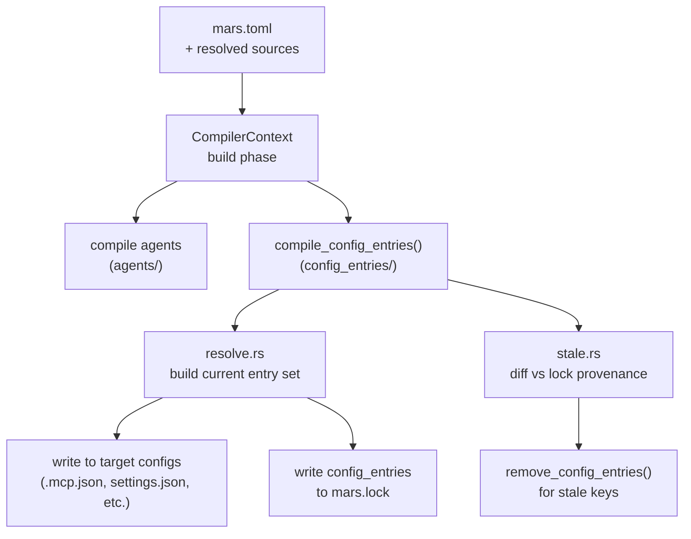

# Mars Compiler Architecture

The Mars compiler is the subsystem in `mars-agents` that transforms package
declarations (`mars.toml` + resolved sources) into materialized output: agent
files, skill files, MCP server config entries, and hook config entries. This
page documents the stable compiler architecture after the
`mars-compiler-cleanup` work item (2026-05).

**Related pages:**
- [concepts/package-management/overview.md](../concepts/package-management/overview.md) — what Mars manages and why
- [lessons/mars-compiler-cleanup.md](../lessons/mars-compiler-cleanup.md) — cleanup lessons: Windows fixes, lock indexing, test split, dead-code deletion, warning routing
- [decisions.md](../decisions.md) — D35–D40 for decisions made during cleanup

---

## Compiler Module Map

```
src/compiler/
  mod.rs              # compiler entry point, orchestrates phases
  context.rs          # CompilerContext: shared resolution state per sync
  agents/
    mod.rs            # agent compilation pipeline
    lower.rs          # profile → materialized agent file
  config_entries/     # extracted module (Phase 3b refactor)
    mod.rs            # entry point: compile_config_entries()
    resolve.rs        # build current entry set from packages
  hooks/
    mod.rs            # fragment discovery, event validation, substitution
  mcp/
    mod.rs            # MCP server lowering + collision resolution
  visibility/
    mod.rs            # model visibility validation

src/surface_ownership/
  mod.rs              # per-target path ownership: may_delete, copy_decision
  retention.rs        # config-entry removal outcomes, WritePermit, RetentionPlan

src/lock/
  mod.rs              # mars.lock read/write, LockIndex, config_entries section
```

The `config_entries/` module was extracted as a preparatory refactor (D39)
before two concurrent feature phases (MCP/hook conflict resolution and stale
config cleanup) modified it. Stale-entry detection (`stale.rs`) was subsumed
by `RemovalPlan::build` in `surface_ownership/retention.rs` when the retention
seam was redesigned (see below).

---

## Compilation Pipeline


```mermaid
graph TD
    TOML["mars.toml\n+ resolved sources"] --> CTX["CompilerContext\nbuild phase"]
    CTX --> AGENTS["compile agents\n(agents/)"]
    CTX --> CE["compile_config_entries()\n(config_entries/)"]
    CE --> RESOLVE["resolve.rs\nbuild current entry set"]
    CE --> STALE["stale.rs\ndiff vs lock provenance"]
    RESOLVE --> WRITE["write to target configs\n(.mcp.json, settings.json, etc.)"]
    STALE --> REMOVE["remove_config_entries()\nfor stale keys"]
    RESOLVE --> LOCK["write config_entries\nto mars.lock"]
```

---

## MCP/Hook Conflict Resolution

When two packages declare MCP servers or hooks with the same name for the
same target root, the compiler resolves the collision rather than aborting.

**Precedence model** (matches agent precedence — zero new concepts for users):

| Scenario | Winner | Behavior |
|---|---|---|
| `_self` (local) vs. dependency | Local | Dependency silently dropped |
| Dependency A vs. dependency B | Earlier in `mars.toml [dependencies]` | Later dropped with warning |
| Same-scope collision | Alphabetically first source | Warning names both sources |

**Critical finding:** `graph.order` in the dependency graph is **alphabetical**,
not declaration order. To implement declaration-order precedence for
dependency-vs-dependency collisions, the resolver reads declaration order
directly from `mars.toml` rather than trusting graph traversal order.

**Why local wins:** Users already understand "local shadows dependency"
from agent behavior. The same mental model applied to MCP/hooks requires
zero new concepts.

**Previous behavior:** Any name collision aborted config-entry compilation
with a warning. This was overly strict — same-name-from-different-packages
is common and has an obvious resolution.

---

## Config-Entry Provenance and Stale Cleanup

### The Problem

Before this work, Mars installed MCP server and hook entries into target
config files (`.mcp.json`, `settings.json`, `codex_mcp.json`, etc.) but
never removed them. When a package was removed from `mars.toml` and
`mars sync` ran, the config entries remained as stale orphans. The adapter
removal APIs existed (`remove_config_entries()`) but were never called
because Mars had no record of which entries each package had installed.

### Solution: Provenance in `mars.lock`

The lock file gains an optional `config_entries` section. On each sync,
Mars writes a provenance record for every config entry installed:

```toml
[config_entries."claude/.mcp.json"]
source = "meridian-base"
key = "some-mcp-server"
target_root = "claude"
```

On the next sync, the stale detection diff:
1. Loads prior provenance from `mars.lock`
2. Builds the current entry set from resolved packages
3. Calls `remove_config_entries()` for keys present in the prior set but
   absent from the current set

**Why extend `mars.lock` rather than a separate manifest:**
- Single authority for "what did sync install?" prevents coherence risk
- One atomic write = one crash-recovery path
- Lock already owns content-item provenance; config entries are the same
  concept for a different artifact kind
- `#[serde(default)]` makes the section backwards-compatible — older mars
  versions ignore it

**Dry run:** `mars sync --diff` reports stale entries in diagnostics but
does not remove them.

---

## Two-Surface Ownership Model

Mars manages two distinct ownership surfaces for linked targets:

**Path ownership** (`surface_ownership/mod.rs`). Mars may delete or overwrite
a file at `(target_root, dest_path)` only when the lock holds an
`OutputRecord` for that exact pair. `.mars`-only records do not imply
ownership of files in `.cursor`, `.claude`, or other linked targets. This
covers copied hook directories, agent files, and skill files.

**Config-entry ownership** (`surface_ownership/mod.rs` + adapter removal
methods). Mars may remove a config entry only when the lock holds a
`ConfigEntryRecord` whose recorded `emitted_json` still matches the entry on
disk. Content resemblance without a lock record never establishes ownership.
This covers merge-mode hook entries in `settings.local.json`, `hooks.json`,
and similar config files.

### Retention Seam

When a removal step fails, the question is: what ownership records are retained
and which replacement writes are suppressed? The retention seam
(`surface_ownership/retention.rs`) answers this once, per `(target_root,
surface)` pair, and derives both retention and suppression from the answer.

The seam makes two properties structural rather than convention-dependent:

1. `RemovalOutcome::Confirmed` has no field for retained records. A confirmed
   removal cannot retain its record because there is no place to store one.
2. Every replacement write (merge entries and file outputs alike) requires a
   `WritePermit` that only `RetentionPlan::write_permit()` issues, and only
   for confirmed pairs. An unconfirmed removal cannot permit any replacement
   write because the only constructor returns `None`.

The three call sites that previously decided retention independently -- hook
sweep, stale MCP removal, and OpenCode legacy bridge -- are replaced by a
single `RemovalPlan::execute` closure. Cross-surface bleed (an Mcp failure
retaining Hook records) is unrepresentable because `RemovalPlan::build`
partitions records by surface before any mutation.

See [lessons/verification-and-review-discipline.md](../lessons/verification-and-review-discipline.md)
for the engineering lessons from the review that drove this redesign, and
[decisions/package-management.md](../decisions/package-management.md#d91-native-hook-fragments-replace-command-synthesis-2026-07)
for the D91 decision.

## Cleanup Notes Moved Out

The cleanup also produced operational lessons and test-structure rationale
that are not part of the compiler's steady-state architecture. Those details
live in [lessons/mars-compiler-cleanup.md](../lessons/mars-compiler-cleanup.md)
to keep this page focused on the compiler boundary and data flow.
