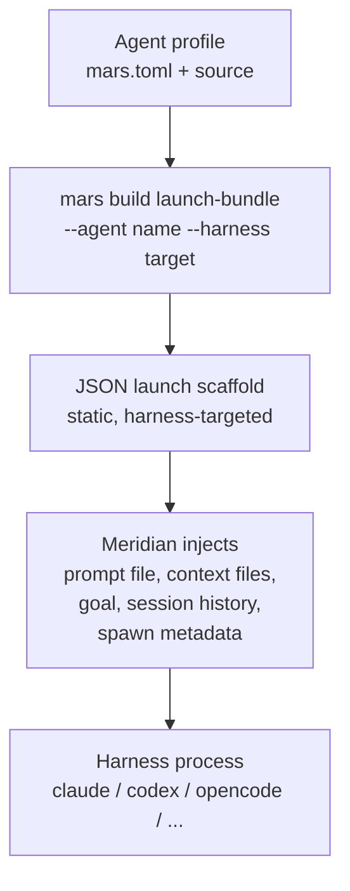
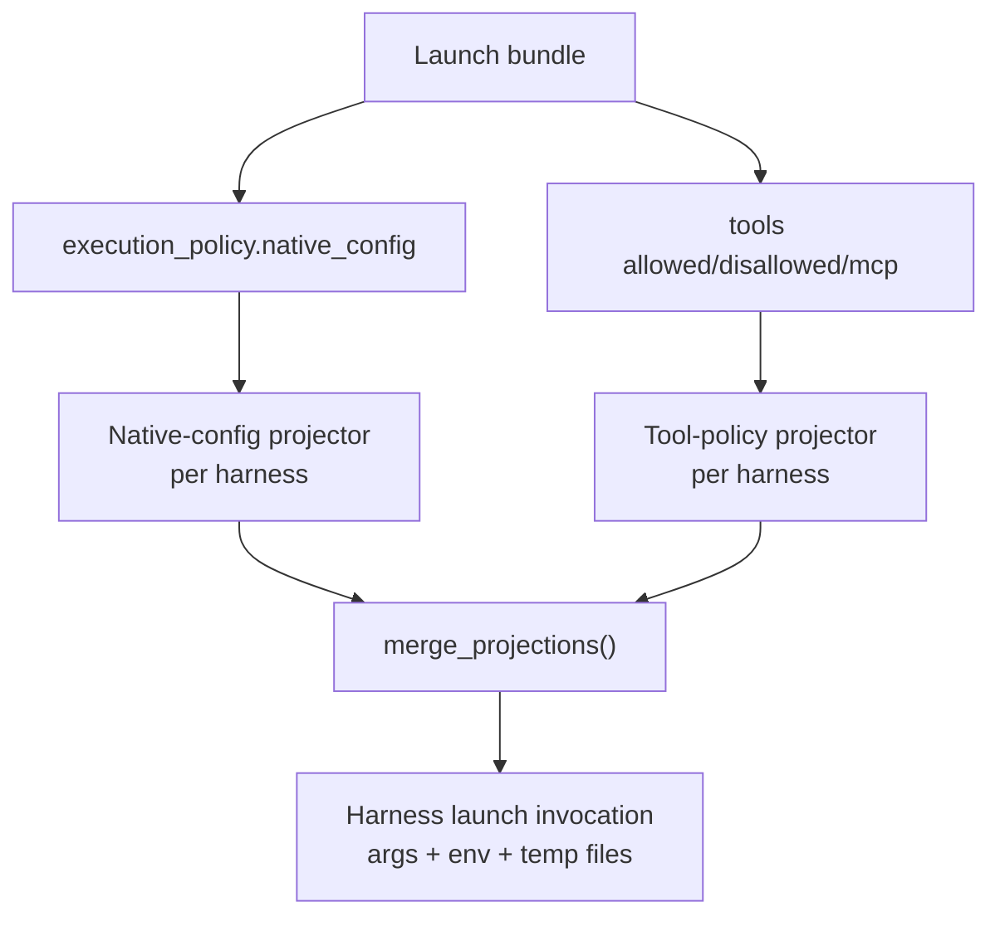

# Mars Launch-Bundle System

Cross-repo system spanning `mars-agents` (builds the scaffold) and `meridian-cli`
(injects per-spawn content and launches the harness). The public verb is `build`
(`mars build launch-bundle`).

**Related pages:**
- [mars-compiler.md](mars-compiler.md) — compiler internals, config-entry pipeline
- [mars-targeting.md](mars-targeting.md) — static `.mars/` targeting vs. launch-bundle
- [../concepts/native-config.md](../concepts/native-config.md) — native-config passthrough concept
- [../decisions/package-management.md](../decisions/package-management.md) — D80–D85 for decisions made during this work
- [../lessons/mars-launch-bundle-lessons.md](../lessons/mars-launch-bundle-lessons.md) — implementation lessons from the launch-bundle work item

---

## Ownership Boundary

**Mars builds the static scaffold.** At `mars build launch-bundle` time, Mars has
the compiled agent/skill graph. Mars cannot see per-spawn content — prompt files,
context files, goal text, prior session history — because those are runtime concerns
owned by Meridian.

**Meridian injects per-spawn dynamic content and launches.** Meridian reads the
bundle, injects prompt + context files + goal + session history into scaffold slots,
then starts the harness process.



**Mars never receives the prompt file.** The prompt file is per-spawn confidential
content. It enters the flow only at Meridian injection time.

---

## Two-Phase Model

| Phase | Owner | Input | Output |
|-------|-------|-------|--------|
| `mars build launch-bundle` | Mars | agent identity, target harness, launch options | JSON scaffold (bundle) |
| Meridian injection + launch | Meridian | bundle + prompt file + context files + goal + session history | running harness process |

Mars produces a bundle with scaffold slots — placeholder markers where Meridian will
inject per-spawn content before assembling the final system prompt.

---

## Bundle Structure

Top-level fields in the full Mars JSON schema (version 2, mars >= 0.5.0):

| Field | Type | Description |
|-------|------|-------------|
| `version` | integer | Schema version (currently `2`) |
| `agent` | string \| null | Resolved agent name (`null` for ad-hoc mode) |
| `agent_body` | string \| null | Agent body markdown when an agent is provided; omitted/null in ad-hoc mode |
| `routing` | object | Routing result + Mars diagnostics (`model`, `model_token`, `harness`, `harness_model`, diagnostic fields) |
| `execution_policy` | object | Portable execution settings + `native_config` |
| `prompt_surface` | object | System instruction + supplemental documents |
| `scaffold_slots` | object | Placeholder positions for Meridian injection |
| `tools` | object | Resolved portable tool policy (`allowed`, `disallowed`, `mcp`) |
| `skills_metadata` | object | Skill loading metadata |
| `provenance` | object | Source attribution for each resolved field |
| `warnings` | string[] | User-visible warnings emitted during build |

Meridian consumes a subset of this schema. It parses:
- `routing.model`, `routing.model_token`, `routing.harness`, `routing.harness_model`
- `execution_policy` fields
- `prompt_surface`
- `tools`
- `skills_metadata`
- `provenance`
- `warnings`

Other routing fields are Mars-owned diagnostics and are ignored by Meridian.

### `routing` object (Meridian-consumed fields)

Meridian reads the following fields from the `routing` object:

| Field | Type | Description |
|-------|------|-------------|
| `model` | string | Canonical resolved model identifier |
| `model_token` | string | Selected model token from Mars routing/policy resolution (may differ from `model`) |
| `harness` | string | Harness identifier (e.g. `"claude"`, `"codex"`, `"opencode"`) |
| `harness_model` | string \| null | Harness-specific model ID used at harness command-build time when present; otherwise Meridian launches with the canonical resolved model ID |

Current Mars output also includes diagnostic routing fields such as `selection_kind`, `match_evidence`, `harness_model_source`, `harness_model_confidence`, and `route_trace`. These are Mars-internal diagnostics; Meridian ignores them.

### `execution_policy` key fields

```json
{
  "execution_policy": {
    "effort": "high",
    "approval": "auto",
    "sandbox": "workspace-write",
    "autocompact": null,
    "autocompact_pct": 80,
    "timeout": null,
    "native_config": {
      "sandbox_workspace_write.network_access": true
    }
  }
}
```

`native_config` is omitted (`skip_serializing_if = None`) when no native config
is declared. See [../concepts/native-config.md](../concepts/native-config.md) for
full semantics.

### `tools` field

```json
{
  "tools": {
    "allowed": ["Bash", "Bash(meridian spawn *)", "Bash(meridian session *)"],
    "disallowed": ["Agent", "Edit", "Write"],
    "mcp": ["plugin:context7:context7"]
  }
}
```

Both `allowed` and `disallowed` may be non-empty simultaneously. An empty list
means no entries of that kind — not "wildcard everything." Mars preserves both
sides; Meridian projects both sides per harness.

---

## Scaffold Slots

Mars emits a six-slot scaffold under `scaffold_slots`; each slot value is
`###SLOT###`. Meridian fills these slots with per-spawn dynamic content.

| v2 slot key | Placeholder value | Content Meridian injects |
|------|------------|------------------------------|
| `completion_contract` | `###SLOT###` | Goal/completion-contract instruction (`--goal` plus work-goal context when available) |
| `context_prompt` | `###SLOT###` | Launch context block (inventory/context docs built at launch time) |
| `user_prompt_file` | `###SLOT###` | User task prompt content for the spawn |
| `context_files` | `###SLOT###` | Material from `-f` reference files |
| `prior_session_context` | `###SLOT###` | Prior session/context-ref material (`--from`) |
| `spawn_metadata` | `###SLOT###` | Spawn metadata/report-contract instructions attached during composition |

Mars never populates these slots — it only marks where they go. Meridian replaces
each placeholder with actual content or removes it if the slot is unused for a given
spawn.

---

## Harness Support Status

| Harness | Status | Notes |
|---------|--------|-------|
| Claude | First-class | Full native-config (`--settings`), tool policy (`--allowedTools`/`--disallowedTools`), full bundle support |
| Codex | First-class | Full bundle; native-config via `-c` flags; tool allow/deny not projected (warns) |
| OpenCode | First-class | Full bundle; native-config and tool policy via `OPENCODE_CONFIG_CONTENT` |
| Cursor | Experimental | Bundle supported; `provenance.harness_stability: "experimental"` + warning; projection best-effort; contract may change |
| Pi | Future | Pi contract still being developed; not in this slice; tool policy should be part of the future Pi contract |
| Gemini | Out of scope | Not a current Mars/Meridian target |

---

## Static Sync vs. Launch-Bundle: Intentional Divergence

Different build products for different consumers:

| | `mars sync` (static) | `mars build launch-bundle` (runtime) |
|---|---|---|
| **Consumer** | Harness-native agent discovery (e.g., Claude Code sidebar) | Meridian's runtime spawn flow |
| **Output** | `.mars/agents/*.md`, `.claude/agents/*.md`, etc. | JSON scaffold |
| **`native-config`** | Dropped from native artifacts (meridian-only in lossiness matrix) | Preserved in `execution_policy.native_config` for Meridian runtime projection |
| **Tool policy** | Preserved for harnesses that support it in native artifacts | Preserved in `tools` field for per-harness projection |

The static path serves harness-native discovery; the launch-bundle path serves Meridian.
The harness does not know how to apply `native-config` — that's Meridian's job.

---

## Projection Architecture

Two independent projection paths in Meridian:



Results are merged: args concatenated, env vars deep-merged (native-config first,
tool-policy second for overlapping env vars), temp files tracked for cleanup,
warnings surfaced to user.

**Per-harness native-config projection:**

| Harness | Strategy |
|---------|----------|
| Codex | Repeated `-c <key>=<toml-value>` CLI flags |
| Claude | Temp settings JSON file, `--settings <path>` |
| OpenCode | Deep-merged into `OPENCODE_CONFIG_CONTENT` env var |
| Cursor | `mcp` key → `.cursor/mcp.json`; unknown keys warn |

**Per-harness tool-policy projection:**

| Harness | Strategy |
|---------|----------|
| Claude | `--allowedTools` + `--disallowedTools` (both emitted when non-empty) |
| Codex | Warning emitted; tool-level allow/deny not projected |
| OpenCode | Permission JSON via `OPENCODE_CONFIG_CONTENT` overlay |
| Cursor | Warning emitted; MCP tools via `.cursor/mcp.json` |

---

## Prompt-Surface Isolation Invariant

**`native-config` entries must never appear in `prompt_surface`, supplemental documents,
or any scaffold slot content.** Enforced structurally:

- **Mars side:** native-config extraction and prompt composition are separate code paths.
  Native config → `execution_policy.native_config`; prompt surface → `prompt_surface`/`scaffold_slots`.
- **Meridian side:** config projector reads `execution_policy.native_config`; content
  projector reads `prompt_surface` and fills scaffold slots. Separate projectors,
  no shared output.

Model context never contains raw harness config.

---

## Compatibility

Schema v2 (mars >= 0.5.0) is the required schema.
Meridian requires schema version `2` exactly — older bundles from mars < 0.5.0 are rejected at parse time.

`native_config` remains optional and additive — bundles without it remain valid within v2.
Cursor is an additive harness enum variant.

Meridian validates the version field at consumption time:

```python
if version != _SUPPORTED_BUNDLE_SCHEMA_VERSION:
    raise RuntimeError(f"Mars launch-bundle schema version {version} is unsupported. Expected {_SUPPORTED_BUNDLE_SCHEMA_VERSION}.")
```
