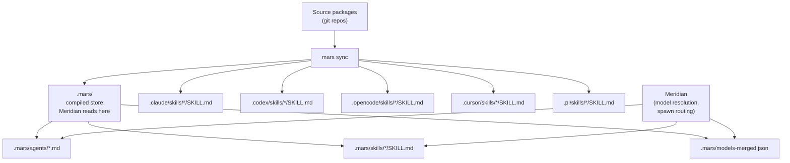
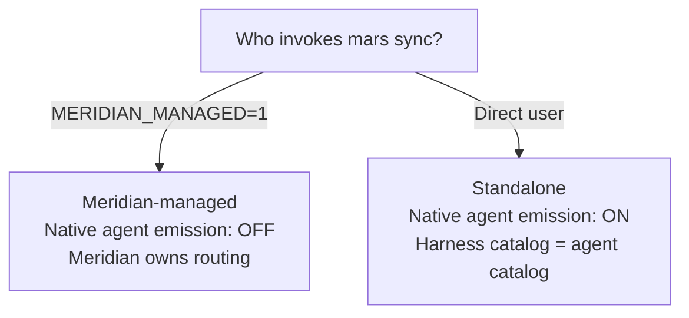

# Mars Targeting Architecture

**Decided:** 2026-05-01  
**Implemented:** 2026-05-02 (Phases 7–8 of mars-capability-packaging)  
**Supersedes:** D7 (`.agents/` asymmetric model), D27/D28 (dual-surface compilation)

This page documents the targeting architecture — where mars puts compiled
content, and where Meridian (and harnesses) read it from. It answers the "why
is the layout this way?" question that isn't obvious from the code.

---

## The New Layout

**Three invariants:**
1. `.mars/` is mars-owned compiled output. Only mars writes it. Meridian reads it.
2. Every enabled harness's native skill directory gets a lowered projection of all skills.
3. Native agent emission to harness dirs is conditional — OFF when `MERIDIAN_MANAGED=1`.

---

## Why `.agents/` Was Eliminated

`.agents/` was originally a "generic compiled target" with two subtrees:
- `.agents/agents/` — consumed only by Meridian (no harness auto-discovers it)
- `.agents/skills/` — shared by some harnesses (Codex, OpenCode, Pi)

Problems:
- The name implied cross-tool portability that didn't exist for agents
- Skills in `.agents/skills/` overlapped with harness-native skill dirs (D29
  overlap problem) — same-name skills could appear in two places
- "What is `.agents/`?" was a constant source of confusion

**Why `.mars/` instead of a new `.agents-meridian/` or similar?** `.mars/` is
already the mars-owned directory (lock file lives there). Meridian reading from
`.mars/` is natural: it reads the same compiled markdown it read before, just
from the correct ownership boundary. The original objection ("creates a second
mars reader") didn't apply — `.mars/` contains compiled output, not mars source.

---

## Skill Duplication: Intentional

Projecting skills to each harness's native directory creates disk duplication
(5-6 generated SKILL.md files per skill). This was an explicit tradeoff:

**In favor of duplication:**
- Each harness sees skills only in its own directory — no overlap problem
- No `placement: shared` vs `routed` logic needed in the compiler
- Simpler mental model: "mars sync puts skills where each tool looks"
- Universal skill metadata can be lowered to harness-specific frontmatter
  without changing the source package schema
- Skill files are markdown — the disk cost is negligible

**The alternative (shared layer) was rejected because:**
- It recreated the `.agents/skills/` sharing problem with a different name
- OpenCode discovered skills from both `.opencode/skills` AND `.claude/skills`,
  making deduplication logic necessary regardless

---

## Conditional Native Agent Emission

This is the subtlest part of the architecture. Agents can be compiled to native
harness directories (`.claude/agents/`, `.codex/agents/`, etc.), but the default
behavior differs by invocation context:

**Rationale for the asymmetry:**

When Meridian is present, it owns agent routing — it reads from `.mars/agents/`
and selects the harness. Emitting agents to native dirs would create visible
duplicates in the harness's UI (e.g., Claude Code would show the same agent
twice: once via native discovery, once via Meridian).

When Meridian is absent (pure mars workflow), the harness's native agent catalog
IS the agent catalog. Emission must be ON for the workflow to function.

**Implementation:** Meridian sets `MERIDIAN_MANAGED=1` in the environment when
invoking `mars sync` via the `meridian mars sync` passthrough. Mars detects this
and sets the effective `agent_emission` to "never".

---

## Harness Agent Formats (When Emission Is ON)

Different harnesses require different agent profile formats:

| Harness | Format | Output path |
|---------|--------|-------------|
| Claude | YAML frontmatter + Markdown body | `.claude/agents/<name>.md` |
| Codex | TOML (name, description, model, sandbox, instructions) | `.codex/agents/<name>.toml` |
| OpenCode | YAML frontmatter + Markdown body | `.opencode/agents/<name>.md` |
| Cursor | Markdown (schema evolving) | `.cursor/agents/<name>.md` |
| Pi | No first-class agent profiles | Skipped |

Mars compiles the same source profile to each target's native format.

---

## MCP and Hooks

MCP config and hooks are also compiled to native harness directories:

| Harness | MCP location | Hook location |
|---------|-------------|--------------|
| Claude | `.mcp.json` (project root) | `.claude/settings.json hooks` |
| Codex | `.codex/config.toml [mcp_servers.*]` | `.codex/config.toml [hooks]` |
| OpenCode | `opencode.json mcp.<name>` | Plugin API (TypeScript) — mars warns, skips |
| Cursor | `.cursor/mcp.json` | No public hook API — skipped |
| Pi | N/A | Extension API — mars warns, skips |

Mars manages its entries in these files without touching user-managed entries
(append-and-lock approach).

---

## `.agents/` Deprecation Path

The `.agents/` target is deprecated, not hard-broken:

- Existing repos with `.agents/` as a link target see a deprecation warning on
  next `mars sync`: "Run `mars unlink .agents` to remove it."
- Meridian reads `.mars/` first, falling back to `.agents/` during the
  transition window
- Future release: `.agents/` fallback removed from Meridian loader

If you're migrating: run `meridian mars sync` once. The new `.mars/` directory
is populated. Remove `.agents/` from `.gitignore` and add `.mars/` entries.

---

## What This Supersedes

| Old | New | Reason |
|-----|-----|--------|
| D7: `.agents/` asymmetric model | `.mars/` for Meridian, native dirs for harnesses | Ownership was confusing |
| D27: `.agents/agents/` is Meridian-facing | `.mars/agents/` is Meridian-facing | Path cleanup |
| D28: every agent emits to `.agents/agents/` | Every agent emits to `.mars/agents/`; native emission is conditional | Eliminate duplicate catalog |
| D29: V0 bans same-name skills in overlapping roots | No overlap possible — `.mars/skills/` not in any harness scan path | Architecture eliminates the problem |

---

## Related Pages

- [../concepts/package-management/overview.md](../concepts/package-management/overview.md) — what mars manages and the sync workflow
- [../concepts/model-resolution/overview.md](../concepts/model-resolution/overview.md) — how Meridian reads from `.mars/` at spawn time
- [mars-compiler.md](mars-compiler.md) — mars compiler internals
- [../concepts/skill-schema.md](../concepts/skill-schema.md) — universal skill frontmatter, variants, and per-harness lowering
- [../decisions.md](../decisions.md) — D50–D57 for the specific decisions made during the targeting overhaul
