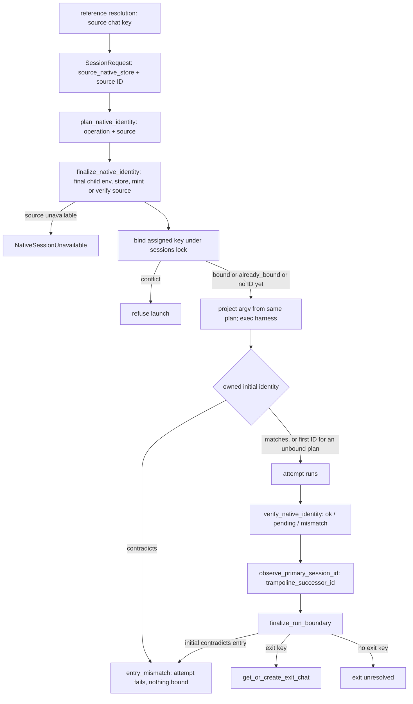

# Native Session Binding

How a launch decides its native key, when that key is written, how the source of a
resume or fork is carried, and how a run's exit is attributed. The rule and its
rationale are in the [native session identity decision](../decisions/native-session-identity.md).
Pi specifics are in [Pi native sessions](pi-native-sessions.md).

State: implemented for Pi, Claude, Codex, and OpenCode on the PR #520 integration
branches, not yet on `main`. Cursor is untracked.

## Seams

**`NativeIdentityPlan`** (`lib/core/native_identity.py`). A frozen value with
`harness_session_id`, `native_store`, `locator`, and
`operation ∈ {create, resume, fork}`. It lives in `core` because importing the harness
package from the launch-spec leaf caused a bootstrap cycle. It rides on
`ResolvedLaunchSpec.native_identity_plan`, so projection, binding, and verification all
read the same value. The same module holds `NativeSessionUnavailable`,
`NativeSessionKey(native_store, session_id)`, and `RunBoundary(entry_observed, exit)`.

**Source key.** `SessionRequest.source_native_store` plus the requested native ID is
the only description of a resume/fork source. Producers and consumers:
`ops/reference.py` (from the chat binding or spawn row) → `launch/continue_replay.py`
→ `ops/spawn/api.py` fork request builder → `ops/spawn/execute_runner.py` → the
adapter's finalization or preparation. Continue model reads receive the same store.
No launch or ops code carries a harness-specific source field. A tracked source with
no recorded store refuses as `unbound`.

**Adapter hooks** (`lib/harness/adapter.py`):

- `plan_native_identity(run)` picks the operation and source. It performs no I/O. A
  plan may carry no ID when the harness assigns it after start (Codex/OpenCode create,
  Claude fork).
- `finalize_native_identity(plan, child_env, child_cwd, session, spawn_id, interactive)`
  runs during launch binding, before argv projection (`launch/context.py`). It resolves
  the store from the *final* child env, points the child at the recorded source store,
  verifies the exact source file, and mints where the harness accepts an assigned ID.
  Env and argv come from its result, so they cannot drift from the bound key. The base
  composes `native_store_for_launch()`; Pi, Codex, and OpenCode override it.
- `verify_native_identity(plan)` runs after the attempt. It checks only the planned
  target and returns an error on contradiction. It never selects or binds a
  replacement.
- `observe_session_id()` / `observe_primary_session_id()` return **observations**
  only. For plans without an ID the first owned observation binds. Otherwise an
  observation confirms or conflicts. `PrimarySessionObservation` also carries
  `trampoline_successor_id` (Claude) as a separate diagnostic.
- `observe_run_boundary(child_env, pid)` returns a `RunBoundary` or `None`. Only Pi
  implements it (see [Pi native sessions](pi-native-sessions.md#exit-observation)).

**Binding** (`state/session_store.py`, `launch/session_scope.py`). The write is
`update_session_harness_id()`. Under the sessions lock it binds the first key and
returns `NativeBindingResult(bound | already_bound | conflict)` with the *accepted*
ID/store. A conflict never appends a rebind. `bind_harness_session_id(source=...)`
accepts only `assigned` (pre-exec plan) or `observed` (owned signal) and mirrors the
accepted ID onto the spawn row. Callers must mirror the returned ID, never their
candidate. The runner carries the finalized store on `SessionAttempt.native_store`,
so an observed-only ID binds together with its store. Binding `(id, None)` would
leave later reads to guess a root.

**Runner order.** Both runners (`launch/process/runner.py`,
`launch/streaming_runner.py`) do the same steps:

1. Bind the assigned key before starting the child.
2. Fail the attempt on an owned initial identity that contradicts it.
3. After the attempt, `verify_native_identity`.
4. `observe_primary_session_id`, persisting `trampoline_successor_id` on the run.
5. `finalize_run_boundary(..., exit_key=NativeSessionKey(plan.native_store, successor))`.

**Run boundary** (`launch/run_boundary.py`). The adapter's boundary wins. The
trampoline `exit_key` is used only when the adapter returns none, so an unresolved or
mismatched Pi record is never overridden. If the boundary's initial identity
differs from the entry chat's key (ID or store), the finalizer writes
`exit_identity=mismatch` and returns a typed `NativeEntryMismatch`. Both runners route
it through the same terminal branch as a startup mismatch: `failure_reason=
"entry_mismatch"` with structured expected/observed fields. Streaming sets failed
status so a successful native terminal result cannot override it. Otherwise an exit
key goes to `session_store.get_or_create_exit_chat`, which finds the chat already
owning that exact `(harness, store, id)`, including stopped chats, or creates one
under the sessions lock. Spawn rows record `entry_chat_id`, `exit_chat_id`, and
`exit_identity ∈ {verified, unresolved, mismatch}`. Exit uncertainty is not an
execution failure.

**Refusals.** `NativeSessionUnavailable(ref, reason)` with
`reason ∈ {unbound, missing, ambiguous_native_file}` is a `ValueError` subclass.
`missing` reports as `native_transcript_missing`. Launch preparation preserves the
typed exception through `ops/spawn/execute_runner.py` into
`ops/spawn/failure_policy.py`. The terminal error carries the code, and stderr names
the chat reference. The coarse lifecycle category stays `launch_failure`. Known gap:
Pi's tracked-source-without-store branch still raises a plain `ValueError` (tracked in
`harness/.context/TODO`).

**Reads and references** (`ops/session_target.py`, `ops/reference.py`,
`ops/reference_recovery.py`). A tracked chat transcript resolves only its bound key
inside its recorded store. Recovery reads the chat binding (chat refs) or the spawn
row (spawn refs). Primary metadata and native-file detection are not recovery levels.
A completed `session log pN` shows the verified exit chat. Otherwise it shows the entry
chat with a visible entry-based label.

**Spawned exact continue reuses the source chat.** `ops/spawn/execute_session.py`
passes `continue_chat_id` into the spawn session scope for exact continues. Fresh and
fork launches allocate new chats.

## Per-harness state

| Harness | Create | Resume | Fork | Store → child |
|---|---|---|---|---|
| Pi | Minted `--session-id` in pinned `--session-dir` | `--session <abs verified path>` | `--fork <abs source> --session-id <new>` | `PI_CODING_AGENT_SESSION_DIR` and `--session-dir` |
| Claude | `--session-id <uuid>` assigned (typed spec field) | `--resume <id>` | `--resume <id> --fork-session`; new ID from first owned signal | Store is `<config root>/projects/<slug>` from the child's `CLAUDE_CONFIG_DIR`; source `<store>/<id>.jsonl` is seeded into it (atomic copy, or symlink in the same root) |
| Codex | No ID in plan; first owned `thread.started`/`thread/start` binds ID + store | `codex resume <uuid>` / `thread/resume` | Meridian-materialized rollout copy from the recorded store; plan `operation=fork` | `CODEX_HOME` = store parent (relative homes resolve against the child cwd) |
| OpenCode | No ID in plan; first owned session event/`POST /session` binds ID + store | `-s <id>` / exact `GET /session/{id}` | `--fork` (streaming fork refused) | `OPENCODE_DB` = exact recorded DB path (`:memory:` refused) |
| Cursor | Deferred, untracked | — | — | — |

Residual inference outside identity: the Claude trampoline successor is still
detected by matching Claude's own `~/.claude/history.jsonl` against transcripts. It
only ever names an exit, never an entry. OpenCode's report fallback
(`opencode_report.py`) still reads the ambient DB. It affects `report.md` extraction,
not transcript identity, and is tracked for the native-reader phase.

## Testing

Reporting fakes must adopt `spec.native_identity_plan.harness_session_id`. A fixed
fake ID correctly trips `entry_mismatch` (see `tests/AGENTS.md`). The standard is
POSIX `sh` harness shims at the real runner seams that emit real owned events,
including prose, nested-key, and no-event negatives. Add CLI probes against an
isolated installed wheel (`--reinstall-package` with a unique wheel path so uv does
not reuse a cached same-version build). For Pi, the built extension bundle runs in
Node and the production Python reader consumes its record. That qualifies Meridian's
boundary: bound key before exec, emitted argv, typed refusals, and exit mapping. It
does not qualify a real harness's parser, lazy persistence, lifecycle races,
credentials, or billing. See
[harness integration lessons](../lessons/harness-integration.md#green-suites-did-not-find-the-seam-defects).

## Related

- [Native session identity decision](../decisions/native-session-identity.md)
- [Pi native sessions](pi-native-sessions.md)
- [Session state](state-system/session-state.md)
- [Session reference resolution](../decisions/session-reference-resolution.md)
- [Claude session isolation](claude-session-isolation.md)

**Provenance:** `work:native-harness-session-identity`; lanes `spawn:p7038`,
`spawn:p7040`, `spawn:p7041`, `spawn:p7054`; fix passes `spawn:p7043`, `spawn:p7048`,
`spawn:p7058`, `spawn:p7061`, `spawn:p7064`; merges `spawn:p7057`, `spawn:p7063`;
reviews `spawn:p7044`, `spawn:p7045`, `spawn:p7056`, `spawn:p7059`, `spawn:p7062`.
