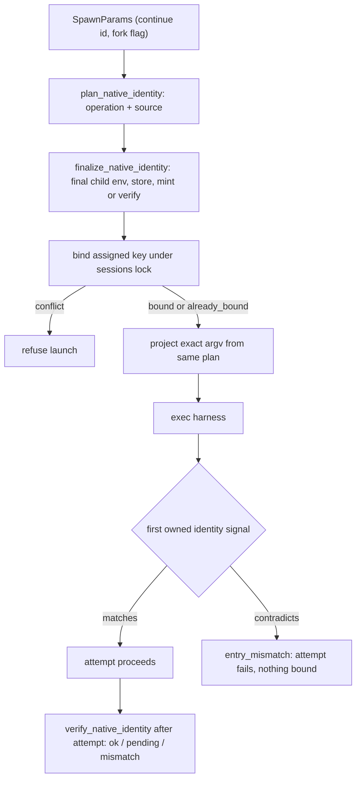

# Native Session Binding

How a launch decides its native key, when that key is written, and what each seam
guarantees. The rule and its rationale are in the
[native session identity decision](../decisions/native-session-identity.md). Pi
specifics are in [Pi native sessions](pi-native-sessions.md).

State: implemented on `fix/native-session-wrapper` for the core seams, Pi, and Claude
create/resume. Codex/OpenCode plans are in progress, and those adapters return no plan
yet.

## Seams

**`NativeIdentityPlan`** (`lib/core/native_identity.py`). A frozen value with
`harness_session_id`, `native_store`, `locator`, and
`operation ∈ {create, resume, fork}`. It lives in `core` because importing the harness
package from the launch-spec leaf caused a bootstrap cycle. It rides on
`ResolvedLaunchSpec.native_identity_plan`, so projection, binding, and verification all
read the same value.

**Adapter hooks** (`lib/harness/adapter.py`):

- `plan_native_identity(run)` picks the operation and source. It performs no I/O. The
  base returns `None`, meaning the harness has no plan yet.
- `finalize_native_identity(plan, child_env, child_cwd, session, spawn_id, interactive)`
  runs during launch binding, before argv projection (`launch/context.py`). It resolves
  the store from the *final* child env and mints or preflights the ID. Env and argv are
  derived from its result, so they cannot drift from the bound key. The default
  composes `native_store_for_launch()`, and Pi overrides the whole step.
  `SpawnParams` alone lacks the final env and spawn facts, which is why this second
  hook exists.
- `verify_native_identity(plan)` runs after the attempt. It checks only the planned
  target and returns an error string on contradiction. It never selects or binds a
  replacement.
- `observe_session_id()` / `observe_primary_session_id()` return **observations**
  only. For plans without an ID (Claude fork today) the first observation binds.
  Otherwise an observation confirms or conflicts.

**Binding** (`state/session_store.py`, `launch/session_scope.py`). The write is
`update_session_harness_id()`. Under the sessions lock it binds the first key and
returns `NativeBindingResult(bound | already_bound | conflict)` with the *accepted*
ID/store. A conflict never appends a rebind. `bind_harness_session_id(source=...)`
accepts only `assigned` (pre-exec plan) or `observed` (owned signal) and mirrors the
accepted ID onto the spawn row. Callers must mirror the returned ID, never their
candidate. Both runners (`launch/process/runner.py`, `launch/streaming_runner.py`)
bind the assigned key before starting the child.

**Entry mismatch.** An owned initial identity that contradicts the assigned or resume
target fails the attempt as `entry_mismatch`. That covers a streaming connection
report, a duplicate delivery, or a Pi RPC session event. Nothing is attributed or bound
to the unexpected key. Later switch signals update nothing about entry.

**Reads and references** (`ops/session_target.py`, `ops/reference.py`,
`ops/reference_recovery.py`). A tracked chat transcript resolves only its bound key.
If it cannot, it raises `NativeSessionUnavailable(ref, reason="unbound"|"missing")`,
which is a typed `ValueError` that fits the existing CLI error contract. Recovery reads
the chat binding (chat refs) or the spawn row (spawn refs). Primary metadata and
native-file detection are no longer recovery levels. A tracked reference without a
recorded harness refuses rather than inferring one from adapters.

**Spawned exact continue reuses the source chat.** `ops/spawn/execute_session.py`
passes `continue_chat_id` into the spawn session scope for exact continues. Fresh and
fork launches allocate new chats.

## Per-harness state

| Harness | Create | Resume | Fork | Remaining inference |
|---|---|---|---|---|
| Pi | Minted `--session-id` in pinned `--session-dir` | `--session <abs verified path>` | `--fork <abs source> --session-id <new>` | None for identity. Model replay (`harness/model_observation.py`) still scans candidate stores |
| Claude | `--session-id <uuid>` pre-assigned (or explicit passthrough ID) | `--resume <id>` | `--resume <id> --fork-session`; target ID awaits first owned signal | Exact-ID transcript lookup still falls back across config roots. Trampoline successor is diagnostic only |
| Codex | No plan yet | `codex resume <uuid>` / `thread/resume` | Meridian-materialized rollout copy | Rollout filename scan, newest-mtime among matches |
| OpenCode | No plan yet | `-s <id>` / exact `GET /session/{id}` | `--fork` | Storage/log detection; ambient DB check in `ops/session_target.py` |
| Cursor | Deferred, untracked | — | — | — |

Two other paths are outside identity but still inference-shaped. Native capture
(`state/session_identity.py`, `ops/session_target.py` capture purpose) combines row,
session, and primary-metadata IDs as conservative candidates. Runner-history capture
remains until phase 4.

## Testing

Reporting fakes must adopt `spec.native_identity_plan.harness_session_id`. A fixed
fake ID now correctly trips `entry_mismatch` (see `tests/AGENTS.md`). The phase-1
standard is POSIX `sh` harness shims at the real runner seams, plus CLI probes against
an isolated installed wheel. That qualifies Meridian's boundary: bound key before exec,
emitted argv, and typed refusals. It does not qualify a real harness's parser, lazy
persistence, credentials, or billing.

## Related

- [Native session identity decision](../decisions/native-session-identity.md)
- [Pi native sessions](pi-native-sessions.md)
- [Session state](state-system/session-state.md)
- [Session reference resolution](../decisions/session-reference-resolution.md)
- [Claude session isolation](claude-session-isolation.md)

**Provenance:** `work:native-harness-session-identity`; `spawn:p7038`, `spawn:p7040`,
`spawn:p7043`, `spawn:p7048`; reviews `spawn:p7044`, `spawn:p7045`.
