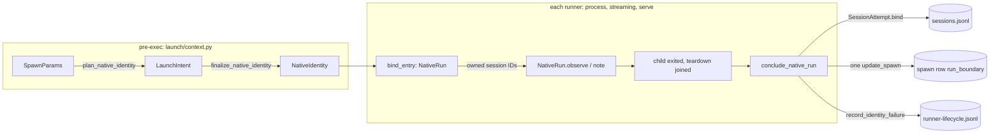

# Native Session Binding

How a launch decides its native key, when that key is written, how a run's
observations are judged, and how a run's exit is recorded. The rule and its rationale
are in the [native session identity decision](../decisions/native-session-identity.md).
Harness specifics: [Pi](pi-native-sessions.md), [Claude](claude-native-sessions.md).
How reads use the key: [native transcript reads](native-transcript-reads.md).

**State:** implemented for Pi, Claude, Codex and OpenCode in combined PR #534
(`feat/native-session-identity` @ `08499af0`, against `main`); #520, #526 and #531 are
closed as superseded. Cursor was not live-probed because the user does not use it; it
has no native identity binding in this implementation.

The design goal of the restructure: one value type, one pure binding rule, one
adapter template, one post-exit hook, and one runner pipeline.

## Types

In `lib/core/native_identity.py`:

| Name | Meaning |
|---|---|
| `NativeKey(harness, native_store, session_id)` | A complete binding. Tracked reads, continue and fork require one. |
| `NativeKeyFields` | The partial key a record may hold: a legacy record has no store; a Codex or OpenCode create has no ID until observed. `complete()` returns a `NativeKey` or `None`. `render()` is the one formatter for lifecycle payloads and messages. |
| `LaunchIntent(operation, source_session_id, preforked_session_id)` | What the caller asked for, before any store is known. |
| `NativeIdentity` | What the child is launched with: harness, operation, store (always set), assigned `session_id` or `None`, fork source ID, verified source file. The only identity input to projection, `bind_entry` and `observe_after_exit`. |
| `PostExit(entry_error, entry_observed, exit, trampoline_successor_id)` | What the adapter saw after exit. Pure; the runner pipeline decides. |
| `NativeIdentityError` | Base of every typed refusal. Runners catch only this. |
| `NativeSessionUnavailable(ref, unbound \| missing \| ambiguous_native_file)` | Nothing trustworthy to open. `missing` reports as `native_transcript_missing`. `for_ref()` re-targets the message at the user's ref. |
| `NativeEntryMismatch(expected, observed, reason)` | A readable identity contradicts the key. Carries keys, not strings. `reason ∈ {key, fork_reused_source, source_changed, fork_parent}`. |

`BindSource` is `assigned` (pre-exec), `observed` (an owned signal),
`legacy_import` (the [one-time import](legacy-native-import.md)),
`legacy_pi_recovery` (the content-proven [0.6.7 Pi pass](legacy-native-import.md#legacy-pi-recovery))
or `user_repair` ([`session repair --native`](legacy-native-import.md#session-repair)).

Two key types exist because records legitimately hold partial keys. With a complete
type, "tracked reads need the complete key" becomes a type check:
`record.native_key() is None` means `unbound`.

## Binding

In `lib/state/`:

**`native_binding.bind(prior, attempted) -> Bound | Same | Conflict`** is the one
binding rule. It is pure and fieldwise:
- an empty prior field fills;
- a differing non-empty field is a `Conflict` naming the field;
- no change is `Same`.

A conflict is never applied: the kept key stays. `bind` does not look at the bind
source; `assigned` and `observed` obey the same immutability.

**Who uses it.**
- **Replay:** the pure replay fold, public as `state/session_fold.py`, uses `bind`
  and never logs. `session_fold.by_native_key(records)` inverts the accepted keys
  into `NativeKey → chats`. Incomplete keys are omitted, and aliases keep input
  order.
- **Writes:** writers go through `state/session_binding.py`. `session_bindings()`
  takes the history-mutation lock and the sessions lock, and replays the journal
  once. Each `bind()` checks the chat, its generation and `bind`. The batch commits
  as one durable append.
- **Conflict reporting:** `native_binding.report_conflict` is the only emitter of
  `native_binding_conflict`. Only writers call it, so replay no longer repeats old
  conflicts on every command.

**Replay rules** (byte-equal to the old fold on a copied 7,000-chat journal):
- A conflicting update is dropped whole.
- A start is rewritten with the chat's accepted key before its generation is
  projected.
- `Same` still appends when it carries a startup attempt ID. That update is the
  attempt→native link that model-selection lookups read.

In PR 2 (draft #526), the per-event generation step is also public, as
`project_session_generation(...)`. The metadata index (schema 6) persists the fold's
working state and feeds appended events through it, so its incremental catch-up
calls the same code instead of re-deriving it. Search inverts the fold with
`by_native_key` to map native keys to chats.

**Runner-side writer.** `launch/session_scope.SessionAttempt.bind(attempted, source)`
is the only one:
- it mirrors a `Bound` or `Same` ID onto the spawn row;
- it never raises on `Conflict`, because the store already logged it.

Raising belongs to `NativeRun`: whether a conflict is fatal depends on whether the
signal was the attempt's first.

## Adapter template

In `lib/harness/adapter.py`:

**The two template methods.** `plan_native_identity` and `finalize_native_identity`
are base-class templates that adapters never override.
- **Plan** refuses `refused_identity_flags` in passthrough args. It builds a
  `LaunchIntent` from the run's continue/fork request, or from the pre-forked ID
  (Codex fork materialization).
- **Finalize** runs at the launch-binding site in `launch/context.py`, before argv
  projection, against the final child env:
  1. resolves and pins the store;
  2. verifies the exact source file and its native header for resume and fork;
  3. assigns the session ID.

  Argv and env are projected from its result, so they cannot drift from the bound
  key.

Each harness supplies small primitives:

| Primitive | Contract |
|---|---|
| `native_store_for_launch(...)` | Pure: no env or filesystem writes. Returns an absolute store. |
| `pin_native_store(child_env, store)` | The only env writer; never touches the filesystem |
| `assign_session_id(intent, store)` | Default: resume → source ID; fork → pre-forked ID or `None`; create → `None` |
| `validate_intent(intent)` | Optional (Codex: UUID source) |
| `resolve_native_session_file(session_id, native_store)` | Exact file for a key, header-checked; no project-root fallback |
| `observe_after_exit(identity, entry, …) -> PostExit` | Post-exit observation only; never persists |
| `continues_in_source_store`, `resolves_untracked_source`, `refused_identity_flags` | Class flags |

| Harness | create ID | resume | fork ID | Store pinned via | `observe_after_exit` |
|---|---|---|---|---|---|
| Claude | minted UUID, `--session-id` | `--resume <id>` after the source's `sessionId` checks | harness-assigned (`--resume <src> --fork-session`) | none (store is `<config root>/projects/<slug(cwd)>`; the source is seeded into it) | trampoline successor, diagnostic only |
| Codex | harness-assigned | exact rollout, `session_meta.payload.id` checked | pre-forked by Meridian before exec | `CODEX_HOME = store.parent` | default (nothing) |
| OpenCode | harness-assigned | exact session row | harness-assigned (blackbox subprocess only; streaming and attach refuse forks) | `OPENCODE_DB = store` (`:memory:` is `unbound`) | default |
| Pi | minted, `--session-id` | `--session <abs verified path>` | minted, `--fork <abs source> --session-id <new>` | `PI_CODING_AGENT_SESSION_DIR = store` (env only; Pi creates the dir) | header re-check plus the session-boundary record |
| Cursor | no native identity | — | — | — | — |

`continues_in_source_store` is `{resume, fork}` for Codex and OpenCode and `{resume}`
for Pi. A continue then runs inside the recorded store. A recorded store that is not
canonical refuses as `missing` before exec.

## Runner pipeline

In `lib/launch/native_run.py`:

The process runner, the streaming runner and `streaming serve` call only these for
identity. Managed primary attach feeds live IDs into `NativeRun.observe`.

1. **`bind_entry(attempt, spec, harness=…) -> NativeRun`**, once before exec. An
   assigned ID binds as `assigned`; a `Conflict` raises `NativeEntryMismatch`. A
   harness-assigned ID binds together with its store at the first observation, so
   no chat ever holds an ID without a store.
2. **`NativeRun.observe(id)`**: owned signals, live or the post-exit artifact ID.
   Only the attempt's **first** signal can fail the run:
   - if the harness was given a pre-exec ID, the first signal must equal it;
   - a harness-assigned fork's first ID must differ from its source
     (`fork_reused_source`).

   Every signal then binds as `observed`. A later conflicting ID is diagnostic: the
   store logs it once, and the run continues. This is the one drift rule that
   replaced three runner copies that disagreed.
3. **`NativeRun.note(id)`**: the connection's *current* ID after exit. It is always
   diagnostic, because transports overwrite it on legitimate switches. Each
   candidate is bound once per attempt.
4. **`NativeRun.retry(attempt)`** re-arms the first-signal check for a new startup
   attempt against the same pre-exec facts. On a Codex or OpenCode create retry,
   attempt 2's new thread ID stays diagnostic, and the entry keeps attempt 1's ID.
5. **`conclude_native_run(...)`**, once per attempt, **after the child exited and
   teardown was joined**. The first error wins, and later identity steps are
   skipped:
   1. **Candidate first signal:** on PR 1, an ID extracted from artifacts. In PR 2
      it is the attempt fold's `first_session_id`, observed from live events
      ([run facts](attempt-facts-and-delivery.md#attempt-folds)).
   2. **Current ID:** the connection's current ID goes to `note`.
   3. **Adapter:** `observe_after_exit`. An adapter-reported entry that differs from
      the run's entry is `NativeEntryMismatch`.
   4. **Exit:** with no error and an exit key, `session_store.get_or_create_exit_chat`
      allocates only when the exact resolver finds the file.
   5. **One row write:** `run_boundary = RunBoundaryOutcome(status, exit_chat_id,
      trampoline_successor_id)`.
   6. **On error:** `record_identity_failure(...)`, the one lifecycle writer for
      identity refusals.
   7. **Otherwise:** `record_started`, with the accepted entry ID.

**Why teardown comes first.** Exit evidence is written by the child as it shuts down.
Real Pi showed the failure mode: the streaming runner read the boundary record about
4 s before Pi wrote `quit`. The fix orders the read after `SpawnManager.join_teardown`;
there is no polling or timeout
([lesson](../lessons/native-session-identity.md#terminal-status-is-not-process-exit)).

**Serve.** `streaming serve` concludes like the other runners. The original error
survives, cleanup runs in `finally`, and the conclusion runs once.
`LifecycleLog.for_spawn` builds the spawn-scoped lifecycle log.

**Refusals before the runner** (launch preparation) pass through
`ops/spawn/execute_runner.py`. There one `raise exc.for_ref(source_ref)` re-targets
the message, and `ops/spawn/failure_policy.py` uses the typed `failure_code` as the
terminal error.

## Spawn row

In `lib/state/spawn/model.py`:

- **`chat_id`** is the entry chat, and it is immutable. There is no separate
  `entry_chat_id`.
- **`run_boundary: RunBoundaryOutcome | None`:**
  - `status ∈ {verified, unresolved, mismatch}`;
  - `exit_chat_id` is set exactly when `verified`; a validator enforces this;
  - `trampoline_successor_id` is a Claude diagnostic that never binds.
- **`SpawnRecord.continue_chat_id`** is the one post-run continue rule: a terminal
  run's verified exit chat, otherwise the entry chat. The primary exit hint,
  `--continue pN`/`--fork pN` and `session log pN` all use it.
- **Dogfood rows.** Rows written by the pre-restructure PR 1 dogfood build carry flat
  `entry_chat_id`, `exit_chat_id`, `exit_identity` and top-level
  `trampoline_successor_id` fields (`repository.DOGFOOD_BOUNDARY_FIELDS`). The strict
  schema quarantines them. Since PR 3, `state/spawn/dogfood_migration.py` rewrites them
  once, run by `meridian doctor` and primary-launch background repairs; the read-time
  translator is gone ([why](../decisions/native-only-history.md#dogfood-rows-migrate-once-not-on-read)).
- **`run_boundary_summary(row)`** renders `entry cN (…) → exit …` for `spawn show`.

The history-index `SCHEMA_VERSION` is 5 at PR 1's head. It was bumped at each
serialized record shape change so that older builds refuse the index with a typed
rebuild instruction instead of crashing
([lesson](../lessons/dogfooding-pr-builds.md#a-pr-build-must-never-touch-a-real-runtime-root)).
PR 2 bumps it to 6, adding the `session_chats` working set.

## Source key

`SessionRequest.source_native_store`, plus the requested native ID, is the only
description of a resume or fork source. It flows:
1. `ops/reference.py`, from the chat binding or the spawn row;
2. continue replay;
3. the fork request builder;
4. `execute_runner`;
5. the adapter template.

`SessionRequest.source_ref` names the user's ref in refusals. A tracked source with no
recorded store refuses as `unbound`. No launch or ops code carries a harness-specific
source field ([why](../decisions/native-session-identity.md#one-recorded-source-key)).
A spawned exact continue reuses the source chat; fresh and fork launches allocate new
chats.

## Testing

- **Fakes.** Reporting fakes must adopt `spec.native_identity.session_id`; a fixed
  fake ID correctly trips `entry_mismatch`.
- **Fixtures.** Native source fixtures need faithful headers (Claude `sessionId`,
  Codex `session_meta`); a `"{}\n"` stand-in refuses as `missing`.
- **Shims.** The qualifying standard is POSIX `sh` harness shims at the real runner
  seams. They emit real owned events, including negatives:
  - prose;
  - nested keys;
  - no event;
  - a contradictory first frame;
  - an unrelated concurrent session.
- **Refactor gates.** Refactors of the fold or the template are gated on real-data
  equivalence:
  - copied-journal byte equality;
  - 1,000 generated histories;
  - a launch-golden matrix of harness × operation × mode.

This qualifies Meridian's boundary. It does not qualify a real harness's lazy
persistence, lifecycle races or credentials
([lesson](../lessons/native-session-identity.md#green-suites-did-not-find-the-seam-defects)).

## Related

- [Native session identity decision](../decisions/native-session-identity.md)
- [Native-only history decision](../decisions/native-only-history.md)
- [Native transcript reads](native-transcript-reads.md)
- [Legacy native import](legacy-native-import.md)
- [Session state](state-system/session-state.md)
- [Session reference resolution](../decisions/session-reference-resolution.md)

**Provenance:** `work:native-harness-session-identity`:
- `design/pr1-foundation-restructure.md`, revision 3 (reviews `spawn:p7092`,
  `spawn:p7097`);
- phase lanes P0 `spawn:p7100`, P1 `spawn:p7102`, P2 `spawn:p7114`, P4 `spawn:p7104`,
  P3 `spawn:p7116`;
- thermo recheck `spawn:p7120`, alignment review `spawn:p7121`, real-data probe
  `spawn:p7122`, fix pass `spawn:p7126`;
- earlier lanes and reviews are listed on the
  [decision page](../decisions/native-session-identity.md);
- code checked at `08499af0`; final live probe and targeted re-probes are recorded in
  `work:native-harness-session-identity` evidence.
