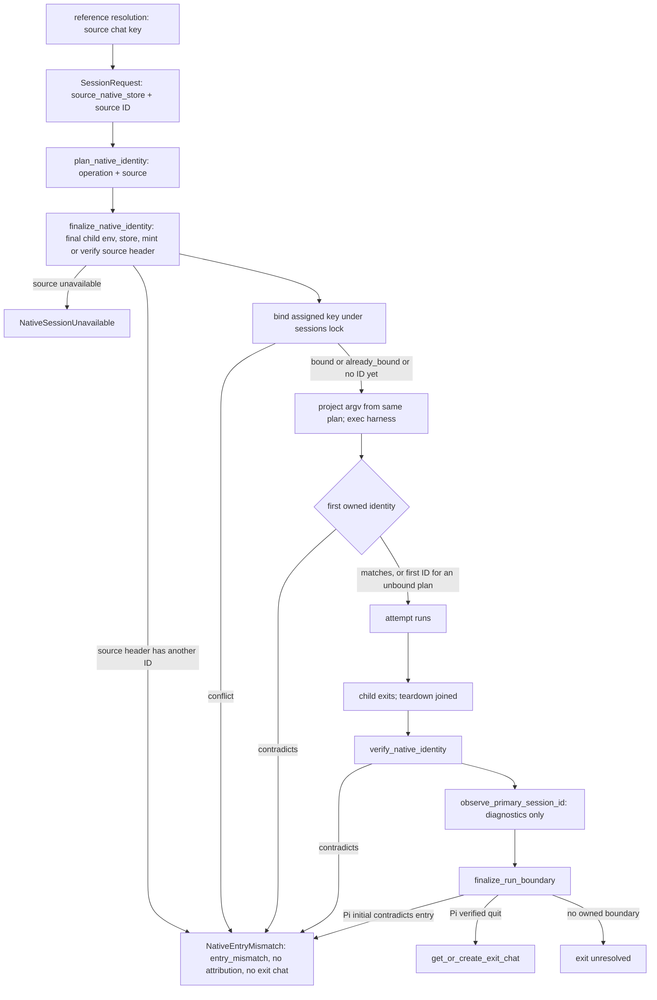

# Native Session Binding

How a launch decides its native key, when that key is written, how the source of a
resume or fork is carried, and how a run's exit is attributed. The rule and its
rationale are in the [native session identity decision](../decisions/native-session-identity.md).
Pi specifics are in [Pi native sessions](pi-native-sessions.md).

State: implemented for Pi, Claude, Codex, and OpenCode on `fix/native-session-wrapper`
(draft PR #520, head `95db4d03`), not yet on `main`. Cursor is untracked.

## Seams

**`NativeIdentityPlan`** (`lib/core/native_identity.py`). A frozen value with
`harness_session_id`, `native_store`, `locator`, and
`operation ∈ {create, resume, fork}`. It lives in `core` because importing the harness
package from the launch-spec leaf caused a bootstrap cycle. It rides on
`ResolvedLaunchSpec.native_identity_plan`, so projection, binding, and verification all
read the same value. The same module holds `NativeSessionUnavailable`,
`NativeEntryMismatch`, `NativeSessionKey(native_store, session_id)`, and `RunBoundary(entry_observed, exit)`.

**Source key.** `SessionRequest.source_native_store` plus the requested native ID is
the only description of a resume/fork source. Producers and consumers:
`ops/reference.py` (from the chat binding or spawn row) → `launch/continue_replay.py`
→ `ops/spawn/api.py` fork request builder → `ops/spawn/execute_runner.py` → the
adapter's finalization or preparation. Continue model reads receive the same store.
No launch or ops code carries a harness-specific source field. A tracked source with
no recorded store refuses as `unbound`.

**Adapter hooks** (`lib/harness/adapter.py`):

- `plan_native_identity(run)` picks the operation and source. It performs no I/O. A
  plan may carry no ID when the harness assigns it after start (Codex/OpenCode create,
  Claude fork).
- `finalize_native_identity(plan, child_env, child_cwd, session, spawn_id, interactive)`
  runs during launch binding, before argv projection (`launch/context.py`). It resolves
  the store from the *final* child env, points the child at the recorded source store,
  verifies the exact source file (including its native header ID), and mints where
  the harness accepts an assigned ID.
  Env and argv come from its result, so they cannot drift from the bound key. The base
  composes `native_store_for_launch()`; Pi, Codex, and OpenCode override it.
- `verify_native_identity(plan)` runs after the attempt. It checks only the planned
  target and returns a typed `NativeEntryMismatch` or `NativeSessionUnavailable`,
  never a string. It never selects or binds a replacement.
- `observe_session_id()` / `observe_primary_session_id()` return **observations**
  only. For plans without an ID the first owned observation binds. Otherwise an
  observation confirms or conflicts. `PrimarySessionObservation` carries only
  `trampoline_successor_id` (Claude), a diagnostic that never reaches binding or the
  exit allocator. The earlier `HarnessSessionDiscovery` carrier and its primary
  metadata fields were deleted.
- `observe_run_boundary(child_env, pid)` returns a `RunBoundary` or `None`. Only Pi
  implements it (see [Pi native sessions](pi-native-sessions.md#exit-observation)).

**Binding** (`state/session_store.py`, `launch/session_scope.py`). The write is
`update_session_harness_id()`. Under the sessions lock it binds the first key and
returns `NativeBindingResult(bound | already_bound | conflict)` with the *accepted*
ID/store. A conflict never appends a rebind. `bind_harness_session_id(source=...)`
accepts only `assigned` (pre-exec plan) or `observed` (owned signal) and mirrors the
accepted ID onto the spawn row. Callers must mirror the returned ID, never their
candidate. The runner carries the finalized store on `SessionAttempt.native_store`,
so an observed-only ID binds together with its store. Binding `(id, None)` would
leave later reads to guess a root.

**Refusals.** Two typed errors, both `ValueError` subclasses in
`lib/core/native_identity.py` (`launch/errors.py` re-exports `NativeEntryMismatch`):

- `NativeEntryMismatch(expected, observed)`, `failure_code = "entry_mismatch"`: a
  readable identity contradicts the key. Sources: an assigned-key conflict at bind,
  a source header with another ID, a contradictory first owned identity (primary,
  streaming, and managed-primary attach), Pi header/ancestry verification, and a Pi
  boundary whose initial identity differs from the entry.
- `NativeSessionUnavailable(ref, reason)` with
  `reason ∈ {unbound, missing, ambiguous_native_file}`: nothing trustworthy to open.
  `missing` reports as `native_transcript_missing` and also covers empty, torn, or
  malformed native headers.

Refusals before the runner (launch preparation) pass through
`ops/spawn/execute_runner.py` into `ops/spawn/failure_policy.py`, which uses the
typed `failure_code` as the terminal error and appends an `entry_mismatch` runner
lifecycle event with expected/observed for contradictions. Refusals inside a run go
through the runner's terminal branch with the same code and event. Pre-runner
refusals keep the coarse origin `launch_failure`; stderr names the chat reference.

**Reads and references** (`ops/session_target.py`, `ops/reference.py`,
`ops/reference_recovery.py`). A tracked chat or spawn transcript resolves only its
complete bound key: harness, recorded store, and ID. A record without a store is
`unbound`, even if a legacy `claude_config_dir` hint would find a same-ID file;
`resolve_session_file()` with hints serves only explicitly untracked references.
Recovery reads the chat binding (chat refs) or the spawn row (spawn refs). Primary
metadata and native-file detection are not recovery levels. A completed
`session log pN` shows the verified exit chat. Otherwise it shows the entry chat with
the label `entry-based view (exit identity unresolved)`.

**Spawned exact continue reuses the source chat.** `ops/spawn/execute_session.py`
passes `continue_chat_id` into the spawn session scope for exact continues. Fresh and
fork launches allocate new chats.

## Runner order

Both runners (`launch/process/runner.py` for primaries,
`launch/streaming_runner.py` for spawns) run the same sequence. The primary runner
got it last: its lane review covered streaming only, and the whole-change review
found the primary Claude path still completing and attributing a contradicted run.

1. **Assigned bind** before exec (`update_session_harness_id(source="assigned")`); a
   conflict is `NativeEntryMismatch`.
2. **Initial identity check.** The first owned identity is validated before the run
   completes; a contradiction is `NativeEntryMismatch`. Invocation attribution waits
   until validation passes.
3. **Teardown join.** The child has exited and its cleanup is finished. The
   streaming runner always awaits `SpawnManager.stop_spawn()`, which also joins an
   already-terminal session; the primary runner has waited on the process.
4. `verify_native_identity(plan)` (skipped once an identity error exists).
5. `observe_primary_session_id()`: diagnostics. A Claude `trampoline_successor_id` is
   persisted on the spawn row and goes nowhere else.
6. `finalize_run_boundary(adapter, child_env, runtime_root, spawn_id, pid,
   identity_error)` (`launch/run_boundary.py`).

**Why the teardown join comes first.** Exit evidence is written by the child as it
shuts down, so it can only be read after the child is gone. Real Pi under Meridian
showed the failure: the streaming runner published terminal status when the RPC turn
completed, and that hid the connection. A `get_connection(...) is not None` guard
then skipped `stop_spawn`, and `finalize_run_boundary` read the record about 4 s
before Pi's shutdown hook wrote `quit`. The run stayed `exit unresolved` even though
the file on disk later held a valid quit. The fix removed the guard, so teardown is
always joined before the read. No polling or timeout was added. A shim that
publishes quit only during delayed termination now covers it.

**Run boundary.** When `identity_error` is already set, the finalizer does not ask
the adapter for a boundary. Otherwise it calls `adapter.observe_run_boundary()`,
which only Pi implements. If the boundary's initial identity differs from the entry
chat's key (ID or store), the result is `NativeEntryMismatch`. Only with no identity
error and a verified boundary exit does it call
`session_store.get_or_create_exit_chat`, which finds the chat already owning that
exact `(harness, store, id)`, including stopped chats, or creates one under the
sessions lock. There is no other exit input: the Claude `exit_key` parameter was
deleted. Spawn rows record `entry_chat_id`, `exit_chat_id`, and
`exit_identity ∈ {verified, unresolved, mismatch}`. Streaming sets failed status on an
identity error so a successful native terminal result cannot override it. Exit
uncertainty alone is not an execution failure.

## Per-harness state

| Harness | Create | Resume | Fork | Store → child |
|---|---|---|---|---|
| Pi | Minted `--session-id` in pinned `--session-dir` | `--session <abs verified path>` | `--fork <abs source> --session-id <new>` | `PI_CODING_AGENT_SESSION_DIR` and `--session-dir` |
| Claude | `--session-id <uuid>` assigned (typed spec field) | `--resume <id>` after the source's first-line `sessionId` is validated | `--resume <id> --fork-session`; new ID from first owned signal | Store is `<config root>/projects/<slug>` from the child's `CLAUDE_CONFIG_DIR`; source `<store>/<id>.jsonl` is seeded into it (atomic copy, or symlink in the same root) |
| Codex | No ID in plan; first owned `thread.started`/`thread/start` binds ID + store | `codex resume <uuid>` / `thread/resume` after the rollout's `session_meta.payload.id` is validated | Meridian-materialized rollout copy from the recorded store; plan `operation=fork` | `CODEX_HOME` = store parent (relative homes resolve against the child cwd) |
| OpenCode | No ID in plan; first owned session event/`POST /session` binds ID + store | `-s <id>` / exact `GET /session/{id}` | `--fork` (streaming fork refused) | `OPENCODE_DB` = exact recorded DB path (`:memory:` refused) |
| Cursor | Deferred, untracked | — | — | — |

Residual inference outside identity: the Claude trampoline successor is still
detected by matching Claude's own `~/.claude/history.jsonl` against transcripts. It
names neither an entry nor an exit; it is a spawn-row diagnostic. OpenCode's report
fallback (`opencode_report.py`) still reads the ambient DB. It affects `report.md`
extraction, not transcript identity, and is tracked in `harness/.context/TODO` for
the native-reader phase.

## Testing

Reporting fakes must adopt `spec.native_identity_plan.harness_session_id`. A fixed
fake ID correctly trips `entry_mismatch` (see `tests/AGENTS.md`). Native source
fixtures must carry faithful headers (Claude `sessionId`, Codex `session_meta`); a
`"{}\n"` stand-in now refuses as `missing`. The standard is POSIX `sh` harness shims
at the real runner seams that emit real owned events, including prose, nested-key,
no-event, contradictory-first-frame, and unrelated-concurrent-session negatives, for
both runners. Add CLI probes against an isolated installed wheel
(`--reinstall-package` with a unique wheel path so uv does not reuse a cached
same-version build; inspect the installed source to confirm). For Pi, the built
extension bundle runs in Node and the production Python reader consumes its record.
`scripts/preflight.sh full` installs the locked Pi dependencies and builds the
extension bundles before pytest and packaging, as CI does, so tests that run Node on
the built bundle fail rather than skip when it is absent.

That qualifies Meridian's boundary: bound key before exec, emitted argv, typed
refusals, and exit mapping. It does not qualify a real harness's parser, lazy
persistence, lifecycle races, credentials, or billing; the teardown-ordering defect
above surfaced only in a real Pi run. See
[native session identity lessons](../lessons/native-session-identity.md#green-suites-did-not-find-the-seam-defects).

## Related

- [Native session identity decision](../decisions/native-session-identity.md)
- [Pi native sessions](pi-native-sessions.md)
- [Session state](state-system/session-state.md)
- [Session reference resolution](../decisions/session-reference-resolution.md)
- [Claude native sessions](claude-native-sessions.md)

**Provenance:** `work:native-harness-session-identity`; lanes `spawn:p7038`,
`spawn:p7040`, `spawn:p7041`, `spawn:p7054`; fix passes `spawn:p7043`, `spawn:p7048`,
`spawn:p7058`, `spawn:p7061`, `spawn:p7064`; merges `spawn:p7057`, `spawn:p7063`;
reviews `spawn:p7044`, `spawn:p7045`, `spawn:p7056`, `spawn:p7059`, `spawn:p7062`;
merge `spawn:p7070`; whole-change review `spawn:p7072`, fix pass `spawn:p7076`,
recheck `spawn:p7077`; real-Pi one-turn probe `spawn:p7075`.
