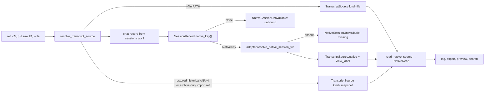

# Native Transcript Reads and Search

How `session log`, export, preview and search find a chat's conversation in the
harness's own transcript, and how search stays fast without becoming a second
authority. How the run's own facts are computed from live events instead of a
re-read stream, and delivered to subscribers and reports: [attempt facts and
delivery](attempt-facts-and-delivery.md).
Why it is built this way: [native-only history](../decisions/native-only-history.md).
The binding it reads: [native session binding](native-session-binding.md).

**State:** implemented in combined PR #534 (`feat/native-session-identity` @
`08499af0`, against `main`, not merged); #520, #526 and #531 are closed as superseded. Nothing
reads runner `history.jsonl`, and the runner-history writers and checkpoint are retired.

## One resolver, one reader

`ops/session_target.resolve_transcript_source(...)` is the only function that maps a
ref to a transcript. It returns `SessionLogTarget(source, view_label)` or raises
`NativeSessionUnavailable`.

- **One constructor.** Every native source is built by `TranscriptSource.native(harness,
  session_id, path)`. The adapter names the kind of its own file
  (`native_transcript_kind`), and `native_source_label(harness)` gives the one label
  (`"<harness> transcript"`) that log, preview and search all show.
- **The key comes from `sessions.jsonl`.** The metadata index is used only by
  `_indexed_spawn`. It recovers a `SpawnRecord`, never a transcript location, for a
  reclaimed `pN` whose `state.json` is gone, or for a history UUID or non-harness
  alias. `_indexed_target` then picks the source: the archived snapshot for an
  archive-only record this runtime did not reclaim itself (an import), the local
  snapshot for a restored record, otherwise the live binding.
- **Retained snapshots are opt-in by ref.** `TranscriptSource.retained(row, path,
  manifest_sha256=None)` builds a `snapshot` source bound to the history UUID. It
  reads a restored record's local `native-transcript.jsonl` or streams a verified
  ZIP member in place. A live `cN` whose native file is gone never falls back to
  one. Selection rules and the regression that motivated them:
  [portable history](state-system/portable-history.md#retained-snapshots-are-read-only-when-a-ref-selects-them).

| Ref | Chat read | View label |
|---|---|---|
| `cN` | `cN` | none |
| `pN`, running | `row.continue_chat_id`, which is the entry chat while running | `pN → cN (entry chat; run in progress)` |
| `pN`, terminal, boundary `verified` | `row.continue_chat_id` (the exit chat) | names the selected chat and verified exit when it differs |
| `pN`, terminal, boundary `unresolved` or `mismatch` | `row.continue_chat_id` (the entry chat) | `pN → cN (entry chat; exit identity …)` |
| `pN` with no `run_boundary` (row predates PR 1) | the entry chat | names the entry chat and predates-exit-tracking status |
| `pN` with no chat | none | `unbound`, naming the spawn |
| `pN` reclaimed | the chat of its metadata-index record, then as above | as above |
| raw native ID matching bound keys | lowest `cN` among the chats bound to that key | `also bound to cA, cB` when shared; different stores for one ID → `ambiguous_native_file` |
| raw ID matching a history alias | that spawn record, as for `pN` | as for `pN` |
| other raw ID | none; harness inferred, adapter lookup in the project | `untracked`; no inferable harness → `unbound` |
| `--file PATH` | none | `file`; rejects retired runner history and non-native inputs; SQLite is rejected with an OpenCode chat hint |

`ops/run_boundary.spawn_view_label(row)` computes the `pN` label.
`SpawnRecord.continue_chat_id` is the one post-run rule: a terminal run's verified exit
chat, otherwise the entry chat. When the chat is known but unbound, the error names the
chat (`unbound: … for c4904`), not the spawn. Old installs named the spawn.

**Capture resolves differently.** `purpose="capture"` (archive capture) accepts only an
identified terminal local `pN`. It reads the key of the run's *exact session
generation* (`session_identity.session_records_for_spawns`), never the chat's current
binding or a sidecar candidate. Explicit `session archive --apply` materializes this
native snapshot before final selection; dry-run reports when apply can capture it but
does not publish one. A missing key raises `unbound`.

**The reader.** `ops/session_transcript.read_native_source(source, budget=)` is the one
byte or snapshot read. It returns a lazy `NativeRead`:
- `events`: a generator that owns the read-only file or DB connection;
- `validation`;
- `view_basis` and `reasons`: the Pi projection's metadata;
- `witness`: the source's freshness witness, taken when the generator starts, from
  the same bytes it reads.

Log, export, preview and search all consume `NativeRead`. Pi is projected once, here,
onto its reopen-default lineage (`project_pi_reopen_default`). Each surface then
applies its own policy to the same reasons:
- log keeps the view and adds `partial: …`;
- preview shows the view as unavailable;
- search skips the source (`search_ready` is false).

An explicit Pi `--file` read stays raw.

| Harness | Source |
|---|---|
| Claude | `<store>/<id>.jsonl`, first-line `sessionId` checked |
| Codex | `<store>/YYYY/MM/DD/rollout-*-<id>.jsonl`, `session_meta.payload.id` checked. The store is `<CODEX_HOME>/sessions`, so a rollout Codex moved to `archived_sessions/` reads `missing`. |
| Pi | `…_<id>.jsonl`, header checked, projected onto the reopen-default lineage |
| OpenCode | the session in the DB at the store path. `harness/opencode_snapshot.read_opencode_snapshot` opens it `mode=ro` and reads the witness and events in one transaction. |

**Archives.** Archive capture takes the exact generation's native snapshot. A spawn with
no native source stays loose, with a reason. Legacy `history.jsonl` members of existing
ZIPs still verify and restore as bytes. `iter_archived_events` refuses to read them as
transcripts. When the snapshot exists, ZIP inventory omits retired runner stream and
checkpoint files.

## Search projection

Corpus `session search` reads a disposable SQLite file,
`<runtime_root>/history-index/native-search-v1.sqlite3`. It is separate from the
metadata index `history-v6.sqlite3`: it has its own WAL. Both put the schema version in
the file name, so builds with different schemas never open each other's file
([D-history-index-schema-namespace](../decisions/history-storage.md#d-history-index-schema-namespace)).

| Module | Owns |
|---|---|
| `harness/native_witness.py` | Witness types `FileWitness`, `OpenCodeV1Witness`, `OpenCodeV2Witness`, each with `.encode()` and `.activity_ns` |
| `harness/opencode_snapshot.py` | OpenCode's grouped `mode=ro` witness query, snapshot read, and exact V2 turn read |
| `state/native_search_index.py` | SQL only: schema, row replace, query. A witness is stored as an opaque string; `SourceRecord.is_current` is the only freshness predicate. |
| `ops/session_search_index.py` | `SearchProjection`: `open`, `refresh`, `search`, `rebuild`, `status`, `read_status`. Also `native_bindings()`. |
| `ops/session_index.py` | CLI glue for `session index rebuild` and `status`, calling the projection |
| `ops/session_search.py` | Query scopes, coverage, output |

**Tables.**
- **`sources`:** one row per native key, holding the adapter's exact locator, the
  witness, `parser_version`, activity, status and read reasons.
- **`entries`:** one row per normalized transcript entry, holding the display text.
- **`entries_fts`:** FTS5 with `tokenize='trigram'`, `detail='none'`, contentless,
  `contentless_delete=1`. It indexes a text computed in Python and never stored:
  `" ".join(content.split()).lower().replace("\0", " ")`.

A source's FTS rows and entries are replaced together in one transaction. SQLite must be
≥ 3.43 for `contentless_delete`.

**The projection stores no chat IDs.** At query time, `native_bindings()` inverts the
authoritative session fold with `session_fold.by_native_key`, giving `NativeKey → chat
IDs` with newest-first aliases. Rows for keys that are no longer bound are dropped on
refresh. The alternative, reading bindings from the metadata index's `sessions` table,
measured about 0.25 s faster. It was rejected because it adds a cold metadata
dependency and alias tie-break rules, and it still does not reach the < 1 s target.

**Freshness witness.** A row is used only when its witness equals one read from the
source right now:
- **Files:** `(st_dev, st_ino, st_size, st_mtime_ns)`.
- **OpenCode:** counts and max update times over the session's messages and parts. One
  grouped `mode=ro` query per DB also serves as OpenCode's existence check. This avoids
  the ~300 ms per-session resolution that made 0.6.7's search slow.
- **Parse bracket:** the witness from the read itself is compared with a fresh stat
  after the parse. If they differ, the source is retried once within the deadline, then
  reported as `changed during refresh`. The before-witness is what gets stored, so a
  later append makes the row stale rather than hiding it.
- **Stale sources are reparsed whole.** There is no tail-append indexing.
- **Parser version** (`PARSER_VERSION = 2`): a bump makes every row stale.

**A query.** Search:
1. Refreshes stale in-scope sources, newest first, while time remains.
2. `MATCH`es the AND of the lowercased query's quoted trigrams. Queries shorter than 3
   characters, or containing NUL, scan instead.
3. Verifies each candidate in order with the exact predicate `q.lower() in "
   ".join(content.split()).lower()`.
4. Stops at the 100-match cap.

Open commands are built from the chat ref and ordinal, never from a path in the index.
Scoped searches (`--work`, browse subsets) select keys set-based; one `OR` term per key
overflowed SQLite at ≥ 1,000 keys. The browse subset search has its own `QUERY_TIMEOUT`
deadline.

**Coverage and `complete`.** `complete = not truncated and not errors and not
sources_not_searched`.
- *Errors* are sources that could not be searched: missing, unsupported, or changed
  during refresh.
- *Pending* sources are stale ones the time budget did not reach. They print as "N of M
  sources not searched (index refreshing …)".
- *Warnings* come from sources that were searched but whose renderer reported warnings
  (`search_ready=True`). They never make a result incomplete. Text shows one count line,
  and `--json` has the detail.
- More than three errors collapse into one line per reason class.

**Archived chats** keep their binding and native file, so corpus search includes them.
Search has no `--include-archives`. `session browse --include-archives` remains a
row filter on the picker (`+archived` vs `loose`).

**`session index`.**
- `rebuild` imports configured archive ZIPs, rebuilds the metadata index, then unlinks
  the search DB and its `-wal`/`-shm` and rebuilds the projection. It does not warm browse previews; they refresh
  lazily.
- `rebuild --metadata-only` skips the search projection.
- `status` (the default) reports metadata status plus search counts: `search_bytes`,
  `search_fresh`, `search_stale`, `search_unavailable` and `search_unindexed`. It never
  creates an absent search DB.

**Timing and durability.**
- **Cold:** a missing projection gets a shared 15 s build phase, then answers with a
  coverage line. Later searches continue where it stopped. Unresolved keys cold-build
  in chat start-time order.
- **Durability:** WAL with `synchronous=NORMAL`. A process crash loses at most the
  source being written.
- **Corruption:** a corrupt file is deleted and treated as cold.

**Measured** on copies of this project's runtime (`evidence/pr2-v2-measure.md`; 2,037
keys):

| Surface | Installed (PR 1 code) | PR 2 |
|---|---|---|
| `session index rebuild` | 985 s, prewarming 1,356 previews | 55 s; `--metadata-only` 5 s |
| warm `session search`, 7 queries | 2.8–3.1 s, truncated by its scan budget | 1.23–1.77 s; hit sets equal a brute-force full native parse, 7 of 7 |
| first cold search | — | 15.9 s, with coverage |
| `session log`, 11 refs across harnesses | 0.74–1.63 s | 0.84–1.26 s; only native files and `sessions.jsonl` / `state.json` opened (strace) |
| on disk | 180 MB metadata index | 174 MB metadata index (schema 6) + 218 MB search projection |

The design's < 1 s warm target is **not met**, and the gap is not in the query path.
A warm query path costs about 0.44 s: bindings 0.32 s, witnesses 0.05 s, FTS plus exact
verification 0.05 s. The rest is `meridian session …` import and startup: 0.75 s on the
installed PR 1 build, 0.85 s on PR 2. That cost predates PR 2 and is tracked as #527.

On the real corpus, `complete` stays false: 4 of 2,037 sources cannot be searched
(3 unsupported Pi journals and 1 missing file), and 87 OpenCode sources carry warnings.

## Related Pages

- [Attempt facts and delivery](attempt-facts-and-delivery.md) — how run facts (usage,
  failure, "produced output", the first session ID) are computed from live events
  instead of a re-read stream, how they are delivered to subscribers, and the retired
  runner stream
- [Native session binding](native-session-binding.md) — the binding this resolver reads
- [Native-only history decision](../decisions/native-only-history.md) — why native reads
  replaced the runner stream, and the retained rationale and rejected alternatives
- [Session state](state-system/session-state.md) — the authoritative journal this
  page's resolver and search projection read
- [Portable history](state-system/portable-history.md) — retained snapshots selected for historical refs
- [History-storage decisions](../decisions/history-storage.md) — schema namespaces and retained-history authority
- [Native session identity lessons](../lessons/native-session-identity.md) — seam failures found by integrated probes

**Provenance:** `work:native-harness-session-identity`:
- `design/pr2-native-reads.md`;
- lane reports `evidence/pr2-{r1,r2a,r2b,r3,a1,f1a,f1b,f2,v1,fix-a,fix-b,fix-c,fix-d}-report.md`;
- `evidence/pr2-v2-measure.md` and its tech-lead correction;
- reviews `review/pr2-thermo.md`, `review/pr2-alignment.md`, `review/pr2-recheck.md`;
- `decision.md` entries of 2026-09-25.

Code was checked at `feat/native-reads` @ `3ae3fce8`.
