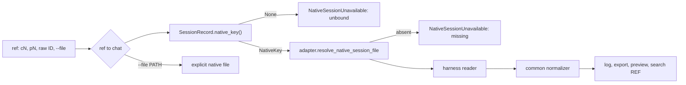

# Native Transcript Reads and Search

How `session log`, export, preview and search find a chat's conversation in the
harness's own transcript, and how search stays fast without becoming a second
authority. Why it is built this way: [native-only history](../decisions/native-only-history.md).
The binding it reads: [native session binding](native-session-binding.md).

**State:** PR 2 branch `feat/native-reads` at `1124ef38`, stacked on PR #520; not on
`main`. Items marked *designed* are not on the branch yet.

## One resolver

`ops/session_target.resolve_transcript_source(...)` is the only function that maps a
ref to a transcript source. It returns the source or raises
`NativeSessionUnavailable`. The chat's key always comes from `sessions.jsonl`. The
metadata index appears in exactly one place: mapping a reclaimed `pN`, whose
`state.json` is gone, to its chat.

| Ref | Chat read | View label |
|---|---|---|
| `cN` | `cN` | none |
| `pN`, running | `row.chat_id` (the entry chat) | entry-based view (run in progress) |
| `pN`, terminal, boundary `verified` | `row.continue_chat_id` (the exit chat) | none; names the exit chat when it differs |
| `pN`, terminal, boundary `unresolved` or `mismatch` | `row.chat_id` | entry-based view (exit identity …) |
| `pN` with no `run_boundary` (row predates PR 1) | `row.chat_id` | entry chat (run predates exit tracking) |
| `pN` reclaimed | the chat of its metadata-index record, then as above | as above |
| raw native ID | every chat whose key has that ID | lowest `cN`, naming the others; several stores → `ambiguous_native_file`; none → labeled `untracked` lookup |
| `--file PATH` | none | `file`; a runner `history.jsonl` is rejected as "not a native transcript" |

`ops/run_boundary.spawn_view_label(row)` computes the label next to
`run_boundary_summary(row)`. `SpawnRecord.continue_chat_id` is the one post-run
rule: a terminal run's verified exit chat, otherwise the entry chat.

**Readers are unchanged from PR 1:**

| Harness | Source |
|---|---|
| Claude | `<store>/<id>.jsonl`, first-line `sessionId` checked |
| Codex | `<store>/YYYY/MM/DD/rollout-*-<id>.jsonl`, `session_meta.payload.id` checked |
| Pi | `…_<id>.jsonl`, header checked, projected onto the reopen-default lineage |
| OpenCode | the session row in the DB at the store path, opened `mode=ro` |

**Deleted from implicit paths:**
- `indexed_history_target`;
- the `spawn_history` source kind;
- `HistoryJsonlTranscriptProvider`'s registration;
- the preview's runner-history cursor;
- `canonical_transcript_path`'s history fallback, and `resolve_spawn_output_path`'s.

**Archives.** Archive capture takes the bound native key's snapshot. A spawn with no
native source stays loose, with a reason. Legacy `history.jsonl` members of existing
ZIPs still verify and restore as bytes, but `iter_archived_events` refuses to read
them as transcripts.

## Search projection

Corpus `session search` reads a disposable SQLite file,
`<runtime_root>/history-index/native-search-v1.sqlite3`. It is separate from the
metadata index `history.sqlite3`: it has its own WAL, and the schema version is in
the file name, so builds with different schemas never open each other's file.

| Module | Owns |
|---|---|
| `state/native_search_index.py` | SQL only: schema, row replace, query, witness compare. Knows nothing about parsing. |
| `ops/session_search_index.py` | Refresh: key → exact source → witness → real parse → rows. Also `native_bindings()`. |
| `ops/session_index.py` | `session index rebuild` and `status` |
| `ops/session_search.py` | Query, scopes, coverage output |

**Tables.**
- **`sources`:** one row per native key, holding the adapter's exact locator, a
  freshness witness, `parser_version`, activity, status and read reasons.
- **`entries`:** one row per normalized transcript entry, holding the display text.
- **`entries_fts`:** FTS5 with `tokenize='trigram'`, `detail='none'`, contentless,
  `contentless_delete=1`. It indexes a text computed in Python and never stored:
  `" ".join(content.split()).lower().replace("\0", " ")`.

A source's FTS rows and entries are replaced together in one transaction. SQLite
must be ≥ 3.43 for `contentless_delete`.

**The projection stores no chat IDs.** At query time, `native_bindings()` maps
`NativeKey` to chats. It groups chat records from the authoritative session fold,
ordered by start time. Rows for keys that are no longer bound are dropped on refresh.

**Freshness witness.** A row is used only when its witness equals one read from the
source right now:
- **Files:** `(st_dev, st_ino, st_size, st_mtime_ns)` of the stored locator.
- **OpenCode:** counts and max update times over the session's messages and parts,
  read with one grouped `mode=ro` query per DB. The witness and the event read share
  one read snapshot. The grouped query also serves as OpenCode's existence check,
  which avoids the ~300 ms per-session resolution that made 0.6.7's search slow.
- **Parse bracket:** the witness is read before and after each parse, and a source
  that changed in between is not written.
- **Stale sources are reparsed whole.** There is no tail-append indexing.
- **Parser version:** a bump makes every row stale. It is 2, after R2b kept sources
  with warnings but `search_ready=True`.

**A query.** Search:
1. Refreshes stale in-scope sources, newest first, while time remains.
2. `MATCH`es the AND of the lowercased query's quoted trigrams. Queries shorter than
   3 characters, or containing NUL, scan instead.
3. Verifies each candidate in order with the exact predicate `q.lower() in "
   ".join(content.split()).lower()`.
4. Stops after 101 verified hits.

Stale sources that were not refreshed are listed ("N of M sources not searched …"),
and the result is then marked incomplete. Open commands are built from the chat ref
and ordinal, never from a path in the index. Scoped searches (`--work`, browse
subsets) select keys set-based; one `OR` term per key overflowed SQLite at ≥ 1,000
keys.

**Timing.**
- **Cold phase:** a missing projection gets the shared 15 s cold phase, then answers
  with a coverage line.
- **Rebuild:** `session index rebuild` rebuilds search and leaves browse previews
  lazy.
- **Durability:** WAL with `synchronous=NORMAL`. A process crash loses at most the
  source being written.
- **Corruption:** a corrupt file is deleted and treated as cold.

**Designed, not on the branch yet:**
- removing `--include-archives` (it is still a flag at `1124ef38`);
- R3's switch of the metadata index to the shared fold step (see
  [the decision](../decisions/native-only-history.md#the-metadata-index-calls-the-shared-fold-it-never-folds-keys-itself));
- whether `native_bindings()` then reads that projection or `session_fold.by_native_key`,
  whichever R3 measures cheaper.

## Run facts and delivery

**The emit path.** `SpawnManager._emit(spawn_id, event)` is the one emit path for the
drain loop and the manager's own events. Managed primary attach has the same shape.
It runs three steps in order:
1. inline event hooks, synchronously; a hook exception is logged and never stops
   delivery;
2. the history write, only when a writer exists;
3. subscriber fan-out: always when there is no writer, otherwise after a successful
   write.

The unused `EventObserverRegistry` and its lossy queued observer were deleted.
Managed primary attach also touches the spawn heartbeat now. It no longer raises
without a writer.

**Inline hooks now registered:**
- **Pi phase sink.** Registered by `streaming/drain_plan_factory.py` for Pi spawns.
  It atomically replaces `spawns/<id>/pi-lifecycle.json` with the last phase and
  cleanup status per attempt. `spawn show` reads that file.
- ***Designed (F1b, in flight):*** an `AttemptFacts` fold per attempt, fed by the
  same hooks in the streaming runner, `streaming serve` and managed primary attach.
  Report, usage, failure class, "produced output" and the first session ID for
  `conclude_native_run` then come from the fold, then a native turn named by this
  attempt's events, then unknown. Until F1b merges, `launch/report.py` and
  `launch/extract.py` still read the stream after exit.

**Other stream readers removed in F2:**
- the reaper's and the stale check's history-mtime leg (heartbeat, process and
  report evidence remain);
- the empty-output failure artifact written into the history path;
- `_MERIDIAN_GUARDRAIL_OUTPUT_LOG`, replaced by `_MERIDIAN_GUARDRAIL_REPORT` and
  `_MERIDIAN_GUARDRAIL_CHAT_ID`;
- the transcript-available check, which now tests
  `continue_chat_id`'s record for a native key.

## What is still written

Writers stay until PR 3:
- `HarnessHistoryWriter` in the drain loop and primary attach;
- the retry marker;
- the header write;
- `last-observed-event.json`.

`pytest --runner-history=off` runs the suite with writers absent and runner-history
reads trapped, so every remaining dependency is listed before PR 3 deletes them.

**Provenance:** `work:native-harness-session-identity` (`design/pr2-native-reads.md`;
lane reports `evidence/pr2-r1-report.md`, `pr2-r2a-report.md`, `pr2-r2b-report.md`,
`pr2-a1-report.md`, `pr2-f1a-report.md`, `pr2-f2-report.md`,
`pr2-r3-report.md`; `DIVERGENCE/pr2-r2b-cost-and-rebuild.md`); branch
`feat/native-reads` at `1124ef38`, checked `spawn:p7135`.
