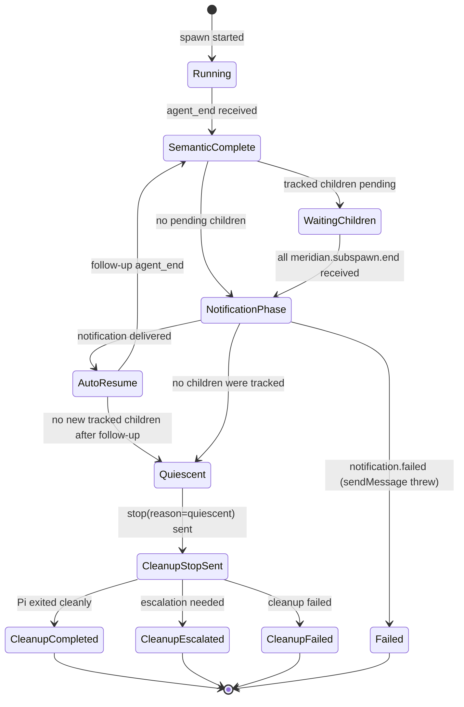

# Architecture: Pi Lifecycle and Quiescence

Pi spawned sessions use a **quiescence-based completion model** — the Pi process stays running to handle follow-up turns (when tracked child work completes). Meridian declares a spawn done only after the quiescence state machine reaches a final state, not when the Pi process exits.

This pattern is unique to Pi among Meridian harnesses. Claude, Codex, and OpenCode complete when their process exits. Pi's completion involves semantic completion, child-wave draining, and optional auto-resume before quiescence.

---

## Extension Architecture

Pi supports TypeScript extensions loaded via `-e <path>` flags. Meridian ships two managed extensions as package data under `src/meridian/pi_runtime/extensions/`:

### managed-bash

Overrides Pi's `bash` builtin. Every shell command Pi runs goes through this extension.

| `wait_policy` | Behavior |
|---|---|
| `"tracked"` (default) | Returns immediately with `state: "running"` + `job_id`. On completion emits `meridian.subspawn.end`. |
| `"detached"` | Starts job, returns without tracking. No completion event. Does not block quiescence. |
| synchronous | Blocks, returns `state: "exited"` with exit code. |

### meridian-lifecycle

Reads the managed-bash event bus and emits canonical lifecycle events. Writes to `pi-lifecycle-events.jsonl` via `fs.writeSync` (append-mode fd) — reliable even if Pi crashes mid-session.

Events emitted:

| Event type | Meaning |
|---|---|
| `meridian.subspawn.start` | Tracked child job started |
| `meridian.subspawn.end` | Tracked child job completed (with exit code) |
| `meridian.notification.queued` | Notification to Meridian queued post-child-drain |
| `meridian.notification.delivered` | Notification delivered via `sendMessage()` |
| `meridian.notification.failed` | `sendMessage()` threw; spawn finalizes failed |

---

## Sidecar JSONL Transport

Lifecycle events are written to a **sidecar file**, not stdout/stderr.

- **File:** `pi-lifecycle-events.jsonl` (path in `MERIDIAN_PI_LIFECYCLE_EVENT_FILE` env var)
- **Written by:** meridian-lifecycle extension (TypeScript, inside Pi process)
- **Read by:** `PiLifecycleEventTailer` (Python, Meridian side) — forced catch-up read before any quiescence decision

**Why sidecar, not stdout:** Pi's stdout carries the JSONL RPC protocol. Mixing lifecycle events into stdout would require Pi to multiplex two protocols — which it doesn't support. The sidecar is a write-once-read-many side channel with no RPC interference.

---

## Primary vs Spawned Split

| Aspect | Primary | Spawned |
|---|---|---|
| Launch mode | Native Pi TUI (no `--mode`) | Pi RPC (`--mode rpc`) |
| Extensions loaded | lifecycle only (`-e lifecycle.js`) | managed-bash + lifecycle (`--no-extensions -e managed-bash.js -e lifecycle.js`) |
| `MERIDIAN_PI_SESSION_ROLE` | `"primary"` | `"spawned"` |
| Quiescence auto-stop | No — user stays in TUI | Yes — quiescence triggers `stop(reason="quiescent")` |
| Prompt delivery | User types in TUI | Meridian writes prompt JSON to Pi's stdin |

Extension behavior is role-gated via `MERIDIAN_PI_SESSION_ROLE`. The quiescence machinery (auto-stop, child-wave tracking) runs only in spawned sessions.

---

## Tracked vs Detached Child Jobs

**Tracked jobs** (`wait_policy: "tracked"` or unset):
- managed-bash records the job, emits `meridian.subspawn.start`
- On completion, emits `meridian.subspawn.end`
- Pending tracked jobs block quiescence

**Detached jobs** (`wait_policy: "detached"`):
- managed-bash starts the job and returns immediately
- No completion tracking, no `meridian.subspawn.end`
- Do not block quiescence; not killed during cleanup

---

## Quiescence State Machine

**Simplified flow:**
1. Pi sends `agent_end` → Meridian records semantic completion
2. If tracked children pending: wait for `meridian.subspawn.end` events
3. When all tracked children drain: lifecycle emits `notification.queued` → `notification.delivered`
4. Auto-resume: Meridian injects a follow-up turn summarizing child results
5. After follow-up `agent_end` with no new tracked children: quiescence reached
6. Meridian sends `stop(reason="quiescent")` → cleanup phase

**`spawn wait` returns** once semantic completion is recorded — cleanup is async and does not block the caller.

---

## Child-Wave Batching

Multiple tracked children completing close together are batched into one aggregate auto-resume — one follow-up turn per wave, not one per child. This prevents rapid-fire auto-resume cycles when a Pi session spawns many children concurrently.

---

## Pi-Specific Spawn Phases

Visible in `meridian spawn show`:

| Phase | Meaning |
|---|---|
| `waiting_for_first_pi_event_after_prompt` | Waiting for Pi to acknowledge the prompt |
| `waiting_for_continuation_completion` | Auto-resume in progress after child wave |
| `pi_notification_timeout:id=...:phase=...:elapsed=...:timeout=...` | Notification delivery in progress |
| `semantic_completion_recorded` | `agent_end` received; cleanup pending |
| `cleanup_stop_sent` | `stop(reason=quiescent)` sent to Pi |
| `cleanup_completed` | Pi exited cleanly |
| `cleanup_failed` / `cleanup_escalated` | Cleanup error or escalation |

---

## Nested Stale Detection

For `MERIDIAN_DEPTH > 0` (Pi running inside another Pi spawn), stale detection applies after reconciliation using grace windows:

- Startup grace: ~15 seconds
- Recent-activity grace: ~120 seconds

Never writes orphan state from the nested read path. Surfaces as a synthetic terminal event with `stale_nested_read` code.

---

## Notification Timeout

If `sendMessage()` (the Pi API call that delivers the follow-up notification) throws after child completion, meridian-lifecycle emits `meridian.notification.failed`. Meridian finalizes the spawn as failed. No hang.

---

## Related Pages

- [../concepts/harness-abstraction.md](../concepts/harness-abstraction.md) — extension-based adapter pattern, Pi capability flags
- [../codebase/harness-adapters.md](../codebase/harness-adapters.md) — Pi-specific notes, dual launch path, capability matrix
- [../lessons/harness-integration.md](../lessons/harness-integration.md) — extension injection architectural lesson, probe-before-launch
- [launch-system.md](launch-system.md) — Pi dual launch path in the spawn subprocess path
