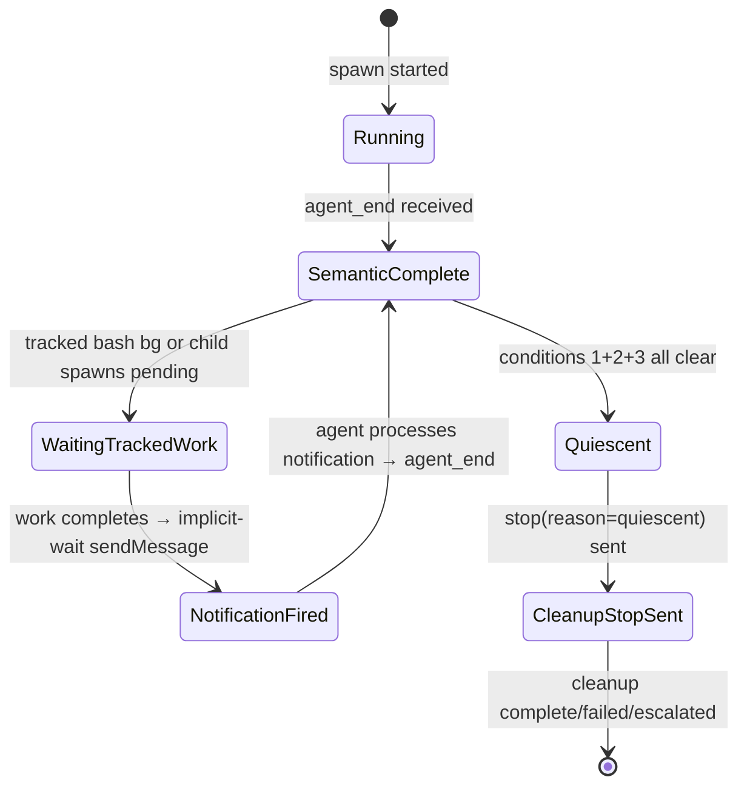

# Architecture: Pi Lifecycle and Quiescence

> **Status:** Current. Pi-bg-redesign shipped; PR #297 tightened disk-backed
> quiescence correctness and split the streaming implementation.

Pi spawned sessions use a **quiescence-based completion model** — the Pi process stays running to handle follow-up turns (when tracked child work completes). Meridian declares a spawn done only after the quiescence state machine reaches a final state, not when the Pi process exits.

Pi still has the deepest quiescence machinery because it must combine semantic
completion, disk-backed background work, and implicit-wait notification delivery
before shutdown. Codex and OpenCode now have a narrower resident-done path for
Meridian-tracked descendant spawns, but they do not use Pi's bash-record or
notification-marker machinery. Claude/plain streaming harnesses complete from the
ordinary terminal-event / connection-close path.

This page describes the current checkout. The settled
[completion-drain target](completion-drain-coordination.md) converges Pi and
resident mechanism through composition and moves Pi's persisted-spawn authority
to the reconciled transitive tree. That authority change is not implemented yet;
the direct-child quiescence rule below remains current until its gated cutover.

---

## Extension Architecture

Pi supports TypeScript extensions loaded via `-e <path>` flags. Meridian ships two managed extensions as package data under `src/meridian/pi_runtime/extensions/`:

**Two extensions, two independent concerns.** Each extension can be loaded alone or together. The split is intentional: mechanism and policy are separated.

### managed-bash (mechanism extension)

Overrides Pi's `bash` builtin. Every shell command Pi runs goes through this extension.

Registers tools:

| Tool | Purpose |
|---|---|
| `bash` | Unified bash tool. `command: string` required. `timeout_min?: 1-59` (default 55) — foreground budget only; after this elapses, bg transition occurs and tool returns `{bash_id, status: "backgrounded"}` in tool_result content. `background?: boolean` (default false) — detach immediately. |
| `bash_manage` | Single discriminated-action ops tool. Actions: `list`, `output`, `kill`, `wait`, `detach`. |

Also owns: b-* bash registry, env-var injection (`MERIDIAN_PI_BASH_ID` into every child process's env).

Slash commands: `/ps` (bash record list; supports combined/stdout/stderr stream filters), `/ps:b` (alias `/ps:background` — fg→bg mid-flight), `/ps:kill`, `/ps:logs`, `/ps:clear` (hide finished rows for this session).

Disk artifact: writes `pi-bash/<spawn-id>/bash-records.json` (aggregate per-spawn bash records, atomic tmp+rename). Python quiescence checker (`PiDiskWatcher` / `PiQuiescenceTracker`) watches this file.

### meridian-spawn-watch (policy extension)

Watches spawn records on disk and manages agent notification for completed spawns. This is the redesign successor to the earlier Pi lifecycle policy extension.

No tool registration.

Owns: spawn-record disk watcher (`watchfiles`-based, cross-platform), env-var correlation filter, implicit-wait completion notifications, ping timer.

Slash commands: `/spawn` (spawn record list, filtered to this session's spawns), `/spawn:wait`, `/spawn:cancel`, `/spawn:show`, `/spawn:log`, `/spawn:clear` (hide finished rows for this session). **Renamed from `/mspawn` — no compatibility alias.**

**Implicit-wait notification:** when a watched spawn or tracked bash bg terminates, `meridian-spawn-watch` fires a `sendMessage({triggerTurn: true})` to the agent — wave-batched for concurrent completions. Covers the failure mode where an agent backgrounds work then forgets to call explicit wait.

### Extension composition

| Extension | What it owns | When to load |
|---|---|---|
| `managed-bash` | bash/bash_manage tools, b-* registry, `/ps*` slash commands | When agent can background work |
| `meridian-spawn-watch` | spawn watcher, `/spawn*` slash commands, implicit-wait | When agent spawns meridian subprocesses |
| both | full surface | Interactive + most spawned contexts (default) |
| neither | — | True leaf agents (explorer, simple Q&A) |

---

## Primary vs Spawned Split

| Aspect | Primary | Spawned |
|---|---|---|
| Launch mode | Native Pi TUI (no `--mode`) | Pi RPC (`--mode rpc`) |
| Extensions loaded | policy only (`-e meridian-spawn-watch.js`) | managed-bash + meridian-spawn-watch (`--no-extensions -e managed-bash.js -e meridian-spawn-watch.js`) |
| `MERIDIAN_PI_SESSION_ROLE` | `"primary"` | `"spawned"` |
| Quiescence auto-stop | No — user stays in TUI | Yes — quiescence triggers `stop(reason="quiescent")` |
| Prompt delivery | User types in TUI | Meridian writes prompt JSON to Pi's stdin |

Extension behavior is role-gated via `MERIDIAN_PI_SESSION_ROLE`. The quiescence machinery (auto-stop, tracked-work checking) runs only in spawned sessions.

---

## Tracked vs Detached Child Jobs

**Tracked bash** (default):
- Created by `bash({background: true})` or any fg→bg timeout transition.
- Blocks pi quiescence until it terminates (see quiescence rule below).
- Tracked in `pi-bash/<spawn-id>/bash-records.json`.
- To opt out: `bash_manage({action: "detach", bash_id})` converts tracked → detached.

**Detached bash** (explicit opt-out):
- Created by `bash_manage({action: "detach", bash_id})` on a tracked record.
- Does NOT block pi quiescence.
- Process continues until natural exit or pi shutdown (signal cleanup kills it on pi exit).
- Use for daemon/watcher commands the agent doesn't need results from.

**Note on spawn rows:** `meridian spawn --background` spawns are separate from bash records. Spawn lifecycle is tracked via spawn records on disk, not via the bash registry.

---

## Env-Var Correlation: Linking Bash Records to Spawn Records

Correlation uses two channels. Neither depends on argv parsing.

### Channel 1 — Env Propagation

`managed-bash` injects `MERIDIAN_PI_BASH_ID=b-<id>` into every child process's environment. When meridian-cli creates a spawn record, the spawn-store reads this env var and persists it as `originating_bash_id: string` on the spawn record.

`meridian-spawn-watch` reads `originating_bash_id` to filter `/spawn` rows to spawns originating from the current session's bash invocations.

Any wrapper (`uv run meridian spawn`, shell aliases, custom scripts) converges on the same spawn-store write and inherits the parent env.

### Channel 2 — Sidecar Origin File

A separate sidecar file `pi-bash/<spawn-id>/spawn-origins.json` bridges gaps in the
env-propagation chain. `managed-bash` calls `rememberSpawnOriginBashIds()` at process
start to record the bash ID. `meridian-spawn-watch` calls `readSpawnOriginBashIds()`
to discover bash IDs for correlation, covering cases where:

- A bash process starts before `bash-records.json` is persisted (atomic write timing).
- Concurrent bash processes write origins simultaneously (serialized via per-file
  promise chain — no origin is lost).
- A spawn `state.json` appears on disk before the bash record that launched it
  (discovery polling discovers the spawn by ID, then the sidecar confirms correlation).

**The two channels are complementary, not redundant.** Env propagation provides the
primary correlation at spawn-creation time. The sidecar fills in timing gaps that
env propagation alone cannot cover. Together they ensure `/spawn` filtering and
quiescence tracking work across concurrent bash and spawn processes.

### Detection Signal Is Disk State

The detection signal is **disk state + env, never argv parsing.** Command-string
parsing would need to know every wrapper anyone might invent.

**Cross-reference columns:** when a spawn record's `originating_bash_id` matches a b-* bash record, `/ps` shows a `→ SPAWN` column linking the bash row to its spawn. `/spawn` shows a `← BASH` column linking back.

**Two-row case (no correlation):** only occurs if something runs `meridian spawn` *without* `MERIDIAN_PI_BASH_ID` set — e.g. agent shells out outside the bash tool, or human runs spawn from a separate terminal. Two honest rows, no merge. Acceptable degradation.

---

## Quiescence State Machine

### Quiescence Rule (S11)

A pi spawn is finished when, AFTER the most recent `agent_end`:

1. No spawn records with `parent_id == current_spawn_id` in non-terminal state, AND
2. No **tracked** bash bg records (b-*) for this session in non-terminal state, AND
3. No **pending implicit-wait notifications** — every `sendMessage({triggerTurn: true})` queued by `meridian-spawn-watch` has been delivered AND the agent has responded with a fresh `agent_end`.

The "after the most recent `agent_end`" qualifier is what condition 3 captures: if a notification fires AFTER `agent_end #1`, that doesn't quiesce. Wait for `agent_end #2` (which the notification's `triggerTurn: true` produces).



### Lifecycle pattern

```
agent_end #1 → check (1)+(2)+(3) → tracked work pending → wait

tracked work completes
  → meridian-spawn-watch queues implicit-wait notification (wave-batched)
  → sendMessage({triggerTurn: true}) fires
  → notification "in flight" until next agent_end

agent processes notification → takes turn → agent_end #2
  → check (1)+(2)+(3) → all empty → quiesce → stop(reason=quiescent)
```

**Implementation note:** The policy extension writes a `last-notification.json` marker file (`pi-bash/<spawn-id>/last-notification.json`) when it calls `sendMessage({triggerTurn: true})`; Python quiescence check (`PiQuiescenceTracker`, fed by `PiDiskWatcher`) requires `agent_end_ts > last_notification_ts` AND conditions (1)+(2) hold. Disk-observed child spawns participate in the child-wave timeout and quiescence check (condition 1). Event reads from the disk watcher are shielded from policy timeouts to avoid false-quiescence under load.

### Drain Correctness Constraints

`PiDiskWatcher` wakes the Python drain loop when spawn rows, bash records, or
notification markers change. Disk-change wakeups must always trigger a fresh
quiescence evaluation; a parent cannot rely only on stdout events after `agent_end`.

Current safeguards:

- Micro-drain rechecks disk before accepting terminal success, so a just-written
  child row or bash update cannot be missed.
- Child-spawn tracking counts only allocated-looking numeric `p*` directories as
  unresolved stale candidates. Names such as `p-test` or `p-child` are ignored
  because they cannot be real allocated spawn ids.
- Unresolved candidates expire after 30 seconds. Expired and wrong-parent
  candidates become rejected tombstones, so they neither block quiescence nor
  re-enter repeated disk reads.
- Child wave state preserves the parent idle epoch across disk wakeups and re-arms
  when a new child wave appears.
- Disk watcher failures propagate as drain failures instead of silently allowing
  false quiescence.
- Pending child counts sum active child spawns and tracked bash records before
  finalization decisions.

### Child-wave timeout is terminal

Once the child-wave deadline expires, Pi returns `failed` /
`pi_child_wave_timeout` exactly once. The deadline and cleanup latch are settled
before the single tracked-child cleanup attempt. An ordinary cleanup error is
recorded, and timeout-phase emission is best-effort; neither may replace the
timeout outcome, retry the wave, or announce continued waiting. Cancellation
still propagates after tracker state is finalized. This is the Pi instance of
the [one-deadline completion rule](completion-drain-coordination.md).

**`spawn wait` returns** once semantic completion is recorded — cleanup is async and does not block the caller.

---

## Implicit-Wait Wave Batching

Multiple tracked items completing close together are batched into one aggregate notification — one `sendMessage` per wave, not one per completed item. This prevents rapid-fire notification cycles when a Pi session has many children completing concurrently.

Wave batching is internal to `meridian-spawn-watch` extension. The extension debounces its own `sendMessage` calls. (In the legacy architecture this was handled Python-side; that logic is deleted.)

---

## Idle Done Nudge

Pi spawned sessions use the same narrowed drain seam as other streaming paths, but
`PiDrainCoordinator` owns Pi-specific completion policy. When the parent Pi session
is idle while disk-backed child/background work remains, the coordinator may send an
advisory done nudge through `SendPiDoneNudge`. The nudge differentiates between
spawn children and Pi-managed background processes so it can ask Pi to resume only
when the idle parent needs to observe completed work.

The nudge is a progress aid, not the authority. Disk state (`state.json`,
`bash-records.json`, notification markers) remains the completion authority.

## Child Cleanup

When Pi exits or times out with active tracked work, `PiDrainCoordinator` first
cancels active Meridian descendant spawns through the shared `cancel_descendants`
pipeline. That path sets cancel intent, drives each child through normal cancellation
or forced convergence, and lets recorded spawn scopes reap child runner trees. Pi's
tracked-process cleanup then excludes descendants already reaped through that
canonical path and focuses on Pi-internal background work.

This keeps Pi child-spawn teardown aligned with the Codex/OpenCode resident-deadline
model: Meridian-spawn children are cancelled as spawns, while Pi-specific process
metadata remains a fallback for non-spawn background work.

## Pi-Specific Spawn Phases

Visible phase events in `meridian spawn show` cover connection startup and first
response, drain and session observation, tracked-child/notification waits,
micro-drain, timeout, finalization, and connection cleanup. The cleanup phases
are `cleanup_running`, `cleanup_completed`, `cleanup_failed`, and
`cleanup_escalated`. Timeout is terminal: `pi_child_wave_timeout` is not followed
by another `waiting_for_tracked_children` phase from the timeout path.

`meridian-spawn-watch` owns implicit-wait delivery. The Python drain loop records
phase names for observation, but notification delivery itself is not a stdout event
or separate event-file protocol.

---

## Nested Stale Detection

For `MERIDIAN_DEPTH > 0` (Pi running inside another Pi spawn), stale detection applies after reconciliation using grace windows:

- Startup grace: ~15 seconds
- Recent-activity grace: ~120 seconds

The stale-read heuristic uses spawn-record / bash-record mtime activity. The grace windows remain unchanged.

Never writes orphan state from the nested read path. Surfaces as a synthetic terminal event with `stale_nested_read` code.

---

## Notification Timeout

If `sendMessage()` throws after work completion, `meridian-spawn-watch` catches the error internally and logs/retries. The extension handles notification failure as its own local concern — the spawn does not fail due to a notification delivery error.

## Pi Failure Reports

Pi prompt/auth/crash failures persist a human-readable `# Spawn failed` Markdown report rather than the legacy cleanup-only JSON. The report is written to the spawn's `report_output_path` and is visible in `meridian spawn show`. This applies to Pi RPC session failures that occur before or during the agent turn.

---

## Related Pages

- [../concepts/harness-abstraction.md](../concepts/harness-abstraction.md) — extension-based adapter pattern, Pi capability flags
- [../codebase/harness-adapters.md](../codebase/harness-adapters.md) — Pi-specific notes, dual launch path, capability matrix
- [../lessons/harness-integration.md](../lessons/harness-integration.md) — extension injection architectural lesson, probe-before-launch
- [../lessons/pi-rpc-quiescence-impl.md](../lessons/pi-rpc-quiescence-impl.md) — implementation lessons, Windows path handling, CI pitfalls
- [launch-system.md](launch-system.md) — Pi dual launch path in the spawn subprocess path
- [pi-runtime/vocab.md](pi-runtime/vocab.md) — canonical vocabulary for the pi-runtime background-work surface
