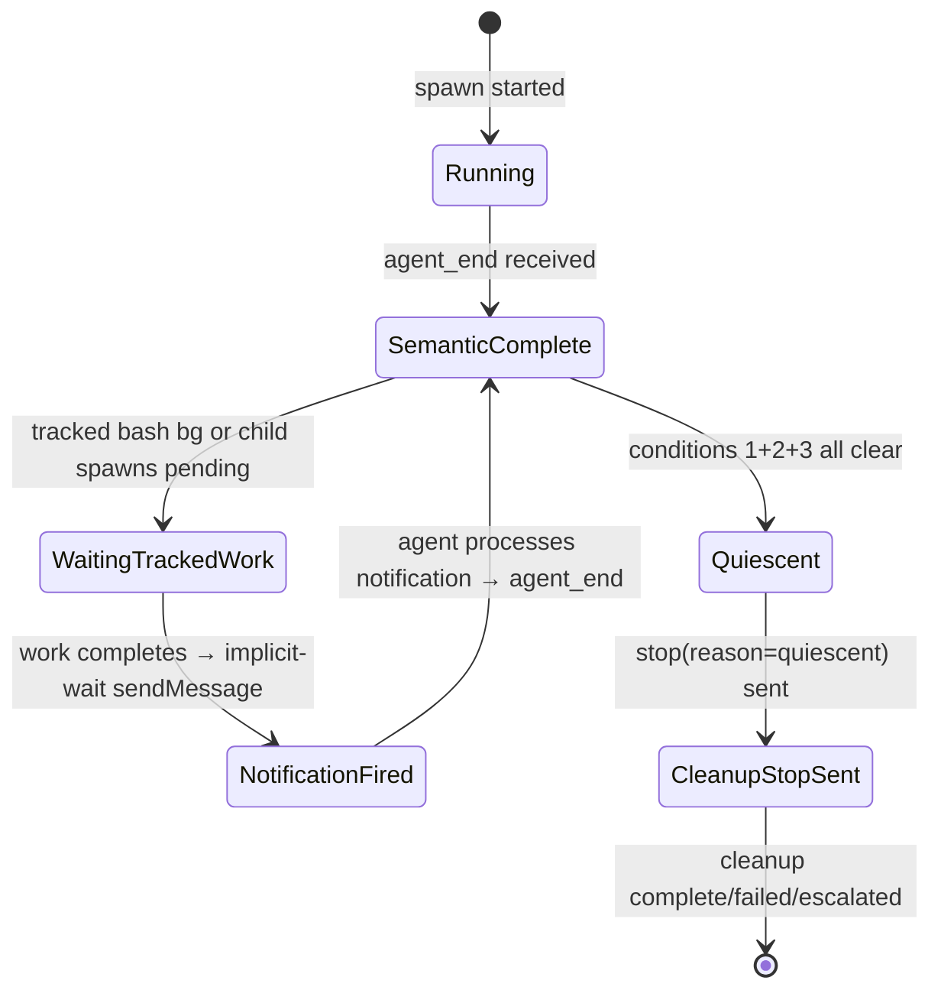

# Architecture: Pi Lifecycle and Quiescence

> **Status:** Current. Pi-bg-redesign shipped. Legacy pre-redesign sections
> preserved in the [Historical: Pre-Redesign Architecture](#historical-pre-redesign-architecture)
> appendix at the bottom.

Pi spawned sessions use a **quiescence-based completion model** — the Pi process stays running to handle follow-up turns (when tracked child work completes). Meridian declares a spawn done only after the quiescence state machine reaches a final state, not when the Pi process exits.

This pattern is unique to Pi among Meridian harnesses. Claude, Codex, and OpenCode complete when their process exits. Pi's completion involves semantic completion, tracked-work draining, and implicit-wait notification delivery before quiescence.

---

## Extension Architecture

Pi supports TypeScript extensions loaded via `-e <path>` flags. Meridian ships two managed extensions as package data under `src/meridian/pi_runtime/extensions/`:

**Two extensions, two independent concerns.** Each extension can be loaded alone or together. The split is intentional: mechanism and policy are separated.

### managed-bash (mechanism extension)

Overrides Pi's `bash` builtin. Every shell command Pi runs goes through this extension.

Registers tools:

| Tool | Purpose |
|---|---|
| `bash` | Unified bash tool. `command: string` required. `timeout_min?: 1-59` (default 55) — foreground budget only; after this elapses, bg transition occurs and tool returns `{bash_id, status: "backgrounded"}` in tool_result content. `background?: boolean` (default false) — detach immediately. |
| `bash_manage` | Single discriminated-action ops tool. Actions: `list`, `output`, `kill`, `wait`, `detach`. |

Also owns: b-* bash registry, env-var injection (`MERIDIAN_PI_BASH_ID` into every child process's env).

Slash commands: `/ps` (bash record list; supports combined/stdout/stderr stream filters), `/ps:b` (alias `/ps:background` — fg→bg mid-flight), `/ps:kill`, `/ps:logs`, `/ps:clear` (hide finished rows for this session).

Disk artifact: writes `pi-bash/<spawn-id>/bash-records.json` (aggregate per-spawn bash records, atomic tmp+rename). Python quiescence checker (`PiDiskWatcher` / `PiQuiescenceTracker`) watches this file.

### meridian-spawn-watch (policy extension)

Watches spawn records on disk and manages agent notification for completed spawns. This is the redesign successor to the earlier Pi lifecycle policy extension.

No tool registration.

Owns: spawn-record disk watcher (`watchfiles`-based, cross-platform), env-var correlation filter, implicit-wait completion notifications, ping timer.

Slash commands: `/spawn` (spawn record list, filtered to this session's spawns), `/spawn:wait`, `/spawn:cancel`, `/spawn:show`, `/spawn:log`, `/spawn:clear` (hide finished rows for this session). **Renamed from `/mspawn` — no compatibility alias.**

**Implicit-wait notification:** when a watched spawn or tracked bash bg terminates, `meridian-spawn-watch` fires a `sendMessage({triggerTurn: true})` to the agent — wave-batched for concurrent completions. Covers the failure mode where an agent backgrounds work then forgets to call explicit wait.

### Extension composition

| Extension | What it owns | When to load |
|---|---|---|
| `managed-bash` | bash/bash_manage tools, b-* registry, `/ps*` slash commands | When agent can background work |
| `meridian-spawn-watch` | spawn watcher, `/spawn*` slash commands, implicit-wait | When agent spawns meridian subprocesses |
| both | full surface | Interactive + most spawned contexts (default) |
| neither | — | True leaf agents (explorer, simple Q&A) |

---

## Sidecar JSONL Transport

> **Legacy only.** The redesign removed the sidecar transport and Python tailer.
> Current quiescence uses `watchfiles`-based disk observation (`PiDiskWatcher`) of:
> - Spawn records: `runtime_root/spawns/<child>/state.json`
> - Bash records: `runtime_root/pi-bash/<parent>/bash-records.json`
> - Notification marker: `runtime_root/pi-bash/<parent>/last-notification.json`

---

## Primary vs Spawned Split

| Aspect | Primary | Spawned |
|---|---|---|
| Launch mode | Native Pi TUI (no `--mode`) | Pi RPC (`--mode rpc`) |
| Extensions loaded | policy only (`-e meridian-spawn-watch.js`) | managed-bash + meridian-spawn-watch (`--no-extensions -e managed-bash.js -e meridian-spawn-watch.js`) |
| `MERIDIAN_PI_SESSION_ROLE` | `"primary"` | `"spawned"` |
| Quiescence auto-stop | No — user stays in TUI | Yes — quiescence triggers `stop(reason="quiescent")` |
| Prompt delivery | User types in TUI | Meridian writes prompt JSON to Pi's stdin |

Extension behavior is role-gated via `MERIDIAN_PI_SESSION_ROLE`. The quiescence machinery (auto-stop, tracked-work checking) runs only in spawned sessions.

---

## Tracked vs Detached Child Jobs

**Tracked bash** (default):
- Created by `bash({background: true})` or any fg→bg timeout transition.
- Blocks pi quiescence until it terminates (see quiescence rule below).
- Tracked in `pi-bash/<spawn-id>/bash-records.json`.
- To opt out: `bash_manage({action: "detach", bash_id})` converts tracked → detached.

**Detached bash** (explicit opt-out):
- Created by `bash_manage({action: "detach", bash_id})` on a tracked record.
- Does NOT block pi quiescence.
- Process continues until natural exit or pi shutdown (signal cleanup kills it on pi exit).
- Use for daemon/watcher commands the agent doesn't need results from.

**Note on spawn rows:** `meridian spawn --background` spawns are separate from bash records. Spawn lifecycle is tracked via spawn records on disk, not via the bash registry.

---

## Env-Var Correlation: Linking Bash Records to Spawn Records

`managed-bash` injects `MERIDIAN_PI_BASH_ID=b-<id>` into every child process's environment. When meridian-cli creates a spawn record, the spawn-store reads this env var and persists it as `originating_bash_id: string` on the spawn record.

`meridian-spawn-watch` reads `originating_bash_id` to filter `/spawn` rows to spawns originating from the current session's bash invocations.

The detection signal is **disk state + env, never argv parsing.** Any wrapper (`uv run meridian spawn`, shell aliases, custom scripts) converges on the same spawn-store write and inherits the parent env. Command-string parsing would need to know every wrapper anyone might invent.

**Cross-reference columns:** when a spawn record's `originating_bash_id` matches a b-* bash record, `/ps` shows a `→ SPAWN` column linking the bash row to its spawn. `/spawn` shows a `← BASH` column linking back.

**Two-row case (no correlation):** only occurs if something runs `meridian spawn` *without* `MERIDIAN_PI_BASH_ID` set — e.g. agent shells out outside the bash tool, or human runs spawn from a separate terminal. Two honest rows, no merge. Acceptable degradation.

---

## Quiescence State Machine

### Quiescence Rule (S11)

A pi spawn is finished when, AFTER the most recent `agent_end`:

1. No spawn records with `parent_id == current_spawn_id` in non-terminal state, AND
2. No **tracked** bash bg records (b-*) for this session in non-terminal state, AND
3. No **pending implicit-wait notifications** — every `sendMessage({triggerTurn: true})` queued by `meridian-spawn-watch` has been delivered AND the agent has responded with a fresh `agent_end`.

The "after the most recent `agent_end`" qualifier is what condition 3 captures: if a notification fires AFTER `agent_end #1`, that doesn't quiesce. Wait for `agent_end #2` (which the notification's `triggerTurn: true` produces).



### Lifecycle pattern

```
agent_end #1 → check (1)+(2)+(3) → tracked work pending → wait

tracked work completes
  → meridian-spawn-watch queues implicit-wait notification (wave-batched)
  → sendMessage({triggerTurn: true}) fires
  → notification "in flight" until next agent_end

agent processes notification → takes turn → agent_end #2
  → check (1)+(2)+(3) → all empty → quiesce → stop(reason=quiescent)
```

**Implementation note:** The policy extension writes a `last-notification.json` marker file (`pi-bash/<spawn-id>/last-notification.json`) when it calls `sendMessage({triggerTurn: true})`; Python quiescence check (`PiQuiescenceTracker`, fed by `PiDiskWatcher`) requires `agent_end_ts > last_notification_ts` AND conditions (1)+(2) hold. Disk-observed child spawns participate in the child-wave timeout and quiescence check (condition 1). Event reads from the disk watcher are shielded from policy timeouts to avoid false-quiescence under load.

**`spawn wait` returns** once semantic completion is recorded — cleanup is async and does not block the caller.

---

## Implicit-Wait Wave Batching

Multiple tracked items completing close together are batched into one aggregate notification — one `sendMessage` per wave, not one per completed item. This prevents rapid-fire notification cycles when a Pi session has many children completing concurrently.

Wave batching is internal to `meridian-spawn-watch` extension. The extension debounces its own `sendMessage` calls. (In the legacy architecture this was handled Python-side; that logic is deleted.)

---

## Pi-Specific Spawn Phases

Visible in `meridian spawn show`:

| Phase | Meaning |
|---|---|
| `waiting_for_first_pi_event_after_prompt` | Waiting for Pi to acknowledge the prompt |
| `waiting_for_continuation_completion` | Auto-resume in progress after child wave |
| `semantic_completion_recorded` | `agent_end` received; cleanup pending |
| `cleanup_stop_sent` | `stop(reason=quiescent)` sent to Pi |
| `cleanup_completed` | Pi exited cleanly |
| `cleanup_failed` / `cleanup_escalated` | Cleanup error or escalation |

The `pi_notification_timeout:...` phases from the legacy sidecar delivery path are removed — the redesign's implicit-wait mechanism (`meridian-spawn-watch` → `sendMessage`) does not use phase-string notification tracking.

---

## Nested Stale Detection

For `MERIDIAN_DEPTH > 0` (Pi running inside another Pi spawn), stale detection applies after reconciliation using grace windows:

- Startup grace: ~15 seconds
- Recent-activity grace: ~120 seconds

The legacy sidecar mtime check is replaced by spawn-record / bash-record mtime heuristics. The grace windows remain unchanged.

Never writes orphan state from the nested read path. Surfaces as a synthetic terminal event with `stale_nested_read` code.

---

## Notification Timeout

If `sendMessage()` throws after work completion, `meridian-spawn-watch` catches the error internally and logs/retries. The extension handles notification failure as its own local concern — the spawn does not fail due to a notification delivery error.

## Pi Failure Reports

Pi prompt/auth/crash failures persist a human-readable `# Spawn failed` Markdown report rather than the legacy cleanup-only JSON. The report is written to the spawn's `report_output_path` and is visible in `meridian spawn show`. This applies to Pi RPC session failures that occur before or during the agent turn.

---

## Related Pages

- [../concepts/harness-abstraction.md](../concepts/harness-abstraction.md) — extension-based adapter pattern, Pi capability flags
- [../codebase/harness-adapters.md](../codebase/harness-adapters.md) — Pi-specific notes, dual launch path, capability matrix
- [../lessons/harness-integration.md](../lessons/harness-integration.md) — extension injection architectural lesson, probe-before-launch
- [../lessons/pi-rpc-quiescence-impl.md](../lessons/pi-rpc-quiescence-impl.md) — implementation lessons, Windows path handling, CI pitfalls
- [launch-system.md](launch-system.md) — Pi dual launch path in the spawn subprocess path
- [pi-runtime/vocab.md](pi-runtime/vocab.md) — canonical vocabulary for the pi-runtime background-work surface

---

## Historical: Pre-Redesign Architecture

> **Note:** The following sections describe the legacy main-branch pi-runtime
> architecture that was deleted and rebuilt in the `pi-bg-redesign` work item
> (worktree: `pi-generic-background-tasks`). Preserved for reference only.
> Do not implement against these contracts.

### Historical: Sidecar JSONL Transport

Lifecycle events were written to a **sidecar file**, not stdout/stderr.

- **File:** `pi-lifecycle-events.jsonl` (path in `MERIDIAN_PI_LIFECYCLE_EVENT_FILE` env var)
- **Written by:** meridian-lifecycle extension (TypeScript, inside Pi process)
- **Read by:** `PiLifecycleEventTailer` (Python, Meridian side) — forced catch-up read before any quiescence decision

**Why sidecar, not stdout:** Pi's stdout carries the JSONL RPC protocol. Mixing lifecycle events into stdout would require Pi to multiplex two protocols — which it doesn't support. The sidecar was a write-once-read-many side channel with no RPC interference.

### Historical: meridian-lifecycle Extension

The predecessor to `meridian-spawn-watch`. Read the managed-bash event bus and emitted canonical lifecycle events. Wrote to `pi-lifecycle-events.jsonl` via `fs.writeSync` (append-mode fd).

Events emitted:

| Event type | Meaning |
|---|---|
| `meridian.subspawn.start` | Tracked child job started |
| `meridian.subspawn.end` | Tracked child job completed (with exit code) |
| `meridian.notification.queued` | Notification to Meridian queued post-child-drain |
| `meridian.notification.delivered` | Notification delivered via `sendMessage()` |
| `meridian.notification.failed` | `sendMessage()` threw; spawn finalized failed |

Renamed to `meridian-spawn-watch` in the redesign. The old name `meridian-lifecycle` is fully retired.

### Historical: managed-bash wait_policy Parameter

The legacy `managed-bash` extension accepted a `wait_policy` parameter controlling background behavior.

| `wait_policy` | Behavior |
|---|---|
| `"tracked"` (default) | Returns immediately with `state: "running"` + `job_id`. On completion emits `meridian.subspawn.end`. |
| `"detached"` | Starts job, returns without tracking. No completion event. Does not block quiescence. |
| synchronous | Blocks, returns `state: "exited"` with exit code. |

**Deleted.** Replaced by `background?: boolean` on the `bash` tool + `bash_manage({action: "detach", bash_id})` for runtime detach. The `tracked` semantic survives as the default state for all `bash({background: true})` calls; `detached` is now a runtime action, not a tool parameter.

### Historical: Legacy Event Types (Deleted)

These event types are fully removed. No compatibility aliases.

| Deleted event | Replaced by |
|---|---|
| `meridian.subspawn.start` | Disk-watch on spawn records |
| `meridian.subspawn.end` | Disk-watch on spawn records |
| `meridian.notification.queued` | Extension-internal (meridian-spawn-watch) |
| `meridian.notification.delivered` | Extension-internal |
| `meridian.notification.failed` | Extension-internal |

Also deleted: `pi-lifecycle-events.jsonl`, `MERIDIAN_PI_LIFECYCLE_EVENT_FILE`, `PiLifecycleEventTailer`, Python-side wave batching, Python-side notification failure/timeout handling.
