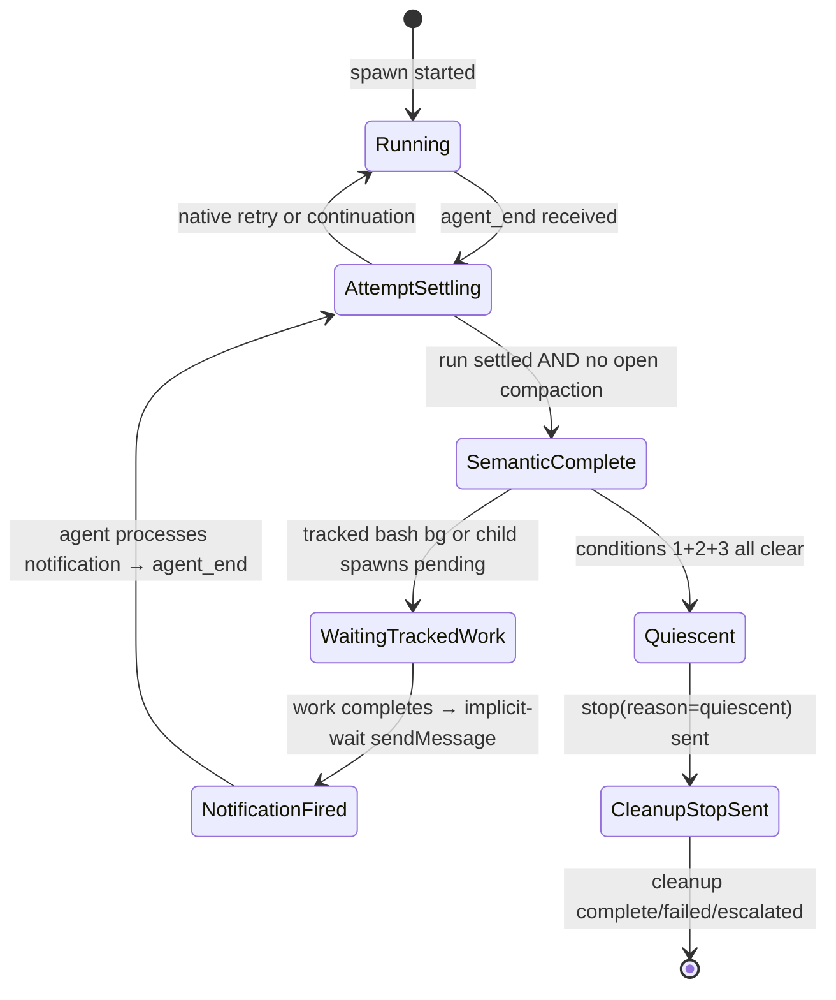

# Architecture: Pi Lifecycle and Quiescence

Pi spawned sessions use a **quiescence-based completion model** — the Pi process stays running to handle follow-up turns (when tracked child work completes). Meridian declares a spawn done only after the quiescence state machine reaches a final state, not when the Pi process exits.

Pi still has the deepest quiescence machinery because it combines semantic
completion, disk-backed background work, and native follow-up delivery before
shutdown. Codex and OpenCode now have a narrower resident-done path for
Meridian-tracked descendant spawns; they do not use Pi's private execution-owner
or exact-delivery evidence. Claude/plain streaming harnesses complete from the
ordinary terminal-event / connection-close path.

Pi and resident completion share the
[`CompletionCoordinator`](completion-drain-coordination.md). Pi supplies its own
profile and private-work evidence while both profiles use the same reconciled
transitive spawn tree for persisted descendants.

> [!NOTE]
> The settlement boundary described below is the design delivered by pending PR #547
> at source checkpoint `c1b64bcf`. The installed Meridian release contract
> must not be inferred from this pending source description.

---

## Extension Architecture

Pi supports TypeScript extensions loaded via `-e <path>` flags. Meridian ships three managed extensions as package data under `src/meridian/pi_runtime/extensions/`. The third, `session-boundary`, records exit identity and is covered in [Pi native sessions](pi-native-sessions.md). This page covers the two lifecycle extensions; their cross-layer ownership and delivery contracts are in [Pi Runtime Coordination](pi-runtime/coordination.md).

**Two extensions, two independent concerns.** Each extension can be loaded alone or together. The split is intentional: mechanism and policy are separated.

### managed-bash (mechanism extension)

Overrides Pi's `bash` builtin. Every shell command Pi runs goes through this extension.

Registers tools:

| Tool | Purpose |
|---|---|
| `bash` | Unified bash tool. `command: string` required. `timeout_min?: 1-59` (default 55) — foreground budget only; after this elapses, bg transition occurs and tool returns `{bash_id, status: "backgrounded"}` in tool_result content. `background?: boolean` (default false) — detach immediately. |
| `bash_manage` | Single discriminated-action ops tool. Actions: `list`, `output`, `kill`, `wait`, `detach`. |

Also owns: b-* Bash registry, live process ownership, and `_MERIDIAN_PI_BASH_ID` injection into child processes.

Slash commands: `/ps` (bash record list; supports combined/stdout/stderr stream filters), `/ps:b` (alias `/ps:background` — fg→bg mid-flight), `/ps:kill`, `/ps:logs`, `/ps:clear` (hide finished rows for this session).

Disk artifact: writes `pi-bash/<spawn-id>/bash-records.json` (aggregate per-spawn Bash records, atomic tmp+rename). Python's `PiDiskWatcher` wakes the private-work ledger when task evidence changes.

### meridian-spawn-watch (policy extension)

Watches spawn records on disk and manages agent notification for completed spawns. This is the redesign successor to the earlier Pi lifecycle policy extension.

No tool registration.

Owns: canonical direct-child discovery, `/spawn*` UI, idle-only implicit-wait
publication, exact native-admission receipts, and delivery fault reporting.
Advisory Bash pings belong to `managed-bash`; a failed ping never fails the shell.

Slash commands: `/spawn` (spawn record list, filtered to this session's spawns), `/spawn:wait`, `/spawn:cancel`, `/spawn:show`, `/spawn:log`, `/spawn:clear` (hide finished rows for this session). **Renamed from `/mspawn` — no compatibility alias.**

**Implicit-wait notification:** when an eligible spawn or tracked Bash result
terminates, `meridian-spawn-watch` batches it with other ready work and publishes
only while Pi's native context is idle. `sendMessage()` queues a follow-up but
does not prove it was admitted; see [Pi Runtime Coordination](pi-runtime/coordination.md)
for the receipt and public-event evidence required by completion policy.

### Extension composition

| Extension | What it owns | When to load |
|---|---|---|
| `managed-bash` | bash/bash_manage tools, b-* registry, `/ps*` slash commands | When agent can background work |
| `meridian-spawn-watch` | spawn watcher, `/spawn*` slash commands, implicit-wait | When agent spawns meridian subprocesses |
| both | full surface | Interactive + most spawned contexts (default) |
| neither | — | True leaf agents (explorer, simple Q&A) |

---

## Primary vs Spawned Split

| Aspect | Primary | Spawned |
|---|---|---|
| Launch mode | Native Pi TUI (no `--mode`) | Pi RPC (`--mode rpc`) |
| Extensions loaded | Meridian's managed extensions via `-e` (managed-bash and spawn-watch when their `[harness.pi]` toggles are on, session-boundary always); no `--no-extensions`, so the user's own Pi extensions still load; passthrough `-e`/`--no-extensions` refused | the same managed `-e` set after `--no-extensions` (omitted when `load_all_pi_extensions` is on) |
| `_MERIDIAN_PI_SESSION_ROLE` | `"primary"` | `"spawned"` |
| Quiescence auto-stop | No — user stays in TUI | Yes — quiescence triggers `stop(reason="quiescent")` |
| Prompt delivery | User types in TUI | Meridian writes prompt JSON to Pi's stdin |

The role comes from `run_params.interactive`. Python owns the role split: the
quiescence machinery (auto-stop, tracked-work checking) runs only for spawned
sessions, which Meridian drives over RPC, and the Pi connection gets the role as
`pi_session_role` on its config. `_MERIDIAN_PI_SESSION_ROLE` is read back only
by the Pi prelaunch to choose the runtime compatibility probe. No TypeScript
extension reads it. A settled decision replaces it with one cross-harness
`MERIDIAN_SESSION_ROLE=primary|spawn`; that is not built yet
([D-session-role](../decisions/idle-notifications.md#d-session-role--one-meridian_session_role-at-the-bind-seam)).

---

## Tracked vs Detached Child Jobs

**Tracked bash** (default):
- Created by `bash({background: true})` or any fg→bg timeout transition.
- Blocks pi quiescence until it terminates (see quiescence rule below).
- Tracked in `pi-bash/<spawn-id>/bash-records.json`.
- To opt out: `bash_manage({action: "detach", bash_id})` converts tracked → detached.

**Detached bash** (explicit opt-out):
- Created by `bash_manage({action: "detach", bash_id})` on a tracked record.
- Does NOT block pi quiescence.
- Process continues until natural exit or pi shutdown (signal cleanup kills it on pi exit).
- Use for daemon/watcher commands the agent doesn't need results from.

**Note on spawn rows:** `meridian spawn --background` spawns are separate from bash records. Spawn lifecycle is tracked via spawn records on disk, not via the bash registry.

---

## Canonical Child Membership

The watcher selects child work from persisted rows whose `parent_id` is the
current spawn. That direct membership is authoritative for `/spawn`, completion
obligations, and exact notification batches. `originating_bash_id` links a
child to the Bash launcher and transfers that launcher's result obligation; it
does not create child membership by itself. Bash logs, remembered scan history,
timers, and the retired `spawn-origins.json` sidecar are not authority. See
[Pi Runtime Coordination](pi-runtime/coordination.md) for the receipt and
observation boundary.

---

## Quiescence State Machine

### Quiescence Rule (S11)

A Pi spawn can become natively idle only after the most recent automatic run has
settled (`agent_end` followed by `agent_settled`) and no compaction remains open.
Settlement and compaction events may arrive in either order: ending a compaction
after an already-settled run needs no second settlement, while `compaction_end`
alone cannot settle an active run.
Once that native idle boundary is reached, it is finished when:

1. No active **transitive persisted descendants** remain in the cycle-safe
   reconciled spawn tree, AND
2. No tracked Bash execution remains live, and no unattended terminal Bash
   result remains owed, AND
3. No child or Bash result delivery remains owed or unknown. For each
   unattended completion, exact native admission and its matching Python
   public-event observation must be recorded, and the agent must complete a
   fresh settled turn (`agent_end` plus `agent_settled`).

The settlement qualifier is what condition 3 captures: if a follow-up is admitted
after attempt `agent_end #1`, that does not quiesce; wait for its settlement and
the next terminal turn. A native receipt without the matching public event remains
unknown and cannot satisfy the rule. The raw `agent_end` frame remains observable;
only its decoded attempt outcome is retained privately until settlement.


```mermaid
stateDiagram-v2
    [*] --> Running: spawn started
    Running --> AttemptSettling: agent_end received
    AttemptSettling --> Running: native retry or continuation
    AttemptSettling --> SemanticComplete: run settled AND no open compaction
    SemanticComplete --> WaitingTrackedWork: tracked bash bg or child spawns pending
    SemanticComplete --> Quiescent: conditions 1+2+3 all clear
    WaitingTrackedWork --> NotificationFired: work completes → implicit-wait sendMessage
    NotificationFired --> AttemptSettling: agent processes notification → agent_end
    Quiescent --> CleanupStopSent: stop(reason=quiescent) sent
    CleanupStopSent --> [*]: cleanup complete/failed/escalated
```

### Lifecycle pattern

```
agent_end #1 → agent_settled (+ no open compaction) → check (1)+(2)+(3)
  → tracked work pending → wait

tracked work completes
  → meridian-spawn-watch queues implicit-wait notification (wave-batched)
  → sendMessage({triggerTurn: true}) fires
  → notification "in flight" until the next settled turn

agent processes notification → takes turn → agent_end #2 → agent_settled
  → check (1)+(2)+(3) → all empty → quiesce → stop(reason=quiescent)
```

### Native evidence boundaries

`agent_end` is a provisional low-level attempt, not a session-level idle or terminal
boundary. `agent_settled` resolves that retained attempt; missing or malformed
settlement data fails closed, and a Boolean `aborted` is required. The raw frames remain
visible to hooks and subscribers even though only the decoded attempt outcome is held
privately until settlement. Native idle also requires that no compaction is open.

Retries and ordinary compaction are separate supported facts: retry/agent-start and
compaction activity keep the parent active, while `compaction_end` cannot settle an
otherwise active run. Pi's `summarization_retry_*` and `queue_update` notifications
remain observable raw telemetry but do not carry activity semantics. In particular,
arbitrary third-party branch-summary lifecycles are unsupported and are not a safety
qualification for this completion model.

**Implementation note:** `PiPrivateWorkLedger`, fed by `PiDiskWatcher`, combines
tracked Bash evidence with exact wait-consumption, admission-receipt, public-event
observation, and wait-lease evidence. The retired `last-notification.json`
timestamp is ignored. Persisted descendants come only from the shared cached
assessment. Its single-flight worker uses
`ReconciledDescendantEvidence` for indexed transitive discovery and authoritative
selected-row reconciliation; finish-anchored polling refreshes that assessment while
completion is pending.

### Drain Correctness Constraints

`PiDiskWatcher` wakes the Python drain loop when Pi-private Bash and delivery
evidence changes. Those wakeups refresh private state and reevaluate policy;
they are not persisted-descendant authority, and a parent cannot rely only on
stdout events after settlement. Descendant refresh is periodic and
request-sequenced rather than watcher- or event-driven.

Current safeguards:

- Micro-drain rechecks private-work evidence and waits for a post-proposal descendant
  refresh before accepting terminal success.
- The shared `CompletionCoordinator` owns completion phase and validation state;
  native run facts and compaction-in-progress remain independent evidence. Its
  `stabilizing` phase has a policy timer; after that timer elapses it enters a distinct
  `validating` phase, disarms stabilization, and waits for the already-requested fresh
  descendant evidence. Activity interrupts either phase and invalidates pending
  validation; a new run separately invalidates the retained candidate.
- Spawn rows publish atomically as complete directories built beneath
  `spawns/.staging/<unique>/`; only valid reconciled parent links create
  descendant blockers.
- Child wave state preserves the parent idle epoch across disk wakeups and re-arms
  when a new child wave appears.
- Store and private-file read failures surface as typed `unknown` instead of
  silently allowing false quiescence.
- Blockers retain their categories: persisted descendants, tracked Bash
  execution/results, and unresolved delivery evidence are not all called
  “children.”
- Pi stream-exit classification uses the category-complete
  `classify_outstanding_work()` for exit decisions. `pending_children_at_exit()`
  recognizes `spawn_children`, `unknown_spawn_children`, and
  `non_spawn_processes` (managed bash). This prevents managed-bash-only tracked
  work from being invisible to exit classification while blocking quiescence.
- `pi_process_exited_with_tracked_children` replaces only the canonical generic
  Pi subprocess-exit outcome (`Pi subprocess exited with code <N>.`, shared
  constant `PI_SUBPROCESS_EXIT_ERROR_PREFIX`). Unrelated specific failures such
  as evidence failure or explicit cancellation preserve their precedence.

### Child-wave timeout is terminal

Once the child-wave deadline expires, Pi publishes `failed` /
`pi_child_wave_timeout` exactly once. The deadline and cleanup latch are settled
before publication; the single tracked-work cleanup runs afterward,
asynchronously and best-effort. An ordinary cleanup error is telemetry; it
cannot replace the outcome, retry the wave, or announce continued waiting.
This is the Pi instance of the
[one-deadline completion rule](completion-drain-coordination.md).

**`spawn wait` returns** once semantic completion is recorded — cleanup is async and does not block the caller.

---

## Implicit-Wait Wave Batching

The watcher batches currently eligible items into one aggregate notification. It
holds a batch reservation through formatting and native send, preventing parallel
flushes from publishing the same IDs; IDs arriving after reservation wait for the
next batch. A failed send leaves its items eligible for a later ordinary scan,
without a retry loop. See [Pi Runtime Coordination](pi-runtime/coordination.md)
for the consumption recheck and admission evidence that close races around a
batch.

---

## Idle Done Nudge

Pi spawned sessions use the same narrowed drain seam as other streaming paths, but
`PiDrainCoordinator` owns Pi-specific completion policy. When the parent Pi session
is idle while known execution remains, the coordinator may send an advisory done
nudge through `SendPiDoneNudge`. A done directive may retain the intentional
override of known running execution or descendant liveness, but it cannot bypass
a causal child/Bash result whose publication, native admission, or exact public
event observation is still owed. No nudge is sent for that delivery blocker.
Done also remains pending while the parent is active, before a reply to an admitted
notice reaches a fresh terminal event, or while evidence is unknown.

The nudge is a progress aid, not the authority. Canonical `state.json` child
rows, `bash-records.json`, and exact delivery/observation evidence remain the
completion authority. See [Pi Runtime Coordination](pi-runtime/coordination.md)
for the delivery evidence boundary.

## Child Cleanup

When Pi exits or times out with active tracked descendants, the completion cycle
first publishes its terminal outcome. Async teardown then cancels active Meridian
descendants through the injected descendant cancellation service. Persisted spawn
rows are the sole child authority; cleanup does not depend on lifecycle PID/PGID
telemetry.

This keeps Pi child-spawn teardown aligned with the Codex/OpenCode resident-deadline
model: Meridian-spawn children are cancelled as spawns through the same
`cancel_descendants` pipeline.

## Pi-Specific Spawn Phases

Visible phase events in `meridian spawn show` cover connection startup and first
response, drain and session observation, tracked-child waits, micro-drain, timeout,
finalization, and connection cleanup. The cleanup phases are `cleanup_running`,
`cleanup_completed`, `cleanup_failed`, and `cleanup_escalated`. Timeout is terminal:
`pi_child_wave_timeout` is not followed by another `waiting_for_tracked_children`
phase from the timeout path.

`meridian-spawn-watch` owns implicit-wait delivery. The Python drain loop records
phase names for observation, but notification delivery itself is not a stdout event
or separate event-file protocol.

---

## Nested Stale Detection

For `MERIDIAN_DEPTH > 0` (Pi running inside another Pi spawn), stale detection applies after reconciliation using grace windows:

- Startup grace: ~15 seconds
- Recent-activity grace: ~120 seconds

The stale-read heuristic uses spawn-record / bash-record mtime activity. The grace windows remain unchanged.

Never writes orphan state from the nested read path. Surfaces as a synthetic terminal event with `stale_nested_read` code.

---

## Delivery Evidence

`sendMessage()` does not prove native admission. The spawn watcher writes an
exact receipt from Pi's `message_start` hook; Python separately persists its
observation of the matching public event after marking the parent active. A
receipt without that observation is bounded unknown evidence, not success. The
retired `last-notification.json` timestamp is ignored. See
[Pi Runtime Coordination](pi-runtime/coordination.md) for the files, ordering,
leases, and cross-store crash limit.

## Pi Failure Reports

Pi prompt/auth/crash failures persist a human-readable `# Spawn failed` Markdown report rather than the legacy cleanup-only JSON. The report is written to the spawn's `report_output_path` and is visible in `meridian spawn show`. This applies to Pi RPC session failures that occur before or during the agent turn.

---

## Related Pages

- [../concepts/harness-abstraction.md](../concepts/harness-abstraction.md) — extension-based adapter pattern, Pi capability flags
- [../codebase/harness-adapters.md](../codebase/harness-adapters.md) — Pi-specific notes, dual launch path, capability matrix
- [../lessons/harness-integration.md](../lessons/harness-integration.md) — extension injection architectural lesson, probe-before-launch
- [../lessons/pi-rpc-quiescence-impl.md](../lessons/pi-rpc-quiescence-impl.md) — implementation lessons, Windows path handling, CI pitfalls
- [launch-system.md](launch-system.md) — Pi dual launch path in the spawn subprocess path
- [pi-runtime/vocab.md](pi-runtime/vocab.md) — canonical vocabulary for the pi-runtime background-work surface
- [pi-runtime/coordination.md](pi-runtime/coordination.md) — current Pi execution ownership, exact result delivery, RPC transport, usage, and failure boundaries
- [pi-native-sessions.md](pi-native-sessions.md) — how fresh primary native identities are discovered and how journals are read back
- [../decisions/idle-notifications.md](../decisions/idle-notifications.md) — planned Pi idle adapter and primary-only session role
