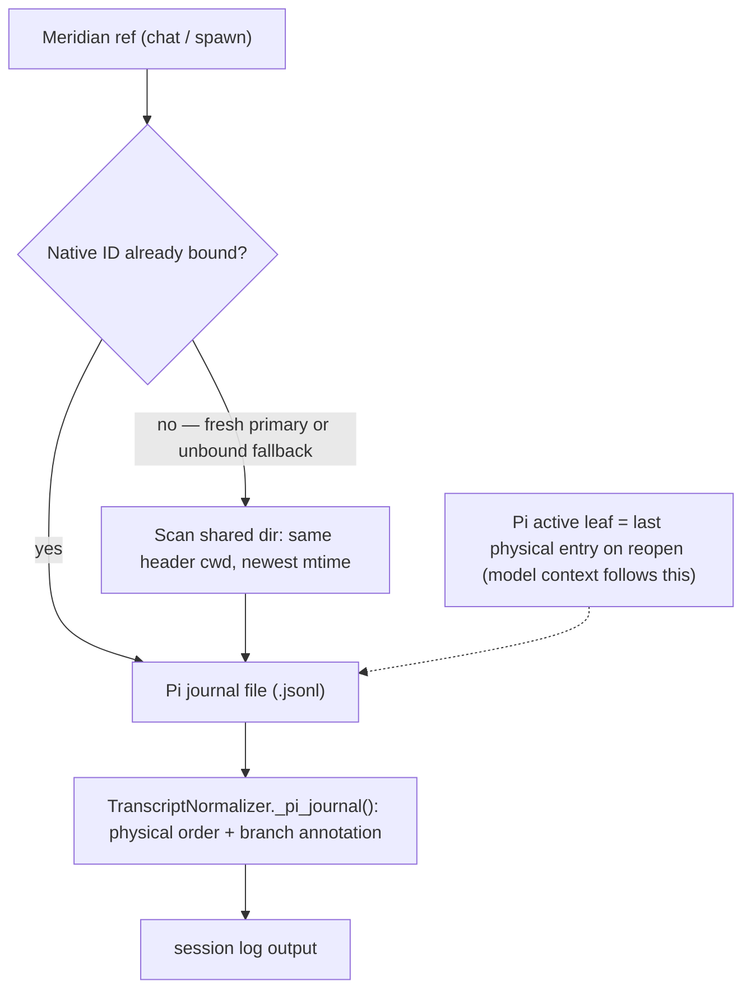

# Pi Native Sessions: Identity and Readback

Two properties of Pi's session store shape every Meridian operation that touches
a Pi conversation, and Meridian's current handling of both is heuristic:

1. A *fresh* Pi primary has no pre-assigned native identity, so Meridian must
   discover which journal on disk belongs to it. Because primaries share one
   flat, cwd-tagged directory, discovery can bind the wrong journal.
2. A Pi journal is an append-only **tree**, not a linear transcript, and its
   physical order is not a single conversation. Meridian's readback renders
   physical order, so it can show branches that were never on the active
   conversation.

## Store layout

- Session root resolution (`src/meridian/lib/harness/pi_paths.py`):
  `PI_CODING_AGENT_SESSION_DIR` override, else `PI_CODING_AGENT_DIR/sessions`,
  else the shared default `~/.meridian/meridian-pi/sessions`.
- **Fresh primary launches resolve to the shared default root** — they are not
  given a session-scoped directory. A resumed/forked primary uses the source's
  explicit directory. Spawned RPC sessions are separated per spawn. So
  concurrently launched fresh primaries in one project all write journals into
  the same directory.
- A journal's first line is a `session` header carrying `id`, `version`, `cwd`,
  and a timestamp; every later entry carries `id` and `parentId`. Meridian
  treats versions 1–3 as renderable.

## Identity acquisition

- Fresh primary: no native ID is pre-seeded, and Pi's TUI emits no session id
  Meridian can read directly, so at finalization
  `PiAdapter.observe_session_id()` falls through to `detect_primary_session_id()`.
  That scans the shared directory, keeps journal headers whose `cwd` matches the
  launch, drops files older than launch-start−2s, removes an expected ID if one
  was supplied, and returns the **newest remaining candidate**
  (`src/meridian/lib/harness/extractors/pi.py`).
- The result is persisted as the launch's canonical native identity
  (`bind_harness_session_id()` in `src/meridian/lib/launch/session_scope.py`;
  observation path in `src/meridian/lib/launch/process/runner.py`). A fresh
  primary has no prior id to conflict with, so the discovered value binds.
- Resume/continue: `--session <expected-id>` is authoritative. Discovery's
  expected-ID filter only excludes one candidate; it does not verify the chosen
  file is the expected one.
- Recovery and presentation reuse the same detection:
  `src/meridian/lib/ops/reference_recovery.py` surfaces it as
  `DETECTED_UNVERIFIED`, and `src/meridian/lib/ops/session_target.py` re-runs it
  for an unbound primary on the shared root.
  [session-reference-resolution.md](../decisions/session-reference-resolution.md)
  already declares `DETECTED_UNVERIFIED` non-authoritative for
  `--continue`/`--fork`.

### Known-fragile: concurrent same-cwd collision

Candidates are ranked by mtime across one shared directory, and only the header
`cwd` discriminates. A longer-running same-cwd session that writes after the
target's last write becomes the newest candidate and can be selected for the
target. When that happens at finalization, the wrong native ID is persisted as
canonical, and a later resume loads the other conversation — real model-context
contamination, not a display artifact. A second collision path (discovery
selecting a concurrent sibling's freshly created file) is refused by the
startup-identity validator in `src/meridian/lib/state/session_store.py` before
persistence.

Because an unbound primary's readback identity is recomputed from filesystem
recency, the same chat reference can resolve to different journals over time as
unrelated sessions write. **A persisted Pi `harness_session_id` records what
discovery returned when it ran; it is not proof of a correct association.**

## Journal topology and readback

Pi appends create a child of the process's current leaf; branching moves that
in-memory leaf. No leaf event is persisted. Pi rebuilds the leaf on file load as
the **last physical entry**, and model context is the root-to-leaf path from
that leaf.

Meridian's `TranscriptNormalizer._pi_journal()`
(`src/meridian/lib/harness/transcript.py`) instead walks physical file order,
tracks the previous entry ID, and inserts a "parent changed; continuing a
different branch" annotation when it detects divergence. It does not project the
active root-to-leaf ancestry, so entries from abandoned sibling branches render
inline next to unrelated turns.
`tests/unit/harness/test_transcript_parser.py` pins this flattening behavior.

The rendered transcript can therefore show messages that were never on the
active branch. Whether a given flattened message was ever sent to a model is a
separate question: model context follows Pi's leaf branch, not the flattened
view.

## Disposition

Both behaviors are current, confirmed, and known-fragile. A correction is
unresolved — no source change has been approved, and this page does not
prescribe one. When the identity-binding or branch-projection behavior changes,
update this page rather than layering a fix on top.

## Related Pages

- [claude-session-isolation.md](claude-session-isolation.md) — same shared-store / concurrent-bleed class, and the isolated-overlay remedy Claude uses
- [../codebase/session-operations.md](../codebase/session-operations.md) — transcript source resolution; presentation-vs-capture separation for OpenCode
- [../codebase/session-log-rendering.md](../codebase/session-log-rendering.md) — normalization and rendering pipeline
- [../codebase/harness-adapters.md](../codebase/harness-adapters.md) — Pi dual launch path and session-dir isolation
- [../architecture/state-system/session-state.md](../architecture/state-system/session-state.md) — session authority and native capture preparation
- [../decisions/session-reference-resolution.md](../decisions/session-reference-resolution.md) — recovery provenance levels, including `DETECTED_UNVERIFIED`
- [pi-lifecycle.md](pi-lifecycle.md) — Pi spawned-session lifecycle and quiescence

**Provenance:** `work:investigate-pi-model-selection-for-luna`; `spawn:p6615`.
