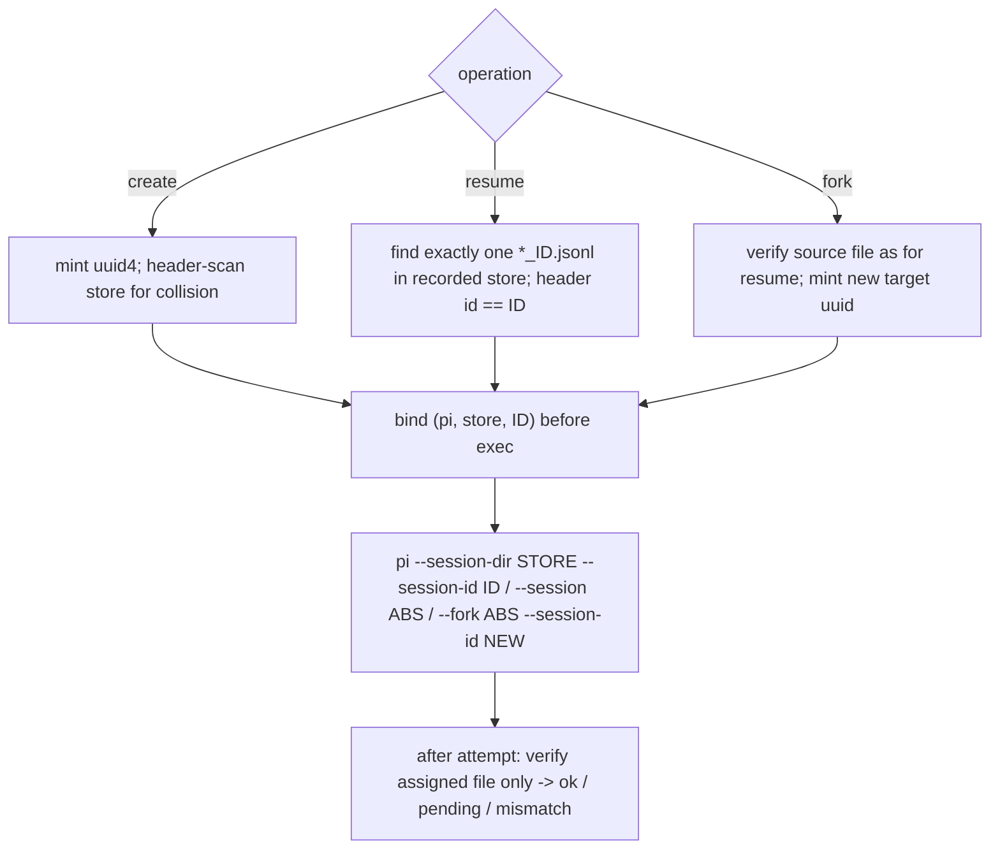

# Pi Native Sessions: Identity and Readback

Pi stores each conversation as one JSONL journal. Meridian handles two things about
those journals differently:

1. **Identity is exact.** Meridian decides the native ID and store before exec, emits
   Pi's exact-target flags, and verifies only that target afterward. It never selects
   a journal by cwd, mtime, or recency. This is implemented on
   `fix/native-session-wrapper` (not yet merged); clean `main` still discovers fresh
   primaries from disk.
2. **Readback is still physical-order.** A Pi journal is an append-only *tree*, and
   Meridian's renderer still flattens it. The fix (native readers on the reopen
   lineage) is phase 3 of the [identity decision](../decisions/native-session-identity.md)
   and has not started.

## Store layout

- A journal is `<store>/<ISO-timestamp>_<id>.jsonl`. Its first line is a `session`
  header with `id`, `version`, `cwd`, a timestamp, and, on forks, `parentSession`
  (the parent's path). Later entries carry `id` and `parentId`. Meridian renders
  versions 1–3.
- Root resolution (`harness/pi_paths.py`): `PI_CODING_AGENT_SESSION_DIR`, else
  `PI_CODING_AGENT_DIR/sessions`, else `~/.meridian/meridian-pi/sessions`.
- Store per operation: a **primary create or fork** uses the flat shared root, and a
  **spawned create or fork** uses a spawn-scoped subdirectory. A **resume** uses the
  verified source file's directory. The store is resolved once, in
  `PiAdapter.finalize_native_identity()`. It is written to the child env *and* emitted
  as `--session-dir`, and it is recorded in the chat's native key. Prelaunch and RPC
  startup no longer rescope or rewrite it.
- A tracked source with no recorded store refuses (`native_transcript_missing`). Pi
  stores are never borrowed from primary or owner metadata.

## Pi 0.87.1 behavior Meridian relies on

These were verified against installed Pi 0.87.1 source (`dist/main.js`,
`dist/core/session-manager.js`), not against a running binary.

- **`--session <arg>`**: an arg containing `/` or ending `.jsonl` is used as a path
  as-is, with no ID, prefix, or global search. If the file is **missing or empty at
  open, Pi mints a new random ID at that path**, and a replaced valid header selects
  the replacement's ID. So Meridian's resume preflight is strict: missing, empty,
  unreadable, ambiguous, or header-mismatched sources refuse. Meridian also requires a
  valid first physical line, which is stricter than Pi's tolerance for a malformed
  leading line.
- **`--session-id <id>`**: Pi finds an existing session by scanning **every `.jsonl`
  header** in the store (the basename is irrelevant) and reopens it. Otherwise it
  creates a new session with that ID. Meridian's collision check therefore also reads
  every header, not filenames.
- **`--fork <path> --session-id <new>`**: Pi rejects an existing local header ID, then
  writes the new file with `flag: "wx"`. `wx` is exclusive by **path**, not by ID. So
  Meridian verifies ancestry (`parentSession` == source path) separately from the new
  ID.
- **Persistence is lazy for create**: no file exists until the first assistant message.
  A fork writes its header and copied history immediately. A bound create with no file
  is `pending`, and resuming it fails `missing`, so an unmaterialized create is never
  treated as resumable.
- **Env vs flag**: Pi reads `PI_CODING_AGENT_SESSION_DIR` (the name is built
  dynamically in source, so a literal grep misses it), and `--session-dir` overrides
  it. Meridian sets both from the same value.
- **Unreadable sibling headers**: Pi's own discovery treats them as non-sessions.
  Meridian's mint warns (`pi_store_unreadable_header`) and skips them. Otherwise one
  torn journal in the shared primary store would block every fresh launch. Resume/fork
  **source** resolution and post-exit verification stay fail-closed.

## Meridian's identity operations

Implementation: `harness/pi_identity.py` (header read, mint, exact resolve, verify,
argv projection) and `harness/pi.py` (plan/finalize/verify hooks). The TUI primary and
RPC spawn projections share the same argv.

- **Passthrough refusal.** Raw `--session`, `-c/--continue`, `-r/--resume`,
  `--session-dir`, `--session-id`, `--fork`, and `--no-session` (including `=value`
  forms) are refused. They would override managed identity, store, or persistence.
- **Exit verification.** The primary runner's `observe_primary_session_id` and the
  streaming runner's `verify_native_identity` check only the assigned file. A create
  may still be pending. A resume must be the same absolute path. A fork's header must
  carry the new ID and `parentSession` equal to the source path. A contradiction fails
  the attempt without touching any binding. Unrelated or newer files are ignored.
- **Owned signals.** RPC stdout session IDs and extractor event IDs are observations
  that confirm the plan or trip `entry_mismatch`.
- **Cost.** Mint is O(entries + first-line reads) in one store. Primary preview and
  execution may each scan. Exact resolve enumerates one directory and reads one
  header, and fork also reads the parent header. There is no recursive scan and no
  byte cap on header reads. This is not benchmarked.
- **Meridian writes no Pi journal.**

## Limits

- **External replacement after preflight.** If the verified file is deleted or
  replaced before Pi opens it, Pi may start a different ID and input may reach the
  model before Meridian detects it. Detection fails the attempt, and the source chat is
  never repointed.
- **In-TUI switches are not yet observed.** A `/resume` or `/new` inside the TUI moves
  the user to another conversation. Until phase 2 wires the session-boundary
  extension, Meridian cannot see this. The chat stays at its entry key, which is
  correct under the rule, but the conversation the user ended on gets no chat. A
  graceful quit's `session_shutdown` will map the final key. Shutdown-for-switch is
  not exit, and a missing quit event (SIGKILL, extension not loaded) stays
  `unresolved`.
- **Model selection on reopen** is a separate Pi setting and never affects identity.

## Journal topology and readback

When Pi appends an entry, it becomes a child of the process's current leaf, and
branching moves that in-memory leaf. No leaf event is persisted. When Pi loads a file,
the leaf is the **last physical entry**, and model context is the root-to-leaf path.

Meridian's `TranscriptNormalizer._pi_journal()` (`harness/transcript.py`) walks
physical order and inserts a "parent changed; continuing a different branch" note on
divergence. It does not project the active ancestry, so abandoned sibling branches
render inline, and `tests/unit/harness/test_transcript_parser.py` pins this. A
rendered message may never have been on the active branch. Model context follows Pi's
leaf, not the flattened view. Phase 3 replaces this with the reopen-lineage projector
salvaged from the comparison branch.

## Related Pages

- [native-session-binding.md](native-session-binding.md): cross-harness plan/bind/verify seams
- [../decisions/native-session-identity.md](../decisions/native-session-identity.md): the rule, rejected alternatives, phases
- [claude-session-isolation.md](claude-session-isolation.md): Claude's shared-store problem and isolated-overlay remedy
- [../codebase/session-operations.md](../codebase/session-operations.md): transcript source resolution
- [../codebase/session-log-rendering.md](../codebase/session-log-rendering.md): normalization and rendering pipeline
- [../codebase/harness-adapters.md](../codebase/harness-adapters.md): Pi dual launch path
- [pi-lifecycle.md](pi-lifecycle.md): Pi spawned-session lifecycle and quiescence

**Provenance:** incident `spawn:p6615` (`work:investigate-pi-model-selection-for-luna`);
`work:native-harness-session-identity` (`DIVERGENCE/exact-locator-entry.md`, design
review `spawn:p7037`, Pi lane `spawn:p7040`, review `spawn:p7045`, integration
`spawn:p7048`).
