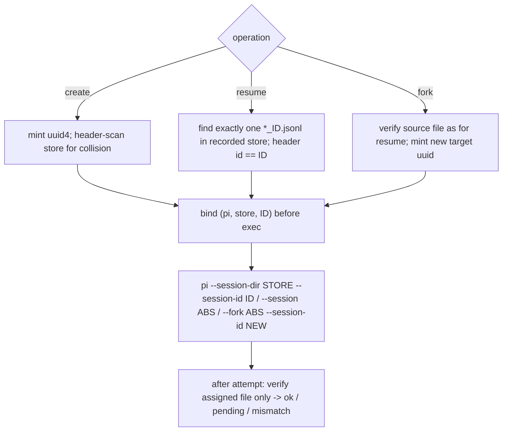

# Pi Native Sessions: Identity and Readback

Pi stores each conversation as one JSONL journal. This page owns Pi-specific journal
behavior, exit observation, and readback. The cross-harness identity rule is in the
[native session identity decision](../decisions/native-session-identity.md), and the
shared plan/bind/verify/boundary mechanics are in
[native session binding](native-session-binding.md). Exact identity and exit
observation are implemented on `fix/native-session-wrapper` (draft PR #520), not on
`main`.
Clean `main` still discovers fresh primaries from disk. Readback is still
physical-order: Pi journals are append-only *trees*, and Meridian's renderer still
flattens them. Native readers on the reopen lineage have not started.

## Store layout

- A journal is `<store>/<ISO-timestamp>_<id>.jsonl`. Its first line is a `session`
  header with `id`, `version`, `cwd`, a timestamp, and, on forks, `parentSession`
  (the parent's path). Later entries carry `id` and `parentId`. Meridian renders
  versions 1–3.
- Root resolution (`harness/pi_paths.py`): `PI_CODING_AGENT_SESSION_DIR`, else
  `PI_CODING_AGENT_DIR/sessions`, else `~/.meridian/meridian-pi/sessions`.
- Store per operation: a **primary create or fork** uses the flat shared root, and a
  **spawned create or fork** uses a spawn-scoped subdirectory. A **resume** uses the
  recorded source store (`SessionRequest.source_native_store`). The store is resolved once, in
  `PiAdapter.finalize_native_identity()`. It is written to the child env *and* emitted
  as `--session-dir`, and it is recorded in the chat's native key. Prelaunch and RPC
  startup no longer rescope or rewrite it.
- A tracked source with no recorded store refuses as
  `NativeSessionUnavailable(unbound)`. Pi stores are never borrowed from primary or
  owner metadata.
- **Agent dir and credentials.** The adapter's `env_overrides()` sets the child's
  `PI_CODING_AGENT_DIR` to `<HOME>/.pi/agent` (`pi_agent_dir_env_override()` resolves
  from `HOME` and ignores a caller-set `PI_CODING_AGENT_DIR`). Pi reads `auth.json`
  and settings from that directory, so under Meridian credentials come from
  `<HOME>/.pi/agent/auth.json`. The first isolated real-Pi run placed auth at
  `$PI_CODING_AGENT_DIR/auth.json`, got `No API key found for deepseek`, and spent no
  turn; Pi had created an empty `auth.json` under the isolated `HOME` instead.

## Pi 0.87.1 behavior Meridian relies on

Verified against installed Pi 0.87.1 source (`dist/main.js`,
`dist/core/session-manager.js`, `dist/core/agent-session-runtime.js`). Items marked
*(runtime)* were also observed running the real binary (temporary store, `--offline`,
`--no-tools`, isolated `HOME`/`PI_CODING_AGENT_DIR`): zero-turn lifecycle probes, and
one Meridian spawn with a single authorized model turn.

- **`--session <arg>`**: an arg containing `/` or ending `.jsonl` is used as a path
  as-is, with no ID, prefix, or global search. If the file is **missing or empty at
  open, Pi mints a new random ID at that path**, and a replaced valid header selects
  the replacement's ID. So Meridian's resume preflight is strict: missing, empty,
  unreadable, ambiguous, or header-mismatched sources refuse. Meridian also requires a
  valid first physical line, which is stricter than Pi's tolerance for a malformed
  leading line.
- **`--session-id <id>`**: Pi finds an existing session by scanning **every `.jsonl`
  header** in the store (the basename is irrelevant) and reopens it. Otherwise it
  creates a new session with that ID. Meridian's collision check therefore also reads
  every header, not filenames.
- **`--fork <path> --session-id <new>`**: Pi rejects an existing local header ID, then
  writes the new file with `flag: "wx"`. `wx` is exclusive by **path**, not by ID. So
  Meridian verifies ancestry (`parentSession` == source path) separately from the new
  ID.
- **Persistence is lazy for create** *(runtime)*: `newSession()` builds the header
  and path in memory, and `_persist()` defers every entry until an assistant message
  exists. RPC `set_session_name` and `set_model` only enqueue entries; neither writes
  the file. RPC `new_session` allocates an in-memory session and does not write
  either. The CLI `--fork <path>` that Meridian emits writes its header and copied
  history immediately (source reading), but needs a persisted source. In-session RPC
  `fork` and `new_session` on a persisted source reported success and a new path, yet
  left no file after a zero-turn exit *(runtime)*. A bound create with no file is
  `pending`, and resuming it fails `missing`, so an unmaterialized create is never
  treated as resumable. It also means a real create/continue/fork workflow cannot be
  exercised without model turns.
- **Create under Meridian** *(runtime, one turn)*: the native file
  `<store>/p1/<timestamp>_<uuid>.jsonl` carried a header `id` equal to the UUID
  Meridian assigned to c1, and `session log c1` / `--raw` printed exactly the prompt
  and reply. After the file was deleted, `session log c1` and
  `spawn --continue c1 --dry-run` both refused `native_transcript_missing` before Pi
  started. Cost: 1,344 input / 2 output tokens, $0.0004.
- **Env vs flag**: Pi reads `PI_CODING_AGENT_SESSION_DIR` (the name is built
  dynamically in source, so a literal grep misses it), and `--session-dir` overrides
  it. Meridian sets both from the same value.
- **Unreadable sibling headers**: Pi's own discovery treats them as non-sessions.
  Meridian's mint warns (`pi_store_unreadable_header`) and skips them. Otherwise one
  torn journal in the shared primary store would block every fresh launch. Resume/fork
  **source** resolution and post-exit verification stay fail-closed.

## Meridian's identity operations

Implementation: `harness/pi_identity.py` (header read, mint, exact resolve, verify,
argv projection) and `harness/pi.py` (plan/finalize/verify hooks). The TUI primary and
RPC spawn projections share the same argv.

- **Passthrough refusal.** Raw `--session`, `-c/--continue`, `-r/--resume`,
  `--session-dir`, `--session-id`, `--fork`, and `--no-session` (including `=value`
  forms) are refused. They would override managed identity, store, or persistence.
- **Post-attempt target check.** `verify_native_identity` checks only the assigned
  file. This is about the entry target; what the user ended on is
  [exit observation](#exit-observation). A create
  may still be pending. A resume must be the same absolute path. A fork's header must
  carry the new ID and `parentSession` equal to the source path. A contradiction fails
  the attempt without touching any binding. Unrelated or newer files are ignored.
- **Owned signals.** RPC stdout session IDs and extractor event IDs are observations
  that confirm the plan or trip `entry_mismatch`.
- **Cost.** Mint is O(entries + first-line reads) in one store. Primary preview and
  execution may each scan. Exact resolve enumerates one directory and reads one
  header, and fork also reads the parent header. There is no recursive scan and no
  byte cap on header reads. This is not benchmarked.
- **Meridian writes no Pi journal.**

## Exit observation

Managed TUI and RPC projections always load Meridian's `session-boundary` extension
(`pi_runtime/extensions/session-boundary`). The extension publishes one small record,
and `harness/pi_boundary.py:read_boundary` reads it once after the process exits.

- **Capability.** Pi prelaunch generates the record path
  (`<runtime>/spawns/<pN>/pi-session-boundary.json`) and a 32-byte hex nonce, passed
  as `_MERIDIAN_PI_SESSION_BOUNDARY_PATH` / `_MERIDIAN_PI_SESSION_BOUNDARY_NONCE`.
  The extension deletes both from its environment on load. The record carries the
  nonce and the publishing process's PID. The reader checks both against the
  launch nonce and the actual child PID, not the launcher's.
- **Record.** `v`, `launch_nonce`, `pid`, `revision`, `initial` (first
  `session_start` only), `current` (latest `session_start`), `last_event`, `quit`,
  `invalid_reason`. There is no event itinerary. Any start, before-switch, or
  non-quit shutdown clears `quit`. IDs ≤256 chars, paths ≤4096, whole record ≤16 KiB.
  Each publication is an exclusive 0600 temp write, fsync, and rename. The extension
  writes nothing to stdout or to any native journal.
- **Reading.** Missing, oversized, corrupt, wrong-version, wrong-nonce, wrong-PID, or
  poisoned records yield no observation. `initial` is compared with the entry key
  (mismatch fails the run; see
  [runner order](native-session-binding.md#runner-order)). Exit is `quit` only when
  `last_event` is `session_shutdown` with reason `quit`.
- **When.** Pi's shutdown hook runs only as the process shuts down, which can be
  seconds after the RPC turn completes and Meridian publishes terminal status. The
  record is therefore read after the runner has joined the child's teardown. The
  first wiring read it right after the turn, got the pre-quit revision, and left the
  real-Pi run `exit unresolved`; see
  [runner order](native-session-binding.md#runner-order).

**What real Pi 0.87.1 emits.** Hooks get a per-invocation `ctx`, and Pi invalidates
extension contexts on session replacement (`newSession`, `fork`, `switchSession`,
`reload`). Any access then throws "This extension ctx is stale after session
replacement or reload". On RPC `new_session` the observed order is
`session_before_switch(new)` → `session_shutdown(new)` → `session_start(new)` → at exit
`session_shutdown(quit)` for the new session. If stdin closes while the replacement
is still settling, the old runner's `session_shutdown(quit)` fires with an
invalidated ctx, and reading `sessionManager` throws.

The first extension treated that throw as an identity fault and poisoned the record.
Every switched run that hit the race lost its exit. The Pi API audit and the fake
lifecycle fixture both missed it, because the fixture replayed event order without
invalidating anything. A zero-turn real-Pi probe found it. The rule now:
documented ctx invalidation is not an identity conflict. A stale-ctx shutdown is
recorded without identity. It clears `quit`, so exit is `unresolved`, and nothing is
poisoned. Poison is reserved for inconsistent data. The record format moved to
`v: 2`; v1 records are rejected. When the replacement settles before exit, real Pi
verifies the new session as exit on stdin EOF and on SIGTERM; SIGKILL publishes no
final shutdown. Detection keys on Pi's error-text prefix
`This extension ctx is stale after session replacement or reload.` If a Pi upgrade
rewords it, the case falls back to poison, which fails closed. Requalify this when
upgrading Pi (`pi_runtime/README.md` records the same contract).

**Cost** (real Pi, zero turns, local smoke timings): the v2 bundle is 5,458 bytes;
records are 445–661 bytes; one fsync per publication, with no event journal. Added
time to RPC-ready measured +14.9 ms (medians of three, 214 → 229 ms) on the v2 bundle
and +36 ms (227 → 263 ms) on the v1 bundle; treat both as orders of magnitude, not
guarantees. The bundle must be built before `uv build`, as CI and
`scripts/preflight.sh full` do. A wheel without it raises
`PiExtensionProjectionError` at projection.

## Limits

- **External replacement after preflight.** If the verified file is deleted or
  replaced before Pi opens it, Pi may start a different ID and input may reach the
  model before Meridian detects it. Detection fails the attempt, and the source chat is
  never repointed.
- **Exit after a switch is only as good as the final quit.** A `/resume` or `/new`
  is observed, but exit is verified only by a final quit with a readable identity.
  SIGKILL, a missing bundle, or the replacement/EOF race below leave it `unresolved`.
  The entry chat is unaffected either way.
- **Model selection on reopen** is a separate Pi setting and never affects identity.

## Journal topology and readback

When Pi appends an entry, it becomes a child of the process's current leaf, and
branching moves that in-memory leaf. No leaf event is persisted. When Pi loads a file,
the leaf is the **last physical entry**, and model context is the root-to-leaf path.

Meridian's `TranscriptNormalizer._pi_journal()` (`harness/transcript.py`) walks
physical order and inserts a "parent changed; continuing a different branch" note on
divergence. It does not project the active ancestry, so abandoned sibling branches
render inline, and `tests/unit/harness/test_transcript_parser.py` pins this. A
rendered message may never have been on the active branch. Model context follows Pi's
leaf, not the flattened view. Phase 3 replaces this with the reopen-lineage projector
salvaged from the comparison branch.

## Related Pages

- [native-session-binding.md](native-session-binding.md): cross-harness plan/bind/verify seams
- [../decisions/native-session-identity.md](../decisions/native-session-identity.md): the rule, rejected alternatives, phases
- [claude-native-sessions.md](claude-native-sessions.md): Claude's shared-store problem, exact source seeding, trampoline exit
- [../codebase/session-operations.md](../codebase/session-operations.md): transcript source resolution
- [../codebase/session-log-rendering.md](../codebase/session-log-rendering.md): normalization and rendering pipeline
- [../codebase/harness-adapters.md](../codebase/harness-adapters.md): Pi dual launch path
- [pi-lifecycle.md](pi-lifecycle.md): Pi spawned-session lifecycle and quiescence

**Provenance:** incident `spawn:p6615` (`work:investigate-pi-model-selection-for-luna`);
`work:native-harness-session-identity` (`DIVERGENCE/exact-locator-entry.md`, design
review `spawn:p7037`, Pi lane `spawn:p7040`, review `spawn:p7045`, integration
`spawn:p7048`; exit lane `spawn:p7054`, review `spawn:p7059`, API audit
`spawn:p7060`, fixes `spawn:p7061`, `spawn:p7067`, `spawn:p7076`; real-Pi zero-turn
probe `spawn:p7065`, `evidence/lane-q-report.md`, `evidence/lane-d-fix2/`; one-turn
probes `spawn:p7073` (`evidence/lane-q2-report.md`) and `spawn:p7075`
(`evidence/lane-q3-report.md`)).
