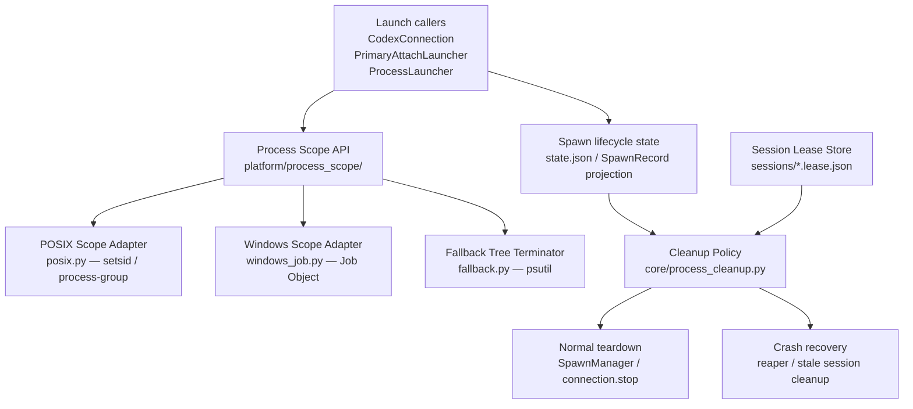

# Architecture: Process-Scope Ownership and Cleanup

Process-scope ownership is Meridian's mechanism for ensuring that every subprocess tree
it starts is reclaimed on spawn completion, cancel, or crash — without killing unrelated
managed-primary sessions that are still serving an active frontend lease.

Related pages:
- [architecture/managed-primary-lifecycle.md](managed-primary-lifecycle.md) — managed-primary
  spawn_owned vs session_owned ownership split
- [decisions/launch.md](../decisions/launch.md#d-process-scope-ownership) — why Option D was
  chosen over A/B/C
- [concepts/spawn-lifecycle.md](../concepts/spawn-lifecycle.md) — generic spawn status machine
  and reaper model

---

## Problem

Meridian leaves harness-owned subprocesses alive after spawn completion, cancel, or
launcher crash. Two concrete failure modes drove the design:

1. `codex app-server` processes survive after streaming spawn success, failure, or cancel.
2. Tool subprocesses (e.g. pytest xdist workers launched by a Bash tool) reparent to PID 1
   after the harness exits and are never reaped.

Single-PID `SIGTERM` to `worker_pid` is insufficient when intermediates have exited and
descendants have reparented. A containment model is required.

---

## Design Decision: Option D — Durable Process-Scope Ownership

Four options were evaluated. Option D was adopted; the rejected options remain partially
useful as sub-components.

### Option A — Process-group / session-owned launches (POSIX-only)

Launch every execution in its own POSIX session; kill the group on teardown and reaper.

**Kept:** POSIX group termination is used as the primary POSIX mechanism inside Option D.
**Rejected as the sole design:** `CREATE_NEW_PROCESS_GROUP` on Windows is for console
signal routing, not tree reclamation. Child tools can still survive root termination.
Managed-primary preservation cannot be expressed with group semantics alone.

### Option B — Explicit descendant tracking via `psutil` tree kill

Discover `children(recursive=True)` and terminate/kill the tree at teardown and reaper time.

**Kept:** `psutil` tree kill is the degraded fallback inside Option D for legacy spawns,
corrupt metadata, and failed Job Object assignment.
**Rejected as primary mechanism:** Snapshot-based — races if an intermediate exits before
the snapshot, dropping its descendants from the tree. No positive containment boundary;
crash recovery depends on rediscovery.

### Option C — Harness-specific cleanup only

Let each harness adapter own subprocess cleanup.

**Rejected:** Misses generic tool-child leaks; duplicates policy across Claude/Codex/OpenCode;
violates policy/mechanism separation. Reaper remains inconsistent.

### Option D — Durable process-scope ownership (adopted)

Introduce a shared process containment layer with OS-specific mechanisms, durable
ownership metadata, and lease-aware cleanup policy. This gives normal teardown and the
reaper the same mechanism seam, and turns managed-primary preservation from an implicit
exception into an explicit ownership class.

---

## Module Boundaries



| Module | Responsibility |
|---|---|
| `lib/platform/process_scope/` | **Mechanism only** — how to launch in a new scope and terminate the tree. Four sub-modules: `base.py` (shared types), `posix.py` (setsid/process-group), `windows_job.py` (Job Object), `fallback.py` (psutil tree kill) |
| `lib/core/process_cleanup.py` | **Policy only** — whether to terminate a scope. Consults spawn record, session lease store, and managed-primary metadata. Never decides how. |
| `lib/state/process_scope_projection.py` | **Persistence** — read/write scope ownership events through the existing spawn lifecycle state stream. Operations: `record_scope`, `mark_scope_released`, `read_scopes`, tolerant read for legacy spawns. |

The mechanism/policy split is load-bearing. Adding a new platform is one adapter file
in `platform/process_scope/`. Changing cleanup rules is one edit to `core/process_cleanup.py`.
Neither needs to touch the other.

---

## Scope Ownership Classes

Every process scope is tagged with one of two ownership classes at launch time:

| Class | Meaning | Cleanup trigger |
|---|---|---|
| `spawn_owned` | The scope lives and dies with its owning spawn | Terminate when the spawn terminates, times out, is cancelled, or the owning runner disappears |
| `session_owned` | The scope is preserved while an associated session lease is active | Preserve while lease exists; reclaim when the lease disappears or explicit session shutdown runs |

Managed-primary sessions split ownership:

- **`launcher`** — `spawn_owned`. Disposable Meridian wrapper process.
- **`backend`** and **`tui`** — `session_owned`. Preserved while the frontend lease is active.

This makes preservation an explicit durable policy, not an absence of cleanup rules.

---

## Durable State Shape

Process-scope ownership is projected into each spawn's `state.json` via the existing
lifecycle event stream. No second authoritative sidecar (e.g. `process-scopes.json`) is
introduced for ordinary child-spawn cleanup.

```json
{
  "process_scopes": [
    {
      "scope_id": "backend",
      "owner_policy": "spawn_owned",
      "owner_id": "<spawn_id>",
      "role": "harness_backend",
      "containment": "posix_pgid",
      "root_pid": 123,
      "root_created_at_epoch": 1778290000.123,
      "pgid": 123,
      "job_name": null,
      "degraded_reason": null,
      "released_at": null
    }
  ]
}
```

Key fields:

- **`containment`** — `posix_pgid | windows_job | pid_tree_fallback`. Records which
  mechanism was actually established (not which was attempted).
- **`root_created_at_epoch`** — required for PID-reuse guarding. Before any signal,
  the current process birth-time is compared against this value. If the PID was reused,
  the kill is skipped.
- **`degraded_reason`** — non-null when containment setup failed and the fallback was
  used instead (e.g. Job Object assignment denied by parent job).
- **`released_at`** — set when the scope is cleanly torn down during normal teardown,
  so the reaper doesn't attempt a second kill.

Managed-primary lease and session facts stay in `primary_meta.json` and session leases.
The scope record carries mechanism facts only — no `chat_id`, no TUI semantics, no
frontend lease rules.

---

## Platform Mechanisms

### POSIX: setsid / process-group

Harness root processes are launched in a new session (`setsid()`) or process group.
On teardown, `os.killpg(pgid, SIGTERM)` kills the entire group. If descendants survive
the grace period, `os.killpg(pgid, SIGKILL)` follows.

Group kill is strictly stronger than single-PID kill: descendants that have reparented
to PID 1 are still in the original group and receive the signal.

### Windows: Job Object

Spawn-owned Windows scopes use a Job Object with `JOB_OBJECT_LIMIT_KILL_ON_JOB_CLOSE`.
This provides crash-only cleanup: if the owning Meridian process dies without explicitly
terminating the job, the kernel closes the job handle and kills all assigned processes.

`CREATE_NEW_PROCESS_GROUP` is kept only where console signal semantics are needed. It
is not treated as an ownership boundary.

If Job Object assignment fails (e.g. the process is already in a non-nested job in an
older Windows environment), `degraded_reason` is set and the fallback activates.

### Degraded fallback: psutil tree kill

When containment setup fails or scope metadata is absent (legacy spawns), cleanup falls
back to `psutil.Process(root_pid).children(recursive=True)` + terminate/kill sequence.
The snapshot-race limitation applies (see Option B rejection above), but this is
acceptable for the fallback path since it is better than no cleanup.

---

## Interface Contract

### Cleanup entry points: async vs sync

Two entry points dispatch to the same platform logic. They are mirrors of each other;
callers pick based on their execution context.

| Entry point | Who uses it | Where |
|---|---|---|
| `ScopedProcessHandle.terminate(grace_seconds)` | Async callers: `SpawnManager`, `connection.stop` | `platform/process_scope/base.py` |
| `terminate_scope_sync(scope, grace_seconds, reason)` | Sync callers: reaper, cancel path, session-exit | `platform/process_scope/__init__.py` |

Both are **exception-safe** — cleanup paths must not propagate. Both dispatch to the
same POSIX / Windows / fallback adapters based on `scope.containment`. Both return a
`CleanupResult`.

`terminate_scope_sync()` is a public function in the platform layer (not a helper in
`core/`). This keeps mechanism co-located with the adapters it dispatches to: callers
import from the mechanism layer directly, not from the policy layer that wraps it.

### `ScopedProcessHandle`

Returned by launchers that participate in the scope system.

```
ScopedProcessHandle:
  process / pid
  snapshot: ProcessScopeSnapshot
  terminate(grace_seconds) -> CleanupResult
```

The platform adapters suppress `NoSuchProcess`, `AccessDenied`, and equivalent Windows
errors so exception-safety is handled at the mechanism layer, not at each call site.

Scope snapshots must be **persisted before `connection.stop()` is called**, not after.
If the launcher crashes between `stop()` and snapshot persistence, no scope record
exists and the reaper falls back to the degraded path. Persisting first ensures that
even a crash during teardown leaves recoverable state.

### `ProcessCleanupPolicy`

Decides **whether** to terminate, never **how**. Inputs: spawn record + embedded scope
snapshots, session lease state, managed-primary metadata when present.

Outputs:

| Decision | Meaning |
|---|---|
| `terminate_now` | Scope is spawn-owned and the owner is dead or being cancelled |
| `preserve_active_lease` | Scope is session-owned, process is alive, and a valid lease exists |
| `finalize_only` | Scope is already gone (process exited naturally / auto-cleaned) |
| `fallback_pid_tree` | No scope snapshot available — use psutil tree kill against recorded worker PID |

`session_owned` scopes are not unconditionally preserved. If the root process has died
(PID not found, or birth-time mismatch indicating PID reuse), the scope is reclaimed
even though its policy is `session_owned`. Preserving a dead scope leaks the record
without protecting anything — the root is already gone.

---

## Cleanup Triggers

Three sync cleanup paths exist. All route through `terminate_scope_sync()`.

### Reaper

The reaper (`state/reaper.py`) runs on Meridian startup and periodically for stale
spawns. Consults scope projections before falling back to legacy PID termination:

1. Read the spawn's `state.json` scope projection.
2. For each `spawn_owned` scope whose owner is dead: call `terminate_scope_sync()`.
3. For `session_owned` scopes: check the lease store. Terminate only if the lease
   is absent or stale, and the root process is dead.
4. If scope projection is missing or corrupt: fall back to `worker_pid` / `runner_pid`
   termination (degraded path, not primary).

Raw `worker_pid` / `runner_pid` termination is a degraded fallback, not the primary
cleanup path.

### Cancel path (`signal_canceller.py`)

The cancel path manages scope cleanup inline — reads scope sidecars, calls
`terminate_scope_sync()`, marks scopes released. It does not delegate to
`core/process_cleanup.py`.

This is intentional: `signal_canceller.py` has a live event loop and uses
`asyncio.to_thread` for blocking calls. `core/process_cleanup.py` is sync-only and
called from the reaper. Keeping cancel self-contained preserves the
`signal_canceller → platform/ + state/` dependency direction without requiring an
upward dep on `core/`.

Legacy (pre-scope-metadata) spawns are handled by a fallback inside the cancel path:
use `runner_pid` + `terminate_tree_sync()`. Both paths are live — the fallback handles
the transition period and any corrupt/missing scope records.

### Session-exit reclamation

`reclaim_session_owned_scopes_for_chat(runtime_root, chat_id)` in
`core/process_cleanup.py` reclaims all unreleased `session_owned` scopes on spawns
belonging to a `chat_id`. Called from the `session_scope()` finally block, after
`stop_session()`, in a nested try/finally so it runs even if `stop_session()` raises.

Reclaims by `chat_id`, not `harness_session_id`. A single meridian session can span
multiple harness sessions (e.g., resume after compaction creates a new harness session
ID). Reclaiming by `harness_session_id` would miss scopes registered under earlier
harness session IDs.

---

## Known Gaps (Follow-up Items)

Detailed deferred-work notes live in [open-questions/process-scope.md](../open-questions/process-scope.md).
This page keeps only the architectural summary needed to understand the current
containment model.

- **PROC-004:** dead wrapper / live reparented child can escape group kill when
  the child starts a new process group before scope snapshot.
- **PROC-007:** metadata-only lifecycle spawns do not yet emit persistent scope
  snapshots, so the reaper still uses degraded `worker_pid` cleanup.

---

## Migration Phases (Summary)

| Phase | Exit gate |
|---|---|
| Phase 1: shared mechanism, no policy expansion | Normal completion/cancel/timeouts stop Codex app-server and tool-child trees on POSIX and Windows |
| Phase 2: durable scope store + reaper integration | Crash a runner; reaper converges to terminal state; no owned subtree survives |
| Phase 3: managed-primary ownership split | Launcher death with active lease preserves runtime; without lease reclaims runtime |
| Phase 4: simplification pass | Remove duplicated tree-kill helpers; narrow log messages to policy outcomes |

---

## Design Rationale Summary

The mechanism/policy/persistence split keeps each layer independently evolvable:
- A new OS uses one new platform adapter and zero policy edits.
- A new ownership class (e.g. workspace-owned) is one new enum value and one policy branch.
- A new state backend is one new projection module and zero adapter changes.

The durable-state-first discipline (record scope before stop, tolerant reads on the
reaper side) implements crash-only semantics for cleanup: a crashed launcher leaves
enough state that the reaper can recover correctly without any graceful-shutdown path.
