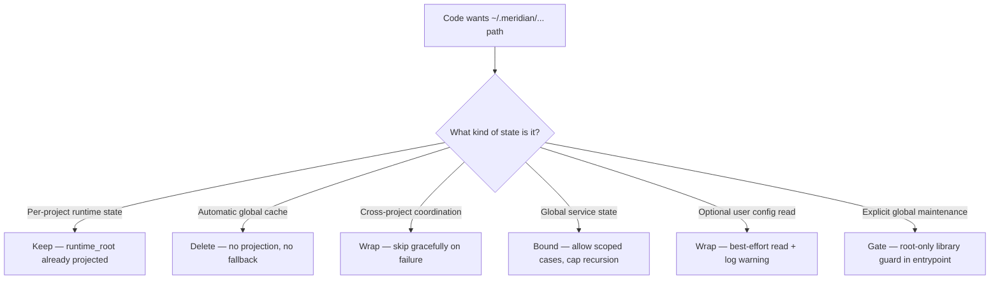

# Architecture: Sandbox Permission Projection

When Meridian spawns a child agent, it projects filesystem paths into the child's sandbox. This page covers the **projection policy** — what can be projected, what cannot, and how code that reaches for unprojected paths should behave.

Related: [startup/sandbox decisions](../decisions/startup-health-sandbox.md#sandbox-projection-policy) — rationale for the fixed projection constraint. [architecture/startup-pipeline.md](startup-pipeline.md) — how the startup pipeline handles per-project repairs in sandboxed contexts. [operations/health-checks.md](../operations/health-checks.md) — doctor tier split driven by sandbox constraints.

## Fixed Projection Constraint

Child sandboxes may receive:

- **Project runtime roots** — `~/.meridian/projects/<uuid>/` for the current project
- **Workspace/context roots** — work, kb, archive, strategy directories, configured git context clones
- **System temp** — platform temp directory

Child sandboxes **shall not** receive the whole `~/.meridian/` tree. The global user home is not projected. This is a fixed constraint, not a tunable.

The design question is therefore not "how do we make user home writable?" but "which global paths are actually valid in nested execution, and how should each class of path behave?"

## Path Classification Framework

| Class | Examples | Nested policy |
|---|---|---|
| Per-project runtime state | `~/.meridian/projects/<uuid>/...` | Already projected — no change |
| Repo/context state | work, kb, archive roots, context git clones | Already projected — no change |
| Automatic global cache | `doctor-cache.json`, background global scan | **Delete** — expensive automatic global work is wrong |
| Cheap per-project repairs | Stale session lock cleanup, orphan run reconciliation | **Keep** — daemon thread, current project root only |
| Cross-project coordination | Lock files serializing shared resources | **Wrap** — skip gracefully on `PermissionError` |
| Global service state | `chat-server.json`, `~/.meridian/chats/<id>/...` | **Bound** — nested chat is allowed below `max_depth`; scoped runtime roots deferred |
| Optional user config | `~/.meridian/config.toml` | **Wrap** — best-effort implicit read + structured log warning |
| Explicit global maintenance | `doctor --global`, prune/reaper-style scans | **Gate** — library-level guard before cross-project traversal |

## Governing Principle

**Do not do expensive things automatically.**

This principle drives the classification:

- Default startup must not launch background global maintenance to print a warning
- Cheap per-project repairs are acceptable on `PRIMARY_LAUNCH` paths if they touch only the projected runtime root
- `meridian doctor` without flags must stay cheap and per-project
- Cross-project cleanup is valid, but only when the user asks explicitly with `--global`

## Gap-by-Gap Behavior

### Gap 1: Doctor Cache (Deleted)

The old `doctor-cache.json` existed only to support a startup nag from a background global scan. The subsystem was deleted:

- `doctor_cache.py` module removed
- `maybe_start_background_doctor_scan()` removed — no background global scans at startup
- `consume_doctor_cache_warning()` removed — no cache-based warning display
- Cheap per-project repairs (stale session locks, orphan runs) are retained as a background daemon thread on `PRIMARY_LAUNCH`; they touch only the current project's runtime root

Users discover cross-project stale state by running `meridian doctor --global` explicitly.

### Gap 2: Chat State (Bounded Nested Access)

Chat is intentionally global service state. The original sandbox fix made chat root-only in nested execution; [chat backend D32](../decisions/chat-backend.md#d32) superseded that guard so delegated smoke/browser testers can launch real chat processes below the project `max_depth` cap.

Current behavior:

- Nested `meridian chat` launch and management subcommands are allowed while total spawn depth is below `max_depth`
- Chat state still lives in global user state (`chat-server.json`, `~/.meridian/chats/<id>/...`)
- `server.py` module-level `_runtime` uses an unconfigured sentinel that raises `RuntimeError` if any method is called before `configure()`
- `ChatRuntime.recover_all()` and `list_chats()` are not yet scoped by spawn context, so concurrent nested chat instances can cross-discover sessions

Deferred fix: derive a per-scope nested chat runtime root from `MERIDIAN_SPAWN_ID` or equivalent. See [future-work](../open-questions/future-work.md#scoped-nested-chat-runtime-roots).

### Gap 3: Autosync Locks (Wrap — Skip on Failure)

Autosync lock files live in `~/.meridian/locks`, not projected in nested sandboxes. Lock acquisition failure now returns a skipped hook result:

- `PermissionError`/`OSError` during lock parent directory creation or lock file opening → `HookResult(outcome="skipped", skip_reason="lock_permission_error", success=True)`
- Existing `TimeoutError` handling is unchanged
- No new projection paths added

**Why not project the lock dir?** Projecting `~/.meridian/locks` as shared writable creates cross-project interference — any nested child could create arbitrary lock files or hold them to force autosync skips. Also, lock identity is derived from clone paths that depend on user config which may not be visible in nested contexts — projecting the lock dir would not guarantee correct serialization anyway.

### Gap 4: User Config Read (Wrap — Best-Effort + Warning)

`~/.meridian/config.toml` is read-only and optional. Nested processes may not have access:

- If the implicit default path probe raises `OSError` → return `None` (treat as absent)
- If probe fails and `is_nested_meridian_process()` is true → emit a structured log warning including the inaccessible path (one-shot per process, to config module logger, not stderr)
- If user explicitly supplied a config path (via argument or `MERIDIAN_CONFIG`) → preserve fail-fast behavior

### Gap 5: Global Doctor Maintenance (Explicit Tier + Gate)

Cross-project doctor work intentionally traverses `get_user_home() / "projects"`:

- `doctor_sync(global_=False)` → no cross-project enumeration under `get_user_home() / "projects"`; per-project preparation (config surface, current project runtime root) is allowed because those paths access the *current* project's own state
- `doctor_sync(global_=True)` in nested execution → `RuntimeError` before any cross-project traversal; guard lives in `doctor_sync()` itself, not just CLI layer
- `doctor_sync(global_=True)` in root process → cross-project scan/prune allowed

## Sandbox vs. Root: Detection

`is_root_side_effect_process()` is the authoritative check for whether the current process may perform cross-project or global side effects. It returns false when `MERIDIAN_DEPTH > 0`. Code that gates on this function:

- `reconcile_spawns()` — reaper never runs in nested processes
- `doctor_sync(global_=True)` — global maintenance rejected before user-home traversal

`meridian chat` no longer gates on `is_root_side_effect_process()` for launch or management subcommands; recursion is bounded by spawn `max_depth` instead. See [chat backend D32](../decisions/chat-backend.md#d32).

## What Was Not Changed

- **Chat state location** — stays user-global for root chat processes. Nested chat access is allowed for testability, but scoped nested runtime roots remain deferred so concurrent nested instances do not cross-discover sessions.
- **Autosync lock location** — stays in `~/.meridian/locks`. Temp directories are subject to platform cleanup (Apple 3-day policy, Windows Storage Sense, systemd-tmpfiles) and are unsuitable for coordination locks.
- **Config forwarding** — nested invocations remain fresh config readers; no parent-resolved config is forwarded via env var. `LaunchRuntime.config_snapshot` is an in-process prepare/execute boundary, not a cross-process transport.

## Cross-References

- [../operations/health-checks.md](../operations/health-checks.md) — doctor tier split and background per-project repairs
- [../decisions/startup-health-sandbox.md](../decisions/startup-health-sandbox.md#sandbox-projection-policy) — sandbox projection policy decisions
- [../architecture/startup-pipeline.md](startup-pipeline.md) — startup pipeline design
- [../concepts/hooks-and-plugins.md](../concepts/hooks-and-plugins.md) — autosync hook behavior
