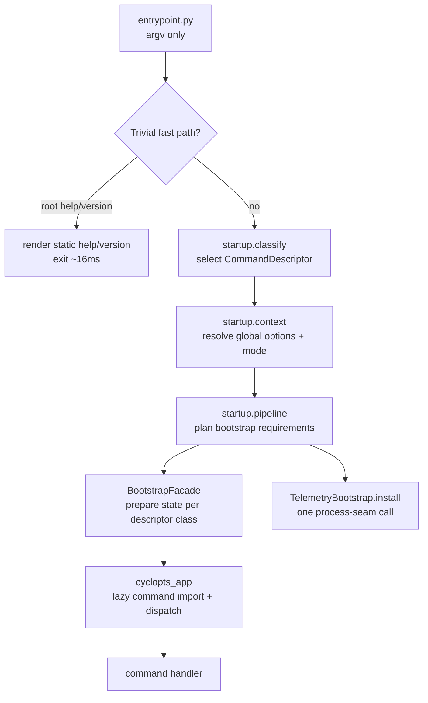

# Architecture: Startup Pipeline

The startup pipeline is the system that classifies a CLI invocation, prepares the right state, installs telemetry, and routes to the command handler — all before any heavy ops modules are imported. It was redesigned (2026-05) to address two problems: slow startup from eager imports and hidden write side effects in read-only command paths.

Related: [launch-system.md](launch-system.md) — composition and harness launch after startup completes. [startup decisions](../decisions/startup-health-sandbox.md#startup-pipeline) — startup design decisions.

## Core Design: Descriptor-Driven Startup

The startup pipeline is policy-driven by a **command catalog** of `CommandDescriptor` objects. Each descriptor is import-cheap and carries everything the pipeline needs before any command handler imports:

- `command_path` — tuple, supports arbitrary nesting (`("spawn", "report", "show")`)
- `lazy_target` — import path string for the Cyclopts handler (not imported at startup)
- `startup_class` — `TRIVIAL | READ_PROJECT | READ_RUNTIME | WRITE_PROJECT | WRITE_RUNTIME | PRIMARY_LAUNCH | SERVICE_ROOTLESS | SERVICE_RUNTIME | CLIENT_READ`
- `state_requirement` — what bootstrap the command needs
- `telemetry_mode` — `none | stderr | segment`
- `default_output_mode` — replaces the old extension-registry lookup for agent-default formats
- `redirect` — optional redirect policy (e.g. `models list` → `mars models list`)
- `root_source` — `"cwd"` (default) or `"argv"` (post-parse resolution for commands like `init [path]`)

The catalog is the **single source of truth** for routing, validation, default output mode, and help. The CLI startup path never queries the extension registry for these answers.

## Startup Pipeline Flow



**Thin entrypoint:** Root `--help` and `--version` exit without importing `meridian.cli.main`. Measured at ~16ms vs ~190ms before (11.6× faster). The import chain for the lazy path is similarly reduced.

## Invocation Classes

The classifier maps argv to one of these classes before any heavy imports:

| Class | Examples | State requirement | Telemetry |
|---|---|---|---|
| `TRIVIAL` | root `--help`, `--version` | none | none |
| `READ_PROJECT` | `context`, `work current`, `hooks list`, `workspace list` | project-read | none |
| `READ_RUNTIME` | `spawn list`, `spawn show`, `session log` | runtime-read | none |
| `WRITE_PROJECT` | `config init`, `workspace migrate` | project-write | optional segment |
| `WRITE_RUNTIME` | `spawn create`, `work start`, `doctor --prune` | runtime-write | segment |
| `PRIMARY_LAUNCH` | bare `meridian`, `--continue`, `--fork` | runtime-write | segment |
| `READ_ROOTLESS` | `doctor`, `kg check/graph`, `qi check/list`, `mermaid check`, `config show/get`, `ext list/commands` | none | none |
| `SERVICE_ROOTLESS` | `serve` | none | stderr |
| `SERVICE_RUNTIME` | `chat` (interactive) | runtime-write | segment |
| `CLIENT_READ` | `chat ls`, `chat show`, `chat log` | runtime-read | none |

Read-only classes (`READ_ROOTLESS`, `READ_PROJECT`, `READ_RUNTIME`, `CLIENT_READ`, `TRIVIAL`) install no telemetry, spawn no writer thread, create no UUID, and make no filesystem mutations.

## Rootless Commands and Established Project

Some commands operate on a path, current working directory, or user-level config — they do not require a Meridian project at all. These are classified as `StartupClass.READ_ROOTLESS` with `StateRequirement.NONE`:

- **Tool-level linters:** `kg check`, `kg graph`, `qi`, `qi check`, `qi list`, `mermaid check`
- **Config inspection:** `config show`, `config get` (degrade to user/builtin layers without a project)
- **Extension introspection:** `ext list`, `ext commands`
- **Doctor:** `doctor` (runs global/user-level checks)

In contrast, project-scoped commands (spawn, work, telemetry, session) require an **established project**. An established project is one where:

1. **Explicit targeting:** `-C <path>` or `MERIDIAN_PROJECT_DIR` is set, OR
2. **Literal-cwd marker:** the current working directory contains its own `.meridian/id` file (`cwd_has_project_id(cwd)` — NO ancestor walk)

### Canonical Resolver: `resolve_cli_project_root()`

The single source of truth for project resolution in the CLI layer is `resolve_cli_project_root()` in `src/meridian/cli/utils.py`. It returns a typed `CliProjectRoot` (never raises):

```python
@dataclass(frozen=True)
class CliProjectRoot:
    project_root: Path | None   # None when not established
    source: ProjectRootSource    # "explicit" | "env" | "cwd"
    established: bool            # True when the project is usable
```

Two thin adapters consume this result:

- `require_established_project_root()` — returns `Path` or calls `exit_no_established_project()` (SystemExit(1))
- `optional_cli_project_root_posix()` — returns `str | None` for callers that degrade gracefully

`exit_no_established_project()` is the **single CLI-edge SystemExit** — centralized so the exit message and code never diverge across call sites.

### Established-Project Predicate: `cwd_has_project_id()`

`cwd_has_project_id(cwd)` in `src/meridian/lib/config/project_root.py` checks whether the literal `cwd` contains `.meridian/id` — **no ancestor walk**. This is the deliberate design from #335 (removing walk-up) and #338 (restoring literal-cwd's-own-id detection as an intentional predicate).

The predicate is intentionally one function; issue #341 will broaden it to `meridian.toml` / `mars.toml` as part of deprecating repo-local `.meridian/`.

### Footgun Killed: SystemExit Through `except Exception`

Before #338, `require_established_project_root` raised `SystemExit` (a `BaseException`) directly. `maybe_bootstrap_runtime_state()` in `cli/bootstrap.py` wrapped bootstrap in `except Exception`, which silently swallowed the `SystemExit` — causing confusing downstream crashes instead of the intended "No Meridian project found" message.

The fix: `resolve_cli_project_root()` never raises. The no-project exit is now an explicit, intentional decision *outside* the `except Exception` guard in `maybe_bootstrap_runtime_state()`.

## Bootstrap Service Split

Before this redesign, `resolve_*` helpers silently created directories and UUIDs. The target enforces a naming contract:

| Prefix | Contract |
|---|---|
| `resolve_*` | Pure — no filesystem mutations. Returns `None` if state doesn't exist. |
| `ensure_*` | May create directories, UUIDs, `.gitignore` entries. Only called on write paths. |

### Project-Read vs Runtime-Write

**Project-read:** resolve project root, resolve layout (legacy + current paths for compatibility), no migration, no UUID creation, no directory creation.

**Runtime-write:** everything in project-read, plus create UUID if missing, resolve user runtime root, create runtime directories.

The `BootstrapFacade` orchestrates the right sequence based on the descriptor's `state_requirement`. Command handlers receive a prepared context rather than calling bootstrap helpers themselves.

### Post-Parse Bootstrap

Commands whose target root comes from parsed arguments (e.g. `init [path]`) declare `root_source: "argv"` in their descriptor. The pipeline defers bootstrap until after Cyclopts dispatch. These commands call the `BootstrapFacade` with the argument-derived root rather than the cwd-derived default.

## Telemetry: Process-Seam Install

Telemetry is installed **once per process** through a single API:

```python
TelemetryBootstrap.install(plan: TelemetryPlan) -> TelemetryHandle
```

`TelemetryPlan` fields: `mode`, `logical_owner`, `runtime_root`, `emit_usage_events`, `schedule_maintenance`.

**Process-seam callers only:**
- CLI entrypoint/main (for CLI commands)
- Spawn worker entrypoint (for background spawn processes)
- MCP server entrypoint (fixed `stderr` rootless plan)
- Test harness (explicit test plan or noop)

No operation-layer code (`spawn_create_sync`, `run_chat_server`, extension dispatch) configures telemetry. The old `setup_telemetry()` calls in `spawn/api.py`, `spawn/execute.py`, `chat_cmd.py`, and `server/main.py` were removed.

> [!FLAG] **Needs human review** — Current source still has `setup_telemetry()` call sites in `src/meridian/lib/ops/spawn/api.py` and no `TelemetryBootstrap` class was found during the 2026-05-05 structural check. This section may describe the intended startup design rather than the shipped implementation.

### Retention Maintenance

Background retention runs as part of the segment telemetry install (not doctor). Algorithm constraints:

- **Must NOT scan the full spawn store** — spawn history can grow unboundedly
- **Liveness via PID + heartbeat** — `psutil.pid_exists()` + stat of heartbeat file
- **Cross-process coordination** — marker file at `<runtime_root>/telemetry/.retention-marker` tracks last-run timestamp; non-blocking `trylock` so only one process runs retention per cooldown window (~1h)
- **Windows-safe deletion** — `OSError` on open-file unlink is caught and retried next cycle

## Help: Declarative Profiles at Build Time

The old `apply_agent_help_supplements()` / `restore_help_supplements()` runtime mutation on shared `App` objects is replaced by **help profiles** in the command catalog. Human vs agent mode selects a `HelpProfile` at app-build time — no mutation, no global state, no `detect_tier()` at import time.

## CLI Output Protocol

Command handlers emit results through `to_cli_output()` dispatch rather than `isinstance` branches in `main.py`. This keeps the root CLI module free of spawn-op and output-model imports. Each result type implements the small protocol to produce its wire-shaped output.

## Lazy Import Strategy (main.py)

Heavy imports are deferred through several independent mechanisms. Combined measured impact: `main.py` module-import time 460ms → 156ms, `--help` latency 140ms → 54ms, spawn dry-run 720ms → 617ms. End-to-end spawn improved from ~14s to ~1s (the bulk from earlier work, with these optimizations removing remaining hotspots).

### Selective Command Registration

`_register_commands_for_invocation()` in `main.py` reads the first positional token and imports only the module group that token needs:

```python
registrations: dict[str, tuple[str, Callable[[], None]]] = {
    "spawn": ("spawn", _register_spawn),
    "session": ("session", _register_session),
    ...
}
```

`spawn list` imports only spawn-related modules. `session log` imports only session-related modules. The full-registration path fires only on `--help` (which needs all commands for the help tree). Before this, a single function `_register_group_commands()` imported all command modules unconditionally.

### `lazy_dispatch.py` Adapter

`src/meridian/cli/startup/lazy_dispatch.py` provides `make_lazy_command(lazy_target: str)` — returns a callable that imports and delegates to `"module.path:function_name"` only when invoked. This allows Cyclopts to hold command registrations without triggering their imports.

```python
# Registration at startup (cheap — no import):
spawn_app.command(name="list")(make_lazy_command("meridian.cli.spawn:list_spawns"))

# Import deferred until the command actually runs.
```

### Heavy Module Deferral

`primary_launch` and `mars_passthrough` are imported inside handler functions, not at module scope in `main.py`. These were among the heaviest imports; deferring them saves ~60ms on non-primary-launch commands.

### `meridian.lib.__getattr__` Lazy Exports

`src/meridian/lib/__init__.py` exports `Spawn`, `HarnessId`, `ModelId`, `SpawnId` via a module-level `__getattr__`. Importing `meridian.lib` no longer transitively imports `core.domain` or `core.types` — only the specific name requested triggers the import.

### `app_tree.py` Pattern

`src/meridian/cli/app_tree.py` defines the top-level Cyclopts app instances (`spawn_app`, `session_app`, `work_app`, etc.) without importing any command implementations. Command modules (`spawn.py`, `session_cmd.py`, …) and the heavy `ext_cmd.py` import the app objects from `app_tree.py` when they register commands. This breaks the old circular import where `main.py` importing app objects also pulled in all command implementations.

### Descriptor-Driven Redirect

The `models list` → `mars models list` redirect is handled via `CommandDescriptor.redirect` in the catalog. No `models_cmd.py` module import is needed — the redirect fires from catalog metadata before any command module loads.

## Cyclopts Integration

Cyclopts remains the argument and help engine. Meridian uses it only as a mechanism layer:

- Commands register via **lazy import strings** with help metadata attached at registration time
- Cyclopts can render parent `--help` for lazy commands without resolving them
- The extension registry is only materialized when an extension surface (MCP, HTTP, ext CLI group) needs schemas or handlers

## What This Replaces

| Old pattern | New pattern |
|---|---|
| `resolved_commands()` for routing validation | Catalog descriptor lookup |
| Extension registry for default output mode | `CommandDescriptor.default_output_mode` |
| `maybe_handle_models_redirect()` special-case branch | `CommandDescriptor.redirect` field |
| Two-token command path model | Arbitrary-depth `command_path` tuple |
| `resolve_runtime_root_and_config()` hiding writes | Explicit `resolve_*` / `ensure_*` split |
| `setup_telemetry()` in ops modules | `TelemetryBootstrap.install()` at process seam |
| `apply_agent_help_supplements()` runtime mutation | Help profiles in catalog, selected at app-build |
| `BufferingSink → upgrade` pattern | Single install before handler dispatch |

## Cross-References

- [launch-system.md](launch-system.md) — composition seam and harness launch (downstream of startup)
- [../architecture/sandbox-projection.md](sandbox-projection.md) — sandbox permission projection (complements startup sandbox correctness)
- [../concepts/extension-system.md](../concepts/extension-system.md) — extension registry as lazy layer over descriptors
- [../concepts/state-model.md](../concepts/state-model.md) — project identity model and `.meridian/id`
- [../decisions/startup-health-sandbox.md](../decisions/startup-health-sandbox.md#startup-pipeline) — startup pipeline design decisions including rootless commands and established-project detection
- [../operations/health-checks.md](../operations/health-checks.md) — background per-project repairs on PRIMARY_LAUNCH
