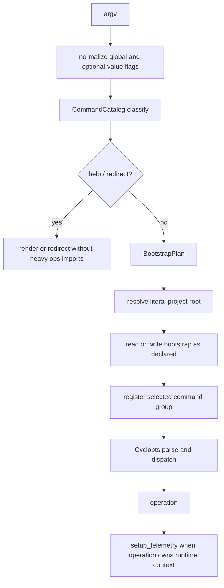

# Architecture: CLI Startup Pipeline

CLI startup classifies the invocation before importing command implementations.
A lightweight descriptor catalog decides registration, bootstrap requirements,
output defaults, and help behavior. Runtime telemetry is installed by the
operation paths that own a resolved runtime root; the previously documented
`TelemetryBootstrap` process seam was intended design and never shipped.

## Descriptor-Driven Flow

```mermaid
graph TD
    A[argv] --> N[normalize global and optional-value flags]
    N --> C[CommandCatalog classify]
    C --> H{help / redirect?}
    H -->|yes| Q[render or redirect without heavy ops imports]
    H -->|no| B[BootstrapPlan]
    B --> R[resolve literal project root]
    R --> S[read or write bootstrap as declared]
    S --> G[register selected command group]
    G --> P[Cyclopts parse and dispatch]
    P --> O[operation]
    O --> T[setup_telemetry when operation owns runtime context]
```

`CommandDescriptor` records a command path, registration bucket, startup class,
bootstrap plan, and output/help metadata. `classify_invocation()` chooses a
descriptor from the import-cheap `COMMAND_CATALOG`; selective registration then
loads only the relevant group.

## Root Resolution and Establishment

`resolve_cli_project_root()` honors an explicit directory, then the established
project environment, then the literal execution CWD according to command
policy. `resolve_project_root_resolution()` returns the root together with its
source and execution CWD.

`cwd_has_project_id(cwd)` is narrowly named legacy vocabulary: it returns true
when the literal directory contains `meridian.toml` or `mars.toml`. It does not
look for `.meridian/id`, `.mars/`, `.git`, or `.agents/`, and it never walks
ancestors.

Bootstrap plans distinguish reads from writes. Commands allowed to initialize
may create or update project config; read-only commands do not silently create
identity or runtime state. `SystemExit` remains outside `except Exception`, so
intentional CLI exits are not rewritten as bootstrap failures.

## Bootstrap Service Split

The startup policy describes requirements; bootstrap services perform the
minimum allowed action after global options are known. Project config access and
runtime-root creation are separate requirements. This prevents help, version,
and rootless operations from mutating a checkout or user state.

Post-parse bootstrap is reserved for facts only Cyclopts can establish. The
normal path classifies and performs its cheap prerequisites before heavy command
registration.

## Telemetry as Shipped

There is no `TelemetryBootstrap` class or universal
`TelemetryBootstrap.install(plan)` call. `setup_telemetry()` remains a live seam
in spawn operations and the background execution path. Those callers install a
rootless/buffering sink when needed and upgrade or replace it once the logical
owner and runtime root are known. `BufferingSink` is therefore current, not a
superseded pattern.

The consequence is narrower than the old intended design: command descriptors
can declare startup telemetry policy, but operation-owned call sites still
perform installation. Changes must audit both CLI startup and background spawn
entry paths until a real single process seam is implemented.

## Help and Lazy Imports

Root help and lightweight redirects use descriptor metadata without importing
all operation modules. `app_tree.py` owns the Cyclopts groups;
`COMMAND_REGISTRATION` and selective registration attach only what the current
invocation needs. Heavy library exports use explicit lazy imports where startup
profiling justified them.

This keeps help/version cheap without creating a second command inventory: the
descriptor catalog and command-group registry have distinct jobs and derive
routing/help views from their declared entries.

## Related

- [Startup / Health / Sandbox Decisions](../decisions/startup-health-sandbox.md)
- [State Model](../concepts/state-model.md)
- [Telemetry Overview](telemetry/overview.md)
- [Codebase Guide](../codebase/guide.md)
