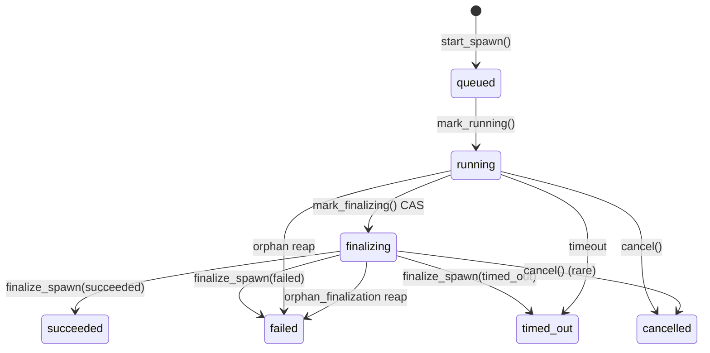
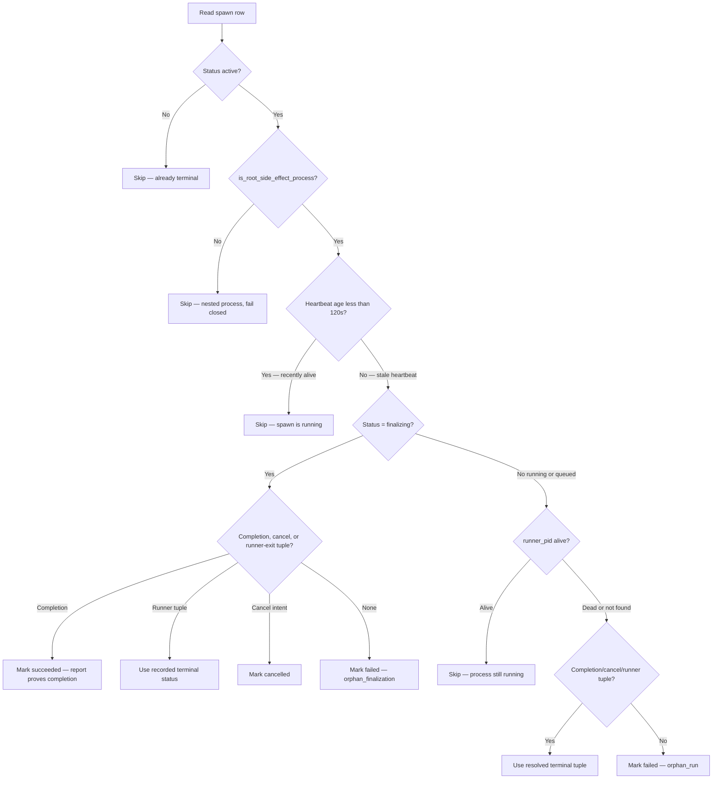

# Architecture: State System

Meridian state is files. No database, no service, no hidden in-memory state. The state system enforces this by making writes atomic, reads crash-tolerant, and keeping recovery derivable from disk. Read paths can project a reconciled view without side effects; repair paths make the durable changes.

See [concepts/state-model.md](../concepts/state-model.md) for the mental model. This page explains the mechanics.

## Split State Layout

State divides across three roots:

```
.meridian/                          ← repo root, committed scaffolding
  id                                — project UUID (gitignored; 36-char v4)
  id.lock                           — exclusive lock for UUID generation
  .gitignore                        — seeded non-destructively
  kb/                               — agent-facing codebase mirror (committed)

~/.meridian/projects/.locks/<uuid>.lock
                                    — project-lifetime shared/exclusive gate (never unlinked)

~/.meridian/projects/<uuid>/        ← user runtime, never committed
  sessions.jsonl                    — all session events, append-only
  sessions.jsonl.flock
  session-id-counter                — monotonic counter for c1, c2, …
  sessions/                         — per-session lock + lease files
  spawn-id-counter                  — monotonic counter for p1, p2, …
  locks/
    spawns/<id>.lock                — stable per-spawn mutation lock
    process-scopes/<id>.lock        — scope-projection sidecar mutation lock
    reaper-cleanup/<id>.lock        — prevents concurrent cleanup signalling
    launch-boundary/<id>.lock       — launch-boundary append lock
    gc.lock                         — lock-GC pass serialization
    hooks/<name>.lock               — per-hook interval serialization lock
  spawns/
    v2-format.json                  — marker file: v2 format active (one-time migration)
    .staging/<unique>/              — complete row build before atomic publication
    <id>/                           — per-spawn state directory
      state.json                    — authoritative spawn state (v2)
      starting-prompt.md            — prompt body (written once at spawn creation)
      prompt.md · report.md · heartbeat
      history.jsonl                 — primary output artifact (seq-enveloped harness events)
      output.jsonl                  — legacy fallback (absent on new spawns)
      stderr.log · params.json · tokens.json
      attempt-N/                    — preserved retry evidence from prior attempts
      last-observed-event.json      — diagnostic marker: last harness event + counters
      runner-lifecycle.jsonl        — runner breadcrumb journal (signals, phases, atexit)
      finalize-evidence.json        — orphan-time liveness snapshot before reaper cleanup
      process_scopes.json           — durable process identities + release markers
      reaper_cleanup_claim.json     — pending finalize-first cleanup targets
      inbound.jsonl                 — injected user messages
      debug.jsonl                   — MERIDIAN_DEBUG=1 only
  artifacts/                        — LocalStore blob store
  cache/                            — models.json (24h TTL), other transient data
  .migrations.json                  — user-side migration tracking

  ← Legacy v1 files (archived on migration):
  spawns.legacy-v1.jsonl            — original global event log (renamed from spawns.jsonl)
  spawns.legacy-v1.jsonl.flock      — renamed from spawns.jsonl.flock

<context.work root>/<slug>/         ← context-resolved, NOT repo-local
  __status.json                     — mutable per-work-item metadata
  prompts/ handoffs/ …              — work artifacts
```

UUID mapping: `.meridian/id` → runtime directory. Projects can be moved or renamed without losing runtime history.

Control sockets live outside the spawn directory in a per-user temp directory:
`/tmp/meridian-<uid>/control-<sha256[:32]>.sock` (POSIX). The hash is derived from
the resolved runtime root and spawn ID, keeping the path within the
`sockaddr_un.sun_path` limit regardless of project path depth. The directory is
mode 0700 with UID ownership validation. Because the socket is external to the spawn
directory, spawn-directory GC does not clean stale sockets; issue #445 tracks
reconnecting socket GC to lifecycle.

Work items live under the `[context.work]` root (default `{user_home}/context/<id>/work/`), resolved by `work_scope.py` / `work_store.py`. Archived items move to `<context.work root>/../archive/work/<slug>/`. See `docs/configuration.md` for context-path resolution.

## Spawn State: V2 Per-Spawn state.json

Since 2026-05 (spawn-state-v2 migration), spawn state lives in individual `state.json` files — one per spawn — rather than a single global `spawns.jsonl` event log.

**Why the migration:** The global `spawns.jsonl` had grown to 189 MB / 35,000 events in production, making every spawn-status read O(n) replay of the entire file. Primary launch time had degraded to 12–13 seconds. Per-spawn `state.json` makes reads O(1) — a single file read per spawn, regardless of project history.

**Performance results after migration:** 12–13s primary launch time → 0.67s. `list_spawns()` improved from multi-second to ~386ms (still bounded by 4,000 file reads — see [open-questions/future-work.md](../open-questions/future-work.md) for the remaining gap).

### Spawn Status Machine

Status progression is v2 per-spawn state plus the current terminal set:



Terminal statuses are `succeeded`, `failed`, `cancelled`, and `timed_out`. `timed_out` is a failure class distinct from generic `failed`, so user-facing filters and statistics can separate deadline failures from other errors.

**Terminal writes use the projection authority rule**: a runner-origin terminal write supersedes a reconciler-origin write on the same spawn. See [spawn-finalization.md](spawn-finalization.md) for the full authority lattice.

`mark_finalizing()` is a compare-and-swap from `running` → `finalizing`. It narrows the reaper's target from the full execution window to the drain/report window, enabling `orphan_finalization` vs `orphan_run` distinction.

### Locked Mutation Seam

Every update to a published spawn calls `write_state_locked()`. It acquires the stable per-spawn lock at `locks/spawns/<id>.lock`, re-reads current `state.json`, applies a pure mutator function, and writes atomically. There is no public unlocked write path — the prior two-tier model (owner writes without lock / external writes with lock) was collapsed in PR #422 to eliminate the convention-enforced split that was the root cause of every reproduced lost-update bug.

`start_spawn()` creates the initial `state.json` under the global `spawns_flock`, where ID reservation is also serialized. Once a spawn row is published, all subsequent mutations go through `write_state_locked()`.

The same mutate-under-lock shape applies across all stores:
- **Spawn state**: `write_state_locked()` — `locks/spawns/<id>.lock`
- **Archived spawns**: `mutate_archived_spawns()` — `locks/archived-spawns.lock`
- **Work items**: `_mutate_item()` in `work_repository.py` — `work-store.flock`
- **Hook intervals**: `run_if_due()` — `locks/hooks/<name>.lock`
- **Scope projections**: `_mutate_scope_projection()` (private) — `locks/process-scopes/<id>.lock`
- **Autosync**: `transaction()` — canonical sync-root lock path
- **Published-spawn deletion**: `delete_published_spawn()` — same per-spawn lock

These seams are behavior-preserving contracts: a planned future store rewrite (typed state, store scaling) inherits the same lock-acquire / re-read / pure-mutate / atomic-write shape.

### Migration: ensure_v2_format()

`state/spawn/migration.py:ensure_v2_format()` performs a one-shot lazy migration on first access to a runtime root:

1. If `spawns/v2-format.json` marker exists → already migrated, return immediately (in-process cache hit after first check).
2. If no legacy `spawns.jsonl` exists → write marker and return (fresh install, nothing to migrate).
3. Under `spawns/migration.lock`: replay legacy `spawns.jsonl`, write `state.json` + `starting-prompt.md` for every spawn, write marker, rename legacy files to `spawns.legacy-v1.jsonl`.

**No quiescence gate.** The migration does not wait for active spawns to finish before migrating. Stragglers are handled by reconciliation: read surfaces can project a stale runner as terminal, and explicit repair paths can finalize it durably. The decision to drop the quiescence gate was deliberate: users always have running spawns, so a gate that requires a quiet runtime would never trigger in practice.

**Migration lock for process safety.** Multiple processes starting simultaneously converge: second process reads the marker after first writes it and skips migration. The `migration.lock` file prevents double-migration, not quiescence.

### Legacy V1 JSONL (Reference)

The original design used a global `spawns.jsonl` event log. Events were appended and state was derived by replaying all events for a spawn. This made crash tolerance structural (truncated lines are skippable) but O(n) in total spawn history. V1 files are archived to `spawns.legacy-v1.jsonl` on migration and are no longer read by active code.

## Session State

Sessions track harness session IDs, work-item attachment, and lifecycle (created → active → closed). Session events in `sessions.jsonl` link `meridian_session_id` (c1, c2, …) to `harness_session_id` (harness-native identifier) and `work_id`.

Session state remains event-sourced JSONL (no v2 migration for sessions). The session log is much smaller than spawn history and does not suffer the same O(n) performance problem.

Session-ID counter (`session-id-counter`) is monotonically incremented under `platform.locking.lock_file()` so concurrent spawns never collide.

Per-session files under `sessions/<chat_id>/`:
- `<chat_id>.lock` — held for active session duration
- `<chat_id>.lease.json` — PID + generation token for staleness detection

## Atomic Writes

Every file write goes through one of three patterns:

**JSONL append** (`state/event_store.py`): acquire `lock_file()` on `.flock` sidecar → repair any torn tail → append line → release. If the process dies mid-append, the next locked append repairs the torn tail before writing: a complete row missing only its delimiter is preserved; a genuinely torn partial row is dropped via atomic inode replacement (so unlocked readers never splice a fabricated hybrid event). The O(1) fast path (check last byte for newline) avoids a full-file read on clean tails. Session events, launch-boundary events, permission journals, and control-action journals all use `append_durable_jsonl_line`, which calls the shared repair before appending. `history.jsonl` is excluded (tracked under #376). Spawn state uses atomic overwrite (v2).

**Atomic file replacement** (`lib/platform/atomic.py:atomic_replace()`): the dependency-neutral platform primitive that `state/atomic.py`, `plugin_api/fs.py`, autosync, and the Codex streaming rewriter all delegate to. Writes to a same-directory temp, optionally fsyncs, then `os.replace()`. Permission policy: `permissions="preserve"` (default) keeps existing file mode; `permissions=0o600` enforces strict mode for runtime state. `AtomicReplaceDurabilityError` surfaces post-commit fsync failures so callers know the write is committed but not yet durable.

State-facing writes use `state/atomic.py:atomic_write_text()` which sets mode `0600` for runtime state. User-owned project files and context work-item metadata use the preserve-mode platform atomic writer.

**Atomic directory publication** (`state/atomic.py:atomic_publish_dir()`): rename a complete same-volume staging directory into a destination that must not exist, then fsync the publication parent.

**Work item renames:** `work-items.rename.intent.json` is written before any rename begins. Leftover intent is replayed on startup/reconciliation — crash-safe two-phase rename.

### Conformance Guard

`tests/contract/test_state_write_conformance.py` is a repo-wide AST test rejecting raw file writes (`Path.write_text`, `Path.write_bytes`, `open(..., "w")`) to authoritative state. It enforces that all state mutations route through the atomic primitives. A documented single-entry allowlist covers the one justified exception (telemetry cooldown marker). Stale allowlist entries are detected. The failure message names the offending call site and guides toward the correct primitive.

## Platform Locking

`platform.locking.lock_file(path, mode, timeout, reentrant)` is the single cross-process locking primitive:

- **POSIX:** `fcntl.flock(LOCK_EX | LOCK_SH)` — advisory, kernel-backed
- **Windows:** `msvcrt.locking(LK_NBLCK, 1)` with retry loop (50 ms sleep)

**Modes:** `exclusive` (default) or `shared`. Shared mode uses `LOCK_SH`; a held shared lock cannot be upgraded to exclusive in place.

**Reentrancy:** thread-local by default. A thread that already holds the lock re-enters safely; the OS lock releases only on outermost exit. Non-reentrant mode (`reentrant=False`) is used for mutation seams where nesting would let an inner run invalidate the outer's state snapshot.

**Fork safety:** acquired handles are tracked in a process-wide registry. On `fork()`, the child closes every inherited descriptor (releasing the parent's open-file-description lock without explicit unlock) and clears the reentrancy state. Release-window descriptors are also registered so a fork during the gap between OS release and handle close does not leak.

**Stable lock inodes with GC seam:** all coordination locks live under `locks/<domain>/` outside the directories they protect. This prevents the split-brain failure where one process unlinks a lock file and creates a new inode while another still holds the old one (POSIX `flock` is per-open-file-description, not per-path). Lock inodes are never unlinked except through a validated GC seam: `unlink_validated_lock()` unlinks only while holding a fresh, non-reentrant exclusive flock on the inode currently linked at that path, immediately before release. The acquire-side revalidation loop (`open → flock → compare fstat(fd) vs stat(path) → retry on mismatch`) makes this provably split-brain-free. Two GC call sites use this primitive: `lock_gc.py` sweeps orphaned per-spawn locks (four classes under `locks/`) when the corresponding spawn directory no longer exists; `cleanup_stale_sessions()` unlinks cleaned session locks before release. Both run on episodic paths (doctor, prune, cleanup), never on hot paths. The forbidden pattern — unlinking while a lock remains held afterwards (e.g. inside a reentrant context) — is never used.

`delete_published_spawn()` in `spawn_aggregate.py` is the single composition owner for published-row deletion: it acquires the spawn lock then the scope-projection lock, checks for pending cleanup claims, and removes the spawn directory. Cross-leaf spawn operations belong in `spawn_aggregate.py`, not in either persistence leaf.

### Lock-Order Invariants

When multiple locks are needed, acquire in this order to prevent deadlocks:

1. `spawns_flock` (global spawn-ID allocation and publication)
2. Per-spawn lock (`locks/spawns/<id>.lock`)
3. Scope-projection lock (`locks/process-scopes/<id>.lock`)

`delete_published_spawn()` (in `spawn_aggregate.py`) acquires the per-spawn lock then the scope-projection lock, and checks for pending cleanup claims before deletion. Pruning acquires `spawns_flock` first.

### Project-Lifetime Gate

`~/.meridian/projects/.locks/<uuid>.lock` sits outside the deletable project root. Sessions hold a **shared** lock for their lifetime; global pruning acquires **exclusive** + revalidates the target before removal. This prevents pruning from destroying a runtime root while sessions hold spawn locks inside it.

See `lib/platform/locking.py` for implementation details.

## Read-Time Projection and Explicit Reconciliation

Meridian no longer lets ordinary read surfaces terminate processes as a side effect.
The state layer has two reconciliation shapes:

- **Read-time projection** — `reconcile_spawns()` and
  `peek_reconciled_active_spawn()` return an in-memory view of stale active spawns
  for list/show/wait/dashboard and descendant-work checks. They do not write
  `state.json`, mark scopes released, or send process signals.
- **Explicit reconciliation repair** — `reconcile_active_spawn()` writes terminal
  state and runs process-scope cleanup. It is called by `meridian doctor
  --kill-orphans` and by the primary-launch background repair thread, both gated to
  root side-effect processes.

Both paths use the same liveness decision rules. Side effects run only from the
explicit path and only at clear root depth — `MERIDIAN_DEPTH` absent, empty, or
`"0"`. Nested processes and malformed depth values fail closed.

**Decision/IO split:** Reconciliation separates the decision step (pure, no I/O) from the action step (writes terminal state and cleans scopes). This lets read-time projection reuse the same decision logic without filesystem mutation.

**Finalize-first cleanup claims:** `reconcile_active_spawn()` snapshots exact cleanup targets into `reaper_cleanup_claim.json` under the spawn lock before persisting terminal state, then terminates the claimed scopes using birth-validated signals. This finalize-first order makes state convergence independent of slow cleanup: a crash leaves a durable claim for the next doctor pass. A separate stable cleanup lock (`locks/reaper-cleanup/<id>.lock`) prevents concurrent reapers from double-signalling. Terminal rows retain failed claims for retry. A runner-origin terminal write clears a reconciler claim without signalling because runner authority supersedes reconciler cleanup intent.

### Liveness Check Sequence



PID reuse guard: the runner records `runner_pid` and `runner_created_at_epoch`. If `psutil` finds a process with that PID but a different birth time, it is a different process — treat the original runner as dead.

`has_durable_report_completion(report_text)` returns True for non-empty report that is not a terminal control frame (`cancelled`/`error` JSON). Used by both reconciliation paths and runner-side terminal resolution to determine if a report artifact proves success.

## Work Item Store

Work items use a different storage pattern from spawns: **one `__status.json` file per work directory** under the context work root (e.g. `<context.work>/<slug>/__status.json`). All mutations (status updates, healing, directory-namespace operations) go through `work_repository.py:_mutate_item()`, which serializes reads and writes under `work-store.flock`. Pure read projections and compatibility facades remain in `work_store.py`.

Archiving moves the entire directory to the archive root. Directory location is the primary authority for active-vs-archived state.

## ID Generation

**Project UUID:** `get_or_create_project_uuid()` in `user_paths.py`. Double-checked under `id.lock` (exclusive cross-process lock). Concurrent first-writes converge to the same UUID.

**Session IDs:** Monotonic counter in `session-id-counter`, incremented under `lock_file()`. IDs: c1, c2, c3, …

**Spawn IDs:** Monotonic counter in `spawn-id-counter` at the runtime root, incremented under `spawns_flock` at reservation time. Format: `p1`, `p2`, `p3`, … IDs can be reserved before the spawn row exists (via `reserve_spawn_id()`) so callers can compose launch context with the final ID.

## Read vs Write Resolution

Bootstrap (UUID creation + runtime dir setup) is skipped for read-only commands. This prevents diagnostic/list commands from creating a UUID in untouched checkouts (CI, first-time runs).

| Resolver | Creates UUID? | Use when |
|----------|--------------|----------|
| `resolve_project_runtime_root(root)` | No | Read paths; falls back to `.meridian/` if no UUID |
| `resolve_project_runtime_root_or_none(root)` | No | Read paths where caller needs to know if uninitialized |
| `resolve_project_runtime_root_for_write(root)` | Yes (under lock) | Write paths |

## Migrations

Migration scripts live in top-level `migrations/`, versioned as `vNNN_short_name/`. Each has `README.md`, `check.py`, `migrate.py`, optional `rollback.py`. Tracking splits across `.meridian/.migrations.json` (repo-side) and `~/.meridian/projects/<uuid>/.migrations.json` (user-side). Run manually — no auto-run, no CLI integration yet.

**v001 `uuid_state_split`** (introduced 0.0.34): moves legacy runtime state from `.meridian/` to `~/.meridian/projects/<uuid>/`. Currently a stub.

## Related Pages

- [system-overview.md](system-overview.md) — where state fits in the overall architecture
- [../concepts/state-model.md](../concepts/state-model.md) — mental model for dual-root and event sourcing
