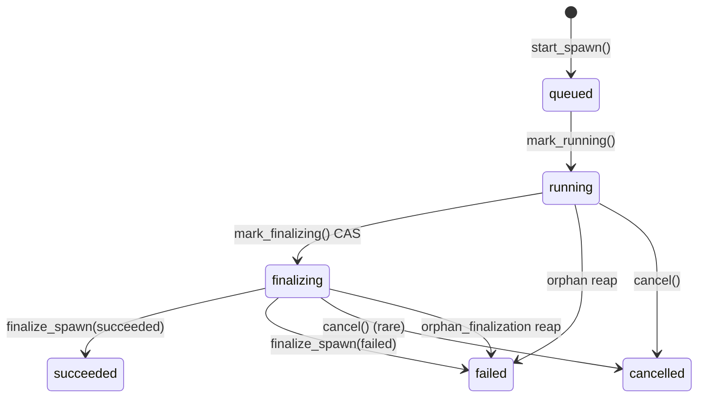
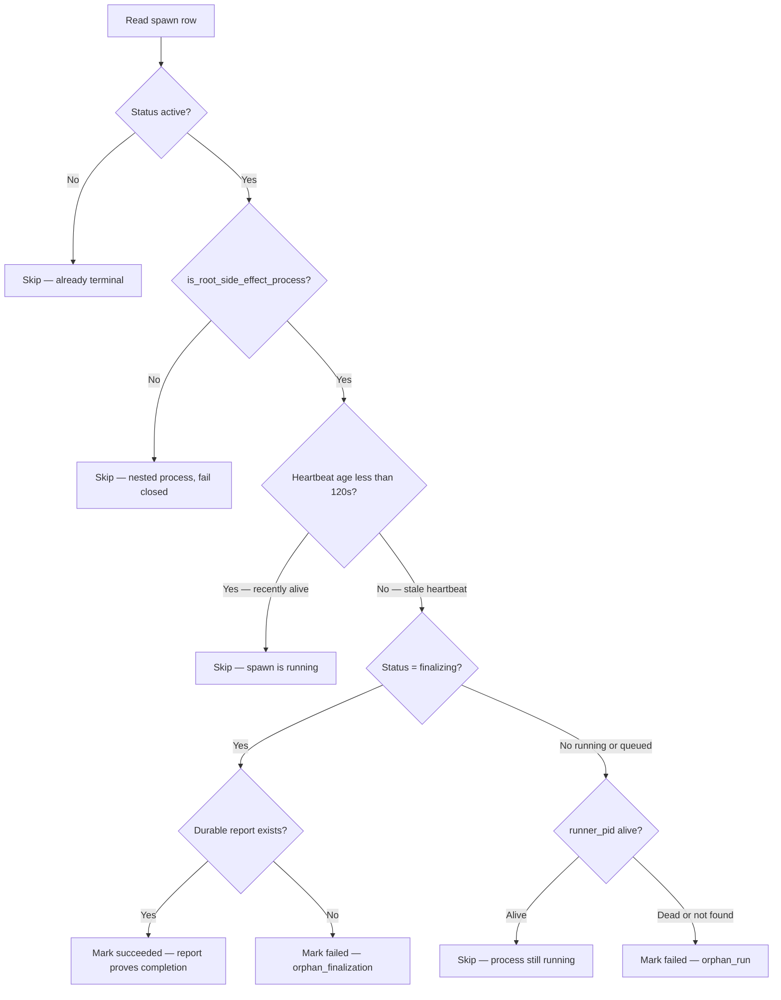

# Architecture: State System

Meridian state is files. No database, no service, no hidden in-memory state. The state system enforces this by making writes atomic, reads crash-tolerant, and recovery automatic on every read path.

See [concepts/state-model.md](../concepts/state-model.md) for the mental model. This page explains the mechanics.

## Split State Layout

State divides across two roots keyed by project UUID:

```
.meridian/                          ← repo root, committed scaffolding
  id                                — project UUID (gitignored; 36-char v4)
  id.lock                           — exclusive lock for UUID generation
  .gitignore                        — seeded non-destructively
  kb/                               — agent-facing codebase mirror (committed)
  work/                             — active work scratch dirs (committed)
  archive/work/                     — archived work dirs (committed)
  work-items/                       — mutable JSON per work item (gitignored)
  work-items.rename.intent.json     — crash-safe rename intent (transient)

~/.meridian/projects/<uuid>/        ← user runtime, never committed
  sessions.jsonl                    — all session events, append-only
  sessions.jsonl.flock
  session-id-counter                — monotonic counter for c1, c2, …
  sessions/                         — per-session lock + lease files
  spawn-id-counter                  — monotonic counter for p1, p2, …
  spawns/
    v2-format.json                  — marker file: v2 format active (one-time migration)
    <id>/                           — per-spawn state directory
      state.json                    — authoritative spawn state (v2)
      state.lock                    — per-spawn exclusive lock for external writers
      starting-prompt.md            — prompt body (written once at spawn creation)
      prompt.md · report.md · heartbeat
      history.jsonl                 — primary output artifact (seq-enveloped harness events)
      output.jsonl                  — legacy fallback (absent on new spawns)
      stderr.log · params.json · tokens.json
      inbound.jsonl                 — injected user messages
      control.sock                  — active-session control socket
      debug.jsonl                   — MERIDIAN_DEBUG=1 only
  artifacts/                        — LocalStore blob store
  cache/                            — models.json (24h TTL), other transient data
  .migrations.json                  — user-side migration tracking

  ← Legacy v1 files (archived on migration):
  spawns.legacy-v1.jsonl            — original global event log (renamed from spawns.jsonl)
  spawns.legacy-v1.jsonl.flock      — renamed from spawns.jsonl.flock
```

UUID mapping: `.meridian/id` → runtime directory. Projects can be moved or renamed without losing runtime history.

## Spawn State: V2 Per-Spawn state.json

Since 2026-05 (spawn-state-v2 migration), spawn state lives in individual `state.json` files — one per spawn — rather than a single global `spawns.jsonl` event log.

**Why the migration:** The global `spawns.jsonl` had grown to 189 MB / 35,000 events in production, making every spawn-status read O(n) replay of the entire file. Primary launch time had degraded to 12–13 seconds. Per-spawn `state.json` makes reads O(1) — a single file read per spawn, regardless of project history.

**Performance results after migration:** 12–13s primary launch time → 0.67s. `list_spawns()` improved from multi-second to ~386ms (still bounded by 4,000 file reads — see [open-questions/future-work.md](../open-questions/future-work.md) for the remaining gap).

### Spawn Status Machine

Status progression is unchanged from v1:



**Terminal writes use the projection authority rule**: a runner-origin terminal write supersedes a reconciler-origin write on the same spawn. See [spawn-finalization.md](spawn-finalization.md) for the full authority lattice.

`mark_finalizing()` is a compare-and-swap from `running` → `finalizing`. It narrows the reaper's target from the full execution window to the drain/report window, enabling `orphan_finalization` vs `orphan_run` distinction.

### Two-Tier Write Model

V2 distinguishes two write tiers based on who is writing and under what lock:

**Tier 1 — Owner writes (unlocked, write-through):**  
`start_spawn()` creates the initial `state.json` under the global `spawns_flock`, where ID reservation is also serialized. Subsequent status transitions by the spawn's own runner use in-memory mutations written to `state.json` via atomic tmp+rename — no per-spawn lock acquired. The runner is the sole writer while the spawn is active, so lock contention is unnecessary.

**Tier 2 — External writes (per-spawn `state.lock`, read-merge-write):**  
Other processes — the reaper, cancel command, `update_spawn()` callers (e.g. session-bleed-isolation writing `claude_config_dir`) — acquire `spawns/<id>/state.lock`, read the current `state.json`, apply a mutator function, and write the result atomically. This pattern appears in `write_state_locked()` in `state/spawn/repository.py`.

The distinction matters: `update_spawn(claude_config_dir=...)` is always a tier-2 external write because it may be called from any process. The runner's own finalization path is tier-1.

### Migration: ensure_v2_format()

`state/spawn/migration.py:ensure_v2_format()` performs a one-shot lazy migration on first access to a runtime root:

1. If `spawns/v2-format.json` marker exists → already migrated, return immediately (in-process cache hit after first check).
2. If no legacy `spawns.jsonl` exists → write marker and return (fresh install, nothing to migrate).
3. Under `spawns/migration.lock`: replay legacy `spawns.jsonl`, write `state.json` + `starting-prompt.md` for every spawn, write marker, rename legacy files to `spawns.legacy-v1.jsonl`.

**No quiescence gate.** The migration does not wait for active spawns to finish before migrating. Stragglers are handled by the reconciler (reaper), which reads v2 state and finalizes any spawn whose runner died mid-migration. The decision to drop the quiescence gate was deliberate: users always have running spawns, so a gate that requires a quiet runtime would never trigger in practice.

**Migration lock for process safety.** Multiple processes starting simultaneously converge: second process reads the marker after first writes it and skips migration. The `migration.lock` file prevents double-migration, not quiescence.

### Legacy V1 JSONL (Reference)

The original design used a global `spawns.jsonl` event log. Events were appended and state was derived by replaying all events for a spawn. This made crash tolerance structural (truncated lines are skippable) but O(n) in total spawn history. V1 files are archived to `spawns.legacy-v1.jsonl` on migration and are no longer read by active code.

## Session State

Sessions track harness session IDs, work-item attachment, and lifecycle (created → active → closed). Session events in `sessions.jsonl` link `meridian_session_id` (c1, c2, …) to `harness_session_id` (harness-native identifier) and `work_id`.

Session state remains event-sourced JSONL (no v2 migration for sessions). The session log is much smaller than spawn history and does not suffer the same O(n) performance problem.

Session-ID counter (`session-id-counter`) is monotonically incremented under `platform.locking.lock_file()` so concurrent spawns never collide.

Per-session files under `sessions/<chat_id>/`:
- `<chat_id>.lock` — held for active session duration
- `<chat_id>.lease.json` — PID + generation token for staleness detection

## Atomic Writes

Every file write goes through one of two patterns:

**JSONL append** (`state/event_store.py`): acquire `lock_file()` on `.flock` sidecar → append line → release. If the process dies mid-append, the next read skips the truncated line. Used for session events (`sessions.jsonl`); spawn state now uses atomic overwrite (v2).

**Atomic overwrite** (`state/atomic.py:atomic_write_text()`): write to temp file → `os.replace()` → fsync parent directory (POSIX only; Windows early-returns — NTFS journaling handles this). Either the old file or the new file exists; never a partial write. Spawn `state.json`, ID counters, and all derived state files use this pattern.

**Work item renames:** `work-items.rename.intent.json` is written before any rename begins. Leftover intent is replayed on startup/reconciliation — crash-safe two-phase rename.

## Platform Locking

`platform.locking.lock_file(path)` is the cross-platform exclusive lock used everywhere:

- **POSIX:** `fcntl.flock(LOCK_EX)` — advisory, kernel-backed
- **Windows:** `msvcrt.locking(LK_NBLCK, 1)` with retry loop (50 ms sleep)

Thread-local reentrancy: a thread that already holds the lock can re-enter on the same path without deadlocking. A depth counter tracks nesting; OS lock released only on outermost exit.

See `lib/platform/locking.py` for implementation details.

## The Reaper

The reaper auto-finalizes abandoned spawns on every read path (list, show, wait, dashboard). It runs only at clear root depth — `MERIDIAN_DEPTH` absent, empty, or `"0"`. Nested processes and malformed depth values fail closed (no reap side effects).

**Decision/IO split:** The reaper separates the decision step (pure, no I/O) from the action step (writes terminal event). This makes the decision logic testable without filesystem.

### Liveness Check Sequence



PID reuse guard: the runner records `runner_pid` at spawn creation time. If `psutil` finds a process with that PID but a different start time than recorded, it's a different process — treat as dead.

`has_durable_report_completion(report_text)` returns True for non-empty report that is not a terminal control frame (`cancelled`/`error` JSON). Used by both reaper and runner to determine if a report artifact proves success.

## Work Item Store

Work items use a different storage pattern from spawns: **one mutable JSON file per item** under `work-items/<slug>.json`. Atomic overwrites via `tmp + os.replace()`. Mutable JSON is appropriate here because work items are correlated with a directory that moves on rename — event-sourcing would add complexity without benefit.

## ID Generation

**Project UUID:** `get_or_create_project_uuid()` in `user_paths.py`. Double-checked under `id.lock` (exclusive cross-process lock). Concurrent first-writes converge to the same UUID.

**Session IDs:** Monotonic counter in `session-id-counter`, incremented under `lock_file()`. IDs: c1, c2, c3, …

**Spawn IDs:** Monotonic counter in `spawn-id-counter` at the runtime root, incremented under `spawns_flock` at reservation time. Format: `p1`, `p2`, `p3`, … IDs can be reserved before the spawn row exists (via `reserve_spawn_id()`) so callers can compose launch context with the final ID.

## Read vs Write Resolution

Bootstrap (UUID creation + runtime dir setup) is skipped for read-only commands. This prevents diagnostic/list commands from creating a UUID in untouched checkouts (CI, first-time runs).

| Resolver | Creates UUID? | Use when |
|----------|--------------|----------|
| `resolve_project_runtime_root(root)` | No | Read paths; falls back to `.meridian/` if no UUID |
| `resolve_project_runtime_root_or_none(root)` | No | Read paths where caller needs to know if uninitialized |
| `resolve_project_runtime_root_for_write(root)` | Yes (under lock) | Write paths |

## Migrations

Migration scripts live in top-level `migrations/`, versioned as `vNNN_short_name/`. Each has `README.md`, `check.py`, `migrate.py`, optional `rollback.py`. Tracking splits across `.meridian/.migrations.json` (repo-side) and `~/.meridian/projects/<uuid>/.migrations.json` (user-side). Run manually — no auto-run, no CLI integration yet.

**v001 `uuid_state_split`** (introduced 0.0.34): moves legacy runtime state from `.meridian/` to `~/.meridian/projects/<uuid>/`. Currently a stub.

## Related Pages

- [system-overview.md](system-overview.md) — where state fits in the overall architecture
- [../concepts/state-model.md](../concepts/state-model.md) — mental model for dual-root and event sourcing
