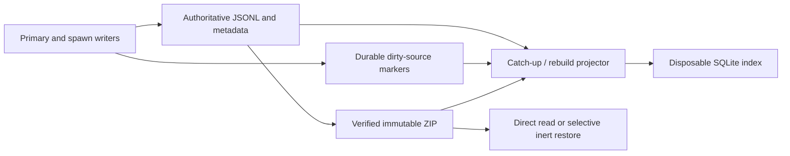

# Portable history, derived discovery, and ZIP retention

**Readable JSONL records and immutable ZIPs are history authority; SQLite is a
disposable discovery projection.** Managed writes publish durable dirty-source
intent before changing files, so one catch-up/rebuild path can repair the index
without putting SQLite in the write path.

## Authority and identity

A history record is one transcript plus the small file-backed facts needed to
identify, relate, and recover it. Its random `history_id` UUID survives copies,
archive, import, restore, and local alias changes. Spawn IDs (`pN`) and chat IDs
(`cN`) are local aliases: multiple session generations may legitimately share a
chat ID, while each transcript keeps a distinct history UUID.

New transcripts begin with a self-identifying header. Their following JSONL
events stay append-only, including across launch retries. Retry boundaries are
events in the canonical transcript; only attempt-scoped diagnostics rotate.
Lifecycle extraction reads the current attempt and ignores an uncommitted final
line. When a native primary transcript is unavailable at execution time, a
harness provider captures it after stop; rendered reports are never promoted to
transcript authority.

Session-to-spawn publication binds the exact chat generation and aggregate UUID
before launch. Fork ancestry records the selected history UUID, not a mutable
latest-chat lookup. Restored histories are marked `historical`: process IDs,
leases, scopes, and harness continuation identifiers are provenance rather than
live control state, and persistence/control seams reject mutation or re-entry.

## One projector, no writer dependency on SQLite

Before an indexed file mutation, the writer takes the shared history-mutation
gate and its source lock, then publishes a random-token dirty marker. A marker
failure prevents the file mutation. A successful file write does not wait for
SQLite.

Catch-up captures a finite marker set, reads each authoritative source under its
source lock, commits the projection durably, and acknowledges only markers whose
tokens are unchanged. Active transcript appends may coalesce, while terminal
transitions and late events replace the token. Rebuild uses the same per-source
projectors rather than a separate repair implementation. Reset changes the marker
generation before discarding damaged coordination and rescanning authority.

The index stores metadata, aliases, relationships, work/session projections,
and independently addressable loose or ZIP locations—not transcript bodies.
Lifecycle, dependency, reclaim, and conflict decisions re-read authoritative
files or verified ZIP members. Deleting `history-index/` while a runtime is
stopped loses acceleration only; deleting lock identities is unsafe.

Discovery operations share one deadline across corpus preparation, lock waits,
database work, and content scanning. Exhaustion produces an explicitly incomplete
result. Confirmed loose-file matches survive exhaustion. ZIP-member matches are
withheld until that member's checksum completes; confirmed matches from earlier
members survive.

## ZIP publication and reclaim

Automatic retention is opt-in, defaults to 30 days since last activity, and runs
as a bounded finite pass after a primary stops. There is no resident indexer,
daemon, SQLite FTS, or automatic ZIP expiry. Manual selection bypasses the age
threshold but not active-session and dependency protection.

Archive publication computes an exact member inventory, writes the ZIP, and then
independently verifies both the selected records and their bytes. Publication
does not itself delete loose data. Reclaim requires the current source fingerprint
to match, persists a prepared receipt, and atomically retires the aggregate into
the existing disposable spawn staging area before recursive cleanup. A cleanup
failure can therefore leave staging residue, but it cannot leave a partial loose
record hiding the verified ZIP.

The catalog records snapshots and physical locations separately. The selected
portable digest determines current content; another location is interchangeable
only when it verifies the same digest. A different older snapshot is never a
fallback for unavailable current content. Import registers a verified ZIP for
direct reads without extraction, and rebuild may discover an orphan ZIP as
snapshot-only metadata.

## Selective restore preserves portable facts

Restore verifies a ZIP and extracts only selected records into private stages.
Slow extraction and checksums run outside the exclusive root gate. Before atomic
publication, the short final gate revalidates conflicts and a POSIX metadata
witness (membership, inode, mode, size, mtime, and ctime). The witness detects a
change after hashing; it never substitutes for hashing.

A durable per-history plan spans local ID reservation, aggregate publication,
and historical session append, so interruption can be retried without duplicating
or activating state. The ZIP remains in place. Changed content or exact session
metadata conflicts rather than overwriting local history.

Portable recapture preserves the source session facts, including their absence.
Exact session lookup returns raw authoritative nullable fields for provenance,
fingerprinting, and witnesses. Only the exported capsule is enriched with its new
local aliases, and only after raw validation. This prevents synthetic restore
metadata from changing the portable digest or hiding an out-of-band authority
change.

## Delivery and evidence boundary

The mechanism and its source-local documentation are complete on the feature
branch, but the feature is not merged or released. Independent review approved
the core/index and ZIP/restore lanes. Isolated ordinary-CLI verification passed
index rebuild, archive, direct log/export, restore, historical mutation rejection,
and archive→restore→archive identity preservation.

The final branch gate recorded 1,515 passed and 2 skipped, Ruff success, Pyright
with zero errors, and a successful package build. Real crash/restart, concurrent
writer/projector, WAL-reader replacement, archive retirement, and restore-witness
probes also passed. These are production crash-boundary results, not guarantees
for power loss, ENOSPC, network filesystems, or hardware failure. Current PR-phase
commands, logs, and limits live in `work:next-minor-planning/probes/root-4859cc7b/`
and `work:next-minor-planning/inputs/implementation-runtime-2026-09-14.md`.

A synthetic 10,000-record metadata filter measured median scan 643.196 ms,
indexed query 2.166 ms, and rebuild 3.412 s. It demonstrates the value of the
index on that corpus, not a general latency SLA.

## Related

- [State-system overview](overview.md)
- [Session state](session-state.md)
- [Spawn state](spawn-state.md)
- [State decisions](../../decisions/state.md)

**Provenance:** `work:next-minor-planning`; `spawn:p6019`; `spawn:p6020`;
`spawn:p6022`; `spawn:p6023`; `spawn:p6024`; `spawn:p6025`; `spawn:p6027`.
