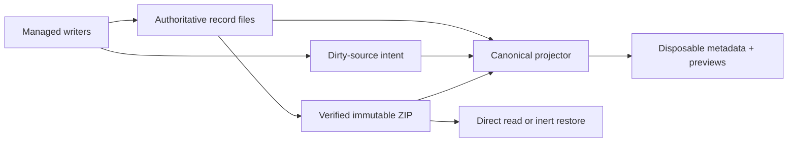

# Portable history, derived discovery, and ZIP retention

**Readable record files and immutable ZIPs are retained-history authority. SQLite
metadata, preview and search rows are disposable projections that can be rebuilt
without losing history.** The same authority boundary governs discovery, preview,
retention, transfer, and restore.

**Scope.** This page covers retention, archive and restore. For a live bound chat,
the conversation is the harness's native file, read through one resolver
([native transcript reads](../native-transcript-reads.md)). Meridian's runner
`history.jsonl` stopped being read in PR 2 and stopped being written in PR 3
([native-only history](../../decisions/native-only-history.md)). Archives capture
the bound key's native snapshot.

## Authority, identity, and ownership are separate

A history UUID identifies one transcript across copies, archive, import, restore,
and local alias changes. Spawn and chat IDs are local aliases, and a chat can have
multiple generations. Source locators identify where bytes can currently be read;
they are not the transcript's historical identity.

Runtime ownership is different again. Live process IDs, leases, scopes, and
continuation handles authorize control of a current runtime. When a record is
restored as historical, those fields remain provenance only: restore never turns
foreign runtime ownership back on. This distinction prevents a portable identity
from becoming permission to signal a process or resume a harness.

Exact harness-native history serves live reads. Sealed native snapshots in
archives preserve offline history. Rendered reports are never transcript authority,
and neither is a runner event stream.

## One-way, rebuildable projections

Managed writers publish durable dirty-source intent before changing indexed files.
They do not depend on SQLite to complete the authoritative write. Catch-up captures
a finite marker set, reads authority under the corresponding source lock, commits
the projection, and acknowledges only unchanged marker tokens. Rebuild uses the
same projectors rather than a second interpretation path.

The index can hold discovery metadata, aliases, relationships, independent loose or
ZIP locations, and bounded preview checkpoints. It must not become a full
conversation store or the only copy of any historical fact. Lifecycle, dependency,
reclaim, and conflict decisions return to authoritative files or verified ZIP
members.

A selected snapshot is a content decision, not merely a locator preference. Multiple
physical copies are interchangeable only when they independently verify to the
selected portable digest. If that snapshot is offline, the system may show metadata
or a previously verified preview for the same digest, clearly labeled offline. It
must not silently substitute an older but reachable snapshot.

Rejected alternatives: a resident indexing service, a second transcript parser,
and full-conversation caching as authority. They duplicate authority or
interpretation, enlarge repair state, and make a disposable accelerator necessary
for correctness.

Search is the one full-text projection. It is a separate, native-keyed FTS5 file
that stores no chat IDs and no unique facts. Every hit is re-verified against the
live native source ([native transcript reads](../native-transcript-reads.md#search-projection)).

## Missing or outdated index initialization

The first operation that needs a missing or incompatible index gets one 15-second
automatic initialization phase, separate from the ordinary two-second query budget.
Reuse the existing catch-up lock and recheck the database plus persisted failure
state after acquiring it. A waiting caller uses a peer's successful publication;
it does not build again.

Workspace/global operations share one initialization deadline across roots. If all
roots are already current, classification and work share the existing ordinary
deadline without a reset. Only a real initialization phase permits a fresh ordinary
deadline afterward. The 5 ms cache-only preview path does not join this gate, open
transcript sources, or initialize anything.

A genuine owned-build failure is recorded atomically outside the replaceable SQLite
directory and suppresses later automatic attempts for the same schema/coordination
generation. Manual metadata rebuild is the explicit retry and clears the failure on
successful metadata publication. Another initializer, lock contention, cancellation,
and crash before a recorded failure are not sticky. Status inspection must not create
coordination state or initiate progress. There is no automatic progress UI, daemon,
second index, or destructive transcript conversion.

This contract was selected after a real 1,093-record / 6,077-session corpus exceeded
the ordinary budget while explicit metadata construction finished in 5.68 seconds,
and two concurrent missing-index callers rebuilt twice serially. The feature-branch
implementation now performs the under-lock recheck, preserves old-schema identities,
publishes once for concurrent callers, and recovers from non-sticky interruption.
These results establish behavior, not a controlled speed improvement across changing
corpora and cache state.

## Bounded preview projection

Previews are a selected-row acceleration path, not a new transcript format. The
canonical normalizer used for full reads feeds a bounded accumulator and persists
only recent normalized messages, setup text, clipping state, and a refresh
checkpoint. Ordinary metadata catch-up does not decode bodies. Rebuild leaves
previews cold; browse refreshes them on demand. The old eager warm loop re-folded and
re-resolved every chat.

Selection first performs a bounded cache lookup without source reads or catch-up.
Cached content may be shown as updating while a latest-only worker verifies or
refreshes the selected row. ZIP-derived previews are published only after required
members and bytes verify. Preview, selection, and direct archive read never restore
or launch a record.

Previews read native sources only, and each refresh reparses the selected source.
The complete-line checkpoint that once let previews resume Meridian's own
append-only runner stream was deleted with the runner-history read path.

Rejected preview alternatives include caching grouped render entries as if they were
bounded messages, clipping only at render time, parsing the full conversation into
SQLite, adding a second parser, and hashing the full source on every append. The
selected design keeps one interpretation path and treats a checkpoint witness as a
narrow optimization rather than a generic mutation detector.

## Archive capture is native-only

Archive capture of a spawn resolves the exact native key recorded for that
aggregate and publishes its snapshot. A spawn with no native source stays loose,
with an explicit reason: unbound, legacy-only, a failed launch, or a bound chat whose
file is gone. Archive readiness requires a transcript member, and there is no
runner-history fallback. The earlier plan to keep the runner stream and add a
separate canonical snapshot beside it (PR #494) is superseded.

The selected capture timing is **post-stop observation** associated with the exact
completed record, not a reconstruction of bytes at a past launch-end instant. A
delayed observation may include later native continuation and must state its scope.
Same-runtime owner checks are safety preconditions, not a fence against external
writers.

## Verified publication and short reclaim serialization

Archive capture runs under the shared root gate and source lock. It brackets a full
source hash with exact before/after witnesses covering membership, POSIX identity
and change fields, raw session state, and spawn state. The initial capture and hashes
are reused; reclaim does not add a third full hash pass.

After the ZIP has been published and independently verified, the final exclusive
phase revalidates current protection, dependency closure, activity, ownership, and
the exact witness. A changed source or metadata record keeps loose authority.
Dependents are chosen before dependencies. The exclusive phase then publishes
reclaim intent and atomically retires the aggregate into owned staging. Recursive
cleanup runs only after the root, spawn, and scope locks are released.

Retirement is durable before disposal. Both affected parent directories are synced
before garbage collection removes retirement residue or recovery acknowledges an
absent source. Persistent sync failure leaves the prepared receipt and staging for a
later recovery pass; it does not need a second ledger. A verified published ZIP
remains readable throughout.

Witnesses detect changes after hashing; they never replace checksums. Full hashing
under the final exclusive gate, full hashing once more per reclaim, and recursive
cleanup inside the writer gate were rejected because they serialize unrelated
writers without adding authority. Stat-only verification was also rejected because
metadata cannot prove content bytes.

Previously published immutable archive metadata may contain the single obsolete
capture-fingerprint field. Readers drop only that field at the decode boundary while
still verifying the original ZIP member bytes and all required facts. New records do
not calculate or emit it, and arbitrary unknown fields remain invalid. This narrow
accommodation preserves immutable history; it is not a legacy runtime or parallel
schema.

## Selective restore preserves portable facts

Restore extracts only selected records into private stages, verifies their bytes,
and assigns new local aliases. A durable per-history plan spans publication and the
historical session append so interruption can be retried without activation or
duplication. The ZIP remains in place.

The final short gate revalidates conflicts and a current witness before atomic
publication. Exact raw session facts—including absent optional facts—remain portable
provenance. Local linkage added for an exported or restored capsule does not rewrite
the source's historical identity. Changed content or exact session metadata
conflicts instead of being overwritten.

New portable records explicitly declare their canonical transcript member and bind
an immutable original capture descriptor into the versioned portable digest. Restore
may remap local aliases and clear live native ownership, but rearchive must carry that
original descriptor unchanged. The required round trip is archive -> restore ->
rearchive -> restore with the original native store and first ZIP unavailable. Old
archives keep their implicit `history.jsonl` member and original digest recipe; they
are never rewritten or given fabricated descriptors. Such a member still verifies and
restores as bytes. `iter_archived_events` refuses to read it as a transcript
(old-data option C).

## Provenance

**Provenance:** `work:next-minor-planning/design/followup-495-497.md`;
`work:next-minor-planning/DIVERGENCE/2026-09-14-preview-reclaim-model-followup.md`;
`work:next-minor-planning/followup-implementation-progress.md`;
`work:next-minor-planning/reviews/496-implementation-followup.md`;
`work:next-minor-planning/reviews/495-final.md`; `spawn:p6053`; `spawn:p6062`.
Investigation update: `work:next-minor-planning/investigation-499-500.md`;
`work:next-minor-planning/design/history-repair-plan.md`;
`work:next-minor-planning/design/index-initialization.md`;
`work:next-minor-planning/design/native-transcript-capture.md`;
`work:next-minor-planning/reviews/repair-design-review.md`;
`work:next-minor-planning/DIVERGENCE/post-stop-capture-scope.md`;
`work:next-minor-planning/reviews/post-stop-scope-review.md`;
`work:next-minor-planning/implementation-history-completion.md`;
`work:next-minor-planning/reviews/499-opencode-closeout-review.md`;
`work:next-minor-planning/reviews/499-capture-identity-review.md`.
Native-only capture and inert legacy members: `work:native-harness-session-identity`
(`evidence/pr2-a1-report.md`, `spawn:p7124`).

## Related

- [State-system overview](overview.md)
- [Session state](session-state.md)
- [Spawn state](spawn-state.md)
- [Session-log rendering](../../codebase/session-log-rendering.md)
- [History-storage decisions](../../decisions/history-storage.md)
