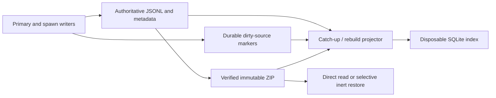

# Portable history, derived discovery, and ZIP retention

**Readable JSONL records and immutable ZIPs are history authority; SQLite is a
disposable discovery projection.** Managed writes publish durable dirty-source
intent before changing files, so one catch-up/rebuild path can repair the index
without putting SQLite in the write path.

## Authority and identity

A history record is one transcript plus the small file-backed facts needed to
identify, relate, and recover it. Its random `history_id` UUID survives copies,
archive, import, restore, and local alias changes. Spawn IDs (`pN`) and chat IDs
(`cN`) are local aliases: multiple session generations may legitimately share a
chat ID, while each transcript keeps a distinct history UUID.

New transcripts begin with a self-identifying header. Their following JSONL
events stay append-only, including across launch retries. Retry boundaries are
events in the canonical transcript; only attempt-scoped diagnostics rotate.
Lifecycle extraction reads the current attempt and ignores an uncommitted final
line. When a native primary transcript is unavailable at execution time, a
harness provider captures it after stop; rendered reports are never promoted to
transcript authority.

Session-to-spawn publication binds the exact chat generation and aggregate UUID
before launch. Fork ancestry records the selected history UUID, not a mutable
latest-chat lookup. Restored histories are marked `historical`: process IDs,
leases, scopes, and harness continuation identifiers are provenance rather than
live control state, and persistence/control seams reject mutation or re-entry.

## One projector, no writer dependency on SQLite

Before an indexed file mutation, the writer takes the shared history-mutation
gate and its source lock, then publishes a random-token dirty marker. A marker
failure prevents the file mutation. A successful file write does not wait for
SQLite.

Catch-up captures a finite marker set, reads each authoritative source under its
source lock, commits the projection durably, and acknowledges only markers whose
tokens are unchanged. Active transcript appends may coalesce, while terminal
transitions and late events replace the token. Rebuild uses the same per-source
projectors rather than a separate repair implementation. Reset changes the marker
generation before discarding damaged coordination and rescanning authority.

The index stores metadata, aliases, relationships, work/session projections,
and independently addressable loose or ZIP locations—not transcript bodies.
Lifecycle, dependency, reclaim, and conflict decisions re-read authoritative
files or verified ZIP members. Exact launch/control references recover launch
policy, native identity, and primary/Pi ownership from session/spawn files even
for an unlinked primary; a damaged discovery database cannot block that known
reference. Deleting `history-index/` while a runtime is stopped loses
acceleration only; deleting lock identities is unsafe.

Discovery operations share one deadline across corpus preparation, lock waits,
database work, and content scanning. Exhaustion produces an explicitly incomplete
result. Confirmed loose-file matches survive exhaustion. ZIP-member matches are
withheld until that member's checksum completes; confirmed matches from earlier
members survive. SQLite and coordination failures likewise return explicit
errors with `complete=false` rather than escaping or presenting an empty result
as complete. Browse subset search uses the same canonical target resolver as
preview and ordinary search, so a selected loose or ZIP record does not enter a
second selection path. Scope is explicit before resolution: the browser always
lists archived metadata and can preview a selected ZIP, but `/` searches only
loose visible rows unless `session browse --include-archives` opts into ZIP
content. Search status labels the scope as `loose` or `+ZIP`. Corpus search keeps
its existing explicit archive flag.

Rebuild uses one rollback-journal stage owned by the per-runtime catch-up lock.
The owner removes its own crash residue before rebuilding and cleans the stage
and journal on ordinary failure without touching the published database or
unrelated files. Session and archive-catalog projection use their authoritative
logs plus cursor/receipt and dirty-generation evidence; no write-only log
identity sidecars are maintained.

## ZIP publication and reclaim

Automatic retention is opt-in, defaults to 30 days since last activity, and runs
as a bounded finite pass after a primary stops. There is no resident indexer,
daemon, SQLite FTS, or automatic ZIP expiry. Manual selection bypasses the age
threshold but not active-session and dependency protection.

Archive publication computes an exact member inventory, writes the ZIP, and then
independently verifies both the selected records and their bytes. Publication
does not itself delete loose data. Reclaim requires the current source fingerprint
to match and persists a prepared receipt before retirement. Selection orders
dependents before their dependencies before applying record/byte limits. The
exclusive final check refuses to reclaim a dependency while any loose dependent
—including one excluded by a limit or created after ZIP publication—still needs
it. Aggregate retirement uses the existing atomic spawn-deletion seam before
recursive cleanup, so cleanup failure cannot leave a partial loose record hiding
the verified ZIP. Shortening the conservative exclusive window remains deferred
under #496.

The archive lock owns one deterministic destination partial per runtime.
Ordinary failure removes it; same-runtime retry removes crash residue; another
runtime sharing the destination cannot remove it. A restore has a durable
per-history plan and deterministic extraction stage outside disposable spawn
stage GC. Ordinary restore failure cleans extracted bytes but retains the plan,
and retry cleans only that plan's crash residue before continuing.

The catalog records snapshots and physical locations separately. The selected
portable digest determines current content; another location is interchangeable
only when it verifies the same digest. A different older snapshot is never a
fallback for unavailable current content. Import registers a verified ZIP for
direct reads without extraction, and rebuild may discover an orphan ZIP as
snapshot-only metadata.

## Selective restore preserves portable facts

Restore verifies a ZIP and extracts only selected records into private stages.
Slow extraction and checksums run outside the exclusive root gate. Before atomic
publication, the short final gate revalidates conflicts and a POSIX metadata
witness (membership, inode, mode, size, mtime, and ctime). The witness detects a
change after hashing; it never substitutes for hashing.

A durable per-history plan spans local ID reservation, aggregate publication,
and historical session append, so interruption can be retried without duplicating
or activating state. The ZIP remains in place. Changed content or exact session
metadata conflicts rather than overwriting local history.

Portable recapture preserves the source session facts, including their absence.
Exact session lookup returns raw authoritative nullable fields for provenance,
fingerprinting, and witnesses. Only the exported capsule is enriched with its new
local aliases, and only after raw validation. This prevents synthetic restore
metadata from changing the portable digest or hiding an out-of-band authority
change.

## Delivery and evidence boundary

The mechanism and its source-local documentation are complete on the feature
branch through the narrow browser-scope correction at `4adeb355` (`6c3249c4`
quality-fix checkpoint, then guidance-only `8e8f588f`), but the feature is not
merged or released. Independent review approved the earlier core/index and
ZIP/restore lanes; follow-up reproduction and regression probes closed the
reported retention, resolver, error-boundary, staging, and exact-control defects.

The `6c3249c4` checkpoint gate recorded 1,522 passed and 2 skipped with 10
warnings, Ruff and build success, and Pyright with zero errors and 34 warnings.
For `4adeb355`, the red-before-fix policy regression plus 43 focused tests, Ruff,
and Pyright with zero errors passed; its full pre-push and independent review/
runtime verdicts were still pending at capture time. Production
process-death, shared-destination, restore-publication, rebuild-lock/stage,
dependency-order, SQLite failure, and I/O retry probes passed. The final native
run is separately pinned to immutable `dfb3fa73`: an actual Codex response,
exit, loose preview, browse resume, automatic ZIP retention, ZIP preview/search,
and repeat inert selective restore passed with the ZIP unchanged. Claude and Pi
native turns were blocked by unavailable credentials, and the OpenCode
requested-model/UI mismatch remains #497. These results are not exhaustive
all-function/all-harness, physical-device, or power-loss guarantees. No native
harness was rerun for the browser flag. The earlier synthetic default ZIP-search
match is superseded only for default scope; direct ZIP preview and explicit
archive-resolution evidence remain valid.

On one generated 10,000-session authority, the actual browse-list function
improved from a 200.18 ms median to 35.70 ms (about 5.6x). Preview still parses
the full transcript: local warm medians were 14.98, 109.95, and 844.43 ms for
100, 2,000, and 20,000 messages. Bounded preview parsing remains #495; the
measurements are not general latency SLAs. Current commands, logs, scope, and
limits live in `work:next-minor-planning/probes/followup/`,
`work:next-minor-planning/probes/quality-fixes-runtime.md`, and
`work:next-minor-planning/probes/native-tmux-final.md`.

## Related

- [State-system overview](overview.md)
- [Session state](session-state.md)
- [Spawn state](spawn-state.md)
- [State decisions](../../decisions/state.md)

**Provenance:** `work:next-minor-planning`; `spawn:p6019`; `spawn:p6020`;
`spawn:p6022`; `spawn:p6023`; `spawn:p6024`; `spawn:p6025`; `spawn:p6027`.
