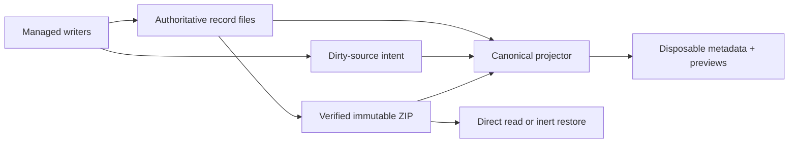

# Portable history, derived discovery, and ZIP retention

**Readable record files and immutable ZIPs are history authority. SQLite metadata
and preview rows are disposable projections that can be rebuilt without losing
history.** The same authority boundary governs discovery, preview, retention,
transfer, and restore.

## Authority, identity, and ownership are separate

A history UUID identifies one transcript across copies, archive, import, restore,
and local alias changes. Spawn and chat IDs are local aliases, and a chat can have
multiple generations. Source locators identify where bytes can currently be read;
they are not the transcript's historical identity.

Runtime ownership is different again. Live process IDs, leases, scopes, and
continuation handles authorize control of a current runtime. When a record is
restored as historical, those fields remain provenance only: restore never turns
foreign runtime ownership back on. This distinction prevents a portable identity
from becoming permission to signal a process or resume a harness.

New record streams are self-identifying and append-only across retries. Attempt
boundaries remain in the transcript; only attempt-scoped diagnostics rotate. If a
native primary transcript is unavailable during execution, a harness provider may
capture it after stop. Rendered reports are never promoted to transcript authority.

## One-way, rebuildable projections

Managed writers publish durable dirty-source intent before changing indexed files.
They do not depend on SQLite to complete the authoritative write. Catch-up captures
a finite marker set, reads authority under the corresponding source lock, commits
the projection, and acknowledges only unchanged marker tokens. Rebuild uses the
same projectors rather than a second interpretation path.

The index can hold discovery metadata, aliases, relationships, independent loose or
ZIP locations, and bounded preview checkpoints. It must not become a full
conversation store or the only copy of any historical fact. Lifecycle, dependency,
reclaim, and conflict decisions return to authoritative files or verified ZIP
members.

A selected snapshot is a content decision, not merely a locator preference. Multiple
physical copies are interchangeable only when they independently verify to the
selected portable digest. If that snapshot is offline, the system may show metadata
or a previously verified preview for the same digest, clearly labeled offline. It
must not silently substitute an older but reachable snapshot.

Rejected alternatives are SQLite FTS, a resident indexing service, a second
transcript parser, and full-conversation caching. They duplicate authority or
interpretation, enlarge repair state, and make a disposable accelerator necessary
for correctness.

## Bounded preview projection

Previews are a selected-row acceleration path, not a new transcript format. The
canonical normalizer used for full reads feeds a bounded accumulator and persists
only recent normalized messages, setup text, clipping state, and a refresh
checkpoint. Ordinary metadata catch-up does not decode bodies. Explicit rebuild may
warm previews through the same path; metadata-only rebuild leaves them cold.

Selection first performs a bounded cache lookup without source reads or catch-up.
Cached content may be shown as updating while a latest-only worker verifies or
refreshes the selected row. ZIP-derived previews are published only after required
members and bytes verify. Preview, selection, and direct archive read never restore
or launch a record.

Incremental checkpoints are limited to Meridian-controlled append-only streams. Two
positions carry different meanings:

- **Consumed extent** is the byte boundary through the last complete event already
  parsed.
- **Observed source size** is the file size witnessed when the checkpoint was made,
  including an incomplete suffix.

Real append growth can change the observed size while resuming from the consumed
extent. New inodes, truncation, same-size rewrites, and false growth invalidate the
checkpoint. Tail witnesses assume controlled append-only growth; they do not prove
an arbitrary prefix rewrite followed by append. External edits require an explicit
rebuild, while mutable native and OpenCode sources refresh from fresh snapshots.

Rejected preview alternatives include caching grouped render entries as if they were
bounded messages, clipping only at render time, parsing the full conversation into
SQLite, adding a second parser, and hashing the full source on every append. The
selected design keeps one interpretation path and treats a checkpoint witness as a
narrow optimization rather than a generic mutation detector.

## Verified publication and short reclaim serialization

Archive capture runs under the shared root gate and source lock. It brackets a full
source hash with exact before/after witnesses covering membership, POSIX identity
and change fields, raw session state, and spawn state. The initial capture and hashes
are reused; reclaim does not add a third full hash pass.

After the ZIP has been published and independently verified, the final exclusive
phase revalidates current protection, dependency closure, activity, ownership, and
the exact witness. A changed source or metadata record keeps loose authority.
Dependents are chosen before dependencies. The exclusive phase then publishes
reclaim intent and atomically retires the aggregate into owned staging. Recursive
cleanup runs only after the root, spawn, and scope locks are released.

Retirement is durable before disposal. Both affected parent directories are synced
before garbage collection removes retirement residue or recovery acknowledges an
absent source. Persistent sync failure leaves the prepared receipt and staging for a
later recovery pass; it does not need a second ledger. A verified published ZIP
remains readable throughout.

Witnesses detect changes after hashing; they never replace checksums. Full hashing
under the final exclusive gate, full hashing once more per reclaim, and recursive
cleanup inside the writer gate were rejected because they serialize unrelated
writers without adding authority. Stat-only verification was also rejected because
metadata cannot prove content bytes.

Previously published immutable archive metadata may contain the single obsolete
capture-fingerprint field. Readers drop only that field at the decode boundary while
still verifying the original ZIP member bytes and all required facts. New records do
not calculate or emit it, and arbitrary unknown fields remain invalid. This narrow
accommodation preserves immutable history; it is not a legacy runtime or parallel
schema.

## Selective restore preserves portable facts

Restore extracts only selected records into private stages, verifies their bytes,
and assigns new local aliases. A durable per-history plan spans publication and the
historical session append so interruption can be retried without activation or
duplication. The ZIP remains in place.

The final short gate revalidates conflicts and a current witness before atomic
publication. Exact raw session facts—including absent optional facts—remain portable
provenance. Local linkage added for an exported or restored capsule does not rewrite
the source's historical identity. Changed content or exact session metadata
conflicts instead of being overwritten.

## Convergence status and provenance

Retention commits `a8592210` and `80c37741` and preview commit `c44a3e81` plus the
observed-size/UI follow-up are approved on the feature branch. They are not released.
Core OpenCode work tracked alongside them is approved at `078d907a`, and its
separately scoped native matrix is complete. Release-equivalent native/Pi closeout
passed for pinned `f56d8131`; later prelaunch corrections and their revalidation do
not change the portable-history decisions on this page.

**Provenance:** `work:next-minor-planning/design/followup-495-497.md`;
`work:next-minor-planning/DIVERGENCE/2026-09-14-preview-reclaim-model-followup.md`;
`work:next-minor-planning/followup-implementation-progress.md`;
`work:next-minor-planning/reviews/496-implementation-followup.md`;
`work:next-minor-planning/reviews/495-final.md`; `spawn:p6053`; `spawn:p6062`.

## Related

- [State-system overview](overview.md)
- [Session state](session-state.md)
- [Spawn state](spawn-state.md)
- [Session-log rendering](../../codebase/session-log-rendering.md)
- [State decisions](../../decisions/state.md)
