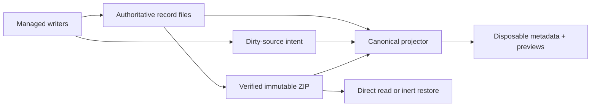

# Portable history, derived discovery, and ZIP retention

**Readable record files and immutable ZIPs are history authority. SQLite metadata
and preview rows are disposable projections that can be rebuilt without losing
history.** The same authority boundary governs discovery, preview, retention,
transfer, and restore.

The retention/index implementation on draft PR #494 has not converged on all of
this contract. Investigation at source `7a2c9b81` found issues #499 and #500; the
repairs below are settled intent, not implemented behavior. Existing suite and CI
results predate those discoveries and do not close them.

## Authority, identity, and ownership are separate

A history UUID identifies one transcript across copies, archive, import, restore,
and local alias changes. Spawn and chat IDs are local aliases, and a chat can have
multiple generations. Source locators identify where bytes can currently be read;
they are not the transcript's historical identity.

Runtime ownership is different again. Live process IDs, leases, scopes, and
continuation handles authorize control of a current runtime. When a record is
restored as historical, those fields remain provenance only: restore never turns
foreign runtime ownership back on. This distinction prevents a portable identity
from becoming permission to signal a process or resume a harness.

New record streams are self-identifying and append-only across retries. Attempt
boundaries remain in the transcript; only attempt-scoped diagnostics rotate.
`history.jsonl` remains stream/retry evidence. A native-primary conversation becomes
portable authority only through a separately qualified atomic snapshot in the same
record aggregate. Rendered reports are never promoted to transcript authority.

## One-way, rebuildable projections

Managed writers publish durable dirty-source intent before changing indexed files.
They do not depend on SQLite to complete the authoritative write. Catch-up captures
a finite marker set, reads authority under the corresponding source lock, commits
the projection, and acknowledges only unchanged marker tokens. Rebuild uses the
same projectors rather than a second interpretation path.

The index can hold discovery metadata, aliases, relationships, independent loose or
ZIP locations, and bounded preview checkpoints. It must not become a full
conversation store or the only copy of any historical fact. Lifecycle, dependency,
reclaim, and conflict decisions return to authoritative files or verified ZIP
members.

A selected snapshot is a content decision, not merely a locator preference. Multiple
physical copies are interchangeable only when they independently verify to the
selected portable digest. If that snapshot is offline, the system may show metadata
or a previously verified preview for the same digest, clearly labeled offline. It
must not silently substitute an older but reachable snapshot.

Rejected alternatives are SQLite FTS, a resident indexing service, a second
transcript parser, and full-conversation caching. They duplicate authority or
interpretation, enlarge repair state, and make a disposable accelerator necessary
for correctness.

## Missing or outdated index initialization

The first operation that needs a missing or incompatible index gets one 15-second
automatic initialization phase, separate from the ordinary two-second query budget.
Reuse the existing catch-up lock and recheck the database plus persisted failure
state after acquiring it. A waiting caller uses a peer's successful publication;
it does not build again.

Workspace/global operations share one initialization deadline across roots. If all
roots are already current, classification and work share the existing ordinary
deadline without a reset. Only a real initialization phase permits a fresh ordinary
deadline afterward. The 5 ms cache-only preview path does not join this gate, open
transcript sources, or initialize anything.

A genuine owned-build failure is recorded atomically outside the replaceable SQLite
directory and suppresses later automatic attempts for the same schema/coordination
generation. Manual metadata rebuild is the explicit retry and clears the failure on
successful metadata publication. Another initializer, lock contention, cancellation,
and crash before a recorded failure are not sticky. Status inspection must not create
coordination state or initiate progress. There is no automatic progress UI, daemon,
second index, or destructive transcript conversion.

This contract responds to a real 1,093-record / 6,077-session corpus: automatic
construction failed under the ordinary budget while explicit metadata construction
finished in 5.68 seconds. Two concurrent missing-index callers also rebuilt twice
serially because current code does not recheck after taking the lock.

## Bounded preview projection

Previews are a selected-row acceleration path, not a new transcript format. The
canonical normalizer used for full reads feeds a bounded accumulator and persists
only recent normalized messages, setup text, clipping state, and a refresh
checkpoint. Ordinary metadata catch-up does not decode bodies. Explicit rebuild may
warm previews through the same path; metadata-only rebuild leaves them cold.

Selection first performs a bounded cache lookup without source reads or catch-up.
Cached content may be shown as updating while a latest-only worker verifies or
refreshes the selected row. ZIP-derived previews are published only after required
members and bytes verify. Preview, selection, and direct archive read never restore
or launch a record.

Incremental checkpoints are limited to Meridian-controlled append-only streams. Two
positions carry different meanings:

- **Consumed extent** is the byte boundary through the last complete event already
  parsed.
- **Observed source size** is the file size witnessed when the checkpoint was made,
  including an incomplete suffix.

Real append growth can change the observed size while resuming from the consumed
extent. New inodes, truncation, same-size rewrites, and false growth invalidate the
checkpoint. Tail witnesses assume controlled append-only growth; they do not prove
an arbitrary prefix rewrite followed by append. External edits require an explicit
rebuild, while mutable native and OpenCode sources refresh from fresh snapshots.

Rejected preview alternatives include caching grouped render entries as if they were
bounded messages, clipping only at render time, parsing the full conversation into
SQLite, adding a second parser, and hashing the full source on every append. The
selected design keeps one interpretation path and treats a checkpoint witness as a
narrow optimization rather than a generic mutation detector.

## Native-primary authority requires a qualified atomic snapshot

Issue #499 has two independent causes:

1. **Preexisting Pi grammar:** native Pi stores nested messages as `type=message`,
   but the canonical parser dispatches its Pi helper only for RPC `message_end`.
   Existing native and retained Pi bytes can therefore render as zero messages. A
   parser/checkpoint-version repair can recover those bytes without rewriting them.
2. **PR-introduced capture and selection:** PR #494 can prefer an existing partial
   stream and treats `history.jsonl` existence as completed capture. A probe archived
   and reclaimed incomplete stream evidence while fuller OpenCode native history
   existed. A message-count fallback would still fail for nonempty prefixes.

Keep stream evidence untouched and publish `native-transcript.jsonl` atomically as
the sole final native snapshot path inside the existing aggregate. This is preferred
to appending begin/body/commit sections to `history.jsonl`: abandoned sections would
need their own recovery protocol and can leak captured conversation into runner/report
evidence. One shared source policy selects the canonical member for log, preview,
search, export, archive, and restore.

Capture must preserve raw provider authority, not only normalized display events.
OpenCode therefore needs a harness-owned raw-row dialect that captures the exact
session and all ordered message/part rows—including IDs, relationships, unsupported
shapes, and original payloads—in one read-only transaction. The current event iterator
is lossy and cannot be used as preservation input. Storage qualification and rendering
support are distinct outcomes.

The snapshot header binds the original portable identity, generation, harness/native
identity, dialect, observation interval/scope and source revision; a final seal binds frame count and digest.
Validation streams bounded frames and checks deadlines between reads. An unread seal,
budget-exhausted prefix, malformed record, or unsupported dialect is partial, corrupt,
or unavailable—not verified empty. Retention requires complete validation before
reclaim, while presentation may expose an explicitly labeled partial prefix.

### Post-stop observation, not exact-stop reconstruction

The selected repair retains the existing post-stop capture path and passes the
completed primary_spawn_id instead of looking up latest cN. It captures a consistent
available native transcript observation, not exact native bytes at a past launch exit.
A delayed observation may include later native continuation; metadata and read views
must state that scope. No provider-wide writer fence, teardown callback or frontier
ledger is added. The earlier F1 exact-stop requirement is superseded, not proven.

Capture still needs exact native identity, full supported scope, strict framing and
positive valid-empty evidence. Missing/ambiguous/known-incomplete native input blocks
new reclaim. OpenCode raw scope is its MessageV2 transcript, not all native state;
Codex capture must follow declared paginated ancestor ranges. Preserve stream bytes
and all required companions. A later external append does not invalidate a completed
immutable capture; archive verification still covers the exact aggregate being removed.

The provider/materializer qualification result distinguishes complete observation,
known incomplete, unavailable and unsupported, with a bounded reason. Existing
lifecycle facts and provider-owned supported-dialect markers reject positively known
unfinished input; possible unobserved late writes do not require an external-writer
proof. Delayed preparation retries that qualification; valid captures stay immutable.

Review p6109 approved the direction with a medium qualification-contract finding.
After the primary corrected that detail, p6110 closed it at design-contract level,
removing the stage 3 and downstream stages 4–5 contract blocker. Implementation and
runtime gates remain open; this is neither a four-provider pass nor publication,
reclaim, or PR-readiness approval. Earlier account exhaustion did not block these
reviews.

## Verified publication and short reclaim serialization

Archive capture runs under the shared root gate and source lock. It brackets a full
source hash with exact before/after witnesses covering membership, POSIX identity
and change fields, raw session state, and spawn state. The initial capture and hashes
are reused; reclaim does not add a third full hash pass.

After the ZIP has been published and independently verified, the final exclusive
phase revalidates current protection, dependency closure, activity, ownership, and
the exact witness. A changed source or metadata record keeps loose authority.
Dependents are chosen before dependencies. The exclusive phase then publishes
reclaim intent and atomically retires the aggregate into owned staging. Recursive
cleanup runs only after the root, spawn, and scope locks are released.

Retirement is durable before disposal. Both affected parent directories are synced
before garbage collection removes retirement residue or recovery acknowledges an
absent source. Persistent sync failure leaves the prepared receipt and staging for a
later recovery pass; it does not need a second ledger. A verified published ZIP
remains readable throughout.

Witnesses detect changes after hashing; they never replace checksums. Full hashing
under the final exclusive gate, full hashing once more per reclaim, and recursive
cleanup inside the writer gate were rejected because they serialize unrelated
writers without adding authority. Stat-only verification was also rejected because
metadata cannot prove content bytes.

Previously published immutable archive metadata may contain the single obsolete
capture-fingerprint field. Readers drop only that field at the decode boundary while
still verifying the original ZIP member bytes and all required facts. New records do
not calculate or emit it, and arbitrary unknown fields remain invalid. This narrow
accommodation preserves immutable history; it is not a legacy runtime or parallel
schema.

## Selective restore preserves portable facts

Restore extracts only selected records into private stages, verifies their bytes,
and assigns new local aliases. A durable per-history plan spans publication and the
historical session append so interruption can be retried without activation or
duplication. The ZIP remains in place.

The final short gate revalidates conflicts and a current witness before atomic
publication. Exact raw session facts—including absent optional facts—remain portable
provenance. Local linkage added for an exported or restored capsule does not rewrite
the source's historical identity. Changed content or exact session metadata
conflicts instead of being overwritten.

New portable records explicitly declare their canonical transcript member and bind
an immutable original capture descriptor into the versioned portable digest. Restore
may remap local aliases and clear live native ownership, but rearchive must carry that
original descriptor unchanged. The required round trip is archive -> restore ->
rearchive -> restore with the original native store and first ZIP unavailable. Old
archives keep their implicit `history.jsonl` member and original digest recipe; they
are never rewritten or given fabricated descriptors.

## Convergence status and provenance

Retention commits `a8592210` and `80c37741` and preview commit `c44a3e81` plus the
observed-size/UI follow-up are approved on the feature branch. They are not released.
Core OpenCode work tracked alongside them is approved at `078d907a`, and its
separately scoped native matrix is complete. Release-equivalent native/Pi closeout
passed for pinned `f56d8131`; later prelaunch corrections and their revalidation do
not change the portable-history decisions on this page.

Those earlier approvals do not cover #499/#500. PR #494 is draft; all repair work
remains in that PR and #498 is excluded. Initialization and the minimal Pi parser/cache
repair can proceed independently. Native capture/reclaim follows the selected
post-stop observation contract; integrated correctness is not yet established. The F2–F5 contract revisions (raw
OpenCode preservation, repeated-portability descriptor, warm deadline accounting,
and bounded validation outcome) were accepted by reviewer p6104 at design-contract
level only; no implementation/runtime approval was given.

**Provenance:** `work:next-minor-planning/design/followup-495-497.md`;
`work:next-minor-planning/DIVERGENCE/2026-09-14-preview-reclaim-model-followup.md`;
`work:next-minor-planning/followup-implementation-progress.md`;
`work:next-minor-planning/reviews/496-implementation-followup.md`;
`work:next-minor-planning/reviews/495-final.md`; `spawn:p6053`; `spawn:p6062`.
Investigation update: `work:next-minor-planning/investigation-499-500.md`;
`work:next-minor-planning/design/history-repair-plan.md`;
`work:next-minor-planning/design/index-initialization.md`;
`work:next-minor-planning/design/native-transcript-capture.md`;
`work:next-minor-planning/reviews/repair-design-review.md`;
`work:next-minor-planning/DIVERGENCE/post-stop-capture-scope.md`;
`work:next-minor-planning/reviews/post-stop-scope-review.md`; `spawn:p6109`; `spawn:p6110`.

## Related

- [State-system overview](overview.md)
- [Session state](session-state.md)
- [Spawn state](spawn-state.md)
- [Session-log rendering](../../codebase/session-log-rendering.md)
- [State decisions](../../decisions/state.md)
