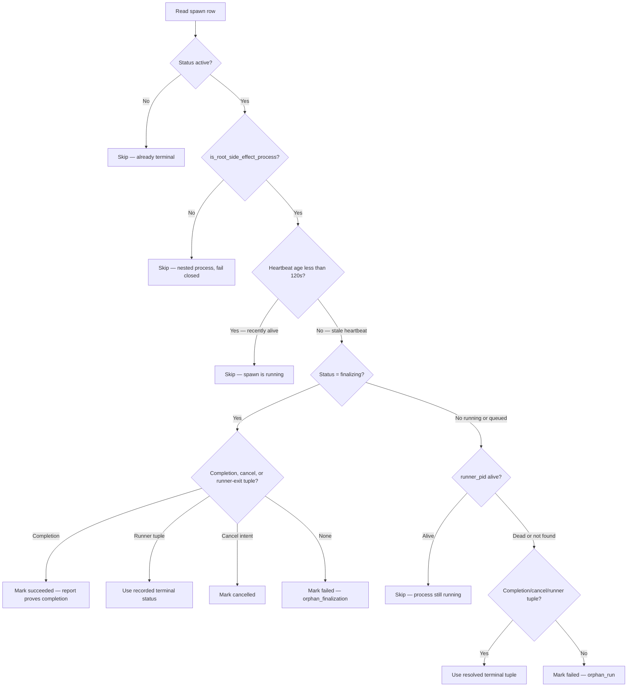

# Reconciliation

Meridian no longer lets ordinary read surfaces terminate processes as a side effect.
The state layer has two reconciliation shapes:

- **Read-time projection** — `reconcile_spawns()` and
  `peek_reconciled_active_spawn()` return an in-memory view of stale active spawns
  for list/show/wait/dashboard and descendant-work checks. They do not write
  `state.json`, mark scopes released, or send process signals.
- **Explicit reconciliation repair** — `reconcile_active_spawn()` writes terminal
  state and runs process-scope cleanup. It is called by `meridian doctor
  --kill-orphans` and by the primary-launch background repair thread, both gated to
  root side-effect processes.

Both paths use the same liveness decision rules. Side effects run only from the
explicit path and only at clear root depth — `MERIDIAN_DEPTH` absent, empty, or
`"0"`. Nested processes and malformed depth values fail closed.

**Decision/IO split:** Reconciliation separates the decision step (pure, no I/O) from the action step (writes terminal state and cleans scopes). This lets read-time projection reuse the same decision logic without filesystem mutation.

**Finalize-first cleanup claims:** `reconcile_active_spawn()` snapshots exact cleanup targets into `reaper_cleanup_claim.json` under the spawn lock before persisting terminal state, then terminates the claimed scopes using birth-validated signals. This finalize-first order makes state convergence independent of slow cleanup: a crash leaves a durable claim for the next doctor pass. A separate stable cleanup lock (`locks/reaper-cleanup/<id>.lock`) prevents concurrent reapers from double-signalling. Terminal rows retain failed claims for retry. A runner-origin terminal write clears a reconciler claim without signalling because runner authority supersedes reconciler cleanup intent.

### Liveness Check Sequence

PID reuse guard: the runner records `runner_pid` and `runner_created_at_epoch`. If `psutil` finds a process with that PID but a different birth time, it is a different process — treat the original runner as dead.

`has_durable_report_completion(report_text)` returns True for non-empty report that is not a terminal control frame (`cancelled`/`error` JSON). Used by both reconciliation paths and runner-side terminal resolution to determine if a report artifact proves success.

## Related Pages

- [State system overview](overview.md) — state roots and subsystem map
- [Spawn state](spawn-state.md) — spawn status machine and terminal authority
- [Durability and locking](durability-and-locking.md) — lock ordering and atomic publication
