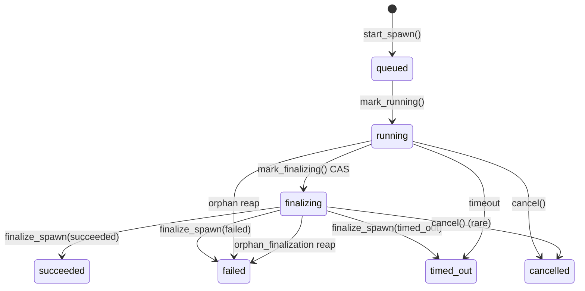

# Spawn State

Since the 2026-05 spawn-state-v2 layout migration, spawn state lives in individual
`state.json` files — one per spawn — rather than a single global `spawns.jsonl` event
log. The layout name is historical; published rows now use schema v3, with a
one-shot read upgrade for legacy v2 rows.

**Why the migration:** the production global event log had grown enough that
every status read replayed substantial project history. Per-spawn `state.json`
makes an individual read O(1), independent of total event history. The dataset
and before/after measurements are recorded once below.

**Measured migration result:** in the production dataset that triggered the
migration (about 189 MB / 35,000 events), primary launch fell from 12–13 seconds
to 0.67 seconds and `list_spawns()` measured about 386 ms across roughly 4,000
spawn files. Provenance: `work:spawn-state-v2`, benchmark notes from the May
2026 state-v2 campaign. These historical measurements are not current
performance guarantees.

### Spawn Status Machine

Status progression is v2 per-spawn state plus the current terminal set:

Terminal statuses are `succeeded`, `failed`, `cancelled`, and `timed_out`. `timed_out` is a failure class distinct from generic `failed`, so user-facing filters and statistics can separate deadline failures from other errors. `SpawnStatus` is a `StrEnum` (`core/domain.py`); lifecycle sets are derived from a member→class map.

Lifecycle evidence is nested into frozen sub-models (`RunnerExitFacts`, `TerminalFacts`). Top-level `status` is the sole status authority; `TerminalFacts` carries exit code, timestamps, metrics, error, and origin but does not repeat status. When `status` is terminal, `terminal` must not be `None`; active rows must not carry `terminal`. `StoredSpawnState` uses `extra="forbid"`, so persisted rows with a nested `terminal.status` or stale flat fields are quarantined. Collection reads partition valid rows from quarantine reports in immutable `SpawnScan` envelopes. See [spawn-finalization.md](../spawn-finalization.md) for the discriminated facts schema and quarantine contract.

**Terminal writes use the projection authority rule**: a runner-origin terminal write supersedes a reconciler-origin write on the same spawn. See [spawn-finalization.md](../spawn-finalization.md) for the full authority lattice.

`mark_finalizing()` is a compare-and-swap from `running` → `finalizing`. It narrows the reaper's target from the full execution window to the drain/report window, enabling `orphan_finalization` vs `orphan_run` distinction.

### Locked Mutation Seam

Every update to a published spawn calls `write_state_locked()`. It acquires the stable per-spawn lock at `locks/spawns/<id>.lock`, re-reads current `state.json`, applies a pure mutator function, and writes atomically. There is no public unlocked write path — the prior two-tier model (owner writes without lock / external writes with lock) was collapsed in PR #422 to eliminate the convention-enforced split that was the root cause of every reproduced lost-update bug.

`start_spawn()` creates the initial `state.json` under the global `spawns_flock`, where ID reservation is also serialized. Once a spawn row is published, all subsequent mutations go through `write_state_locked()`.

The same mutate-under-lock shape applies across all stores:
- **Spawn state**: `write_state_locked()` — `locks/spawns/<id>.lock`
- **Archived spawns**: `mutate_archived_spawns()` — `locks/archived-spawns.lock`
- **Work items**: `_mutate_item()` in `work_repository.py` — `work-store.flock`
- **Hook intervals**: `run_if_due()` — `locks/hooks/<name>.lock`
- **Scope projections**: `_mutate_scope_projection()` (private) — `locks/process-scopes/<id>.lock`
- **Autosync**: `transaction()` — canonical sync-root lock path
- **Published-spawn deletion**: `delete_published_spawn()` — same per-spawn lock

These seams are behavior-preserving contracts: a planned future store rewrite (typed state, store scaling) inherits the same lock-acquire / re-read / pure-mutate / atomic-write shape.

### Published Spawn Artifact Lifetime

The published `state.json` row owns the lifetime of every artifact under its
spawn directory. Once that row is gone, no signal, journal, history record,
diagnostic, metadata file, heartbeat, connection, or process-scope registration
may recreate or change the aggregate.

`spawn_aggregate.py` gives deletion and late writers one ordering boundary:

1. `mutate_published_spawn_artifact()` acquires
   `locks/spawns/<id>.lock`.
2. It re-reads `spawns/<id>/state.json` while holding the lock.
3. It optionally evaluates a current-row predicate, such as `status == failed`.
4. It performs the supplied artifact mutation or returns `False` without
   touching the spawn directory.
5. `delete_published_spawn()` takes the same outer lock before removing the
   directory.

If the writer wins, deletion waits and then removes the complete aggregate. If
deletion wins, the writer observes no published row and fails closed. Artifact-
specific locks remain nested inside the spawn lock. Heartbeats are the lighter
case: they never create their parent and stop when deletion makes the path
disappear. Harness connection startup and process adoption likewise require an
already-published directory rather than creating one.

This seam belongs above the persistence leaves because low-level atomic and
JSONL writers cannot decide whether a spawn is still published. See the
[state decision](../../decisions/state.md#published-row-lifetime-owns-spawn-artifacts-issue-437-2026-07)
for the rejected alternatives and rationale.

### Migration: ensure_v2_format()

`state/spawn/migration.py:ensure_v2_format()` performs a one-shot lazy migration on first access to a runtime root:

1. If `spawns/v2-format.json` marker exists → already migrated, return immediately (in-process cache hit after first check).
2. If no legacy `spawns.jsonl` exists → write marker and return (fresh install, nothing to migrate).
3. Under `spawns/migration.lock`: replay legacy `spawns.jsonl`, write `state.json` + `starting-prompt.md` for every spawn, write marker, rename legacy files to `spawns.legacy-v1.jsonl`.

**No quiescence gate.** The migration does not wait for active spawns to finish before migrating. Stragglers are handled by reconciliation: read surfaces can project a stale runner as terminal, and explicit repair paths can finalize it durably. The decision to drop the quiescence gate was deliberate: users always have running spawns, so a gate that requires a quiet runtime would never trigger in practice.

**Migration lock for process safety.** Multiple processes starting simultaneously converge: second process reads the marker after first writes it and skips migration. The `migration.lock` file prevents double-migration, not quiescence.

### Legacy V1 JSONL (Reference)

The original design used a global `spawns.jsonl` event log. Events were appended and state was derived by replaying all events for a spawn. This made crash tolerance structural (truncated lines are skippable) but O(n) in total spawn history. V1 files are archived to `spawns.legacy-v1.jsonl` on migration and are no longer read by active code.

## Related Pages

- [State system overview](overview.md) — state roots and subsystem map
- [Session state](session-state.md) — the separate session journal and index projection
- [Spawn finalization](../spawn-finalization.md) — terminal facts, authority lattice, and quarantine contract
- [State decisions](../../decisions/state.md) — migration and concurrency rationale
