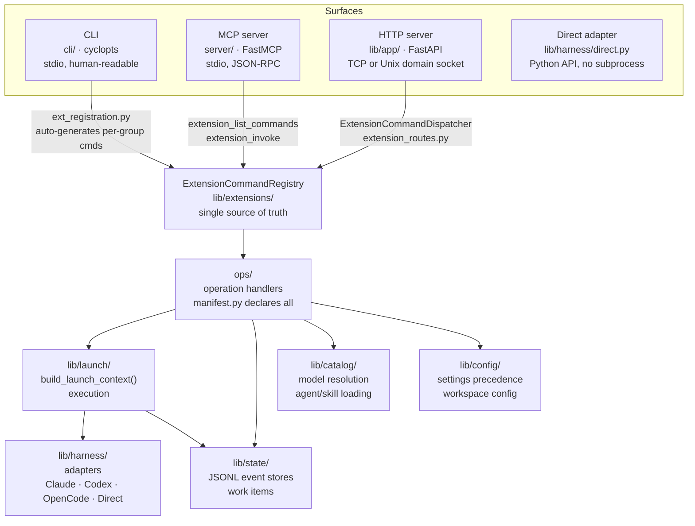
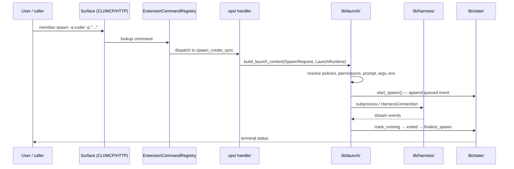
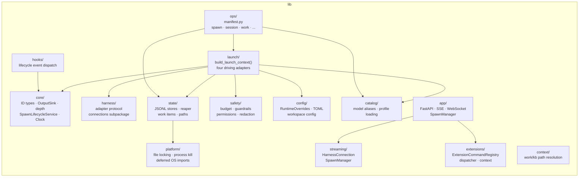

# Architecture: System Overview

Meridian exposes one coordination layer through three external surfaces and one in-process adapter. All surfaces share a single extension registry — no duplicated command definitions. User requests flow through launch and land in state; the state layer is the only durable record.

## Surface Map

## Entry Points

| Surface | Entry point | Transport | Auth |
|---------|-------------|-----------|------|
| CLI | `meridian` (cyclopts) + `ext_cmd.py` | stdio | n/a |
| MCP | `meridian serve` (FastMCP) | stdio, JSON-RPC | n/a |
| HTTP | `lib/app/server.py` (FastAPI) | TCP / Unix socket | Bearer token |
| Direct | `DirectAdapter.execute()` | Python call | n/a |

The MCP server exposes exactly **two tools**: `extension_list_commands` and `extension_invoke`. The HTTP server adds discovery routes (no auth) and invoke routes (Bearer token). The CLI auto-generates per-group commands from the registry via `ext_registration.py`. All three call the same underlying `sync_handler` or `ExtensionCommandDispatcher`.

## Data Flow: User Request → State

## Key Subsystems

## Extension System as Single Source of Truth

`ops/manifest.py` declares every user-facing operation as an `ExtensionCommandSpec` via `ExtensionCommandSpec.from_op()`. The registry becomes the authority — no command can exist in the CLI but not the MCP server, or vice versa. Surface membership controls reachability per surface.

This design means:
- Adding a new command = define an `ExtensionCommandSpec` in `manifest.py`
- Removing legacy wiring = delete old CLI registration; registry takes over
- Command documentation = queryable via `extension_list_commands`

## Related Pages

- [launch-system.md](launch-system.md) — composition factory, four driving adapters
- [state-system.md](state-system.md) — event store internals, reaper
- [app-server.md](app-server.md) — FastAPI factory, SSE, WebSocket
- [../codebase/guide.md](../codebase/guide.md) — how to navigate and change things
