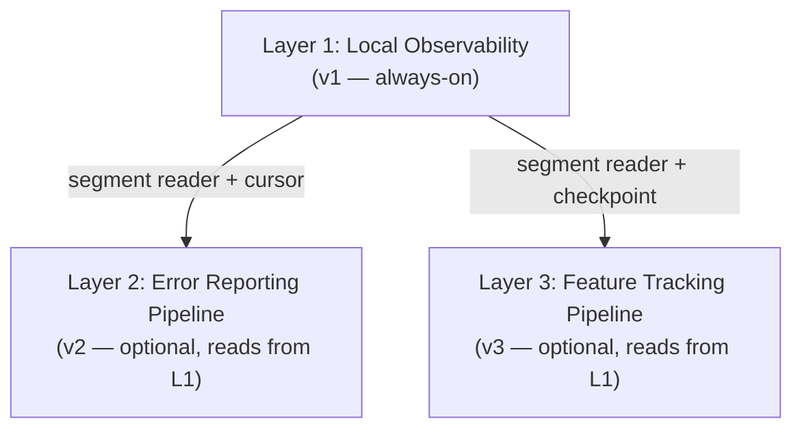
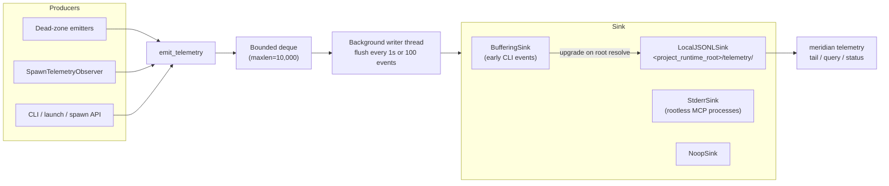

# Telemetry Architecture: Overview

The telemetry system is a three-layer observability spine that fills Meridian's observability dead zones — areas where existing stores (`spawns/<id>/state.json`, `sessions.jsonl`, `chat/<id>/history.jsonl`) are silent — without duplicating what those stores already capture.

**Related:**
- [concepts/state-model.md](../../concepts/state-model.md) — dual-root state model the telemetry layer sits alongside
- [architecture/state-system.md](../state-system.md) — existing JSONL stores
- [codebase/observability.md](../../codebase/observability.md) — structured logging and debug tracing
- [decisions/telemetry.md](../../decisions/telemetry.md) — why this architecture, rejected alternatives

---

## Three Layers



**Layer 1 — Local Observability (v1, always-on):** Unified local event log. All dead-zone events, lifecycle correlation markers, runtime self-observation, and usage signals land here. Never leaves the machine. Queryable via `meridian telemetry tail/query/status`.

**Layer 2 — Error Reporting Pipeline (v2, optional):** Reads from the local log via a segment follower with a durable cursor. Produces structured incident reports with stack traces, spawn tree state, and correlation IDs. Not yet implemented.

**Layer 3 — Feature Tracking Pipeline (v3, optional):** Reads from the local log, aggregates `usage`-tagged events into anonymized counters, uploads in batches. Not yet implemented.

### Readers, not sinks

v2 and v3 consume telemetry by **reading** local JSONL segments — they are not `TelemetrySink` implementations wired into the write path. This preserves v1's fire-and-forget failure budget and keeps consent and export logic in reader components. See [decisions/telemetry.md#d61-tel](../../decisions/telemetry.md#d61-tel).

---

## Subsystem Map

| Page | What it covers |
|---|---|
| [local-persistence.md](local-persistence.md) | `LocalJSONLSink`, segment naming, rotation, `BufferingSink` upgrade pattern |
| [event-catalog.md](event-catalog.md) | `TelemetryEnvelope`, `EVENT_REGISTRY`, domains, concern classification, validation |
| [reader-and-query.md](reader-and-query.md) | Segment discovery, `read_events()`, `tail_events()`, query filters, status, retention |

---

## Write Path at a Glance



`emit_telemetry()` never blocks and never raises. Events are enqueued to a bounded `deque`; if the queue is full the oldest event is dropped and a drop counter increments.

---

## What the Telemetry Layer Captures (v1)

The telemetry stream carries only content the existing stores don't capture. See [decisions/telemetry.md#d65](../../decisions/telemetry.md#d65) for the separation rationale.

**New dead-zone events:**

| Area | Events |
|---|---|
| Chat HTTP transport | `chat.http.request_completed` |
| WebSocket lifecycle | `chat.ws.connected`, `chat.ws.disconnected`, `chat.ws.rejected` |
| Command dispatch | `chat.command.dispatched` |
| Chat runtime shutdown | `chat.runtime.stopping`, `chat.runtime.stopped` |
| Dev frontend subprocess | `dev_frontend.launched`, `dev_frontend.ready`, `dev_frontend.readiness_timeout`, `dev_frontend.exited` |
| MCP local commands | `mcp.command.invoked` |
| Work item transitions | `work.started`, `work.updated`, `work.done`, `work.deleted`, `work.reopened`, `work.renamed` |
| Stream backpressure | `runtime.stream_event_dropped` |
| Debug tracer self-disable | `runtime.debug_tracer_disabled` |

**Sparse lifecycle correlation markers** — terminal spawn events only:
- `spawn.succeeded`, `spawn.failed`, `spawn.cancelled`, `spawn.process_exited`

**Usage foundation (v3 feedstock):**
- `usage.command.invoked`, `usage.model.selected`, `usage.spawn.launched`

**What stays in existing stores (not mirrored):** Full spawn lifecycle → `spawns/<id>/state.json` plus spawn artifacts. Session events → `sessions.jsonl`. Chat turns → `chat/<id>/history.jsonl`.

---

## Module Layout

```
src/meridian/lib/telemetry/
  __init__.py        # emit_telemetry(), init_telemetry(), BufferingSink (re-exported)
  events.py          # TelemetryEnvelope + EVENT_REGISTRY
  router.py          # TelemetryRouter — bounded queue, background writer
  sinks.py           # TelemetrySink protocol, BufferingSink, NoopSink, StderrSink
  local_jsonl.py     # LocalJSONLSink — compound-named segments, rotation
  init.py            # setup_telemetry() per-process-type entry points
  observer.py        # SpawnTelemetryObserver
  observers.py       # Lifecycle observer registry
  retention.py       # Startup cleanup: liveness, age/size caps
  reader.py          # Truncation-tolerant segment reader, tail follower
  query.py           # Filter and query logic
  status.py          # TelemetryStatus, compute_status()

src/meridian/cli/telemetry_cmd.py    # tail, query, status CLI commands
src/meridian/lib/state/liveness.py   # is_spawn_genuinely_active()
```
