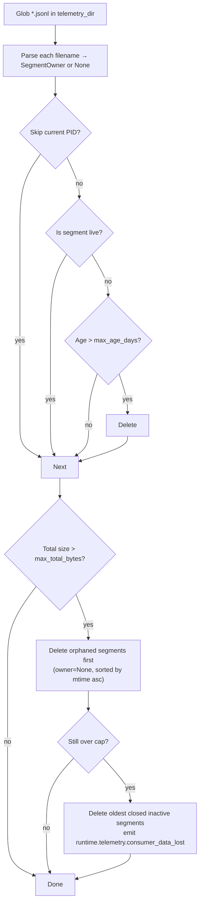

# Telemetry: Reader, Query, and Retention

The read path covers segment discovery, truncation-tolerant event reading, live tailing, query filtering, status summarization, and startup retention cleanup. All components are in `src/meridian/lib/telemetry/`.

**Related:**
- [local-persistence.md](local-persistence.md) — how segments are written
- [event-catalog.md](event-catalog.md) — envelope schema and domain reference
- [decisions/telemetry.md](../../decisions/telemetry.md) — D69 (spawn liveness), D70 (global discovery)

---

## Segment Discovery

`discover_segments(telemetry_dir: Path) -> list[Path]` in `reader.py`:

- Globs `*.jsonl` in the given directory
- Sorts results by `mtime` ascending (oldest first)
- Silently skips segments that raise `OSError` on stat

Returns an empty list if `telemetry_dir` is not a directory.

---

## Reading Events

`read_events()` in `src/meridian/lib/telemetry/reader.py` is the single-segment, truncation-tolerant reader:

```python
def read_events(
    path: Path,
    *,
    since_ts: str | None = None,
    domain: str | None = None,
    ids_filter: dict[str, str] | None = None,
) -> Generator[dict[str, Any], None, None]:
```

Behavior:
- Opens the file in read mode, iterates lines
- Strips whitespace, skips blank lines
- Silently skips lines that fail `json.loads()` — truncation-tolerant
- Applies filters before yielding
- Returns without raising on `OSError`

### Filter semantics

| Parameter | Behavior |
|---|---|
| `since_ts` | Skips events where `envelope["ts"] < since_ts` (ISO-8601 string comparison) |
| `domain` | Keeps only events where `envelope["domain"] == domain` |
| `ids_filter` | Keeps only events where all `key=value` pairs match `envelope["ids"]`; events with no `ids` field are excluded |

Filters are evaluated as AND conditions.

---

## Live Tailing

`tail_events()` in `reader.py` follows live segments like `tail -f`, but across rotating JSONL files:

```python
def tail_events(
    telemetry_dir: Path | list[Path],
    *,
    domain: str | None = None,
    ids_filter: dict[str, str] | None = None,
    poll_interval: float = 1.0,
) -> Generator[dict[str, Any], None, None]:
```

Mechanism:
1. On entry: discovers all current segments, records each file's current size as initial offset in `seen_files: dict[Path, int]`
2. Poll loop: re-discovers segments each iteration
3. For each segment: if current size > stored offset, seeks to offset, reads new lines, updates offset
4. If no new events found in this poll, sleeps `poll_interval` seconds (default 1.0s)
5. Applies `domain` and `ids_filter` to each line before yielding

New segments created after tailing begins are picked up automatically — they appear in the next `discover_segments()` call with an initial offset of 0.

Accepts either a single `Path` or a `list[Path]` to tail multiple telemetry directories simultaneously (used by `--global`).

---

## Query

`query_events()` in `src/meridian/lib/telemetry/query.py` merges events across all segments in a directory, applying combined filters:

```python
def query_events(
    telemetry_dirs: list[Path],
    *,
    since: str | None = None,
    domain: str | None = None,
    ids_filter: dict[str, str] | None = None,
    limit: int | None = None,
) -> list[dict[str, Any]]:
```

`parse_since()` converts human time offsets to ISO-8601 cutoffs:
- `Ns` → N seconds ago
- `Nm` → N minutes ago
- `Nh` → N hours ago
- `Nd` → N days ago

Segments are sorted by mtime before reading. Results accumulate from all segments across all provided directories; `limit` truncates the output list.

---

## Status

`compute_status()` in `src/meridian/lib/telemetry/status.py` produces a `TelemetryStatus` summary:

```python
@dataclass(frozen=True)
class TelemetryStatus:
    telemetry_dir: Path | list[Path]
    segment_count: int
    total_bytes: int
    active_writers: list[str]   # e.g. ["cli.12345", "p42.7812"]
    legacy_segments: int = 0
    rootless_note: str = ROOTLESS_LIMITATION_NOTE
```

**Active writer detection** uses owner-aware liveness:

| Segment owner | Liveness check |
|---|---|
| `cli` or `chat` | `is_process_alive(pid)` — raw OS process existence |
| Spawn ID (e.g., `p42`) | `is_spawn_genuinely_active(segment_runtime_root, spawn_id)` — spawn store + heartbeat |

For global status, `segment_runtime_root` is derived from the segment's path (`segment.parent.parent`) so liveness is checked against the owning project's runtime state, not the current project.

`TelemetryStatus.total_size_human` formats bytes as B, KB, or MB.

**Legacy segments:** `~/.meridian/telemetry/` segments are counted in `legacy_segments`. They have no active writers and age out naturally.

**Rootless limitation:** MCP stdio server processes emit to stderr only (`StderrSink`). They produce no JSONL segments and are outside the scope of status reporting. `ROOTLESS_LIMITATION_NOTE` is always included in the status output.

---

## Retention Cleanup

`run_retention_cleanup()` in `src/meridian/lib/telemetry/retention.py` runs at `LocalJSONLSink` initialization (startup cleanup). It is synchronous and blocks sink construction briefly.

### Defaults

| Parameter | Default |
|---|---|
| `max_age_days` | 7 days |
| `max_total_bytes` | 100 MB (100,000,000 bytes) |

### Cleanup steps



1. **Parse** every `*.jsonl` filename into `SegmentOwner(logical_owner, pid)` or `None`
2. **Skip** the current PID (cannot delete own active file)
3. **Skip** live segments (see liveness rules below)
4. **Age cleanup:** delete non-live segments older than `max_age_days`
5. **Size cap:** if total remaining size exceeds `max_total_bytes`, delete orphaned segments first (those with `owner=None`); if still over cap, delete oldest closed inactive segments and emit `runtime.telemetry.consumer_data_lost`

### Liveness rules

| Segment type | How `live` is determined |
|---|---|
| Owner is current PID | Always live |
| `cli` or `chat` owner | `is_process_alive(owner.pid)` |
| Spawn ID owner, `runtime_root` known | `is_spawn_genuinely_active(runtime_root, owner.logical_owner)` |
| Spawn ID owner, no `runtime_root` | `is_process_alive(owner.pid)` (fallback) |
| `owner is None` (legacy/unparseable) | Always orphaned (not live) |

`is_spawn_genuinely_active()` in `lib/state/liveness.py` uses three signals: (1) spawn store status must be `queued`, `running`, or `finalizing`; (2) runner PID alive if present; (3) heartbeat file modified within 120 seconds. This prevents false-orphaning during the spawn's finalizing window. See [decisions/telemetry.md#d69](../../decisions/telemetry.md#d69).

### Types

```python
@dataclass(frozen=True)
class SegmentOwner:
    logical_owner: str    # "cli", "chat", or spawn ID
    pid: int

    @property
    def is_cli_or_chat(self) -> bool:
        return self.logical_owner in ("cli", "chat")

@dataclass(frozen=True)
class SegmentInfo:
    path: Path
    owner: SegmentOwner | None
    size: int
    mtime: float
    live: bool

    @property
    def orphaned(self) -> bool:
        return self.owner is None
```

`parse_segment_owner(path)` parses compound filenames. Legacy `<pid>-<seq>.jsonl` filenames return `None`.

---

## CLI Surface

```bash
# Tail events from the current project
meridian telemetry tail
meridian telemetry tail --domain=chat
meridian telemetry tail --spawn=p42
meridian telemetry tail --json          # raw JSONL output

# Tail across all projects (point-in-time directory walk)
meridian telemetry tail --global

# Query events with filters
meridian telemetry query --since=1h --domain=spawn
meridian telemetry query --spawn=p42 --event=spawn.failed
meridian telemetry query --global

# Status: sink health, segment count, total size
meridian telemetry status
meridian telemetry status --global
```

**`--global` discovery:** `_resolve_telemetry_dirs()` in `src/meridian/cli/telemetry_cmd.py` walks `~/.meridian/projects/*/telemetry/` at invocation time. Also includes `~/.meridian/telemetry/` (legacy user-home segments) if that directory exists. Point-in-time snapshot — not subscribed. See [decisions/telemetry.md#d70](../../decisions/telemetry.md#d70).

**`--spawn` filter:** Translates to an `ids_filter={"spawn_id": spawn_id}` passed to `query_events()` or `tail_events()`.
