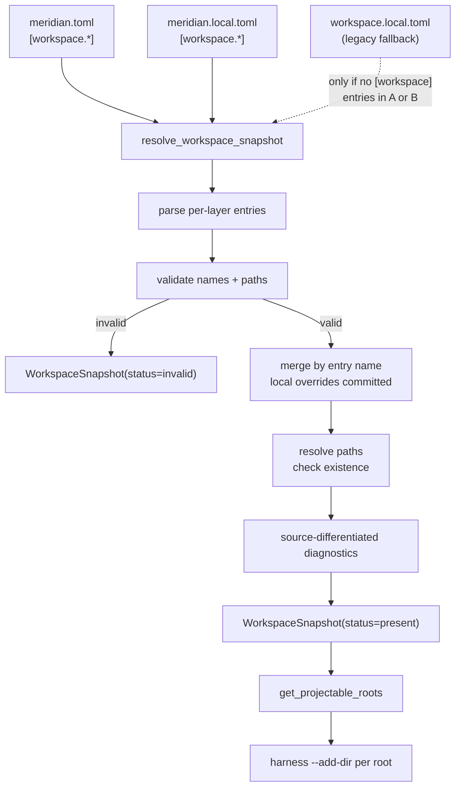

# Workspace Resolution

`resolve_workspace_snapshot()` is the single entry point that reads config files, merges layers, evaluates paths, and produces a `WorkspaceSnapshot`. This page describes the merge algorithm, snapshot types, path evaluation, and how the snapshot flows to launch.

See [decisions/workspace.md](../../decisions/workspace.md#d44) for why missing-path behavior is source-differentiated.

---

## Resolution Entry Points

| Function | Location | Purpose |
|---|---|---|
| `resolve_workspace_snapshot(project_root)` | `src/meridian/lib/config/workspace.py` | Full resolution; returns `WorkspaceSnapshot` |
| `load_workspace_config(project_root)` | `src/meridian/lib/config/workspace.py` | Returns merged raw `[workspace]` table or `None` (moved from `state/paths.py` in Phase 8.6) |
| `resolve_workspace_snapshot_for_launch(project_root)` | `src/meridian/lib/launch/workspace.py` | Calls `resolve_workspace_snapshot`, raises on `status == "invalid"` |
| `get_projectable_roots(snapshot)` | `src/meridian/lib/config/workspace.py` | Returns ordered enabled+existing `Path` tuple |

---

## Resolution Flow



---

## Merge Algorithm

The loader reads `[workspace]` tables from both `meridian.toml` and `meridian.local.toml`. Entries are merged by name:

1. Start with committed entries in their file order.
2. For each local entry:
   - If the name exists in committed: replace the entry entirely (path override).
   - If the name is local-only: append after all committed entries.
3. Projection order is deterministic: committed-file order, then local-only entries in local-file order.

The merge uses `_merge_nested_dicts` (in `src/meridian/lib/config/workspace.py`), which recursively merges nested dicts — overrides replace values at each key. This helper was moved from `state/paths.py` into `config/workspace.py` during Phase 8.6 to consolidate workspace table ownership in the config layer.

Each resolved root records where it came from:

| `source` value | Meaning |
|---|---|
| `"committed"` | Name exists only in `meridian.toml` |
| `"local"` | Name exists only in `meridian.local.toml` |
| `"merged"` | Name exists in both; local path was applied |
| `"legacy"` | Entry came from `workspace.local.toml` fallback |

---

## Path Evaluation

After merging, each entry's `path` is resolved to an absolute path:

```python
candidate = Path(declared_path).expanduser()
if not candidate.is_absolute():
    candidate = project_root / candidate
return candidate.resolve()
```

`project_root` is the directory containing `meridian.toml`. The resolved absolute path is stored in `ResolvedWorkspaceRoot.resolved_path`. Existence is checked via `resolved_path.is_dir()` at resolution time.

---

## Source-Differentiated Missing-Path Behavior

Missing paths (directory does not exist on disk) are handled differently depending on their source:

| Source | Path doesn't exist | Finding emitted? |
|---|---|---|
| `"committed"` | Silently excluded from projection | No |
| `"local"` or `"merged"` | Excluded from projection | Yes — `workspace_local_missing_root` |

A committed path that doesn't exist means the developer hasn't checked out that repo — normal in partial setups. A local path that doesn't exist means the developer wrote a path on this machine that can't be found — almost certainly a typo or stale config. See [decisions/workspace.md#d44](../../decisions/workspace.md#d44).

---

## Snapshot Types

```python
class ResolvedWorkspaceRoot(BaseModel):
    model_config = ConfigDict(frozen=True)

    name: str                            # entry name from TOML key
    declared_path: str                   # path string from config
    resolved_path: Path                  # absolute resolved path
    enabled: bool                        # always True in new schema; legacy may be False
    exists: bool                         # resolved_path.is_dir() at resolution time
    source: WorkspaceRootSource          # "committed" | "local" | "merged" | "legacy"

class WorkspaceSnapshot(BaseModel):
    model_config = ConfigDict(frozen=True)

    status: WorkspaceStatus              # "none" | "present" | "invalid"
    source_paths: tuple[Path, ...]       # config files that contributed entries
    roots: tuple[ResolvedWorkspaceRoot, ...]
    findings: tuple[WorkspaceFinding, ...]
```

`WorkspaceSnapshot` is immutable (frozen). Consumers read it; they do not mutate it.

### Status Values

| Status | Meaning |
|---|---|
| `"none"` | No workspace config found in any file |
| `"present"` | Config parsed successfully; roots resolved |
| `"invalid"` | Parse or validation error; blocks launch |

### Computed Properties

```python
snapshot.roots_count          # total roots
snapshot.enabled_roots_count  # enabled roots (all in new schema)
snapshot.missing_roots_count  # enabled roots where exists == False
```

---

## Projectable Roots

`get_projectable_roots(snapshot)` filters the snapshot to roots ready for harness injection:

```python
def get_projectable_roots(snapshot: WorkspaceSnapshot) -> tuple[Path, ...]:
    return tuple(
        root.resolved_path
        for root in snapshot.roots
        if root.enabled and root.exists
    )
```

Only `enabled == True` and `exists == True` roots are returned. The order matches the merge order (committed first, then local-only).

---

## Doctor Findings

| Finding code | Severity | Condition |
|---|---|---|
| `workspace_invalid` | Blocks launch | Schema error, parse failure, missing `path` field |
| `workspace_unknown_key` | Warning | Unknown field in an entry |
| `workspace_local_missing_root` | Warning | Local/merged entry path does not exist |
| `workspace_legacy_file_present` | Warning | `workspace.local.toml` exists when new config is present |
| `workspace_deprecated_legacy` | Warning | `workspace.local.toml` is in use (no new config) |

`workspace_invalid` is the only finding that blocks launch. All others are surfaced by `meridian doctor` and `meridian config show`.

---

## Config Show Output

```text
workspace.status = present
workspace.sources = ["meridian.toml", "meridian.local.toml"]
workspace.roots.count = 3
workspace.roots.projected = 2
workspace.roots.skipped = 1     # committed path not found — normal partial checkout
workspace.applicability.claude = active
```

Verbose/JSON mode adds per-root detail: `name`, `source`, `declared_path`, `resolved_path`, and projection status.

---

## Related

- [config-schema.md](config-schema.md) — entry format, name rules, validation
- [migration.md](migration.md) — legacy fallback path through this resolver
- [decisions/workspace.md](../../decisions/workspace.md) — design rationale
- [architecture/launch-system.md](../launch-system.md) — where projectable roots flow next
