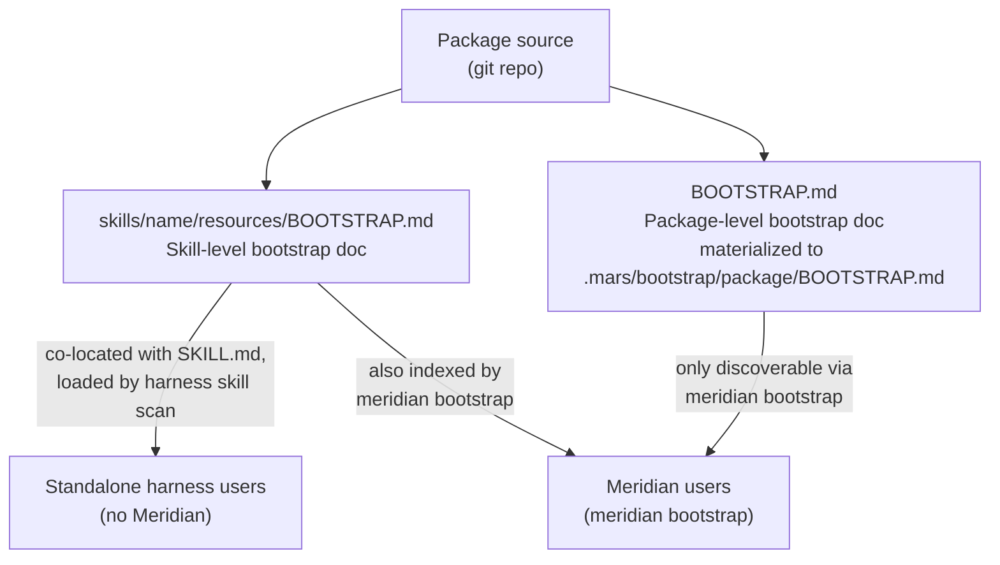
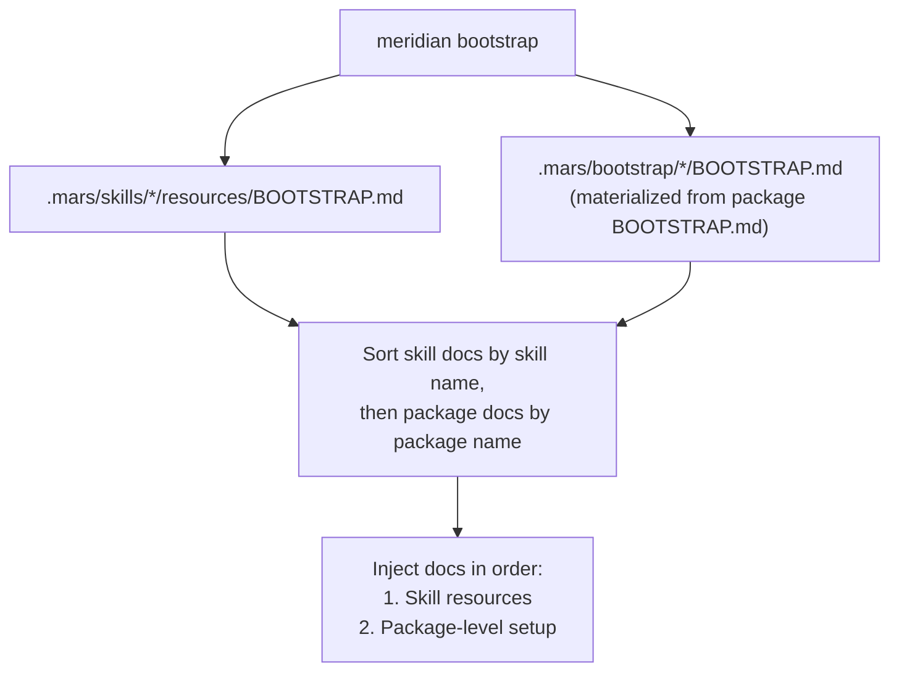

# Bootstrap Doc Discovery

Bootstrap docs are human-readable setup guides that explain how to install,
configure, and use a skill or package. They live alongside the content they
describe and are surfaced via `meridian bootstrap`.

---

## Why Bootstrap Docs

Skills and agents can be installed from packages, but installation alone doesn't
tell a user (or another agent) how to use what was installed. Bootstrap docs
fill the gap:

- **Skills** need invocation instructions, required permissions, and any
  harness-specific notes
- **Packages** need project-level setup steps — environment variables,
  credential requirements, dependencies, known limitations

Without bootstrap docs, users discover usage through trial and error or by
reading source markdown. With them, `meridian bootstrap` can surface the right
instructions for the current environment.

---

## Two-Tier Structure

Bootstrap docs live at two levels, with different visibility purposes:



### Tier 1: Skill-Level Resources (`skills/<name>/resources/`)

Each skill directory may contain a `resources/` subdirectory:

```
skills/
  my-skill/
    SKILL.md
    resources/
      BOOTSTRAP.md       # setup, invocation, examples, troubleshooting
```

**Purpose:** Standalone visibility for users who use the skill without Meridian.
Because `resources/` lives next to `SKILL.md`, harnesses that scan the skill
directory may surface the docs directly (e.g., as file context when loading
the skill). The docs also appear in `meridian bootstrap` output.

**Content:** Skill-scoped. Covers what this specific skill does, how to invoke
it, what permissions it needs, and any harness-specific notes.

### Tier 2: Package-Level Bootstrap (`BOOTSTRAP.md`)

The package root may contain a `BOOTSTRAP.md` file:

```
my-package/
  BOOTSTRAP.md          # single-file bootstrap (small packages)
```

**Purpose:** Meridian-only. Package-level bootstrap docs cover concerns that
span multiple skills or the package as a whole — environment setup, credentials,
workspace config, compatibility notes. These are not appropriate for `SKILL.md`
bodies (too operational) or skill resources (too coarse-grained).

**Why not harness-discoverable:** Package-level docs don't belong in any single
skill directory, so there's no natural location a harness would scan them from.
`meridian bootstrap` is the discovery path. This is intentional — Meridian users
get full docs; standalone harness users see only skill-level resources.

---

## `meridian bootstrap` Command

`meridian bootstrap` aggregates bootstrap docs from all installed packages and
presents them for the current context.

```bash
meridian bootstrap                 # launch a primary session with all bootstrap docs
meridian bootstrap --agent setup-helper --dry-run
meridian bootstrap --model gpt-5.5 --harness codex
```

### Agent Resolution

`meridian bootstrap` uses **normal agent resolution** — the same profile
loading, harness detection, and model selection path that `meridian spawn` uses.
There is no dedicated bootstrap agent.

**Why normal resolution:** An earlier design proposed a dedicated bootstrap agent
that would format and present docs. This was simplified: the bootstrap command
reads docs as markdown and surfaces them directly. Normal agent resolution
handles the harness-context question (which skill variant's resources apply
here?) without a bespoke code path.

This keeps `meridian bootstrap` lightweight and its output predictable — it's
a document reader, not a conversational agent.

### Discovery Algorithm

On invocation, `meridian bootstrap` walks the installed skill and package tree:



Bootstrap doc discovery is currently document-level, not variant-level: it
looks for `resources/BOOTSTRAP.md` and `.mars/bootstrap/*/BOOTSTRAP.md`.
Harness- or model-specific setup notes belong inside that bootstrap document,
or in skill variants when they are runtime instructions rather than setup docs.

---

## Authoring Bootstrap Docs

### What belongs in skill resources

- Invocation syntax (the slash command, the trigger phrase)
- What the skill does and doesn't do
- Required permissions (tool allowlist, approval mode)
- Harness-specific notes (if any harness behaves differently)
- Brief examples

### What belongs in package bootstrap

- Environment variables and credentials required before skills work
- External service dependencies
- Workspace or permission-model setup steps
- Known incompatibilities with harness versions or configurations
- Multi-skill concepts that span the whole package

### What belongs in SKILL.md (not bootstrap docs)

The `SKILL.md` body is loaded into the agent's system prompt at runtime — it
is instruction content, not setup documentation. Keep the skill body focused
on **behavioral instructions** (what the agent should do when the skill is
active). Move setup and explanation content to `resources/`.

Mixing setup docs into the skill body wastes system-prompt tokens on content
the agent doesn't need at runtime.

---

## Mars Sync Behavior

Mars emits skill `resources/` alongside `SKILL.md`:

```
.mars/skills/<skill>/
  SKILL.md
  resources/
    BOOTSTRAP.md
```

Package bootstrap docs are materialized to
`.mars/bootstrap/<package>/BOOTSTRAP.md`.

**Bootstrap docs are not emitted to native harness dirs** (unlike SKILL.md
files). The native harness dirs get the skill file for harness-native skill
loading; bootstrap docs are a Meridian-only feature surfaced via
`meridian bootstrap`.

---

## Related Pages

- [skill-schema.md](skill-schema.md) — skill frontmatter, variants, lowering
- [package-management/overview.md](package-management/overview.md) — Mars sync workflow, what lives in `.mars/`
- [../decisions.md](../decisions.md) — D61–D62 for bootstrap design decisions
