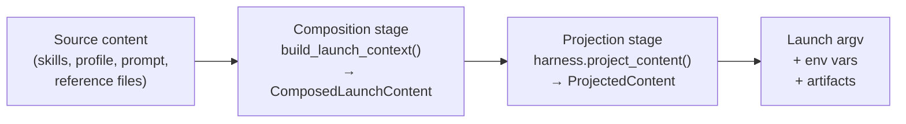

# Composition Pipeline

Every spawn involves assembling content — skills, agent profile, user prompt,
reference files, prior output — and delivering it to the harness in the right
form. Different harnesses have different channel capabilities: Claude has a
separate system prompt channel; Codex and OpenCode do not.

The **Semantic IR + Adapter Projection** pattern is how Meridian handles this
without coupling content assembly to harness-specific logic.

---

## The Core Insight

Content assembly and content delivery are separable concerns:

- **Assembly**: classify content by semantic meaning, independent of how any
  harness will use it
- **Delivery**: each harness adapter decides how to route each category to its
  own channels

Separating these means composition code never contains `if harness == "claude":`
branches. Harness choices stay in adapters, where they belong.

---

## Two-Stage Pipeline



### Stage 1: Composition → ComposedLaunchContent

`ComposedLaunchContent` is the harness-agnostic intermediate representation
(the "Semantic IR"). It classifies content into three categories:

| Category | What belongs here |
|----------|------------------|
| `SYSTEM_INSTRUCTION` | Behavioral controls for the agent |
| `USER_TASK_PROMPT` | The user's actual request |
| `TASK_CONTEXT` | Reference files, prior run output, context |

Fields in the IR:

| Field | Category | Meaning |
|-------|----------|---------|
| `skill_injection` | SYSTEM_INSTRUCTION | Composed skill content |
| `agent_profile_body` | SYSTEM_INSTRUCTION | Agent profile body text |
| `report_instruction` | SYSTEM_INSTRUCTION | "Write a report at the end" directive |
| `inventory_prompt` | SYSTEM_INSTRUCTION | Installed agent catalog (primary only) |
| `context_prompt` | SYSTEM_INSTRUCTION | Named context paths surfaced to the agent |
| `completion_contract` | SYSTEM_INSTRUCTION | Bounded goal contract from `--goal TEXT`; empty when no goal given |
| `passthrough_system_fragments` | SYSTEM_INSTRUCTION | Explicit `--append-system-prompt` args |
| `user_task_prompt` | USER_TASK_PROMPT | Raw user request (template-substituted) |
| `reference_items` | TASK_CONTEXT | Structured reference file/dir objects |
| `prior_output` | TASK_CONTEXT | Sanitized output from a prior spawn |

The `SYSTEM_INSTRUCTION` blocks are assembled in a fixed order (`SYSTEM_INSTRUCTION_BLOCK_ORDER` in `composition.py`). Ordering matters because system prompts are read top-to-bottom: `agent_profile_body` orients the agent, `context_prompt` provides location knowledge, `completion_contract` (if present) follows with the bounded goal, and `passthrough_system_fragments` comes last so explicit user-supplied fragments can override or append:

```
supplemental_documents → agent_profile_body → report_instruction
    → inventory_prompt → context_prompt → completion_contract → passthrough_system_fragments
```

The key constraint: **no cross-category concatenation before projection**. You
can't join `skill_injection + user_task_prompt` into a single blob and call it
`user_task_prompt`. The semantic classification must survive intact until
`project_content()` is called.

### Stage 2: Projection → ProjectedContent

`harness.project_content(composed)` is the adapter's opportunity to map each
semantic category to its harness-specific channel. The output is
`ProjectedContent`:

- `system_prompt: str` — content for the `--append-system-prompt` channel
  (empty = omit)
- `user_turn_content: str` — content for user-turn or inline prompt channel
- `reference_routing` — per-reference decisions (`"inline"`, `"omitted"`)
- `channels` — overall routing decisions (written to `projection-manifest.json`)

#### How Each Harness Projects

**Claude:**
- SYSTEM_INSTRUCTION → `--append-system-prompt-file <path>` (file avoids
  ARG_MAX limits for long system prompts)
- TASK_CONTEXT + USER_TASK_PROMPT → user-turn channel, context first then prompt
- References: `"inline"` (rendered as content blocks) or `"omitted"` for
  empty-body files

**Codex and OpenCode:**
- No separate system-prompt channel; everything goes inline
- Canonical order: SYSTEM_INSTRUCTION → TASK_CONTEXT → USER_TASK_PROMPT
- References: `"inline"` or `"omitted"`; no native injection

---

## Why "Classify Before Flatten" Matters

Imagine this (wrong) approach:

```python
# DON'T DO THIS — premature flattening
full_prompt = "\n\n".join([skills, profile_body, refs, user_task])
content = ComposedLaunchContent(user_task_prompt=full_prompt)
```

This loses the semantic boundaries. The harness can no longer route system
instructions to the system-prompt channel — everything looks like user task
content. Claude gets a worse system prompt. Debugging content routing becomes
impossible.

The correct approach keeps categories distinct until `project_content()`:

```python
# DO THIS — preserve semantic categories
content = ComposedLaunchContent(
    skill_injection=skills,
    agent_profile_body=body,
    user_task_prompt=user_task,
    reference_items=refs,
)
projected = harness.project_content(content)
```

---

## Anti-Patterns

These are guardrails, not just suggestions. Code that violates them fails review.

**G-1: Harness-ID branches in composition code**
```python
# WRONG: composition code should never know about harness IDs
if harness.id == HarnessId.CLAUDE:
    prompt = join(skills, body, user_task)
```
*Fix: implement `project_content()` in the harness adapter instead.*

**G-2: Premature cross-category flattening**
```python
# WRONG: loses semantic classification before projection
full_prompt = "\n\n".join([skills, body, refs, user_task])
composed = ComposedLaunchContent(user_task_prompt=full_prompt, ...)
```
*Fix: keep categories in their respective fields.*

**G-3: Writing artifacts from intermediates, not ProjectedContent**
```python
# WRONG: bypasses the authority rule for projection artifacts
atomic_write_text(log_dir / "system-prompt.md", raw_skills_text)
```
*Fix: write artifacts from `ProjectedContent` fields after `project_content()`
is called. The authority rule: when `launch_context.projected_content` is set,
read artifacts from it — not from composition intermediates.*

---

## Observability Artifacts

After projection, Meridian writes a set of durable artifacts to the spawn's
log directory. These are useful for debugging what the harness actually received:

| File | Content |
|------|---------|
| `system-prompt.md` | The composed system prompt (if any) |
| `starting-prompt.md` | The user-turn content |
| `references.json` | Per-reference routing decisions |
| `projection-manifest.json` | Harness + surface + channel routing summary |

`starting-prompt.md` replaced the older `prompt.md`. Readers fall back to
`prompt.md` for older spawn dirs.

---

## Pre-Composed Prompts (Legacy Path)

Some older code paths use `prompt_is_composed=True` — a flag indicating the
prompt is already fully assembled and should bypass the composition stage
entirely. This is a legacy escape hatch. It produces no `ComposedLaunchContent`
and calls no `project_content()`. The projection manifest won't reflect real
routing, and the system-prompt.md artifact may be absent.

New code should never set `prompt_is_composed=True`. The composition pipeline
handles all cases correctly.

---

## Surface Scope

The composition pipeline runs for two surfaces:

- **`SPAWN_PREPARE`** (subagent spawns) — runs full composition: skill
  injection, reference loading, template variable substitution, prior-output
  inclusion
- **`PRIMARY`** (interactive primary launch) — same pipeline, plus:
  `inventory_prompt` (agent catalog) and `passthrough_system_fragments`
  (explicit system prompt passthrough args)

The **`DIRECT`** surface bypasses composition entirely — minimal path, no
`ComposedLaunchContent`, no `project_content()` call.

---

## Skill Delivery: Two Channels, One Correct

Skill content can reach a spawned agent through two injection paths. They are
independent; which path fires depends on harness capabilities, not on the content.

| Channel | Mechanism | When active |
|---|---|---|
| `supplemental_documents` | Rendered as system instruction blocks via `compose_skill_prompt_documents()` | Only when `supports_native_skills=False` (no active harness) |
| `--append-system-prompt` | `compose_skill_injections()` → explicit CLI flag | Claude spawn surface only (`skill_injection_mode == "append-system-prompt"`) |

**Native-skill harnesses suppress `supplemental_documents`:** When `harness.capabilities.supports_native_skills=True`,
`_resolve_spawn_prepare_projection()` and `_resolve_primary_projection()` produce
`supplemental_documents=()`. All three active harnesses (Claude, Codex, OpenCode)
declare this capability. Mars delivers skill content through native channels (Claude
projects, Codex/OpenCode native dirs).

**Claude's `--append-system-prompt` channel is preserved:** This is the intended
delivery mechanism for Claude spawns. Suppressing `supplemental_documents` does not
affect it. Claude continues to receive skill content via `--append-system-prompt`
after the suppression.

**`snapshot_from_resolved_policy()` follows the same gate** (in `chat/policy.py`):
skill document snapshotting is also conditioned on `supports_native_skills`.

See [decisions/launch.md](../decisions/launch.md#d-skill-doc-suppression-skip-supplemental_documents-for-native-skill-harnesses)
for the decision rationale.

---

## Agent Inventory Prompt

The `inventory_prompt` field in `ComposedLaunchContent` is populated only for
the `PRIMARY` surface (not for `SPAWN_PREPARE`). It contains the `# Meridian Agents`
block listing installed agents.

**`model-invocable: false` filters agents before this block is built.** Agents
with this frontmatter field set to `false` are excluded from the inventory list
by `build_agent_inventory_prompt()`. The filter runs at the inventory prompt
boundary — the catalog scan (`scan_agent_profiles()`) still returns all profiles.

See [model-resolution/agent-profiles.md](model-resolution/agent-profiles.md#model-invocable-true--false)
for the field semantics.

---

## Related Pages

- [Harness Abstraction](harness-abstraction.md) — the `project_content()`
  contract and how each harness implements it
- `../architecture/launch-system.md` — where `build_launch_context()` fits in
  the full launch factory
- `../codebase/harness-adapters.md` — per-harness projection notes
