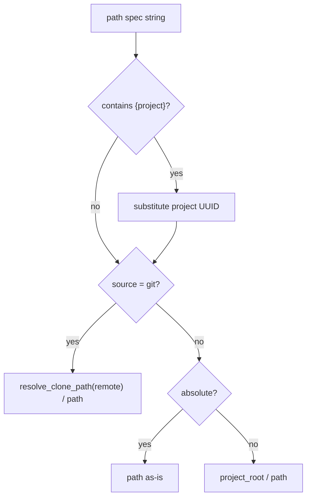

# Context Resolution

Meridian **context** is a set of named filesystem paths that tell agents where their working memory lives: the active work directory, the knowledge base, optional extras like `strategy`. Context is not config in the operational sense — it's workspace structure made visible to agents as environment variables.

```bash
meridian context        # show all context fields with their sources
meridian context work   # path to the active work directory
meridian context kb     # path to the knowledge base
```

## What Context Is

Context paths are injected into every agent's environment as `MERIDIAN_CONTEXT_<NAME>_DIR` variables. They appear in the agent's system prompt so the agent knows where to read and write durable artifacts. This is the primary mechanism by which agents navigate the project's filesystem structure without hardcoding paths.

Context is separate from [workspace projection](workspace-projection.md) — workspace roots grant filesystem access but are invisible to agents; context paths are explicitly surfaced.

## Built-in and Arbitrary Contexts

The `ContextConfig` type (in `src/meridian/lib/config/context_config.py`) has two built-in slots plus open extension:

| Context | Default path | Env var |
|---|---|---|
| `work` | `.meridian/work` | `MERIDIAN_ACTIVE_WORK_DIR` (active item) |
| `work` archive | `.meridian/archive/work` | `MERIDIAN_CONTEXT_WORK_ARCHIVE_DIR` |
| `kb` | `.meridian/kb` | `MERIDIAN_CONTEXT_KB_DIR` |
| `<name>` (arbitrary) | user-defined | `MERIDIAN_CONTEXT_<NAME>_DIR` |

`strategy` is an example of an arbitrary context — it is not a built-in field. Any `[context.<name>]` section in the config becomes an arbitrary context. The env var key is derived by uppercasing the name and replacing non-alphanumeric characters with `_`.

## Config Structure

Context paths are configured in `[context]` sections within `meridian.toml`, `meridian.local.toml`, or the user config. `load_context_config()` merges these layers with later-wins semantics:

```
user config
  → meridian.toml
    → meridian.local.toml
```

Each context entry supports:

```toml
[context.kb]
source = "local"          # "local" (default) or "git"
path = ".meridian/kb"     # relative to project root, or absolute

[context.work]
source = "local"
path = ".meridian/work"
archive = ".meridian/archive/work"

# Arbitrary context (e.g., strategy):
[context.strategy]
source = "git"
remote = "https://github.com/org/strategy-repo.git"
path = "."
```

## Path Resolution Rules

`resolve_context_paths()` in `src/meridian/lib/context/resolver.py` applies these rules per entry:

1. **`{project}` substitution** — if the path string contains `{project}`, it is replaced with the project UUID (a stable identifier stored in `.meridian/`). If no UUID exists yet, read paths fall back to default `.meridian` locations; write paths can force UUID creation.

2. **Git-backed paths** — if `source = "git"` and `remote` is non-empty, the path resolves relative to the auto-cloned repository location (via `resolve_clone_path(remote)`). Cloning itself is handled lazily by git-autosync hooks, not by the resolver.

3. **Absolute paths** — returned as-is.

4. **Relative paths** — resolved relative to the project root.



## Runtime Context: Active Work Item

The active work item overrides the general `work` context path. `ResolvedContext.from_environment()` (in `src/meridian/lib/core/resolved_context.py`) builds the full context, checking in order:

1. Explicit work item ID argument
2. `MERIDIAN_ACTIVE_WORK_ID` env var
3. Session-store lookup by chat ID

When an active work item is found, `MERIDIAN_ACTIVE_WORK_DIR` is set to the item's directory. This is why `meridian context work` shows the active item's path, not the general `work` root.

## Env Var Propagation

Child processes (spawned agents) inherit context via env vars set in `ResolvedContext.child_env_overrides()`. Extra context dirs are exported as `MERIDIAN_CONTEXT_<NAME>_DIR`. This means every agent in a spawn tree sees the same context without needing to re-resolve it.

The env var key derivation rule (from `context_env_key()` in `src/meridian/lib/context/resolver.py`):

```python
env_name = "".join(c if c.isalnum() else "_" for c in name.upper()).strip("_")
return f"MERIDIAN_CONTEXT_{env_name}_DIR"
```

## Context vs. Workspace

These two systems are distinct:

| | Context | Workspace |
|---|---|---|
| Purpose | Working memory paths | Filesystem access scope |
| Config section | `[context]` | `[workspace]` |
| Agent sees | `MERIDIAN_CONTEXT_*_DIR` env vars + system prompt | No env vars, no prompt |
| Trust model | Agent actively reads/writes | Permission grant only |

See [concepts/workspace-projection.md](workspace-projection.md) for workspace details.

## On-Disk Migration

Startup runs an idempotent migration before runtime bootstrap (`src/meridian/lib/context/migration.py`):
- `.meridian/fs` → `.meridian/kb`
- `.meridian/work-archive` → `.meridian/archive/work`

This migration is about physical on-disk layout, not TOML config. It runs every startup and converges safely on repeated application.

## Related

- [concepts/config-precedence.md](config-precedence.md) — operational config (timeouts, retries) that loads separately from context paths
- [concepts/workspace-projection.md](workspace-projection.md) — filesystem scope grants invisible to agents
- [operations/configuration-guide.md](../operations/configuration-guide.md) — practical context setup, git-backed KB walkthrough
